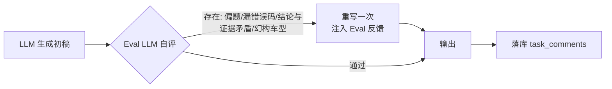
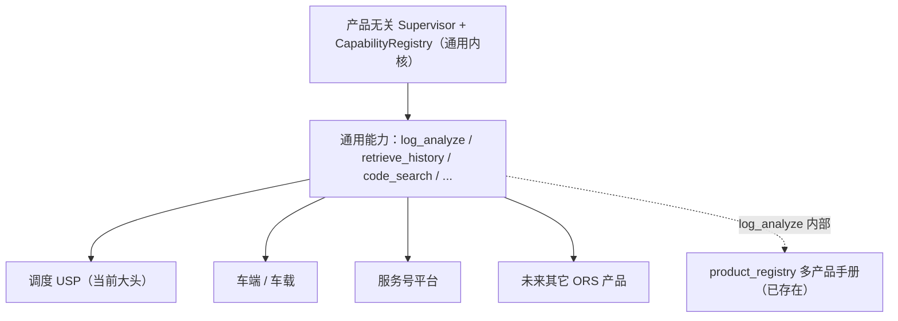

# AiTaskPlatform — 目标架构设计文档（v4.0，已实现）

> **状态**：已全部实现（2026-08-14）。改造点 A/B/C/D/E/F + discuss_flow 收敛 + 能力注册表 均已落地并编译验证。本文档是本轮「参考开源 Agent 架构（Claude / MetaGPT）改造 AiTaskPlatform」的权威设计稿与实现记录。
> **定位**：与 `TASK_AGENT_DESIGN.md`（v3.x 现有权威文档）并行；本实施为独立版本（未提交），供评审后并入正式文档。
> **日期**：2026-08-13（设计） / 2026-08-14（实现）

---

## 0. 目标愿景（定盘星）

> **用户目标（2026-08-13）**："我们的目的就是设计出一个真正能够排查问题的 Agent。只不过需要根据当前的大头——调度 USP——做一些适配，让它能够更好地解决现在的大部分问题。"

**一句话愿景**：设计一个**真正的、通用的「排查问题 Agent」**——它本质上是产品/领域无关的，能自主判断、自主派生子 Agent、调度多类能力去排查复杂问题；**当前为了尽快解决大部分问题，针对调度 USP 做适配**，让它在现有业务上发挥最大价值。

**这条愿景对设计的定盘作用**：

| 维度 | 含义 |
|------|------|
| **目标** | 通用排查 Agent（产品无关） |
| **当前策略** | 先针对调度 USP 适配，解决眼前大部分问题 |
| **演进** | 后续适配车端 / 服务号 / 其它 ORS 产品 = 加手册 + 数据 + 产品能力，**不改内核** |
| **不变量** | 内核（Supervisor + 能力注册表 + 自主派生）保持通用；适配下沉到数据/能力层 |

> 本条是全文总纲：后续所有改造点（能力注册表 E、自主派生 F、Evaluator C、透明化 D 等）都在服务这个"通用排查 Agent，当前专注调度 USP"的目标。

---

## 0. TL;DR（给决策者的一句话版）

AiTaskPlatform 已经是标准的 **Orchestrator-workers 多 Agent** 系统，**不需要重构、不需要引入 LangGraph/CrewAI/AutoGen/MetaGPT 多角色框架**。本轮目标是把它演进为**通用的「排查问题 Agent」**（当前先适配调度 USP），做如下增量补齐：

1. **LLM Routing**（把 `discuss` 的关键词路由升级为 LLM 意图分类 + 「纯闲聊」短路径）
2. **Parallelization / Sectioning**（把 `diagnose`/`discuss` 里彼此独立的工具调用并行化）
3. **Evaluator-optimizer**（在 LLM 输出环节加自评→重写闭环，消除偏题/幻构）
4. **透明化 planning**（把 LogOrchestrator 每轮 `reasoning` 暴露给工程师，提升可信度）
5. **统一能力注册表**（对标 Claude Skill/Tool 机制，把 code_skill/attachments/retrieval/log_analyzer 等能力标准化为一个可发现、可调度的注册表）
6. **自主派生子 Agent（Supervisor）**（像 Claude 一样按任务复杂度自主决定派不派、派几个子 Agent，Orchestrator-workers 升级）

核心原则不变：**手册即数据、Agent 即策略**；**服务端确定性兜底优先于 LLM 自评**；**能不加复杂度就不加**；
**编排自研（透明可控），能力接入对齐开放标准（Claude Skill/Tool）——本版暂不上 MCP**；
**内核通用（多产品）、当前专注调度 USP 适配**。

---

## 1. 现状盘点（改造基线）

### 1.1 现有组件与职责

| 组件 | 类型 | 职责 | 对应开源模式 |
|------|------|------|--------------|
| `AiTaskAgent` | 聚合门面 | DiagnoseFlow/DiscussFlow/SummarizeFlow/SolutionFlow 多继承聚合，持有共享客户端/trace | MetaGPT Role 聚合 |
| `LogOrchestrator` (`orchestrator.py`) | Orchestrator Agent | 循环编排 LLM 决定 `investigate(directive)` / `conclude`，MAX_ROUNDS=3，directive 去重 | Claude **Orchestrator-workers** |
| `LogSubAgent` (`log_analyzer/`) | Worker Agent | 执行单条 directive，grounding 客观事实，查询参数校验/夹紧 | Anthropic 工具 ACI 工程化 |
| `triage.py` (Discovery/ManualGuide/Scenario) | 纯程序前置 | 手册驱动，信号/热窗口/实体/场景分类，零 LLM | Claude 程序化 gate / 预处理 |
| `contexts/` | 域服务 | 工单上下文 + 评论读取/落库 | — |
| `retrieval/` | 检索域 | 排查树规则、历史方案、solution IO | RAG |
| `attachments/` | 解析域 | 日志/压缩包/图片/文档解析 | Tool 层 |
| `code_skill/` | Skill | 代码检索 | Tool / MCP |
| `tracing/` | 可观测性 | Node/TraceBus | Telemetry |

### 1.2 已确认的强项（改造时**必须保留**）

- ✅ 手册=数据、Agent=策略（ManualGuide 动态提取 signal，不写死）
- ✅ Grounding 防幻构（真实时间窗/车型/任务ID + 查询参数夹紧）
- ✅ 防死循环（MAX_ROUNDS + directive 去重 + SOFT_LIMIT + 解析失败保底）
- ✅ 服务端确定性兜底（程序逻辑优先于 LLM 自评）
- ✅ 不依赖重量级框架，自实现、透明、可调试

### 1.3 已确认的薄弱点（本轮改造目标）

| # | 薄弱点 | 现状代码位置 | 危害 |
|---|--------|--------------|------|
| G1 | `discuss` 用**关键词**路由，无「纯闲聊」分支 | `discuss_flow.py:23` `query_matches()` | 所有 @AI 问题走同一份重 prompt；口语化表达触发不到工具；纯闲聊浪费 token/延迟 |
| G2 | `diagnose` 附件分析**串行** | `diagnose_flow.py` 日志→非日志→图片 | 延迟叠加；独立工具互相等待（注：`solution_flow` 已并行，见下方 H1） |
| G3 | `discuss` 多工具调用**串行 if** | `discuss_flow.py` 图片/日志/历史/代码 | 同上 |
| G4 | **无 Evaluator-optimizer** | `discuss_flow.py` `_llm_client.complete` 后直接输出 | 回复可能偏题/漏错误码/结论与证据矛盾，工程师拿到不靠谱结论 |
| G5 | `discuss` 回复**非流式一次性** | — | 可感知延迟高（后面可讨论，不在本版范围） |
| G6 | 编排的每轮 `reasoning` 未暴露给前端 | `orchestrator.py` rounds | 工程师看不到"为什么查这些"，可信度下降 |
| ~~H1~~ | ~~`analysis/engine.py`（`TaskAnalyzer`）死代码~~ **已删除**（见 §2.5 决策 D11） | — | 无残留 |
| **G7** | **能力模块接口不统一**：`code_skill`/`attachments`/`retrieval`/`log_analyzer` 各自独立入口，无统一描述/schema/调用约定 | `code_skill/skill.py`、`attachments/parser.py`、`retrieval/`、`log_analyzer/` | 能力难被 Agent 动态发现和调度；跨 Agent 难复用（见 §6b 改造点 E） |

---

## 2. 目标架构总览

```
                AiTaskAgent (聚合门面)
                        │
        ┌───────────────┼───────────────────┐
        │               │                   │
   [帮我分析]        [@AI 讨论]          [后台扫描摘要]
   DiagnoseFlow     DiscussFlow            SummarizeFlow
        │               │
        │         ┌─────┴──────┐
        │         │  LLM Router│  ← G1 新增
        │         │ (意图分类) │
        │         └─────┬──────┘
        │        ┌──────┼─────────────┐
        │        │ 纯闲聊 │ 需工具分支    │
        │        │短prompt│(日志/图片/历史/代码)
        │        └────────┴──────┬─────┘
        │                  ┌─────┴───────────┐
        │                  │  工具并行调度层     │  ← G2/G3 新增
        │                  │ (asyncio.gather) │
        │                  └─────┬───────────┘
        │             ┌──────────┼─────────┐
        │         LogOrchestrator  图片  历史/代码
        │              │            (轻量并行)
        │         LogSubAgent
        │              │
        │              ▼
        │     ┌───────────────┐
        └────▶│ Evaluator     │  ← G4 新增（诊断报告/日志结论/讨论）
              │ (自评→重写)    │
              └───────┬───────┘
                      ▼
              输出 / 落库 task_comments
```

### 关键不变量（design hard constraints）

- **RAG 五路检索不动**：沿用 `retrieval/` 现状。
- **LogOrchestrator 编排逻辑不动**：只在入口接 Router、出口接 Evaluator。
- **服务端铁律仍优先于 LLM**：Evaluator 只做「质量提升」，不改变工单就绪/权限等确定性判定。
- **成本护栏**：Evaluator 只对**日志结论 + 诊断报告 + 需工具的讨论**启用；**纯闲聊不启用**。

### 2.5 ✅ 已处理 — `analysis/engine.py`（`TaskAnalyzer`）死代码已删除

> 新增审查 `analysis/` 目录时确认：`TaskAnalyzer`/`AnalysisResults` **在运行时代码中从未被实例化/调用**，是已被 `pipeline._run_analysis` 取代的死代码。**已按决策 D11（方案 A）删除**（2026-08-13）。

**证据链**：

| 事实 | 位置 | 说明 |
|------|------|------|
| `TaskAnalyzer` 定义 | `analysis/engine.py:40` | 提供 `analyze()` 三路并行（排查树+历史+附件） |
| 导出 | `analysis/__init__.py` + `AiTaskPlatform/__init__.py:21` | 只在 export 层出现 |
| **无运行时调用** | 全库 grep `TaskAnalyzer(` | 仅定义/导出，无任何实例化 |
| 实际活路径 | `pipeline.py:162 _run_analysis` | `solution_flow.analyze` 调用它 |

**`_run_analysis`（活路径）比 `TaskAnalyzer`（死路径）强在哪**：

- ✅ **平台 vs AGV/USP 路由**：`_is_platform_ticket(context)` → 服务号问题查平台文档、跳过排查树；AGV 问题反之（`TaskAnalyzer` 没有）
- ✅ **4 路 `asyncio.gather`**：排查树/历史/附件/平台文档（`TaskAnalyzer` 只有 3 路）
- ✅ 复用 `contexts.build_query`、`retrieval.format_retrieval_results`，与全域一致
- ✅ 每路独立方法（`_retrieve_troubleshooting_conclusions` 等），可单独测试

**风险**：两套并行分析逻辑共存，容易让新开发者在"该用 `TaskAnalyzer` 还是 `_run_analysis`"上踩坑；且 `TaskAnalyzer.analyze` 内部的附件解析逻辑（`parse_attachments`）比活路径更旧。

**已执行的清理动作（2026-08-13，决策 D11 = 方案 A）**：

| 动作 | 文件 | 状态 |
|------|------|:---:|
| 删除 `analysis/engine.py` | `TaskAnalyzer`/`AnalysisResults` 定义 | ✅ 已删 |
| 删除 `analysis/__init__.py` | 导出死代码 | ✅ 已删 |
| 移除 `AiTaskPlatform/__init__.py:21` import | 再导出死代码 | ✅ 已改 |
| 验证 | `import ai.agents.AiTaskPlatform` + 全库 grep | ✅ 无残留 |

**验证结果**：
- 全仓库无 `TaskAnalyzer`/`AnalysisResults` 代码引用（仅本文档作为决策记录保留）
- "自动首条 AI 评论"活路径（`diagnosis_worker → SolutionFlow.analyze → _run_analysis`）**完全不受影响**
- `solution_flow.py`/`pipeline.py`/`diagnosis_worker.py` 编译检查通过

> ⚠️ **注意**：此发现也**修正了 §1.3 的 G2/G3 表述** —— `solution_flow.analyze` 已经并行（`_run_analysis` 4 路 gather）；真正仍串行的只有 `diagnose_flow.diagnose()`（日志→非日志→图片）和 `discuss_flow.discuss()`（多工具顺序 if）。并行化改造应**只针对这两处**，且要避免把已经并行的 `_run_analysis` 重复改造。

---

## 3. 改造点 A — LLM Router（G1）

### 3.1 目标

把 `discuss` 的关键词路由升级为**轻量 LLM 意图分类**，并新增「纯闲聊」快路径。

### 3.2 设计

```
输入: query + task 上下文(标题/描述/诊断摘要/有无附件)
  │
  ▼
LLM Router（一次小调用，max_tokens≈10，temperature=0）
  │ 输出 JSON: {"intent": "<one of>", "confidence": 0~1}
  ▼
intent 可选值:
  - pure_chat      → 纯闲聊/常识/平台问答 → 走"短 prompt"，不挂任何工具
  - log_analysis   → 有日志附件 & 问日志 → 走 LogOrchestrator
  - image_analysis → 有图片附件 & 问图   → 走图片分析
  - history        → 查历史相似工单方案
  - code           → 查代码
  - general        → 默认综合（现有行为）
```

### 3.3 与现有 `query_matches` 的关系

**保留现有关键词路由作为 fallback**：
1. 先跑 LLM Router（新）
2. 若 Router 置信度 < 阈值（如 <0.6）或解析失败 → **回退到现有关键词 `query_matches`**（零新增风险）

> 这样既获得 LLM 语义理解，又保留确定性的兜底，符合"服务端优先"原则。

### 3.4 为什么这样做（对标 Claude Routing）

Anthropic 原文：*"optimizing for one kind of input can hurt performance on other inputs"*（单 prompt 过载）。你现在的 DISCUSS prompt 同时承担闲聊+日志+图片+历史+代码，属于典型单点过载。拆出 pure_chat 后：
- 纯闲聊走 `DISCUSS_LIGHT_PROMPT`（短、快、省 token）
- 需工具分支走带 `facultative` 的现有 prompt

### 3.5 待讨论点（实现状态）

- [x] **已实现 `Router`（capabilities/router.py）**：LLM 意图分类（temp=0, max_tokens≈40），intent 含 pure_chat/log_analysis/image_analysis/history/code/general
- [x] **已实现纯闲聊短路径**：discuss_flow 用 `Router.classify()`，`pure_chat` → `DISCUSS_LIGHT` 短 prompt（max_tokens=200），跳过 Supervisor 调度
- [x] **置信度阈值**：`CONFIDENCE_THRESHOLD=0.6`，低于回退 general
- [x] **与关键词关系**：Router 解析失败/低置信 → 回退（保留 `need_supervisor` 关键词判断作为兜底）

---

## 4. 改造点 B — 工具并行化（G2 / G3）

### 4.1 目标

把 `diagnose`（G2）和 `discuss`（G3）中**彼此独立**的工具调用用 `asyncio.gather` 并行执行，缩短端到端延迟。

> ⚠️ **修正（因 §2.5 发现）**：`solution_flow.analyze` 已经通过 `_run_analysis` 做了 4 路并行，**不在本轮改造范围**。真正需要并行化的只有 `diagnose_flow.diagnose()`（日志→非日志→图片串行）和 `discuss_flow.discuss()`（多工具顺序 if）。

### 4.2 哪些可以并行（sectioning）

| 工具 | 是否可并行 | 理由 |
|------|:---:|------|
| 历史工单检索 `_retrieve_task_resolutions` | ✅ | 读 Qdrant，无共享状态 |
| 代码检索 `code_skill.search` | ✅ | 读索引，无共享状态 |
| 非日志附件解析 `parse_attachments` | ✅ | 读文件 |
| 图片分析 `analyze_images` | ✅ | 读图片，独立 LLM 调用 |
| **LogOrchestrator** | ⚠️ **独立跑，不建议与其他并行** | 多轮编排、上下文敏感；与静态工具并行会互相污染注意力 |

> **关键约束**：日志编排保持独立串行路径（它每轮改变上下文）。只把**静态、无副作用的检索/解析**并行。

### 4.3 实现草图（discuss）

```python
# 当前是顺序 if
# ── 改造为：先收集异步任务，再 gather ──
tasks = []
if needs_log and ctx.attachments and log_paths:
    tasks.append(_run_log_orchestrator(...))      # 独立任务
if query_matches(img_keywords):
    tasks.append(_run_image(...))
if query_matches(hist_keywords):
    tasks.append(_run_history(...))
if query_matches(code_keywords):
    tasks.append(_run_code(...))

# gather 并行（日志与其它并行，但日志内部仍是编排循环）
results = await asyncio.gather(*tasks, return_exceptions=True)
```

> 注意：`discuss` 里 `_extract_log_paths` 会建临时目录并 `rmtree` 清理，逻辑上要保证 gather 内各自清理，**不要跨任务共享 `_tmp_dirs`**。

### 4.4 待讨论点

- [ ] 日志编排是否纳入 gather（建议：纳入，但内部仍是独立循环，与其它任务并行可显著降延迟）
- [ ] `_tmp_dirs` 清理的线程安全/任务边界（需抽成每个任务自清理）
- [ ] 并行是否引入 token/限流问题（建议加信号量 `asyncio.Semaphore(2~3)` 控并发）
- [ ] `diagnose` 的日志/非日志/图片三段是否也改 gather（注意日志与非日志有 `att_has_logs` 逻辑依赖，需小心）

---

## 5. 改造点 C — Evaluator-optimizer（G4）

### 5.1 目标

在关键 LLM 输出后加**轻量自评→重写**闭环，消除偏题 / 漏错误码 / 结论与证据矛盾 / 幻构。

### 5.2 启用范围（成本护栏）

| 输出 | 是否启用 Evaluator | 理由 |
|------|:---:|------|
| 诊断报告 `diagnose` | ✅ | 结论要交给工程师，可信度关键 |
| 日志结论 `LogSubAgent`/`LogOrchestrator` | ✅ | 已有 grounding，自评聚焦"结论↔证据一致性" |
| 需工具的 `discuss` 回复 | ✅ | 涉及日志/图片/历史引用 |
| **纯闲聊 `discuss` 回复** | ❌ | 无工具依赖，自评纯浪费 |

### 5.3 流程



### 5.4 自评输入（让 Eval LLM 可验证）

- 初稿
- 引用的证据（日志行 / 图片描述 / 历史方案片段）
- 结构化 checklist：`[偏题? / 漏了错误码? / 结论是否被证据支持? / 是否编造了证据中没有的车型或时间?]`
- 输出：`{"pass": bool, "issues": [...]}`
- 若 `pass=false` → 带 issues 重写一次（**最多重写 1 次**，防循环；可配 `MAX_EVAL_REWRITES=1`）

### 5.5 防循环护栏

```python
MAX_EVAL_REWRITES = 1   # 重写上限，防鬼打墙
EVAL_IMPORTED = True    # 若 eval LLM 解析失败 → 直接用初稿（快速失败，不阻塞回复）
```

### 5.6 待讨论点（实现状态）

- [x] **已实现 `Evaluator`（capabilities/evaluator.py）**：`evaluate_and_rewrite()` 自评→重写闭环
- [x] **重写上限**：`MAX_EVAL_REWRITES=1`（防鬼打墙）
- [x] **自评失败**：解析失败 → 用初稿 + `eval_failed=True`（快速失败）
- [x] **启用范围**：discuss_flow 仅当 `facultative` 非空（需工具）才启用，纯闲聊不启用（成本护栏）

---

## 6. 改造点 D — 透明化 planning（G6）

### 6.1 目标

把 LogOrchestrator 每轮 `reasoning`（为什么查这个）暴露给工程师，提升可信度与可追踪性。

### 6.2 现状

`orchestrator.py` 的 `rounds` 已有 `{round, reasoning, directive, matched, summary}`，`discuss_flow` 组装时只取了 `conclusion` + 部分 evidence，**没把每轮 reasoning 呈现出来**。

### 6.3 设计

- 诊断报告 `diagnose` 的响应里，新增可选字段 `reasoning_trace`：
  ```json
  {
    "rounds": [
      {"round": 1, "reasoning": "先确认错误码 XNA-169 是否命中", "directive": {...}},
      {"round": 2, "reasoning": "MAPF 版本与历史方案一致，聚焦避让阈值"}
    ]
  }
  ```
- 前端 Dialog 里可折叠展示「🤖 分析过程」：让工程师看到 Agent 是怎么一步步缩小范围的
- 与现有 `tracing`（Node/TraceBus）打通：把 orchestrator 每轮 append 到 trace 的 evidence（已做一部分）

### 6.4 待讨论点

- [ ] reasoning_trace 是默认返回还是 `?verbose=true` 控制（建议默认返回，前端折叠）
- [ ] 是否也把每轮 `directive` 的查询参数列出来（便于审计 LLM 到底查了什么）
- [ ] 与 `_trace` / TraceBus 的关系是否需要合并

---

## 6b. 改造点 E — 统一能力注册表（G7，决策 D1b）

### 6b.1 目标

对标 **Claude Skill / Tool 机制**，把 `AiTaskPlatform` 现有的能力单元（`code_skill` / `attachments` / `retrieval` / `log_analyzer`）**标准化为一个可发现、可调度的能力注册表**。

> **方向确认**（D1b）：目标 = **统一能力注册表**，**本版不引入 MCP**（D14 = 否，仅预留接口）。因为所有能力都在 `ai/` 同进程内被自家 Agent 用，上 MCP 只会增加协议开销、换不到跨应用复用的好处。

### 6b.2 现状问题（G7）

| 能力 | 入口 | 接口风格 | 是否统一 |
|------|------|---------|:---:|
| `code_skill` | `CodeSkill.search(query)` | 类方法，返回 `CodeSearchResult` | ❌ |
| `attachments` | `parse_attachments()` / `analyze_images()` | 函数，返回 `AttachmentAnalysis`/str | ❌ |
| `retrieval` | `_retrieve_*` 方法 | 走 `self._retriever`，Agent 内私有 | ❌ |
| `log_analyzer` | `LogSubAgent` / `LogOrchestrator` | 类，多轮编排 | ❌ |

问题：每个能力**描述、输入 schema、返回结构、触发方式都不统一**，Agent（或未来的 Router / Orchestrator）无法动态发现"现在有哪些能力、每个能用什么参数、返回什么"。这正好是 Anthropic 强调的 **ACI（Agent-Computer Interface）** 缺失——工具接口没有像 HCI 一样被精心设计。

### 6b.3 设计 — 能力注册表（决策 D12 = 方案② 抽象基类）

> **已定（D12）**：采用 **方案② —— 定义 `BaseCapability` 抽象基类**，强制所有能力继承并实现统一接口。
> **已定（D13）**：**不跨 Agent 共享**，其他 Agent（诊断 Agent 等）不动，注册表只服务于 AiTaskPlatform 内部。

**为什么在"改动大"的情况下仍选方案②**（用户决策）：
- 抽象基类 `BaseCapability` 给能力接口**强类型约束**：所有能力统一声明 `name/description/input_schema/run()/tags`，可被静态检查、可强制子类补齐 `run()`
- 每个能力继承 `BaseCapability` → 注册表遍历 `__subclasses__()` 即可自动发现，无需手工登记
- 虽说是"改动大"，但**只在一个新增 `capabilities/` 层内做**，不触碰各能力模块的既有实现逻辑（只是给它们加个子类包装，或让现有类直接继承）

**方案② 抽象基类设计草图**：

```python
# AiTaskPlatform/capabilities/base.py
from abc import ABC, abstractmethod
from dataclasses import field, dataclass
from typing import Any, Optional

class CapabilityResult:
    """统一能力返回：内容 + 元信息（供 trace / Evaluator / Router 使用）"""
    def __init__(self, text: str, meta: Optional[dict] = None):
        self.text = text        # 注入 prompt 的文本（给 LLM 看）
        self.meta = meta or {}  # 结构化信息（给程序看：line 数/confidence/耗时...）

class BaseCapability(ABC):
    """能力抽象基类。所有能力继承并实现 run()。"""
    # 元数据（子类覆盖）
    name: str = ""
    description: str = ""        # 给 LLM 看的能力描述（Anthropic ACI 风格，含示例/poka-yoke）
    input_schema: dict = {}      # JSON Schema 输入约束
    tags: list[str] = []         # ["log","image","code","history","knowledge"...]

    @abstractmethod
    async def run(self, **kwargs) -> CapabilityResult:
        """执行能力，返回统一 CapabilityResult"""
        raise NotImplementedError

    def is_available(self) -> bool:
        """该能力在当前环境是否可用（默认 True）。

        环境敏感能力（如 code_skill 需要 CODE_SKILL_PATHS 指向存在的代码目录）
        应覆写此方法，返回 True 才被注册表列入可用清单。
        """
        return True

    def __init_subclass__(cls, **kwargs):
        """自动注册到注册表（无需手工登记）"""
        super().__init_subclass__(**kwargs)
        if cls.name:
            CapabilityRegistry.register(cls)
```

```python
# AiTaskPlatform/capabilities/registry.py
class CapabilityRegistry:
    _capabilities: dict[str, type[BaseCapability]] = {}

    @classmethod
    def register(cls, cap_cls):
        cls._capabilities[cap_cls.name] = cap_cls

    @classmethod
    def list(cls) -> list[str]:                     # 能力名清单（全部）
        return list(cls._capabilities)

    @classmethod
    def list_available(cls) -> list[str]:           # 仅当前环境可用能力
        return [n for n, c in cls._capabilities.items() if c().is_available()]

    @classmethod
    def get(cls, name) -> Optional[BaseCapability]: # 取能力（实例化）
        c = cls._capabilities.get(name)
        return c() if c else None

    @classmethod
    def match_by_tags(cls, query: str) -> list[str]:  # 按标签/关键词匹配（供 Router）
        # 实现：基于 description + tags 对 query 打分/匹配，只返回 available 能力
        ...
```

### 6b.3b 能力可用性 — `code_skill` 的环境约束（重要）

> **用户反馈（2026-08-13）**：`code_skill`（代码检索）**当前在服务器上不可用**——服务器不能放代码，`CODE_SKILL_PATHS` 只指向本地 WSL 路径；且该能力**尚未正式投入使用**，属于"本地能力"。

**现状（代码已确认）**：`discuss_flow.py:97-103` 通过关键词触发 → `get_code_skill()` → `ensure_index()` → `search()`；服务器上因 `CODE_SKILL_PATHS` 指向本地不存在的路径，`ensure_index()`/`search()` 会抛异常，被外层 `try/except` 捕获打 warning，**静默降级**（不影响回复，只是没有代码补充）。

**对能力注册表设计的影响**：`BaseCapability` 增加 `is_available()`，能力可按环境生命周期判断——**服务器上没有代码路径时，`code_skill` 的 `is_available()` 返回 False，注册表 `list_available()` 不把它列入可用能力**，Router / Orchestrator 自然不会调度它。

```python
# AiTaskPlatform/capabilities/code_search.py
from ai.agents.AiTaskPlatform.capabilities.base import BaseCapability, CapabilityResult

class CodeSearchCapability(BaseCapability):
    name = "code_search"
    description = "检索项目源代码（需服务器配置 CODE_SKILL_PATHS 指向代码目录）"
    tags = ["code"]

    def is_available(self) -> bool:
        # 复用现有关键词/路径是否存在判断；配置为空或路径不存在 → 不可用
        from ai.config import get_ai_config
        return bool(get_ai_config().code_skill_paths.strip())

    async def run(self, query: str, **kw) -> CapabilityResult:
        from ai.agents.AiTaskPlatform.code_skill.skill import get_code_skill
        skill = get_code_skill()
        skill.ensure_index()
        result = await skill.search(query)
        return CapabilityResult(result.to_prompt_text(), meta={"cap": "code_search"})
```

**为什么这对 code_skill 特别合适**：
- `code_skill` **尚未正式投入使用**、且只本地可用 → **正好用统一能力注册表重构它风险最低**（改坏了不影响线上，因为没有线上流量）
- 通过 `is_available()`，把"服务器不能用"从"运行时报错 + 静默降级"升级为"注册表层面直接不暴露"，更干净、可诊断
- 也回应了用户"**评估这个可以根据代码的统一性进行决定**"——即用统一能力注册表作为审视/规范 `code_skill` 的框架

**结论**：方案②让能力**显式、类型安全、自动注册**；且因 D13=不跨 Agent，注册表放在 `AiTaskPlatform/capabilities/`，**对 AiDiagnosisPlatform 零影响**。

### 6b.4 能力注册表的入口清单（初列）

| name（子类名） | 包装现有 | 输入 | 输出 | tags | 可用性 | 状态 |
|------|---------|------|------|------|:---:|:---:|
| `code_search` | `CodeSkill.search` | query, top_k | 代码片段 + 调用图 | code | ⚠️ 环境敏感（需 CODE_SKILL_PATHS，服务器不可用） | ✅ 已建 |
| `attachment_parse` | `parse_attachments` | paths | 附件摘要 | attachment | ✅ | ⏳ 待建 |
| `image_analyze` | `analyze_images` | img ctx | 图片描述 | image | ✅ | ✅ 已建 |
| `retrieve_history` | `_retrieve_task_resolutions` | query | 历史方案 | history | ✅ | ✅ 已建 |
| `retrieve_troubleshooting` | `_retrieve_troubleshooting_conclusions` | query | 排查树结论 | knowledge | ✅ | ⏳ 待建 |
| `log_analyze` | `LogSubAgent`/`LogOrchestrator` | log_path, question | 日志结论 | log | ✅ | ✅ 已建（F1） |

### 6b.5 收益

- **Agent 动态能力发现**：Router（G1）/ Orchestrator 可通过 `CapabilityRegistry.match_by_tags()` 选能力，替代散落的关键词 `if`
- **自动注册**：子类继承即注册，无需手工维护列表
- **强类型约束**：所有能力统一 `run()` 签名返回 `CapabilityResult`，可类型检查、可单测、可 mock
- **只动内层**（AiTaskPlatform），诊断 Agent 完全不受影响（D13）
- **为未来 MCP 预留**：若某天要对外开放，把 `BaseCapability` 适配成 MCP tool 即可（D14 预留）

### 6b.6 待讨论点

- [x] **D12**：方案①轻量协议 vs 方案②强基类？→ **采用方案②`BaseCapability` 抽象基类**
- [x] **D13**：是否跨 Agent 共享？→ **否，不跨 Agent，其他 Agent 不动**
- [ ] 注册表位置定为 `AiTaskPlatform/capabilities/` ✅（因 D13=不跨 Agent，故不放 `ai/core/`）
- [x] **实现方式**：现有能力类（如 `CodeSkill`）→ **改造直接继承 `BaseCapability`**（用户决定，2026-08-13）
- [ ] 是否用 `match_by_tags()` 替代 `discuss` 里的关键词 `query_matches`（衔接 G1 Router）
- [ ] 触发规则（`retrieval/rules.py` 的 keywords）是否要一并搬进 `Capability.tags`

> **实现方式说明**：用户选定 `CodeSkill` **直接继承 `BaseCapability`**（而非新增包装子类）。理由：`code_skill` 尚未正式投入使用、仅本地可用，改造它风险最低；直接继承更"自然"、少一层适配，也让 `BaseCapability` 的接口设计经受真实能力的检验。其他能力（已投入使用、被多处调用）后续按需评估，不强制立即改。

### 6b.7 参考开源 Agent 的能力层实现（灵感来源）

> 用户反馈（2026-08-13）："我们像现在主流的 Agent 能力还差很多，想学习开源 Agent 的代码获取灵感。"

我们当前 `AiTaskPlatform` 的能力层（code_skill/attachments/retrieval/log_analyzer）相比主流 Agent 框架的**能力/工具层**还有差距。以下是值得参考的开源实现，按与"能力注册表"相关性排序：

| 开源项目 | 能力/工具层形态 | 可借鉴点（针对我们的 BaseCapability） |
|---------|----------------|-------------------------------------|
| **LangChain / LangGraph** | `@tool` 装饰器 + `BaseTool`（name/description/args_schema） | 工具描述用 `args_schema`（Pydantic 模型）做输入校验；`BaseTool` 的字段设计（name/description/args）就是我们的 `BaseCapability` 雏形 |
| **Claude Agent SDK / anthropic-cookbook** | Tool use（tool_use block）+ MCP | **工具描述工程（ACI）**——Anthropic 强调 tool 定义要像写 docstring 一样用心，含示例/边界；这是我们 `description` 字段最该学的 |
| **CrewAI** | `@tool` 装饰器 + Tool 类，tools 由 Agent 声明 | Tool 的**可组合性**：一个 Agent 声明自己用哪些 tools；我们可让 `BaseCapability` 支持"一个 Agent 声明可调度哪些能力" |
| **MetaGPT** | Role + Action（Action 有 name/desc/run） | **Action 与 Role 绑定**：能力归属于特定角色/Agent，与我们的 D13（能力归 AiTaskPlatform）思路一致 |
| **OpenAI / DSPy** | Function calling schema | 结构化 tool schema（`parameters` JSON Schema）→ 对应我们的 `input_schema` |
| **AutoGen** | 函数注册，Agent 按需调用 | **能力可为空/可选**：Agent 没有某能力时行为降级 → 呼应我们的 `is_available()` |

**建议的落地方式**：不直接抄某个框架，而是**借鉴它们共同的"能力元数据 + schema + run"三角结构**（它们本质都长这样），把 `BaseCapability` 设计得与主流一致，这样未来若接入 LangGraph/MCP 时心智模型一致、迁移成本低。

```python
# 主流共同的"能力元数据"三角结构（LangChain/CrewAI/Claude 皆如此）
class BaseCapability(ABC):
    name: str                  # Tool 名
    description: str           # Tool 描述（给 LLM 看，ACI 工程化的重点）
    input_schema: dict = {}    # args_schema / parameters（Pydantic 或 JSON Schema）
    async def run(self, **kw): # 执行
```

> **后续可选**：深入某个开源框架（如 LangChain `BaseTool`、CrewAI `@tool`）的源码，把它们的字段/校验/错误处理模式提炼，反过来校准我们的 `BaseCapability` 细节（D15）。

### 6b.8 源码调研结论 — 可借鉴的具体模式（2026-08-13，基于 LangChain/CrewAI/Claude/MetaGPT 实测源码）

> 已对四个主流框架的工具层源码做了实际调研，确认我们的 `BaseCapability(name/description/input_schema/tags + run())` **完全处于主流共识之内**。以下是**逐条可落地吸收**的模式：

#### ① 子类自动注册 — 已是共识（CrewAI 实证）
CrewAI 的 `BaseTool.__init_subclass__` 正是用我们设计的**子类自动注册**机制：
```python
def __init_subclass__(cls, **kwargs):
    super().__init_subclass__(**kwargs)
    key = f"{cls.__module__}.{cls.__qualname__}"   # 用 module.qualname 保证唯一
    _TOOL_TYPE_REGISTRY[key] = cls
```
> 建议我们的 `CapabilityRegistry.register()` 也用 `module.QualifiedName` 做 key，避免不同模块同名能力冲突。

#### ② 错误处理不中断 Agent（LangChain 最值得抄）
LangChain 的 `handle_tool_error`（bool/str/callable 三态）把异常变成**带 `status="error"` 的观测返回给模型继续推理**，而不是中断整个 Agent。且错误 middleware 建议「优先暴露异常类型名，而非原始堆栈/内部消息」，避免泄漏细节。
> 我们的 `CapabilityResult` 应增加错误态（如 `ok: bool`），让 `run()` 失败时**返回统一错误结果**而非抛异常中断，Router/Orchestrator 可据此继续评估。

#### ③ 输出也应 schema 化（CrewAI `result_schema` / Claude structured output）
主流不仅校验输入，还**约束输出**。CrewAI 有 `result_schema`（从 `_run` 返回类型推断）。
> 我们的 `CapabilityResult` 可加 `result_schema`（可选），对 `text` 之外的 `meta` 结构化输出做约束。

#### ④ `name` 默认取类名（MetaGPT）
`@model_validator("before") set_name_if_empty: name = cls.__name__` 减少重复声明。
> 我们的 `BaseCapability` 可在 `__init_subclass__` 里 `if not cls.name: cls.name = cls.__name__`。

#### ⑤ 能力配额/限流（CrewAI）
`max_usage_count` / `current_usage_count` + `_claim_usage()`，控制单个能力调用次数（如日志编排的轮数护栏）。
> 可给 `BaseCapability` 加可选 `max_usage_per_session`（默认 None 不限），与现有 `MAX_ROUNDS` 思路一致。

#### ⑥ "给模型的 schema" vs "实际运行" 分离（LangChain `tool_call_schema`）
LangChain 把运行时注入参数（`InjectedToolArg`）从发给模型的 schema 里剔除。
> 我们有 `is_available()` 需要的环境注入（如 `code_skill_paths`），可把"能力自带的运行依赖"从 `input_schema`（发给 LLM 的）里分离，运行时注入。

#### ⑦ ACI 描述工程（Anthropic）
- `Annotated[type, "描述"]` 给**每个参数**写人类可读说明，自动进 schema
- `description` 写清「何时用 / 何时不用 / few-shot 示例 / 边界」
> 这是我们 `description`/`input_schema` 字段**最该投入打磨**的地方，直接决定 LLM 会不会正确调用。

#### ⑧ 能力级权限/审批钩子（Anthropic hooks / 可选）
`PreToolUse`/`PostToolUse` hooks + `permissionDecision: allow/deny/ask/defer`。
> 暂不实现（本版不做权限层），但 `BaseCapability` 的 `run()` 封装处可预留「执行前钩子」扩展点，未来加权限/审计。

**落地优先级**：① 自动注册（已在设计）→ ② 错误态不中断（建议立即加进 `CapabilityResult`）→ ④ `name` 默认类名 → ③ 输出 schema（可选）。⑤⑥⑦⑧ 视需要分批加入。

### 6b.9 CodeSkill 直接继承的注意点 — 单例 vs 注册表实例

> **用户选定 `CodeSkill` 直接继承 `BaseCapability`**（2026-08-13）。实施时需注意一个根本差异：

`CodeSkill` 当前是**带懒加载索引的单例**（`get_code_skill()`），而 `BaseCapability` 注册表是**类级别注册、按需实例化**（`CapabilityRegistry.get(name)` 每次 `c()`）。两者要协调：

```python
class CodeSkill(BaseCapability):
    name = "code_search"
    description = "..."
    tags = ["code"]

    # CodeSkill 既有的单例懒加载逻辑保留：
    #   - ensure_index() 逻辑不变
    #   - search() 改名/包一层为 async run(query) -> CapabilityResult
    #   - is_available() 覆写：code_skill_paths 为空或不存在 → False

    async def run(self, query: str, **kw) -> CapabilityResult:
        self.ensure_index()
        result = await self.search(query)   # 复用原逻辑
        return CapabilityResult(result.to_prompt_text(), meta={"cap": "code_search"})

# 保留模块级单例 get_code_skill() 兼容旧调用（discuss_flow 等仍用）
def get_code_skill() -> CodeSkill:
    ...
```

> **协调建议**：
> - `BaseCapability` 注册表存**类**，`get()` 实例化时**复用单例**（如 CodeSkill 的 `get_code_skill()`）而非 `cls()`，避免重复建索引
> - 提供 `CapabilityRegistry.get_singleton(name)` 或让能力类覆写 `_instantiate()` 返回单例
> - 旧调用点（`discuss_flow.py` 的 `get_code_skill()` + `search()`）**保持可用**（兼容），能力注册表只是新增的统一入口（Phase 4 Router 再用）

---

## 6c. 改造点 F — 自主派生子 Agent（Orchestrator-workers 升级，核心）

### 6c.1 目标（用户需求）

> **用户反馈（2026-08-13）**："现在日志分析是主动发起的子 Agent，我希望能像 Claude 一样**自主判断**——任务复杂时就派生子 Agent / 或多个 Agent。"

现状是**代码写死的主动发起**，我们希望升级为**Agent 自主决策**：

| 现状（写死） | 目标（自主） |
|-------------|-------------|
| `discuss_flow` 命中 `log_keywords` → **必然**进 `LogOrchestrator` | 调度 Agent **自己判断**要不要派生子 Agent |
| `diagnose_flow` 有日志附件 → **必然** `LogSubAgent` | 调度 Agent 判断"这个问题值不值得多轮编排" |
| `LogOrchestrator` 只懂日志，领域固定 | 调度 Agent 可动态选择派哪个/哪几个子 Agent |
| 简单任务也走重编排 | 简单任务 → 单 Agent 直接答（不派生） |

这本质上是 Claude **Orchestrator-workers** 的成熟形态：一个**调度决策 Agent（Supervisor）**根据任务复杂度动态决定派几个 worker、各负责什么、何时收束。

### 6c.1b 第一性原则 — 领域无关的通用编排内核（platform-agnostic）

> **用户反馈（2026-08-13）**："工单诊断是我们的目的，但这个诊断/分析能力本身（针对调度 USP 产品和之后的一些 ORS 产品）都能进行分析。"

**核心原则**：Supervisor / 能力注册表这套机制是**多产品适配的分析内核**——**工单诊断是目的，但分析对象（产品）是多元的**。同一套 Agent 机制要能分析**调度 USP、车端、服务号平台、以及之后 ORS 的其它产品**，每个产品有自己的知识库 / 日志手册 / 排查逻辑。调度不可能只绑定"调度 USP"一个产品。

**这条原则对设计的具体要求**：

| # | 要求 | 说明 |
|---|------|------|
| 1 | **Supervisor 是产品无关的内核** | 它只懂"如何调度能力/子 Agent、如何分配、如何收束"，**不绑定某个产品**。产品差异全部下沉到具体 Capability / 子 Agent |
| 2 | **能力是可替换/可插拔的产品单元** | `BaseCapability` 不假设"调度 USP"——`log_analyze`/`retrieve_history` 是产品无关的**通用能力**，内部按产品适配（选哪份手册/知识库）|
| 3 | **多产品手册已有现成基础** | 已有 `product_registry.py`（多产品日志手册注册表）按 `LOG_MANUALS` 配置 + 日志路径正则自动命中产品，**服务器优先/本地兜底**。Supervisor 调度 `log_analyze` 时，其内部走 `product_registry` 选对应产品的手册 |
| 4 | **能力清单运行时动态** | `CapabilityRegistry.list_available()` 当前返回工单能力；未来针对车端/其它 ORS 产品注册专项能力后，Supervisor 自动能调度，**无需改调度逻辑** |
| 5 | **知识（手册/文档）作为数据** | 每个产品的知识 = 数据（手册/日志/排查文档）；"分析哪个产品" = 通过 `product_registry` 选中哪份数据 |

**多产品分析（都基于同一内核）**：



> **关键衔接**：Supervisor 调度**通用能力**（如 `log_analyze`），能力内部用已有的 `product_registry` 按产品选手册——这样**新增产品只是注册新知识/手册，不改 Supervisor 和能力的外层逻辑**。这正是"工单诊断是目的、分析对象多元"的落地方式。

> **分级落地**：本版（Phase 2/4）先搭**通用内核 + 产品无关能力**，用**调度 USP** 验证跑通；**车端/服务号/其它 ORS 产品**作为后续（D17 待定）补充产品手册与专项能力，**不改内核与能力外层逻辑**。

### 6c.2 架构分层（从宽到窄）

```
                    AiTaskAgent (聚合门面)
                           │
              ┌────────────┴─────────────┐
              │   调度 Agent (Supervisor) │  ← 6c 新增：自主决策层
              │   · 评估任务复杂度        │
              │   · 决定是否派生子Agent    │
              │   · 决定派哪个/几个/并行/串行
              │   · 决定何时收束           │
              └────────────┬─────────────┘
              ┌────────────┼─────────────┐
              │            │             │
      [单Agent直答]   [LogOrchestrator]  [CodeSkill/图片/历史...]
       (简单任务)       (领域orchestrator)  (各 Capability worker)
                           │
                      [LogSubAgent]
                        (worker)
```

### 6c.3 调度决策（Supervisor 的判断逻辑）

调度 Agent 每轮评估，输出结构化决策。借鉴 Claude 的 **orchestrator 拆解任务 + 委派 worker**：

```json
{
  "complexity": "simple | medium | complex",
  "plan": [
    {"capability": "log_analyze", "goal": "..."},
    {"capability": "retrieve_history", "goal": "..."}
  ],
  "parallel": true,        // 子任务能否并行
  "max_rounds": 2,         // 每个子 Agent 的编排轮数（防死循环）
  "conclude_when": "..."   // 收束条件（证据足够 / 轮数上限 / 用户已满足）
}
```

**判断依据（输入给调度 Agent）**：
- 任务上下文（标题/描述/诊断摘要/假设）
- 可用能力清单（`CapabilityRegistry.list_available()`）
- 附件类型（有日志？有图片？）
- 讨论历史中已尝试 / 未尝试的方法

**决策规则（硬编码护栏，服务端优先）**：
| 复杂度 | 条件（示例） | 动作 |
|--------|------------|------|
| simple | 纯知识问答、无附件、无多领域线索 | 单 Agent 直答，0 派生 |
| medium | 单一领域线索（只日志 / 只代码 / 只历史） | 派生 1 个子 Agent |
| complex | 多领域线索交叉（日志+代码+历史 都要） | 派生多个子 Agent（并行/串行） |

### 6c.3b LLM 调度决策交互（F3 = A 的具体设计）

> **已定（F3 = A）**：调度决策用 **LLM 自主评估复杂度 + 出 plan**。以下是一次调度决策的具体交互设计。

**调度 LLM Prompt 输出**（结构化 JSON，`temperature=0`，`max_tokens≈200`）：

```json
{
  "complexity": "medium",
  "reasoning": "工单含日志附件且用户问的是车端错误，需日志子Agent确认，不必查代码",
  "plan": [{"capability": "log_analyze", "goal": "确认 XNA-169 错误码根因", "parallel": false}],
  "ask_user": false
}
```

**输入给调度 LLM 的内容**：
- 任务上下文（标题/描述/诊断摘要/hypotheses）
- 可用能力清单 `CapabilityRegistry.list_available()`（每个能力的 name + description + tags）
- 附件概况（有日志 / 有图片 / 无附件）
- 讨论历史（最近几条）
- 明确指示：**只从可用能力清单里选**，不要凭空命名不存在的 capability

**关键：LLM 调度决策只做"建议"，程序做"强制护栏"**（延续服务端优先）：
- `plan` 里的 capability 名**必须**能在 `CapabilityRegistry.list_available()` 里查到，查不到 → 丢弃 + 记 trace
- `complexity=simple` 即使 LLM 出了带演化的 plan，**程序也强制 0 派生**（只保留 `ask_user` 或直接回答）
- `max_rounds`/并发上限由程序兜底，不信任 LLM 的 `max_rounds` 字段（程序用 `min(llm值, 程序上限)`）

**延迟/成本评估**：调度决策多一次 LLM 调用（~200 token，通常 <1s）。相比"该派生而没派生导致的错误结论"，此延迟可接受；且 simple 任务因省掉了不必要的子 Agent，净延迟可能反而降低。

### 6c.4 与现有 LogOrchestrator 的关系

**不建议重写 `LogOrchestrator`**，而是**把它改造成"领域 worker"，由上层 Supervisor 调度**：

| 现有 | 新角色 |
|------|--------|
| `LogOrchestrator` 原来的"何时开始/何时结案"自主性 | 上交给 Supervisor 决策 |
| `LogOrchestrator` 的单条 directive 执行 | 保留（它擅长领域内多轮） |
| `LogSubAgent` | worker（执行 directive） |
| `diagnose_flow`/`discuss_flow` 里的写死触发 | 收敛为 Supervior 的 `run()` 统一入口 |

也就是说：`LogOrchestrator` 从"最外层入口"降级为"supervisor 的一个领域 worker"，supervisor 决定要不要把它派上场。

### 6c.5 与能力注册表（E）的衔接

Supervisor 的 `plan` 里的 `capability` 名，直接用 `CapabilityRegistry` 调度：

```python
# supervisor.py（伪代码）
async def run(self, ctx, query, capabilities=None):
    # 1. 评估复杂度 + 出 plan（LLM 调度决策）
    decision = await self._plan(ctx, query, available_caps=CapabilityRegistry.list_available())
    # 2. 按 plan 调度能力/子 Agent
    if decision["complexity"] == "simple":
        return await self._single_answer(...)          # 0 派生
    results = await self._dispatch(decision["plan"], parallel=decision["parallel"])
    # 3. 汇总 + (可选) Evaluator
    return await self._synthesize(results)
```

### 6c.5b 运行时上下文注入（runtime_ctx，方案 A — 已落地）

> **发现的问题（F1 落地时）**：Supervisor 派给能力时只传了 `query`（调度 LLM 定的 goal），
> 但 `log_analyze` 还需要 `log_path`（日志文件路径，来自工单附件）——**这个路径不是调度 LLM 能决定的，
> 而是任务运行时上下文**。

**方案（用户认可 A）**：`Supervisor.run()` 增加 `runtime_ctx: dict` 参数，`_dispatch` 派任何能力时
**把 `runtime_ctx` 混入 kwargs** 注入给能力：

```python
result = await sup.run(
    task_context="工单描述...",
    runtime_ctx={"log_path": "/tmp/x.log", "robot_type": "XNA-169"},
)
# _dispatch 内部: await cap(query=goal, log_path="/tmp/x.log", robot_type="XNA-169")
```

**设计原则**：
- 调度 LLM **不知道** runtime_ctx —— 它只决定"派不派、派哪个能力、goal 是什么"
- 能力所需的资源（log_path / robot_type / 附件信息...）由**调用方（Flow）从工单上下文构建**后传进来
- 产品无关：runtime_ctx 是通用 dict，不绑定工单；未来 ORS 自身问题分析也可用它传平台上下文件

**落地验证**：`LogAnalyzeCapability`（F1 第一个真实能力）已接入，runtime_ctx 的 `log_path` 正确注入并传给
`LogSubAgent`，全链路（Supervisor → log_analyze → LogSubAgent → 结果汇总）测试通过。

### 6c.5c 日志时间窗优化（大日志 512MB，2026-08-14 用户需求 — 已落地）

> **背景**：日志一般有 512MB，不应全量建索引/读取。方案是**先让用户提供故障发生时间**，只截取
> 故障发生**前**一段窗口的日志分析；时间没给时回退全量分析（保证功能可用）。

**实现（`log_analyzer/log_window.py` + `LogAnalyzeCapability.run`）**：
- `extract_time_window(log_path, occurred_at, window_minutes=15)`：**流式**截取 `[T-window, T]`
  （故障前 window 分钟，**不是**前后各一段）到临时小文件 → 在窗口小文件上建索引分析
- `parse_occurred_at(raw)`：解析多种时间格式（含裸 `HH:MM` 用今天补全）
- `has_time_in_query(query)`：判断描述里是否含时间点

**关键设计（用户修正）**：
1. **窗口是"故障前 N 分钟"**（`[T-window, T]`），不是 ± —— 故障日志价值在前因，故障后无意义
2. **`window_minutes` 是 Agent 可调默认值（默认 15）**：`log_analyze` 读 `kwargs.window_minutes`；
   Supervisor 的 `plan` 可带 `window_minutes`/`occurred_at`/`params`，`_dispatch` 透传给能力，
   调度 prompt 告知 LLM"慢问题/日志稀疏可加大 window"
3. **时间窗是优化非必须**：无时间时**绝不拒绝分析**，回退全量分析，仅标 `no_time_applied=True`
   并在 text 附一句"告知时间可加速定位"引导（User强调，保证功能始终可用）

**验证**：窗口截取（T=14:32, 15min → 只留 14:25/14:29/14:32，排除故障后 14:40）✓；
Agent 调 window=25 → 取到更早前因 ✓；无时间回退全量（ok=True, no_time_applied=True）✓；
plan 透传 window_minutes=30 → 能力收到 30 ✓

### 6c.6 防死循环/成本护栏（延续服务端优先）

- `max_rounds`（每个子任务）由 Supervisor 决策，但**程序强制上限**兜底（如每子任务 ≤3 轮，复用现有 `MAX_ROUNDS`）
- `parallel` 由 Supervisor 建议，但**程序用 `asyncio.Semaphore` 控并发**（复用 D5）
- 总派生数上限（如一次最多 3 个子任务），防止 Supervisor 无限分叉
- 简单任务强制 0 派生，防过度设计

### 6c.7 待讨论点

- [x] **F1**：Supervisor 与 `LogOrchestrator` 边界 → **`LogOrchestrator` 降为领域 worker**（多轮逻辑保留，变成 `log_analyze` 能力内部实现）**✅ 已落地 `LogAnalyzeCapability`**
- [x] **F2**：是否收敛到统一 Supervisor 入口 → **已按方案甲全量收敛 `discuss_flow`**（图片/日志/代码/历史四条写死路径 → Supervisor 自主调度；`retrieve_history`/`code_search`/`image_analyze` 已包装，`log_analyze` 已含，discuss 已接入）
- [x] **F3**：调度决策用 LLM（方案 A）→ **用 LLM 自主评估复杂度 + 出 plan**
- [ ] **F4**：复杂度分级（simple/medium/complex）的判定标准具体怎么定（能否用现有 `triage`/关键词做初筛，LLM 做精判）？
- [ ] **F5**：是否复用现有 `tracing` 把 Supervisor 的 `plan` + 每步调度记录暴露给前端（呼应 G6 透明化）？
- [x] **F6**：Supervisor 作用域 → **本版全限 AiTaskPlatform 内部**，但**内核代码写得通用**（接口不写死工单/产品），将来可移动复用
- [x] **F7**：Supervisor / 排查 Agent 是否支持**自己列 todo** → **本版纳入，平铺结构**（像 Claude Code 那样规划 + 动态更新 + 勾选完成）

### 6c.8 改造点 G — Todo 规划与追踪（Agent 自我任务管理）

> **用户反馈（2026-08-13）**："我们有没有能力像现在的 Claude 一样，给自己列 todo？"

**目标**：让 Supervisor / 排查 Agent 在拿到任务后，像 Claude Code 一样**自己列一个 todo list**，然后**边执行边动态更新**（新增/调整/勾选完成）。这是"自主排查 Agent"的关键能力之一——让 Agent 的规划显式化、可追踪、可向用户/前端展示进度。

**现状**：现有代码**没有真正的 todo 追踪机制**。`plan`/`step` 多是日志手册里的**静态排查步骤**（`07-常见故障场景.md` 的 Step 1/2/3）和调度 JSON 的 `plan`——都不是"Agent 动态维护、可勾选的待办"。

**设计 — TodoList（调研与 Claude Code 的 todo 机制对齐）**：

```python
# capabilities/supervisor_todo.py（产品无关内核的一部分）
@dataclass
class TodoItem:
    id: str                 # "1" / "2" / "2.1"（子任务）
    description: str        # 待办描述（CLI/前端展示）
    status: str             # "pending" | "in_progress" | "completed"
    capability: str = ""    # 关联能力（可选，供调度用）
    result_summary: str = ""  # 完成后的简短结果（供透明化 G6）

class TodoList:
    """Agent 自我任务清单：支持创建/更新/勾选/进度查询。"""
    items: list[TodoItem]
    def add(self, desc: str, capability: str = "") -> TodoItem: ...
    def update(self, id: str, **kw) -> None: ...
    def mark_done(self, id: str, result: str = "") -> None: ...
    def mark_in_progress(self, id: str) -> None: ...
    def to_prompt(self) -> str:      # 序列化成给 LLM 看的 todo 文本
    def progress(self) -> tuple[int, int]:  # (done, total)
```

**工作流（与 F3 调度 plan 衔接）**：

```
1. Supervisor 拿到任务（F3 调度 LLM 出 plan）
2. 把 plan 转成 TodoList（每个 plan 项 = 一个 todo 项）
3. 执行循环（复用现有 MAX_ROUNDS 护栏）：
     - 从 todo 取下一个 pending 项
     - 标记 in_progress → 调度对应 capability / 子 Agent
     - 结果回来 → 更新 result_summary → mark_done
     - 若中途发现需要新步骤 → add 新 todo 项（动态调整，像 Claude Code）
4. 全部完成 or 达上限 → 汇总输出
```

**关键：TodoList 是产品无关的通用内核能力**（同 §6c.1b），不绑定工单/产品。既可用于工单诊断（plan 来自调度 LLM），也可用于 ORS 自身问题分析。

**与前端/透明化的衔接（呼应 G6/F5）**：TodoList 的 `progress()` + 每项 `result_summary` 可通过 `tracing` 暴露给前端，工程师能看到"Agent 正在查什么、查了几步、每步结论"。

**进程内记忆**：TodoList 存在**单次排查会话内**（内存），不会被跨会话滥用。由 Supervisor 生命期管理，请求结束即释放。

### 6c.8b Todo 规划 — 待讨论点

- [ ] **F7 定夺**：todo 是否纳入本版？建议**纳入**——它成本低（一个 dataclass + 几张方法），且让"自主排查"可见，收益高
- [ ] TodoList 与现有 `triage`/`LogOrchestrator` 的角色分工：`triage` 是**程序发现信号**，Todo 是**Agent 自我规划**，两者互补
- [ ] 是否把 todo 的每个元素暴露给前端（呼应 F5/G6）
- [ ] 是否需要"子任务"层级（2.1）还是平铺即可（初判：平铺足够，子任务后续需要再加）

---

## 7. 决策记录（讨论时逐项打勾）

| # | 决策项 | 选项 | 初判 | 结论 |
|---|--------|------|:---:|:---:|
| D1a | **Agent 编排层**：是否引入外部框架（LangGraph/CrewAI/AutoGen/MetaGPT） | 否，保持自研编排 | ✅ 否 | |
| D1b | **能力接入层**：是否对齐 Claude Skill/Tool 机制做统一能力注册表 | 是（目标=统一注册表，**本版不上 MCP**） | ✅ 是 | |
| D2 | Router 用大模型 vs 小模型 | 同模型 temp=0 | | |
| D3 | Router 是否保留关键词 fallback | 保留 | ✅ | |
| D4 | 日志编排是否纳入 gather | 纳入，内部独立 | | |
| D5 | 并行并发上限 | `Semaphore(2~3)` | | |
| D6 | Evaluator 启用范围 | 日志/诊断/工具讨论，纯闲聊不启用 | ✅ | |
| D7 | 重写上限 | `MAX_EVAL_REWRITES=1` | ✅ | |
| D8 | Evaluator 失败时 | 用初稿 + trace 标记 | ✅ | |
| D9 | reasoning_trace 返回方式 | 默认返回，前端折叠 | | |
| D10 | 是否拆 `discuss` 的 DISCUSS prompt 为 light/heavy 两套 | 拆 | ✅ | |
| D11 | `analysis/engine.py`（`TaskAnalyzer`）如何处理 | A=删除死代码 / B=合并进 analysis/ | **方案 A ✅ 已删** | |
| D12 | 能力注册表的标准接口形态 | A=轻量协议 / B=`BaseCapability` 抽象基类 | **方案 B ✅ 抽象基类** | |
| D13 | 能力注册表是否**跨 Agent 共享** | 是/否 | **否 ✅ 不跨 Agent，其他 Agent 不动** | |
| D14 | 能力是否上 MCP（本版） | 否，仅预留接口 | ✅ 否 | |
| D15 | 是否深挖某开源框架（LangChain/CrewAI）校准 `BaseCapability` 细节 | 是/否 | 待定 | |
| F1 | Supervisor 与 `LogOrchestrator` 边界 | A=LogOrchestrator 降为 worker / B=新建 Supervisor、LogOrchestrator 保持原样 | **A ✅ 降为领域 worker** | |
| F3 | 调度决策用 LLM 还是规则 | A=LLM 自主 / B=规则 | **A ✅ 用 LLM 自主决策** | |
| F2 | `diagnose`/`discuss` 是否收敛到统一 Supervisor 入口 | A=收敛 / B=各自保留 | **A ✅ 收敛（分步：先 discuss，再 diagnose/analyze）** | |
| F6 | Supervisor 作用域 | A=全限 AiTaskPlatform / B=内核放 ai/core | **A ✅ 本版限内部，但内核代码写得通用（可复用）** | |
| F7 | Supervisor 是否支持自己列 todo（规划+追踪） | 是（像 Claude Code）/ 否 | **是 ✅ 本版纳入，平铺** | |
| D17 | 本版是否就搭"车端/服务号/其它 ORS 产品"专项能力 | 否，本版先搭通用内核 + 调度 USP 验证；其它产品后续补手册/能力 | ✅ 否（待确认） | |

---

## 8. 分阶段落地方案（实现状态 — ✅ 2026-08-14 已全部实现）

### ✅ Phase 1 — Evaluator + 透明化 planning（已完成）
- D：透明化 planning → `discuss_flow` 返回 `reasoning_trace`（Supervisor 的 complexity/plan/todo/decision）
- C：Evaluator-optimizer → `capabilities/evaluator.py`，discuss 需工具分支启用（成本护栏：纯闲聊不启用）
- ✅ 不改路由、不改并行（当时）

### ✅ Phase 2 — 统一能力注册表（已完成）
- E：`capabilities/` 能力注册表（`BaseCapability` 抽象基类 + `CapabilityRegistry`）
- 已实现 6 个能力：`log_analyze` / `retrieve_history` / `code_search` / `image_analyze` / `retrieve_troubleshooting` / `attachment_parse`
- ✅ `list()` / `list_available()` / `get()` / `match_by_tags()` / 子类自动注册
- ✅ only 包装，不改各能力内部实现

### ✅ Phase 3 — 并行化 Supervisoir + diagnose（已完成）
- Supervisor `_dispatch` 已用 `asyncio.gather` + `Semaphore(_CONCURRENCY)` 并行派生子任务
- `discuss_flow` 已收敛到 Supervisor（并行化天然获得）
- `diagnose_flow` 的 历史/平台/讨论 三路独立只读已 `asyncio.gather` 并行（保留日志串行，避免依赖污染）

### ✅ Phase 4 — LLM Router（已完成）
- A：`capabilities/router.py` LLM 意图分类 + 纯闲聊短路径（`DISCUSS_LIGHT` prompt）
- `discuss_flow` 用 `Router.classify()`：`pure_chat` → 短 prompt、跳过 Supervisor；否则正常调度
- 关键词作为 fallback（`need_supervisor` 判断保留）
- 拆分 DISCUSS prompt → 新增 `DISCUSS_LIGHT_*`

### ✅ F2 — discuss_flow 收敛到 Supervisor（已完成）
- `discuss_flow` 四条写死路径（图片/日志/代码/历史）→ Supervisor 自主调度 + 能力注册表
- diagnose 保持"全量通盘"（符合目标架构，不走 Router），`_run_analysis` 已并行

> **结论**：设计文档中的改造点 A/B/C/D/E/F 已全部实现并编译验证通过（`get_errors` 无错误；运行时端到端需在有真实 LLM 的环境验证）。

---

## 9. 风险与取舍

| 风险 | 缓解 |
|------|------|
| Evaluator 增加延迟/成本 | 只对关键分支启用；重写上限1次；失败用初稿 |
| 并行导致 token 竞争/限流 | `asyncio.Semaphore` 控并发；日志编排独立 |
| Router 误判 | 保留关键词 fallback；置信度阈值；可灰度 |
| 能力注册表过度设计/破坏现有调用 | 用**轻量包装**（方案①），不改内部实现；新增一层，可随时回退 |
| 改动后与现有 `TASK_AGENT_DESIGN.md` 状态漂移 | 定稿后合并进正式文档并更新版本号 |

---

## 10. 附录 — 开源模式对照引用

| 本设计采用的模式 | 出处 | 一句话 |
|------------------|------|--------|
| Routing | Anthropic *Building Effective Agents* | 分类输入，定向到专业子任务；易解用便宜模型 |
| Parallelization (sectioning) | 同上 | 独立子任务并行；每方面单独 LLM 调用聚焦 |
| Orchestrator-workers | 同上 | 中央 LLM 动态拆分子任务，workers 执行 |
| Evaluator-optimizer | 同上 | 生成-评估循环，迭代提升 |
| 工具 ACI 工程化 | 同上, Appendix 2 | 工具文档/参数像写 HCI 一样用心 + poka-yoke |
| **Skill/Tool 机制（能力注册表）** | Claude Skills / Tool use | 能力可发现、有 schema、LLM 可调度 |
| 手册=数据, Agent=策略 | MetaGPT (SOP 思想) | 流程/领域知识可配置，Agent 只做策略 |
| Role/Action 聚合 | MetaGPT | 用多继承 Flow 聚合（你已实现） |

---

*本设计稿已完成实现（2026-08-14）。改造点 A/B/C/D/E/F 均已落地并编译验证；运行时 end-to-end 验证需在有真实 LLM/工单的环境执行。*
