# 需求流转与版本管理设计方案 

> 状态：**设计稿 v2**（仅方案，不含代码改动）
> 日期：2026-08-21（v1 为 2026-08-19 的「禅道对齐三对象」方案，已由本版取代）
> 关联：[PRODUCT.md](./PRODUCT.md)（产品形态）、[ARCHITECTURE.md](./ARCHITECTURE.md)（技术架构）、[../../backend/INTEGRATION_DESIGN.md](../../backend/INTEGRATION_DESIGN.md)（禅道只读同步，本方案是其 §12.2「平替禅道」路径的产品设计）
> 背景：AGV 产品目前用禅道做产品/项目管理。v1 方案按禅道概念一对一平移；本版把流程起点从「产品经理内部提需求」前移到「**客户直接在服务号提需求**」，对象由 3 个扩展为分层的 6 个，流转机制由「阶段推导」升级为「**自动分发与收束**」。
> 目标不变：**功能不减、步骤减半、复杂度藏进自动流转。**

---

## 目录

- [〇、一页纸总览](#〇一页纸总览)
- [一、对象模型：六层对象 + 一个聚合器](#一对象模型六层对象--一个聚合器)
- [二、三个机制：自动流转 / 分发与收束 / 流程分级](#二三个机制自动流转--分发与收束--流程分级)
- [三、角色与职责](#三角色与职责)
- [四、总流程图 · 泳道图 · 用户旅程](#四总流程图--泳道图--用户旅程)
- [五、主流程逐节点详解（字段 / 校验 / 出口 / 通知）](#五主流程逐节点详解字段--校验--出口--通知)
- [六、状态机（六个对象各一张）](#六状态机六个对象各一张)
- [七、例外与分支流程](#七例外与分支流程)
- [八、对客状态映射（客户能看到什么）](#八对客状态映射客户能看到什么)
- [九、版本对象与发布](#九版本对象与发布)
- [十、系统任务收件箱卡片设计](#十系统任务收件箱卡片设计)
- [十一、通知矩阵](#十一通知矩阵)
- [十二、禅道流程覆盖清单（逐条对账）](#十二禅道流程覆盖清单逐条对账)
- [十三、与现有实现的落点（复用 / 新建）](#十三与现有实现的落点复用--新建)
- [十四、有意精简的决策记录](#十四有意精简的决策记录)
- [十五、需求点对照表（12 条要求逐条落点）](#十五需求点对照表12-条要求逐条落点)
- [十六、待决与风险](#十六待决与风险)

---

## 〇、一页纸总览

**一句话**：**客户提出的是问题，产品定义的是需求集，研发交付的是任务。人只做动作，分发与收束由系统完成。**

三个关键判断：

1. **流程从客户开始，不从产品经理开始。** 客户在服务号里说的第一句话就是流程的起点（demand），而不是等产品经理"想起来"去禅道里录一条 story。现场声音直通产品，这是禅道给不了的。
2. **每一次跨人交接都是一张一对一工单。** 服务号最强的现成能力是一对一工单流转（派单 → 处理 → 解决 → 确认关闭，含转派/上报/催办/讨论/已读名单/AI）。需求流程是多人协作，但拆到每一步本质都是"一个人把球传给另一个人"，所以全部用现有工单表达，**不新造流转机制**。
3. **多人协同用"分发 + 收束"两个动作表达。** 1:N 分发（评审派给 N 人、story 拆成 N 个 task）与 N:1 收束（N 张评审单全过才放行、N 个 task 全完成才提测），都落在「系统任务」这一个收件箱里。人只处理自己那一张单，看不到整张网。

```
禅道：约 10 个实体、15+ 个手工步骤、阶段手工维护、多入口、客户进不来
服务号：6 层对象 + 1 个版本聚合器、9 个人工动作、流转全自动、一个收件箱、客户是流程起点

人工动作只剩：①客户提需求 ②项目经理初评 ③产品经理定义 epic ④评审(N人) ⑤评审会拆 story
             ⑥做 task ⑦测 story ⑧集成回归 ⑨点发布
其余（分发、收束、状态推导、生成下一环工单、通知、关闭）全部由系统自动完成。
```

主链路一行表达（**内部代号 / 对客中文名**）：

```
demand ──N:1──▶ epic ──1:N──▶ story ──1:N──▶ task ──N:1──▶ test ──N:1──▶ release + 版本号
客户需求        需求集         子需求         任务          测试            发布
                  ▲                                                          │
                  └────────────── bug 单永久挂载（含发布后的现场 bug）◀──────┘
```

---

## 一、对象模型：六层对象 + 一个聚合器

### 1.1 对象总表

| 内部代号 | 对客/对内中文名 | 归属项目 | 谁的对象 | 生命周期 | 类比禅道 |
|---|---|---|---|---|---|
| **demand** | 客户需求 | **客户项目** | 客户提出 → 项目经理处理 | 短~中（数天） | 无对应（禅道没有客户入口） |
| **epic** | 需求集 | **产品型项目** | 产品经理 | **长（数周~数月，跨版本存活，发布后仍活着）** | story（父级）+ 产品计划 |
| **story** | 子需求 | 产品型项目 | 产品经理拆 → 研发负责人接 | 中（一个版本内） | story |
| **task** | 任务 | 产品型项目 | 研发工程师 | 短（小时~数天） | task |
| **test** | 测试单 | 产品型项目 | 测试 | 短 | testtask |
| **bug** | 缺陷 | 产品型项目（现场 bug 双挂客户项目） | 测试/现场工程师提 → 研发修 | 短~中 | bug |
| **version** | 版本（聚合器） | 产品型项目 | 发布负责人 | 中（一个发布窗口） | 计划+执行+构建+发布 四合一 |

### 1.2 命名双轨（重要）

epic / story 这两个词对客户和现场工程师是不可读的。**内部代号用英文（便于与研发沟通），界面文案一律用中文**：

| 内部代号 | 界面文案 | 编号前缀 |
|---|---|---|
| demand | 需求 | `DM-{客户项目代号}-{序号}` |
| epic | 需求集 | `EP-{产品代号}-{序号}` |
| story | 子需求 | `ST-{产品代号}-{序号}` |
| task | 任务 | 现有工单号 |
| test | 测试单 | 现有工单号 |
| bug | 缺陷 | 现有工单号 |
| version | 版本 | `V2.4.0` |

客户侧界面**只出现"需求"两个字**，看不到"需求集/子需求"等内部层级（见 §八）。

### 1.3 挂载关系与跨项目桥

**流程挂在产品型项目下**（USP 调度产品、服务号 …），但 demand 留在客户项目里——因为提出人是客户、初评人是该客户项目的项目经理。demand ↔ epic 的 N:1 关联就是**跨项目的那座桥**。

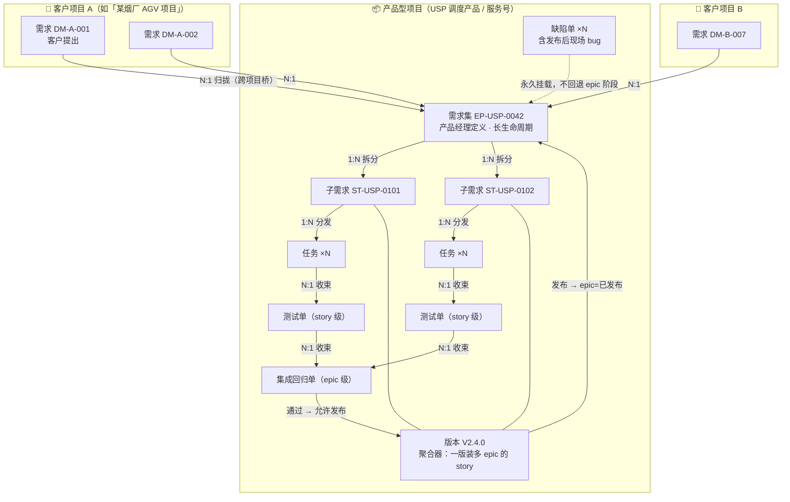

**关键约束**：

- 一个 epic 的 story **可以跨版本**（大 epic 分批交付，见 §7.5）。绝大多数情况下同 epic 的 story 落在同一版本。
- 一个版本装**多个 epic 的 story**——所以版本必须是独立聚合对象，而不是"epic 的一个字段"。用户点8 说"epic 关联版本号"，落地时是「epic 通过它的 story 关联到版本，发布时把版本号写回 epic」。
- **bug 永久挂在 epic 上**（用户拍板 D1）。epic 发布后依然活着、依然能收 bug，因为现场 bug 与原 test 流程可能间隔数月。副产品：epic 天然成为一本质量账本，可统计"哪个需求集产生的现场 bug 最多"——禅道给不了这个视角。

---

## 二、三个机制：自动流转 / 分发与收束 / 流程分级

### 机制① 自动流转：上个节点完成即触发下一节点

**没有任何"提交到下一环"的按钮。** 人只做本节点的动作（评审通过 / 完成任务 / 填测试结论），系统监听事件，自动生成下一环工单并投进对方收件箱。

| 上游事件 | 系统自动动作 |
|---|---|
| 客户提交 demand | 派单给该客户项目的项目经理 |
| 项目经理初评通过 | demand 进「需求池」，通知产品经理 |
| 产品经理提交 epic 评审 | **1:N 分发**：给每个评审人生成一张评审单 |
| 最后一张评审单通过 | **N:1 收束**：epic=已通过，生成「评审会/拆分待办」给产品经理 |
| 产品经理提交 story 拆分 | **1:N 分发**：每个 story 生成 task（指定人 or 进待认领池） |
| 某 story 的最后一个 task 完成 | **N:1 收束**：生成该 story 的测试单给测试 |
| 最后一个 story 测试通过 | **N:1 收束**：生成 epic 集成回归单给测试 |
| 集成回归通过 | epic=待发布，通知发布负责人；版本内全部 epic 就绪 → 生成发布单 |
| 发布单确认发布 | epic=已发布 + 写入版本号；**反向通知全部关联 demand 的提出人** |
| 现场提 bug 并认定归属 epic | 生成 bug 单挂 epic，派给对应研发；**epic 阶段不动** |

### 机制② 分发（1:N）与收束（N:1）

服务号的工单引擎是一对一的，本方案不改它——而是用**一组一对一工单 + 一个计数器**表达多人协同。

| 位置 | 类型 | 分发规则 | 收束规则 |
|---|---|---|---|
| N3 demand → epic | **N:1（人工）** | — | 产品经理把 N 条 demand 勾选归拢为 1 个 epic（可关联到已有 epic） |
| N4 epic 评审 | **1:N 分发** | 每个评审人一张评审单 | **全票通过才放行**；任一驳回即整体回炉、其余未办结评审单自动作废；超时由主持人代决（拍板 D5） |
| N6 story → task | **1:N 分发** | 指定处理人 or 进待认领池 | 该 story 全部 task = 已完成 |
| N7 task → test | **N:1 收束** | — | 该 story 的 task 全完成 → 自动生成 story 测试单 |
| N8 story test → 集成回归 | **N:1 收束** | — | epic 的全部 story 测试通过 → 自动生成集成回归单 |
| N9 epic → version | **N:1 聚合** | — | 版本内每个 epic 的集成回归单都通过 → 允许发布 |

**收束进度对人可见**：epic 详情页有「评审 3/5 已通过」「子需求 2/7 已测试通过」这类计数条，主持人/产品经理一眼知道卡在谁那里，可直接催办（复用现有催办模板）。

### 机制③ 流程分级：重流程 / 轻通道 / hotfix 三档

**如果一条"把按钮改成蓝色"的需求也要走 8 道闸门，实践中一定被绕开。** 所以分三档，由项目经理在 N2 初评时选择（可被产品经理在 N3 改判）：

| 档位 | 判定建议 | 路径 | 谁定 |
|---|---|---|---|
| **重流程** | 跨模块 / 预估 > 5 人日 / 影响对外接口或协议 / 涉及安全与调度核心 | N1→N10 全走 | 默认 |
| **轻通道** | 单模块 / ≤5 人日 / 无接口变更 | 初评通过 → 产品经理**直接建 story**（挂到相关 epic，或挂该产品的常设「零散优化」epic）→ **跳过 N4 评审与 N5 评审会** → 直接进 N6 | 项目经理初评时勾选，产品经理可改判为重流程 |
| **hotfix** | 线上阻塞、现场停机 | 直接建 bug 单挂对应 epic → 研发负责人秒批派单 → 修复 → 回归 → 随最近版本发布（或热更新） | 现场/测试/项目经理 |

三档**共用同一套工单与通知机制**，区别只在跳过哪几个节点。轻通道与 hotfix 一样全程留痕，事后可在 epic 上看到"这个 epic 走了 12 个轻通道 story"。

> 对齐禅道「在执行中直接提研发需求」那条旁路：轻通道就是它的等价物，而且更干净——禅道那条路是为了绕开"评审中需求不能关联执行"的系统限制，本方案是**主动的流程分级**。

---

## 三、角色与职责

角色是项目维度配置（沿用现有 `user_project_roles` + `report_to_id` 汇报链），一人可多角色、可在不同项目里担不同角色。

| 角色 | 归属项目类型 | 在流程中的职责 | 现状 |
|---|---|---|---|
| **客户** | 客户项目 | 提 demand、跟进自己需求的进度、发布后收通知 | ⚠️ **需新建**（`roles` 表无此角色；`tasks.customer` 有列但无写入方） |
| **项目经理** | 客户项目 | demand 初评：补评估意见 → 驳回 / 通过；定流程档位 | ⚠️ 有 `project.project_manager` 姓名字段，但**无角色记录** |
| **产品经理** | 产品型项目 | 定义 epic（归拢 demand）、主持评审、排期、主持评审会拆 story、变更管理、关闭 | ⚠️ **需新建**（代码里完全不存在，AI 派单目前靠"负责产品设计模块的人"代理） |
| **评审人** | 产品型项目 | 在评审单上通过/驳回并留意见 | 由产品经理在 N4 指定，默认候选：研发负责人 + 测试负责人 + 相关模块负责人 |
| **研发负责人** | 产品型项目 | 参与评审与评审会、task 兜底派单/转派、方案性返工决策 | ⚠️ 需新建（现有「调度研发」角色最接近） |
| **研发工程师** | 产品型项目 | 做 task（含自行认领）、修 bug | ✅ 现有工程师 |
| **测试** | 产品型项目 | **参加评审会（测试前置）**、执行 story 测试单与集成回归单、提 bug、回归确认 | ⚠️ **需新建** |
| **发布负责人** | 产品型项目 | 版本窗口管理、处理发布单、顺延决策 | 默认 = 版本创建人 |
| **管理/领导** | 两者 | 看板监控、接收上报、催办仲裁 | ✅ 现有 leader/admin |

**项目级默认配置**（产品型项目详情新增一组字段，配一次全程自动）：默认评审人列表、研发负责人、测试负责人、版本负责人、评审超时时限（默认 T+2 天）。

> 判级不靠角色名，沿用现有 `users.job_level`（1=一线 / 2=管理审核 / 3=兜底）+ `supervisor_id` + `user_project_roles.report_to_id`。

---

## 四、总流程图 · 泳道图 · 用户旅程

### 4.1 主流程图（含分发/收束节点与闸门）

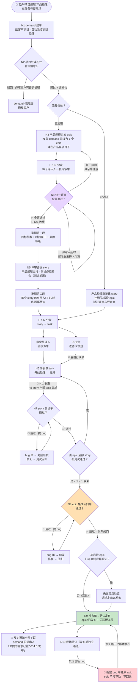

### 4.2 泳道图（每次跨道 = 一次工单流转）

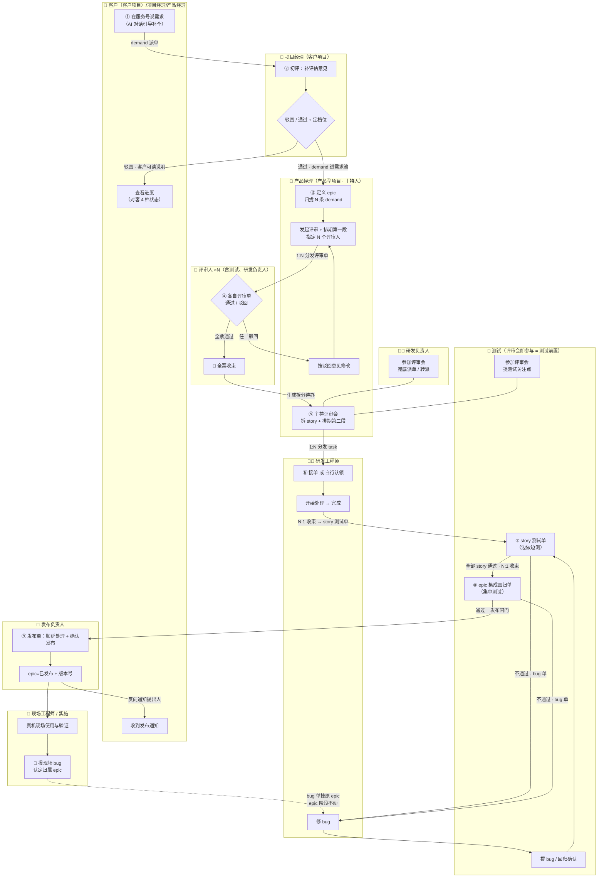

### 4.3 用户旅程（三个视角）

**客户视角**——这是本方案相对禅道最大的增量：客户第一次看得见自己的需求走到哪了。

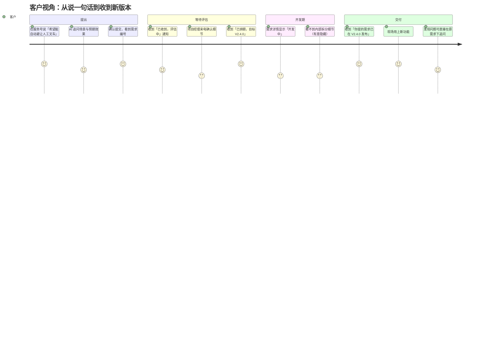

**研发视角**——体验与今天处理工单**完全一样**，管理概念对他不可见。

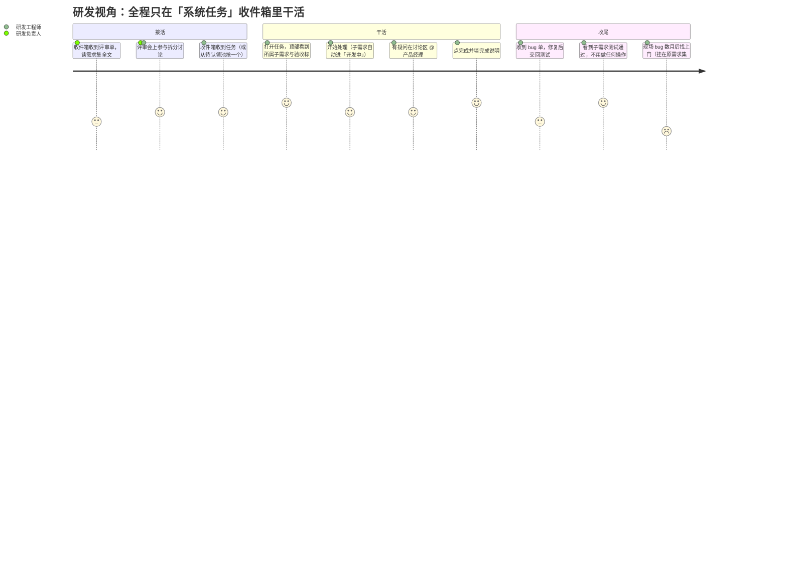

**测试视角**——测试前置落在"评审会必参与"和"story 级持续提测"两处。

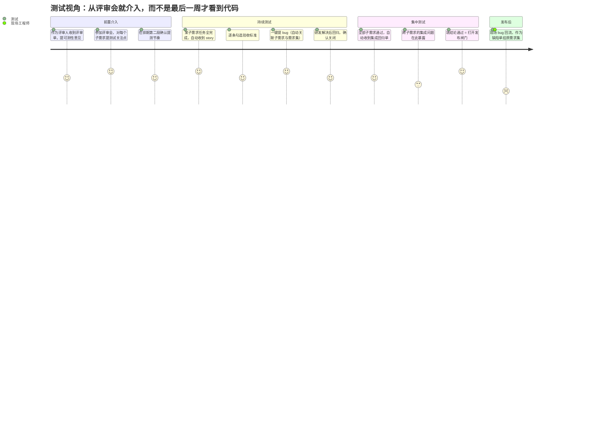

---

## 五、主流程逐节点详解（字段 / 校验 / 出口 / 通知）

> 统一模板：**谁触发 → 系统生成什么 → 处理人做什么 → 字段明细 → 出口条件 → 通知 → 异常分支**。
> 字段分三类：**录** = 该节点录入，**展** = 该节点展示（来自上游），**自动** = 系统生成。

### N1 客户提 demand（客户）

**入口**：🆘我要摇人 → AI 对话（**现有入口，无需新页面**）。AI 判定为需求类时走 demand 分支，追问场景与预期效果。也可由项目经理/现场工程师代客户录入，或由**现场报障工单一键"转需求"**（带出原工单链接）。

| 字段 | 类型 | 必填 | 说明 |
|---|---|---|---|
| 编号 | 自动 | — | `DM-{客户项目代号}-{序号}` |
| 标题 | 录 | ✅ | AI 从对话中提炼，客户可改 |
| **客户原话** | 自动 | — | **完整保留对话原文，永不改写**（产品经理改的是 epic，不是 demand） |
| 描述 | 录 | ✅ | AI 结构化整理：场景 / 期望效果 / 现在怎么做的 |
| 使用场景 | 录 | ✅ | 落 `metadata_info.scenario`（现有字段） |
| 预期效果 | 录 | ✅ | 落 `metadata_info.expected_effect`（现有字段） |
| 紧迫度 | 录 | ✅ | 紧急 / 高 / 中 / 低（复用现有四级） |
| 附件 | 录 | 可选 | 图片/视频（现场照片最有价值），复用现有附件 |
| 所属客户项目 | 自动 | — | 按提出人的项目归属 |
| 提出人 / 提出时间 | 自动 | — | 当前用户 |
| 状态 | 自动 | — | 待评估 |
| 讨论区 / 时间线 | 自动 | — | 复用现有能力 |

**出口**：保存即自动派单给该客户项目的项目经理（`project.project_manager`）。
**通知**：新工单模板（5）→ 项目经理。
**异常**：AI 判定不清时先落 demand 由项目经理改判；重复需求由项目经理在 N2 标记并关联到已有 demand/epic。

---

### N2 项目经理初评（项目经理）

**系统生成**：demand 单已直接派给项目经理，**不额外生成工单**（第一跳就是它本身）。

| 动作 | 字段 | 必填 | 结果 |
|---|---|---|---|
| ✅ 通过 | **评估意见**（业务价值/影响范围/是否已有同类需求）、**流程档位**（重流程/轻通道）、建议优先级 | 评估意见 ✅ | demand=已通过，进「需求池」，通知产品经理 |
| ❌ 驳回 | **驳回说明（客户可读）**、驳回类型（重复/超出产品范围/暂不排期/信息不足） | ✅ | demand=已驳回，客户收到通知与说明 |
| 🔁 补充信息 | 追问内容 | ✅ | demand=待补充，退回客户（走现有"退回"操作） |
| 🔗 标记重复 | 关联到已有 demand 或 epic | ✅ | demand=已合并，客户跟随被关联对象的进度 |

**展示字段**：客户原话全文、场景/预期效果、附件、该客户项目已有的同类 demand 列表（辅助判重）、客户历史 demand 采纳率。

**出口条件**：通过（含定档）/ 驳回 / 退回补充 / 标记重复，四选一。
**通知**：状态变更（3）→ 客户；通过时新工单（5）→ 产品经理。
**⏰ 治理**：初评超时（默认 T+2 天）走催办（1），再超时上报到 `report_to` 汇报链。

> **驳回不是终点**：驳回说明必须是客户能看懂的话。这是服务号的对客形象问题——"暂不排期"配一句"当前版本聚焦交管优化，你这条排在 Q4 评估"，和一句冷冰冰的"驳回"，客户感受完全不同。

---

### N3 产品经理定义 epic（产品经理）

**入口**：📊后台管理 → 需求池 → 勾选 N 条 demand → 「归拢为需求集」或「关联到已有需求集」。

| 字段 | 类型 | 必填 | 说明 |
|---|---|---|---|
| 编号 | 自动 | — | `EP-{产品代号}-{序号}` |
| 标题 | 录 | ✅ | **产品语言重写**，不是客户原话的复制 |
| 描述 | 录 | ✅ | 背景 / 产品目标 / 方案概述 / 不做什么 |
| **验收标准** | 录 | 评审前 ✅ | 条目式 checklist——既是评审依据也是测试依据（轻量用例） |
| 类型 | 录 | ✅ | 新功能 / 优化 / 客户定制 / 技术改造 |
| 优先级 | 录 | ✅ | 复用现有四级 |
| 所属产品型项目 | 录 | ✅ | USP 调度产品 / 服务号 / … |
| 标签 | 录 | 可选 | 模块归类（调度/地图/交管…），替代禅道"模块" |
| **风险等级** | 录 | ✅ | 低/中/高；**高 = 默认开启「强制现场验证才准发布」开关**（见 N9） |
| **关联 demand 列表** | 录 | ✅ 至少 1 条 | N:1 归拢；每条显示客户名+项目+原话摘要 |
| 关联客户/项目 | 自动 | — | 由 demand 反查，发布时用于反向通知 |
| 产品经理 | 自动 | — | 当前用户 |
| 状态 / 阶段 | 自动 | — | 草稿 / 待评审 |

**出口**：保存 = 草稿（可反复改）；点「发起评审」→ N4。
**联动**：被关联的 demand 状态 → 已纳入，客户侧显示「已排期评估」；epic 状态变化时**所有关联 demand 同步刷新对客状态**（见 §八）。
**通知**：状态变更（3）→ 各 demand 提出人（"你的需求已进入产品评估"）。

> **为什么 demand 和 epic 必须是两个对象**：客户重复提同一件事是服务号的最高频场景。两对象 N:1 才能既合并重复、又让每个客户在自己的单里看到自己的原话和进度。如果是"同一条记录升格"，客户会在自己的需求里看到一段被改写成产品语言的、不认识的文字。

---

### N4 epic 统一评审（产品经理主持 · 评审人 ×N）

**系统生成（1:N 分发）**：给每个评审人各一张评审单，标题「评审需求集：{epic 标题}」，截止 = 项目配置的评审时限（默认 T+2 天）。评审单内嵌 epic 全文 + 验收标准 + 关联 demand 原话。

**排期第一段**（产品经理在发起评审时填）：

| 字段 | 类型 | 必填 | 说明 |
|---|---|---|---|
| 目标版本 | 录 | ✅ | 从版本列表选或新建（此时 story 还不存在，只能定到版本粒度） |
| 时间窗口 | 录 | ✅ | 开始日 / 提测截止日 / 计划发布日（两周模板一键生成） |
| 投入预估 | 录 | 可选 | 人日，供版本容量统计 |
| 评审人列表 | 录 | ✅ | 默认带出项目配置：研发负责人 + **测试负责人** + 相关模块负责人 |
| 评审时限 | 录 | ✅ | 默认项目配置值 |

> 排期为什么分两段：点3 要求"评审同时排期"，但此时 epic 还没拆 story，无法排到人和天。所以 **N4 只定"哪个版本、什么窗口"，详细排期在 N5 评审会拆 story 时落**（第二段）。

**评审人动作**（评审单上两个按钮）：

| 动作 | 字段 | 必填 | 结果 |
|---|---|---|---|
| ✅ 通过 | 评审意见 | 可选 | 该张评审单关闭；收束计数 +1 |
| ❌ 驳回 | **驳回原因** | ✅ | epic=评审驳回；**其余未办结评审单自动作废**；通知产品经理 |

**收束规则（拍板 D5）**：

- **全票通过才放行**——任一驳回即整体回炉，产品经理按意见改后重新发起（轮次 +1，历史轮次全留痕）。
- **评审人不回**：到期走催办模板（1）；超过时限（默认再 +1 天）由**主持人（产品经理）代为通过**并留痕「因超时由主持人代决」。防止整条流程被一个人卡死。
- 收束进度在 epic 详情显示「评审 3/5」，产品经理可对未回的人一键催办。

**出口**：全票通过 → epic=已通过，自动生成「评审会/拆分待办」给产品经理。
**通知**：新工单（5）→ 各评审人；催办（1）→ 逾期评审人；状态变更（3）→ 产品经理（评审结果）。
**评审记录**：沉淀在 epic 详情「评审记录」区——轮次、评审人、结论、意见、耗时、时间。争议在 epic 讨论区进行（@ / 引用 / 已读名单齐全）。

---

### N5 评审会 + 拆 story（产品经理主持 · 测试必须参与）

**系统生成**：「拆分待办：{epic 标题}」→ 产品经理，附评审会检查项。

**评审会**（线下/线上会议，系统只承载结论）：

| 会议要素 | 落到系统里的东西 |
|---|---|
| 参会人 | 产品经理（主持）、研发负责人、**测试（强制）**、相关研发 |
| 议题 | epic 方案确认、story 划分、验收标准细化、**测试关注点前置** |
| 结论录入 | 会议纪要（贴进 epic 讨论区）+ story 列表 + 排期第二段 |

> **测试前置就落在这里**：测试在评审会上对每个 story 提测试关注点，写进该 story 的验收标准。这比"测试到最后一周才第一次看到功能"提前了整个开发周期。测试的第二个前置动作是 N4 作为评审人。

**拆 story 表单**（一次拆完，AI 可给拆分建议草稿）：

| 每行一个 story | 必填 | 说明 |
|---|---|---|
| story 标题 | ✅ | 建议动宾结构 |
| 验收标准 | ✅ | 从 epic 验收标准分配/细化，**含测试在会上提的关注点** |
| 负责研发 | 可选 | 留空 = 该 story 的 task 进待认领池 |
| 预估工时 | 可选 | 供版本容量统计 |
| 截止时间 | ✅ | 默认 = 版本提测截止日 |
| **所属版本** | ✅ | 默认 = epic 目标版本；**大 epic 可分批落不同版本**（见 §7.5） |

**排期第二段**就是上表的「负责研发 / 预估工时 / 截止 / 所属版本」四列。

**出口**：提交 → 1:N 生成 story，每个 story 再 1:N 生成 task（N6）；拆分待办自动关闭；epic=开发中。
**校验**：至少 1 个 story；每个 story 至少 1 条验收标准。
**通知**：新工单（5）→ 各 task 处理人；状态变更（3）→ 关联 demand 提出人（对客状态转为「开发中」）。

---

### N6 story → task：分发或自行认领（研发工程师）

**两条路**：

| 路径 | 触发 | 落地 |
|---|---|---|
| **指定分发** | 拆 story 时填了负责研发 | 直接派单（复用现有 `PATCH /{id}/assign`），状态=处理中 |
| **自行认领** | 未指定处理人 | task 进**待认领池**，研发负责人的团队成员都能看到并「认领」；认领即成为处理人 |
| **AI 兜底派单** | 未指定且长时间无人认领 | 走现有 AI 派单能力（`POST /{id}/ai-assign`），按 `duty_text`/`job_level`/责任模块树匹配 |

**待认领池设计**：📥系统任务 顶部新增「待认领 (n)」入口，列表按截止日排序，卡片显示 story 标题 + 验收标准摘要 + 预估工时 + 截止日。认领需**乐观锁**防并发抢单（两人同时点，后者提示"已被 xx 认领"）。

> 「无主资源人人可动」在本平台已有先例：责任模块树里"该功能待分配时任意登录用户可直改"（`module_tree_edit_service.py:51`）。认领池沿用同一治理思路。

**task = 现有工单，零新概念**：

| 现有动作 | 对 story / epic 的影响（自动） |
|---|---|
| 开始处理（new→in_progress） | 首个开始 → story=开发中 |
| 暂停/继续（pending⇄） | 不影响状态（对齐禅道 pause 不算进展） |
| 处理完成（→resolved，必填完成说明） | **该 story 全部 task 完成 → 自动生成 story 测试单**（N7） |
| 转派 / 上报 / 催办 / 讨论 / 逾期预警 | 全部沿用，无特殊逻辑 |

**展示增强**：task 详情页顶部新增**所属子需求卡片**（story 编号+标题+验收标准折叠+所属 epic），研发不离开任务就知道"为什么做、做到什么算好"。列表卡片加 `ST-xx` / `EP-xx` / `V2.4.0` 三个角标。

---

### N7 story 测试单（测试）——测试前置的第二处落点

**系统生成（N:1 收束）**：某 story 的最后一个 task 完成 → 自动生成该 story 的测试单，派给测试负责人（可转派给具体测试）。标题「测试子需求：{story 标题}@{版本号}」。

**为什么是 story 级而不是等 epic 全完**（拍板 D4）：某个 story 先做完就先测，bug 在开发期内暴露、边做边修，而不是全堆在最后一周。这才是"测试前置"在执行层的含义。

| 展示字段 | 内容 |
|---|---|
| story 全文 + **验收标准 checklist** | 可逐条勾选记录结果 |
| 所属 epic 摘要 | 一键跳转看全景 |
| 该 story 的全部 task 及完成说明 | 知道研发到底改了什么 |
| 历史 bug 列表 | 同 story 的老问题 |
| 版本窗口与倒计时 | — |

| 动作 | 字段 | 必填 | 结果 |
|---|---|---|---|
| 开始测试 | — | — | story=测试中 |
| **一键提 bug** | 标题 / 复现步骤 / 预期 / 实际 / 严重程度（阻塞·主要·次要·轻微）/ 截图 | 步骤+严重程度 ✅ | 生成 bug 单，**自动关联 story + epic + 版本**，默认派给对应 task 处理人（可改） |
| 结论=不通过 | 不通过说明 | ✅ | 测试单保持处理中，story 停在测试中 |
| 结论=通过 | 测试结论摘要 + 验收标准逐条勾选结果 | ✅ | **校验该 story 的 bug 全部 closed** 后 → story=测试通过 |

**bug 闭环 = 现有工单机制原样复用**（本方案最省力的一笔）：

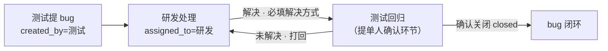

现有「resolved 后仅提单人可 确认关闭 / 打回未解决」的规则，与"bug 回归验证"语义**完全一致**，一行流程都不用改。

**出口**：结论通过 → 检查该 epic 是否全部 story 通过；是则收束到 N8。
**通知**：新工单（5）→ 测试；状态变更（3）→ 研发（bug 待修）/ 测试（bug 待回归）。

---

### N8 epic 集成回归单（测试）——点6 的"集中测试"

**系统生成（N:1 收束）**：epic 的**全部 story 测试通过** → 自动生成 epic 级集成回归单，派给测试负责人。标题「集成回归：{epic 标题}@{版本号}」。

**为什么还需要这一层**：story 级测试只保证每块单独可用，跨 story 的集成问题（接口不一致、时序竞争、整体流程走不通）只有在这里才暴露。这就是点6 要的"每个 task 完成后收束到测试集中测试"，只是收束点从 task 提到了 story——避免最后一周 bug 雪崩。

| 展示字段 | 内容 |
|---|---|
| epic 全文 + **epic 级验收标准 checklist** | 整体目标是否达成 |
| 全部 story 及各自测试结论 | 逐条可展开 |
| bug 汇总统计 | 共提 n 个 / 已关 m 个 / 按严重程度分布 |
| 版本内其它 epic 的进度 | 知道自己卡不卡版本 |

| 动作 | 字段 | 必填 | 结果 |
|---|---|---|---|
| 开始回归 | — | — | epic=集成测试中 |
| 提 bug | 同 N7（严重程度决定是否阻塞发布） | ✅ | bug 单挂 epic（**不挂具体 story**，因为是集成问题） |
| 结论=不通过 | 说明 | ✅ | epic 停在集成测试中，等 bug 闭环 |
| 结论=通过 | 回归结论 + 验收标准勾选 | ✅ | **校验 epic 关联的阻塞级/主要级 bug 全关** → epic=待发布 |

**出口 = 发布闸门（拍板 D3）**：集成回归通过即打开发布闸门。
**通知**：新工单（5）→ 测试；状态变更（3）→ 产品经理 + 发布负责人。

---

### N9 发布（发布负责人）

**系统生成**：版本内**每个 epic 的集成回归单都已通过** → 生成发布单给版本负责人，标题「发布：{版本号}」。

**风险闸门（拍板 D3）**：epic 风险等级=高 且 开启了「强制现场验证才准发布」开关时，该 epic 需先完成一次**现场验证单**（派给现场工程师/实施，含验证清单）才计入就绪。默认关闭——AGV 现场窗口稀缺，把现场窗口当默认发布闸门会让 epic 无限期挂着。

| 展示字段 | 内容 |
|---|---|
| epic 清单 | 每行：编号/标题/产品经理/集成回归结论/关联客户数 |
| story 清单 | 每行：编号/标题/负责研发/测试结论 |
| bug 统计 | 共提 n、全关、遗留（非阻塞）m 条明细 |
| **未完成条目（若有，红色置顶）** | 必须先处理顺延才能发布 |
| 窗口达成情况 | 计划 vs 实际 |

| 动作 | 字段 | 必填 | 结果 |
|---|---|---|---|
| 处理顺延 | 每条未完成 story/epic 选：顺延下一版本 / 退回需求池 / 关闭 | ✅ 清零才能发布 | 见 §7.4 |
| 确认发布 | **发布说明**（AI 按 epic/story 清单生成草稿，可编辑）、实际发布时间 | ✅ | 版本=已发布；版本内 epic=**已发布 + 写入版本号**；story=已发布 |

**发布后的两件自动事**：

1. **反向通知全部关联 demand 的提出人**：「你在 {日期} 提的需求「{demand 标题}」已随 V2.4.0 发布」+ 发布说明摘要。demand 状态 → 已交付。**这是 demand/epic 两对象模型最大的红利**——客户闭环自动完成，不需要项目经理逐个去说。
2. 触发知识库沉淀（现有知识生产闭环）：epic + story + bug + 讨论自动总结入库。

**发布后 epic 不关闭**：epic 保持"已发布"状态**长期存活**，作为后续 bug 的挂载点与质量账本（拍板 D1）。只有产品经理显式「归档」时才终态。

---

### N10 现场验证与现场 bug（现场工程师 / 实施）——发布后独立通道

**这是本方案与 v1 最大的语义差别，也是用户明确拍板的一条（D1）。**

**定位**：现场验证**不是发布前的关卡**（除高风险开关），而是**发布后的独立反馈通道**。理由：AGV 现场窗口稀缺，一个功能可能发布两个月后才在某个客户现场真机跑上，"现场 bug 与原 test 流程的时间间隔非常久"。

**现场 bug 的处理（关键规则）**：

| 规则 | 说明 |
|---|---|
| **新建 bug 单，挂载在原始 epic 上** | 不是新建 demand、不走 N1→N9 全流程 |
| **epic 阶段不动** | epic 保持"已发布"，**绝不回退**。回退会导致 epic 被要求重新评审、重新拆分——荒谬 |
| bug 单独立流转 | 派给对应研发（按 epic 的 story/task 归属推荐）→ 修复 → 测试回归 → 关闭 |
| 修复随下个版本发布 | bug 单关联到修复它的版本；紧急的走 hotfix（§7.6） |
| 双向可见 | bug 单同时出现在原 epic 的缺陷列表 + 报障客户项目的问题列表 |
| 升级例外 | 若修这个 bug 需要重新定义需求（不是缺陷而是设计缺失），由产品经理**显式升级为新 demand/epic**，留痕原 bug 单链接 |

**入口两条**：

1. 现场/客户在服务号报障（现有报障工单）→ 项目经理或研发**认定为某 epic 的缺陷** → 一键"转缺陷并挂载 epic"。
2. 高风险 epic 的现场验证单执行中直接提 bug。

**点7「test 与 epic 形成 loop」的正确表达**：这个 loop 是**信息回流**，不是状态回退——epic 是它这辈子所有 bug 的永久挂载点，测试与现场的发现持续回流到 epic 的账本上。

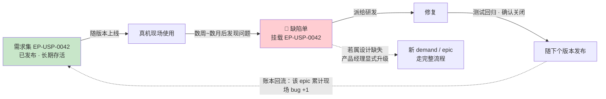

**质量账本视图**（禅道给不了的增量）：epic 列表可按「现场 bug 数」排序，回答"哪个需求集当初就没设计好"。这是产品复盘的硬数据。

---

## 六、状态机（六个对象各一张）

### 6.1 demand（客户需求）

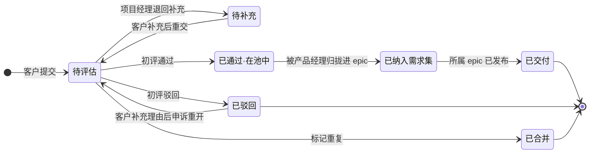

### 6.2 epic（需求集）——注意：发布后不回退

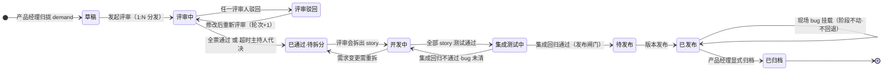

### 6.3 story（子需求）

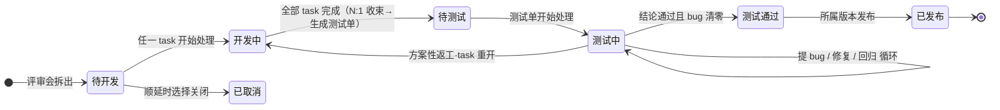

### 6.4 task（任务）——完全复用现有工单状态机

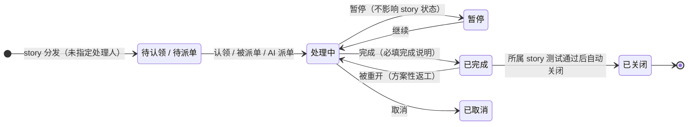

### 6.5 test（测试单：story 级 / epic 集成回归 / 现场验证 三种）

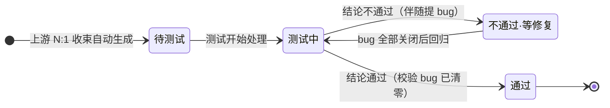

### 6.6 bug（缺陷）——完全复用现有工单机制

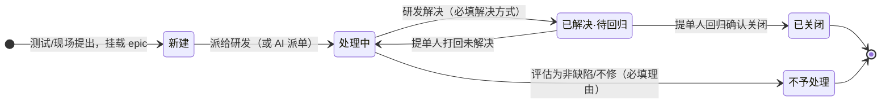

> 6.4 / 6.6 两张图**就是今天线上的状态机**，一个状态都没加。这是"不新造流转机制"的证据。

---

## 七、例外与分支流程

### 7.1 四处驳回，语义各不相同

| 位置 | 谁驳回 | 回到哪 | 必填 | 对客可见性 |
|---|---|---|---|---|
| N2 初评驳回 | 项目经理 | 回客户（终态，可申诉重开） | 客户可读的驳回说明 + 驳回类型 | ✅ 客户看到说明 |
| N4 评审驳回 | 任一评审人 | 回产品经理改稿（轮次+1） | 驳回原因 | ❌ 客户只看到"评估中" |
| N7 story 测试不通过 | 测试 | story 停在测试中，走 bug loop | 不通过说明 | ❌ 客户只看到"开发中" |
| N8 集成回归不通过 | 测试 | epic 停在集成测试中，走 bug loop | 不通过说明 | ❌ 客户只看到"开发中" |

**只有 N2 的驳回对客户可见**，其余是内部质量活动——客户不需要知道产品经理被评审人打回过三次。

### 7.2 现场 bug 不回退（拍板 D1）

见 §N10。核心一句：**bug 单挂 epic，epic 阶段不动。**

### 7.3 epic 变更（已拆 story 后需求变了）

| 时机 | 流程 |
|---|---|
| 评审通过前（草稿/评审中/驳回） | 产品经理直接编辑，改动进时间线，无需流程 |
| 评审通过后 ~ 拆 story 前 | 编辑 → 标记"已变更" → 自动生成新一轮评审单（**仅评审变更点**） |
| 拆 story 后（研发已启动） | 产品经理发起**变更申请**（变更说明 + 影响范围 + 工期影响）→ 评审单派给研发负责人 + 测试 → 通过后调整 epic 描述、增删 story；驳回则维持原稿。epic 回到"已通过·待拆分"重走 N5 的增量部分。全程留痕 |
| 已发布后 | 不改 epic，**建新 demand/epic** 承载新需求（历史版本的事实不该被改写） |

### 7.4 顺延（版本没做完的条目）

发布单强制逐条处理，三选一：

- **顺延下一版本**：解除当前版本关联、关联到指定新版本；已有 task 与 bug 跟随迁移；「顺延次数 +1」（看板红标，**顺延 ≥2 次自动上报领导**，治理"永远做不完的需求"）。
- **退回需求池**：解除版本关联，story 回"待开发"，保留已有 task 记录。
- **关闭**：状态=已取消，留原因；关联 demand 收到通知与说明。

### 7.5 大 epic 分批交付（跨版本）

一个 epic 的 story 可以落在不同版本（N5 排期第二段可逐 story 选版本）。此时：

- epic 标记「分批交付」，显示「批次 1/3」。
- **每批走一次 N8 集成回归**（回归范围 = 本批 story + 与已发布批次的集成点）。
- epic 状态 = **部分发布**（新增态，仅分批交付 epic 使用），直到最后一批发布才转"已发布"。
- 关联 demand 的对客状态按"其对应 story 所在批次"分别显示——客户 A 的需求在批次 1 发布了就通知客户 A，不用等整个 epic。

### 7.6 hotfix（线上急修）

不等版本节拍：直接建 bug 单挂对应 epic → 研发负责人秒批派单 → 修复 → 测试回归 → 建「hotfix 版本」（窗口=当天~数天）发布。跳过 N4/N5，**但不跳过测试回归**（bug 必须被提单人确认关闭）。全程留痕，事后在 epic 上可见。

### 7.7 评审人超时（拍板 D5 的兜底）

到评审时限：催办（1）→ 评审人；再超时（+1 天）：主持人（产品经理）可「代为通过」，系统留痕「因超时由主持人代决，未收到 {姓名} 的评审意见」。该记录进 epic 评审记录，评审人事后仍可补意见（作为讨论，不改变结论）。

### 7.8 非基线工单（保持现状，零影响）

不属于任何 story 的日常工单（报障/支持/杂项）照旧：`story_id`/`epic_id` 为空，流程、入口、看板一切不变——对齐禅道"不在基线内的任务无需关联或拆分"。**需求管理是叠加的容器层，不动现有工单地基。**

---

## 八、对客状态映射（客户能看到什么）

内部有 30+ 个状态（六个对象各自的状态机），**客户只该看到 4 档**。客户看到"子需求 3/7 测试中"是灾难——他会问"另外 4 个为什么没测"。

| 对客状态 | 客户看到的文案 | 内部触发条件 | 附带信息 |
|---|---|---|---|
| **①已收到** | 「已收到，项目经理评估中」 | demand = 待评估 / 待补充 | 提交时间、受理人 |
| **②评估中** | 「已通过初评，产品评估排期中」 | demand = 已通过·在池中 / 已纳入 且 epic ∈ {草稿, 评审中, 评审驳回, 已通过·待拆分} | 初评意见摘要 |
| **③开发中** | 「已排期，开发中」 | demand = 已纳入 且 epic ∈ {开发中, 集成测试中, 待发布} | **目标版本 + 计划发布日** |
| **④已发布** | 「已在 V2.4.0 发布」 | epic = 已发布（或该 demand 对应批次已发布） | 版本号、发布说明摘要、发布日期 |
| （旁支）**已驳回** | 「暂不排期」+ 项目经理的说明 | demand = 已驳回 | 驳回类型 + 说明 + 申诉入口 |
| （旁支）**已合并** | 「与需求 DM-xxx 合并跟进」 | demand = 已合并 | 指向被合并对象的进度 |

**客户看不到的**：epic/story 的存在与命名、评审轮次与驳回原因、story 拆分明细、task 与处理人、bug 数量与内容、内部排期变更过程。

**客户能做的**：查看自己 demand 的 4 档状态与目标版本、在 demand 讨论区追问（@ 项目经理）、被驳回后申诉、发布后在原 demand 下反馈使用情况（可转为现场 bug）。

> 状态收敛的落点：`epic` → `demand` 的状态同步是一个单向映射函数，epic 每次状态变化时刷新其全部关联 demand 的对客状态，并在跨档时发通知（②→③、③→④ 各发一次）。

---

## 九、版本对象与发布

### 9.1 为什么版本必须是独立对象

点8 说"epic release 时关联到版本号"。但真实发布是**一个版本装多个 epic 的 story**——如果版本只是 epic 的一个字段，就无法回答"V2.4.0 里都有什么""哪个 epic 卡了这次发布"。所以版本是独立聚合对象，承接禅道的**计划 + 执行 + 构建 + 发布**四合一。

| 字段 | 类型 | 必填 | 说明 |
|---|---|---|---|
| 版本号 | 录 | ✅ | 如 `V2.4.0`，即构建号 |
| 名称/主题 | 录 | 可选 | 如"交管优化专版" |
| 所属产品型项目 | 录 | ✅ | — |
| 窗口 | 录 | ✅ | 开始日 / 提测截止日 / 计划发布日（两周模板一键生成） |
| 版本负责人 | 录 | ✅ | 默认创建人；即发布单接收人 |
| 状态 | 自动 | — | 规划中 → 进行中 → 已发布 /（已取消） |
| 包含 story 列表 | 自动 | — | 由 N5 排期第二段写入（可跨 epic） |
| 涉及 epic 列表 | 自动 | — | 由 story 反查 |
| 容量提示 | 自动 | — | Σ story 预估工时 vs 窗口人力（二期 AI） |
| 发布说明 | 录 | 发布时 ✅ | AI 按 epic/story 清单生成草稿 |
| 实际发布时间 | 录 | 发布时 ✅ | — |

### 9.2 发布就绪判定

```
版本可发布 ⟺ 版本内涉及的每个 epic 的集成回归单都已通过
          ∧ 未完成条目已全部处理顺延
          ∧（若 epic 开启强制现场验证）该 epic 的现场验证单已通过
```

发布按钮在未就绪时置灰，并**点名卡点**：「EP-USP-0042 集成回归未通过（阻塞 bug 2 个）」。

### 9.3 版本详情页

| 区块 | 内容 |
|---|---|
| 头部 | 版本号、状态、窗口三日期 + **倒计时**、负责人 |
| 汇总条 | epic n 个 · story x/y 已测试通过 · task a/b · bug 未关 z · 按期率 |
| epic 分组列表 | 按 epic 分组展示其 story，每行带 mini 状态条——一眼看清整版推进与卡点 |
| 操作 | 编辑窗口、调整 story 归属版本、发布（未就绪置灰并提示卡点）、取消版本 |
| 发布后 | 发布说明、实际发布时间、顺延去向记录、关联客户通知送达情况 |

---

## 十、系统任务收件箱卡片设计

**一个收件箱，八类卡片。** 干活的人永远只看这一个地方，卡片类型角标告诉他这次要干什么。

| 类型 | 角标 | 标题模板 | 卡片补充字段 | 主按钮 |
|---|---|---|---|---|
| **客户需求** demand | 蓝「需求」 | `需求初评：{标题}` | 客户名、客户项目、紧迫度、提交时间 | 通过 / 驳回 / 退回补充 |
| **评审单** review | 紫「评审」 | `评审需求集：{epic 标题}` | 产品经理、关联客户数、截止日、**当前收束进度 3/5** | 通过 / 驳回 |
| **拆分待办** split | 靛「拆分」 | `拆分需求集：{epic 标题}` | 评审结论摘要、目标版本、窗口 | 开评审会 / 提交拆分 |
| **任务** task | 现有样式 | 现有 | + `ST-xx` + `EP-xx` + `V2.4.0` 三角标、验收标准折叠 | 现有按钮不变 |
| **待认领** claim | 灰「待认领」 | `待认领：{task 标题}` | 所属子需求、预估工时、截止日、已挂 n 小时 | **认领** |
| **story 测试单** test | 橙「测试」 | `测试子需求：{story 标题}@{版本}` | task 完成数、已提 bug 数、验收标准条数 | 开始测试 / 提bug / 填结论 |
| **集成回归单** regression | 深橙「集成回归」 | `集成回归：{epic 标题}@{版本}` | story 通过数 n/n、bug 遗留数、版本内其它 epic 进度 | 开始回归 / 提bug / 填结论 |
| **缺陷** bug | 现有 bug 样式 | 现有 | + `EP-xx` 角标 + **「现场」标记**（区分测试期 bug 与现场 bug） | 现有按钮不变 |
| **发布单** release | 绿「发布」 | `发布：{版本号}` | epic 数、story 数、未完成数、就绪状态 | 处理顺延 / 确认发布 |
| **现场验证单** field | 青「现场」 | `现场验证：{epic 标题}` | 验证清单、客户/现场、风险等级 | 开始验证 / 提bug / 填结论 |

**排序与分组**：默认按「逾期 → 今天到期 → 收束卡点（我是最后一个没交的人）→ 其余按截止日」。收束卡点置顶是关键——让"卡住整条流程的那个人"自己先看到。

---

## 十一、通知矩阵（复用现有 9 类微信模板）

现有模板：1 催办 · 2 每日统计 · 3 状态变更 · 4 逾期 · 5 新工单 · 6 逾期提醒 · 7 转派 · 8 提及 · 9 超时预警。**不新增模板类型**。

| 事件 | 通知对象 | 模板 |
|---|---|---|
| 客户提 demand | 项目经理 | 新工单（5） |
| 初评通过 / 驳回 / 退回补充 | **客户** | 状态变更（3） |
| 初评通过 | 产品经理 | 新工单（5） |
| epic 发起评审（1:N 分发） | 各评审人 | 新工单（5） |
| epic 评审结果（全票通过 / 被驳回） | 产品经理 | 状态变更（3） |
| epic 进入开发中 | 全部关联 demand 提出人（对客②→③） | 状态变更（3） |
| story 分发 task | 各处理人 | 新工单（5） |
| task 进待认领池 | 该研发组全员（一次性，不重复轰炸） | 新工单（5） |
| story 全部 task 完成 → 测试单 | 测试 | 新工单（5） |
| 全部 story 通过 → 集成回归单 | 测试 | 新工单（5） |
| bug 生成 / 解决待回归 | 研发 / 测试（提单人） | 新工单（5）/ 状态变更（3） |
| 集成回归通过（发布闸门打开） | 产品经理、发布负责人 | 状态变更（3） |
| 版本就绪 → 发布单 | 发布负责人 | 新工单（5） |
| **版本发布** | 版本内全部 epic 的**关联 demand 提出人**（对客③→④）+ 内部相关人 | 状态变更（3） |
| 现场 bug 挂载 epic | 对应研发 + 产品经理（质量信号） | 新工单（5） |
| 评审人逾期 / 初评逾期 / task 逾期 | 责任人 | 催办（1）/ 逾期（4/6） |
| 收束卡点超时（我是最后一个没交的） | 责任人 + 主持人 | 超时预警（9） |
| 顺延 ≥2 次 / 阶段滞留超时 | 领导（`report_to` 汇报链） | 催办（1）`to_admin` |
| 转派 / @提及 | 相应人 | 转派（7）/ 提及（8） |
| 每日待办统计 | 全员 | 每日统计（2） |

**对客通知的节制原则**：客户只在**跨对客档位时**收通知（①→②、②→③、③→④、→已驳回），内部状态变化一律不通知。避免客户被"评审第二轮驳回"这类内部噪音打扰。

---

## 十二、禅道流程覆盖清单（逐条对账）

对照现行禅道流程逐条核对，**证明功能不减**：

| # | 禅道现行流程 | 本方案落点 | 状态 |
|---|---|---|---|
| 1 | 产品经理列/写需求 | §N3 定义 epic（**且前置了客户直提 demand + 项目经理初评，禅道没有的入口**） | ✅ 增强 |
| 2 | 发起需求评审 → 状态=评审中、阶段=未开始 | §N4，且升级为 **1:N 多人评审 + 收束** | ✅ 增强 |
| 3 | 评审通过 → 状态=激活、阶段=未开始 | §N4 全票通过 → epic=已通过·待拆分 | ✅ |
| 4 | 评审不通过的处理（禅道未明说，实际存在） | §7.1 四处驳回语义 + 轮次留痕 | ✅ 完善 |
| 5 | 版本计划（未来两周）：构建版本 + 执行关联"未开始"需求，依赖评审通过 → 阶段=研发立项 | §九 版本四合一 + §N4 排期第一段 + §N5 排期第二段（**四步合成两段**） | ✅ 精简 |
| 6 | 或在执行中直接提研发需求（跳过评审关联限制），阶段=评审中 | §机制③ **轻通道**（主动的流程分级，而非绕开系统限制） | ✅ 完善 |
| 7 | 研发按需求拆任务（不在基线的无需关联；强依赖评审通过）→ 任务=未开始、阶段=研发立项 | §N5 拆 story + §N6 分发 task；评审通过是硬门槛；§7.8 非基线工单零影响 | ✅ |
| 8 | 研发开始任务 → 任务=开始、阶段=研发中 | §N6（现有"开始处理"，story 自动进开发中） | ✅ |
| 9 | 研发完成任务 → 任务=完成、阶段=研发完毕 | §N6 → **N:1 自动收束生成测试单**（禅道需手动建测试单） | ✅ 增强 |
| 10 | 测试进行测试 → 阶段=测试中 | §N7 story 级测试单（**比禅道更早介入**） | ✅ 增强 |
| 11 | 测试完成且功能可用 → 阶段=测试完毕 | §N7 结论通过（+bug 清零硬校验，防"带伤通过"）→ §N8 集成回归 | ✅ 完善 |
| 12 | 测试完成但功能不可用/有 bug → 阶段=测试中（循环） | §N7 bug loop（复用现有"提单人确认关闭"回归机制） | ✅ |
| 13 | 已发布（稳定阶段） | §N9 发布单 + 版本号写回 epic | ✅ |
| 14 | （隐含）版本没做完的需求怎么办 | §7.4 顺延机制，留痕 + 红标 + ≥2 次上报 | ✅ 完善 |
| 15 | （隐含）需求变更 | §7.3 四时机变更规则 | ✅ 完善 |
| 16 | （隐含）任务转派/催办/上报/讨论 | 现有工单能力全继承（转派/上报/退回/催办/讨论/@/已读名单/AI） | ✅ 增强 |
| 17 | （禅道**没有**的）客户提需求入口 | §N1 客户在服务号直提 + §八 对客 4 档状态 + 发布反向通知 | 🆕 新增 |
| 18 | （禅道**没有**的）发布后现场 bug 归因 | §N10 bug 永久挂 epic + epic 质量账本 | 🆕 新增 |
| 19 | （禅道**没有**的）测试前置 | §N4 测试作为评审人 + §N5 测试必参会 + §N7 story 级持续提测 | 🆕 新增 |
| 20 | （禅道**没有**的）自行认领 | §N6 待认领池 | 🆕 新增 |

**禅道 story 状态词表覆盖检查**（`backend/app/integrations/sources/zentao/mapper.py:146` 的 `ZENTAO_STORY_STATUS_MAP`）：

| 禅道 | 本方案对应 |
|---|---|
| draft 草稿 | epic=草稿 |
| active 激活 | epic=已通过·待拆分 |
| reviewed 已评审 | epic=已通过·待拆分（同上，禅道两态本方案合一） |
| planned 已计划 | story 已排入版本（排期第二段落地） |
| developed 已开发 | story=待测试 |
| tested 已测试 | story=测试通过 |
| released 已发布 | epic=已发布 |
| closed 关闭 | epic=已归档 / demand=已交付 |
| changed 已变更 | §7.3 变更评审 |

---

## 十三、与现有实现的落点（复用 / 新建）

> 本节只标注落点，**本文不含任何代码改动**。

### 13.1 直接复用（不动）

| 能力 | 位置 |
|---|---|
| 一对一工单状态机（new/in_progress/pending/resolved/closed/canceled） | `backend/app/models/task.py`、`backend/app/modules/tasks/services/ticket_service.py` |
| 转派 / 上报 / 退回（`operation_type`）、`PATCH /{id}/status`、`PATCH /{id}/assign` | `backend/app/modules/tasks/api/task.py` |
| **「resolved 后仅提单人可确认关闭/打回」= bug 回归验证语义** | `ticket_service.update_ticket_status` |
| 讨论区（@ / 引用回复 / 已读名单 / AI「U老师」） | `TaskComment` / `TaskCommentRead` / `TaskCommentReadRecord` |
| 操作时间线 | `TaskOperationLog` |
| 9 类微信模板通知、催办、逾期、超时预警 | `backend/app/utils/notification_utils.py` |
| AI 派单（含 `duty_text`/`job_level`/责任模块树画像） | `ai/agents/AiDiagnosisPlatform/assigner/` |
| **客户提单入口（AI 对话，无需新页面）** | `frontend/src/pages/call/CallView.tsx`；类型判定 `ai/agents/AiDiagnosisPlatform/pipeline.py:510`；需求字段落 `metadata_info`（`ai/core/task_adapter.py:76`） |
| 项目与成员角色、汇报链 | `user_project_roles`（含 `report_to_id`）、`users.supervisor_id` |
| 附件 / MinIO、系统任务收件箱、非基线工单全流程 | 现有 |

### 13.2 可照抄的现成范式

| 需要做的 | 现成范式 |
|---|---|
| **评审单 / 拆分待办 / 发布单 等"审批型工单"** | 公司/部门审核流：`ticket_type=OTHER` + `metadata_info.approval_type` + 业务表 `pending/approved/rejected` + `approved_by/approved_at/reject_reason`（`backend/app/modules/admin/api/users.py:290-355`） |
| 带状态机与"批准后自动生效"的审批 | `backend/app/modules/admin/services/module_tree_edit_service.py:135-164`（`decide_edit`） |
| **待认领池的治理思路** | `module_tree_edit_service.py:51`「该功能待分配时任意登录用户可直改」——无主资源人人可动的既有先例 |
| 认领动作本身 | `PATCH /api/tasks/{id}/assign` 已放开给任何登录用户（`task.py:1169`），补一个池列表 + 乐观锁即可 |
| 父子层级字段 | **`related_resource_id`（`backend/app/models/task.py:89`）已建索引、有完整过滤链路、确认零生产写入**，改语义作 `parent_id` 成本最低；否则走 `metadata_info` JSON（现有审批流就是这么干的） |

### 13.3 需要新建（设计层，均为叠加）

1. **三个新对象**：demand、epic、story（task/test/bug 全部用现有 tasks 表 + 类型语义）+ **version** 聚合器。
2. **工单关联字段**：`epic_id` / `story_id` / `version_id`——空则为非基线工单，现状不变。
3. **四个新角色**：客户、产品经理、测试、研发负责人。⚠️ `roles` 表**零种子数据**（`backend/app/models/identity.py:36`），唯一被代码按名查找的角色是「调度研发」（`identity_service.py:392`）。`tasks.customer` 有列但**无生产写入方**——客户身份要在 AI 提单落库处（`ai/core/task_adapter.py:110`）补填。
4. **项目分型字段**：新增 `project_kind: product | customer`。⚠️ **不要复用 `project_type`**——它是营销维度（大客户项目/展会项目/试点项目…，`backend/app/modules/admin/schemas_das/request_models.py:37`），语义已占用。现有 `frontend/src/pages/admin/ProjectImport.tsx` 的「USP项目/其他项目」两按钮只是路由分流、未落库。**存量脏数据需清洗**：`一期/试点项目`（枚举里是 `试点项目`）、`不重要不紧急`（枚举里是 `不紧急不重要`）。
5. **一个事件推导器**：监听工单状态事件 → 按 §二 的分发/收束规则改写上层对象状态并触发下一环（生成工单 + 通知）。⚠️ 现有后端**没有 `ALLOWED_TRANSITIONS`**，流程约束目前散在 API 角色校验 + 前端 state→action 映射里；新流程的闸门（评审通过才准拆分、bug 清零才准填通过、集成回归通过才准发布）**必须落在服务层集中校验**，否则前端一绕就破。
6. **待认领池**：列表接口 + 认领动作的乐观锁 + 收件箱入口。
7. **对客状态映射函数**：epic/demand 状态 → 对客 4 档，跨档才通知。
8. **页面**：客户侧 demand 详情（4 档进度）；后台需求池、epic 详情（评审记录 + story 收束进度 + **缺陷账本**）、story 详情、版本列表/详情；收件箱十类卡片角标；task 详情"所属子需求"卡片；产品型项目详情的默认负责人配置组。
9. **禅道退役路径**：本方案落地后按 `backend/INTEGRATION_DESIGN.md` §12.1 摘除 zentao 插件（核心零改动），历史同步数据归档保留。

> **迁移建议**：先在一个版本窗口上与禅道**并行跑一轮**（禅道只读同步仍在，可对照），验证分发/收束与对客状态无误后切主，再退役禅道。

---

## 十四、有意精简的决策记录

> 每条都写明"禅道原样"与"功能如何被保住"，确保是**收纳**而不是**砍功能**。

| # | 禅道原样 | 本方案 | 功能保全方式 |
|---|---|---|---|
| 1 | 产品/产品线独立实体 | 产品型项目（`project_kind=product`） | 需求照常归属与筛选，不新增实体层 |
| 2 | 计划、执行、构建、发布 四实体 | **版本**一个聚合对象 | 四者字段/动作全并入版本（排入 story=计划、窗口=执行、版本号=构建、发布单=发布） |
| 3 | 需求阶段手工/半自动维护 | 全自动推导（分发/收束驱动） | 状态值域一致且更准（跟事实走），无手动改阶段入口 |
| 4 | 手动建测试单/提测 | story 的 task 全完成即自动生成测试单 | 提测动作没了，提测这件事还在且不会忘 |
| 5 | 任务每日填 consumed/left 工时 | 一次性预估工时 + 截止时间 + 逾期预警 | 进度靠状态与截止管，卸掉日填负担；完成时可补记实际工时（二期开关） |
| 6 | 测试用例库/用例关联 | **验收标准 checklist 即轻量用例** | 评审、拆分、测试共用一份标准；正式用例库进知识库（二期） |
| 7 | 评审会签多人多轮配置 | 1:N 分发 + 全票收束 + 超时代决 | 会签语义完整保留，且加了防卡死机制（禅道没有） |
| 8 | 模块/分支/多产品维度 | 标签 tags | 归类与筛选能力等价 |
| 9 | 需求树（story 可无限层嵌套） | **epic → story 两层封顶** | 分解能力保留，层级砍平（移动端友好）；特大需求用"分批交付"而非加层 |
| 10 | 多入口多列表（产品视图/项目视图/执行视图/我的地盘…） | **一个收件箱 + 需求池 + epic 看板 + 版本页** | 干活的人只看收件箱；管理的人看三块板 |
| 11 | 需求-任务-bug 三套独立列表与筛选 | 全部收进 epic 详情的子对象区 | 上下文集中，不用在三个列表间跳 |
| 12 | 阶段回退（bug 导致 story 退回） | **发布后现场 bug 不回退，挂 epic 独立流转** | 缺陷跟踪能力更强（有归因账本），且避免"发布两个月后 epic 退回评审"的荒谬 |

---

## 十五、需求点对照表（12 条要求逐条落点）

| # | 要求 | 落点 | 备注 |
|---|---|---|---|
| 1 | 所有流程从 demand 开始，客户可直接通过服务号提基础需求，派单到项目经理 = 第一次流转 | §N1、§N2 | 复用现有 AI 对话入口，无需新页面 |
| 2 | 项目经理第一次评估 + 评估意见 → 驳回/通过；通过流转到产品经理，**demand 转变为 epic** | §N2、§N3 | ⚠️ 按讨论结论落为**两个独立对象 N:1**（用户拍板 D2），而非同一条记录升格——为了能合并重复需求、保住客户原话 |
| 3 | epic 经评审，产品经理主持，同时具体排期，分配不同人评审 = **1:N 派单**，系统任务发给对应人，**统一评审通过**才进下一阶段 | §N4、§机制② | 排期分两段（§N4 第一段 + §N5 第二段）；统一通过 = **全票 + 超时主持人代决**（拍板 D5） |
| 4 | 下一阶段 story，epic 复杂需求拆解为小需求；评审与拆分需**评审会**，**测试也参与（测试前置）** | §N5 | 测试前置三处落点：N4 评审人、N5 必参会、N7 story 级持续提测 |
| 5 | story 继续 **1:1 向下流转为 tasks**，分发给研发，**或自行认领**；分发靠系统任务 | §N6 | 严格说是 1:N（一个 story 可拆多个 task）；待认领池 + 乐观锁 + AI 兜底派单 |
| 6 | 每个 task 完成后（每个研发点完成），**收束到测试集中测试**，工单转为 test | §N7、§N8 | 两层：story 级持续提测 + epic 级集成回归（拍板 D4，解决点4/点6 方向相反的矛盾） |
| 7 | test 流程与 epic 形成 **loop**——本地测完没 bug，真机实地会测出 bug | §N10 | ⚠️ loop 表达为**信息回流而非状态回退**：现场 bug 建 bug 单永久挂 epic，epic 阶段不动（拍板 D1，因"现场 bug 与原 test 流程时间间隔非常久"） |
| 8 | test 通过后完整 epic **release 并关联版本号** | §N9、§九 | 发布闸门 = 本地集成回归通过（拍板 D3）；版本是独立聚合器（一版多 epic） |
| 9 | 所有流程在上个节点完成后**自动流转**，通过系统任务**分发与收束** | §机制①、§机制② | 无"提交到下一环"按钮；收束进度对主持人可见并可催办 |
| 10 | 流程**挂载在产品型项目下**（如 USP 或服务号） | §1.3、§13.3-4 | epic/story/task/test/bug/version 挂产品型项目；demand 留客户项目，N:1 关联即跨项目桥。⚠️ 需新增 `project_kind` 字段 |
| 11 | 改写文档，**完整表达流程图、用户旅程、泳道图** | §4.1 流程图、§4.2 泳道图、§4.3 用户旅程 ×3、§1.3 对象关系图、§六 状态机 ×6 | — |
| 12 | 评审方案矛盾/不流畅处，沟通后再改文档 | 已完成：4 项矛盾已讨论并由用户拍板（D1~D5），6 项由我按推荐补齐（跨项目归属、对客状态映射、流程分级、命名双轨、排期两段、版本聚合器） | 见 §十六 |

---

## 十六、待决与风险

### 16.1 已解决的矛盾（记录讨论结论，便于回溯）

| 原矛盾 | 结论 |
|---|---|
| 点4「测试前置」与点6「集中测试」方向相反 | 两层测试：story 级持续提测（前置）+ epic 级集成回归（集中）。**拍板 D4** |
| 点2「demand 转变为 epic」无法合并重复客户需求，且改写会覆盖客户原话 | 两个独立对象、N:1 关联；demand 原话永不改写。**拍板 D2** |
| 点7「test 与 epic 形成 loop」若做成状态回退，一个现场 bug 会让已发布 epic 退回评审 | 现场 bug 建 bug 单挂 epic，**epic 阶段不动**；loop 是信息回流。**拍板 D1** |
| 点3「统一评审通过」无判定规则 | 全票通过；任一驳回整体回炉；超时催办后主持人代决。**拍板 D5** |
| 真机现场测试是发布闸门还是发布后通道（AGV 现场窗口稀缺） | 本地集成回归通过 = 发布闸门；现场验证为发布后独立通道；高风险 epic 可开强制现场验证开关。**拍板 D3** |

### 16.2 仍需在实施前确认

| # | 待决 | 影响面 |
|---|---|---|
| 1 | **风险等级判定标准**由谁定、怎么定（决定哪些 epic 强制现场验证） | 若判定过松，发布节奏会被现场窗口拖住；过紧则高风险功能裸奔上线 |
| 2 | **轻通道的档位判定阈值**（"≤5 人日、单模块"是建议值，需按团队实际校准） | 阈值定太高，重流程形同虚设；太低，轻需求也走 8 道闸门被绕开 |
| 3 | **评审超时时限**与"主持人代决"的组织授权（产品经理代决研发负责人的评审意见，是否可接受） | 治理问题，非技术问题；建议先设 T+2 天 + 代决留痕，跑一个版本后调 |
| 4 | **客户角色的开通范围**——所有客户都能提 demand，还是只有指定对接人 | 全开放会带来噪音量与判重压力；建议先限项目对接人，跑通后放开 |
| 5 | **`project_kind` 迁移与存量脏数据清洗**（`一期/试点项目`、`不重要不紧急`） | 分型字段是全流程挂载的前提，需在实施第一步解决 |
| 6 | 大 epic **分批交付**的对客通知粒度（按批次通知 vs 全部完成才通知） | 按批次通知客户体验更好，但实现更复杂；建议一期先做"全部完成才通知"，分批交付 epic 手动通知 |

### 16.3 主要风险

| 风险 | 缓解 |
|---|---|
| **收束点成为卡死点**——一个人不回，整条流程停住 | 全部收束点配催办（1）+ 超时预警（9）+ 主持人代决 + 收件箱"收束卡点置顶" |
| **测试单数量爆炸**——story 级持续提测让测试收件箱变密 | 收件箱按 story 分组折叠；同 epic 的 story 测试单可批量处理；测试负责人可转派给组内 |
| **闸门被前端绕过** | 现有后端无集中状态机；三个硬闸门（评审通过才拆分、bug 清零才通过、集成回归通过才发布）必须落服务层校验 |
| **客户期望管理**——客户看到"已排期 V2.4.0"后版本延期 | 对客状态显示"计划发布日"而非承诺；顺延时自动通知客户并给说明；顺延 ≥2 次上报领导 |
| **产品经理成为唯一瓶颈**——归拢 demand、主持评审、主持评审会、拆 story 全压在一个人身上 | 需求池支持多产品经理按模块分工；AI 辅助归拢与拆分草稿（§二期）；轻通道分流小需求 |
| **禅道并行期数据双写** | 并行只跑一个版本窗口，且禅道保持只读同步（现有插件），不做双向写 |

### 16.4 AI 增强点（二期，顺着平台三 Agent 基因）

| 环节 | AI 能力 | 复用 |
|---|---|---|
| 客户提 demand | 对话式引导补全场景/预期效果（**已有**） | 提单 Agent |
| 项目经理初评 | 判重：检索同客户/同产品的历史 demand 与 epic | 知识库 RAG + 相似工单检索 |
| 产品经理归拢 | 聚类建议："这 5 条 demand 说的是同一件事" | 向量检索（Qdrant 已有） |
| 评审 | 评审预检：验收标准完整性、与已有 epic 冲突检测 | 知识库 RAG |
| 拆 story / 拆 task | 生成拆分草稿含建议人选 | 任务 Agent + AI 派单画像 |
| 测试 | 按验收标准生成测试点清单草稿 | 任务 Agent |
| 发布 | 按 epic/story 清单生成发布说明草稿 | resolution-summary 机制 |
| 管理 | 版本风险预警（容量超载、收束滞留、顺延趋势）、**epic 现场 bug 归因分析** | 管理 Agent / 日报周报分析 |
| 沉淀 | 发布后 epic + story + bug + 讨论自动总结入知识库 | 现有知识生产闭环 |
