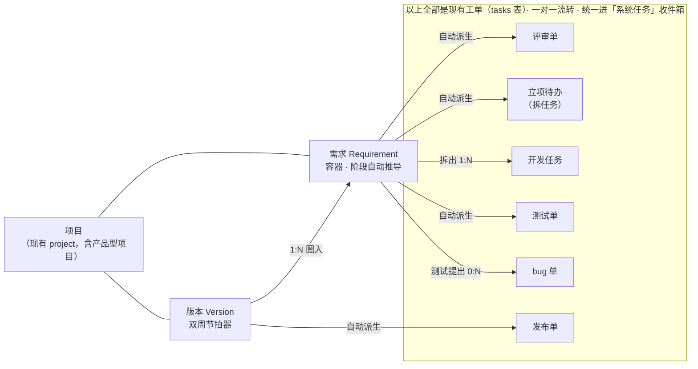
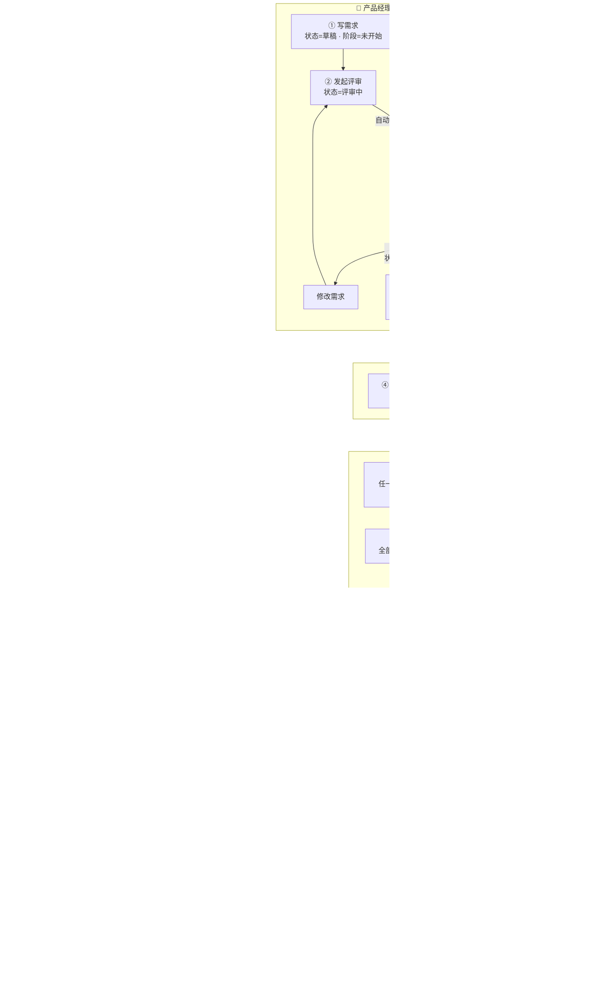
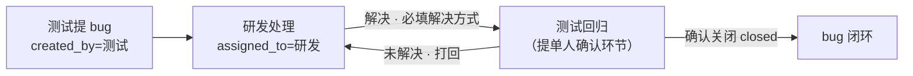
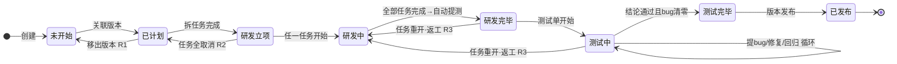
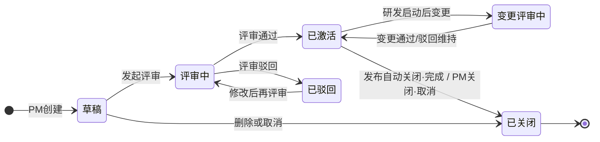

# 需求流转与版本管理设计方案 · 禅道平替

> 状态：**设计稿**（仅方案，不含代码改动）
> 日期：2026-08-19
> 关联：[PRODUCT.md](./PRODUCT.md)（产品形态）、[ARCHITECTURE.md](./ARCHITECTURE.md)（技术架构）、[../../backend/INTEGRATION_DESIGN.md](../../backend/INTEGRATION_DESIGN.md)（禅道只读同步，本方案是其 §12.2「平替禅道」路径的产品设计）
> 背景：AGV 产品目前用禅道做产品/项目管理，需求流转横跨 需求→研发→测试→稳定 四大阶段。禅道体量大、入口多、阶段靠人手工维护。本方案把这套流程原生搬进服务号：**功能不减、步骤减半、复杂度藏进自动流转**。

---

## 目录

- [〇、一页纸总览](#〇一页纸总览)
- [一、设计策略：三个对象 + 一条自动流水线](#一设计策略三个对象--一条自动流水线)
- [二、与禅道的概念对照（证明全覆盖）](#二与禅道的概念对照证明全覆盖)
- [三、总流程图（泳道 · 人员与流转）](#三总流程图泳道--人员与流转)
- [四、阶段自动推导规则（本方案的发动机）](#四阶段自动推导规则本方案的发动机)
- [五、六大节点详解（动作 / 字段 / 校验 / 通知 / 异常）](#五六大节点详解动作--字段--校验--通知--异常)
- [六、例外流程：变更 / 驳回 / 顺延 / 插单 / 非基线任务](#六例外流程变更--驳回--顺延--插单--非基线任务)
- [七、人员角色与三菜单视角](#七人员角色与三菜单视角)
- [八、界面与字段展示设计](#八界面与字段展示设计)
- [九、状态机与通知矩阵（工程附录）](#九状态机与通知矩阵工程附录)
- [十、禅道流程覆盖清单（逐条对账）](#十禅道流程覆盖清单逐条对账)
- [十一、有意精简的决策记录](#十一有意精简的决策记录)
- [十二、AI 增强点（二期）](#十二ai-增强点二期)
- [十三、与现有系统的关系（复用面 / 新增面）](#十三与现有系统的关系复用面--新增面)

---

## 〇、一页纸总览

**一句话**：**需求是流程的容器，工单是人干活的原子。人只做动作，阶段自己走。**

- 禅道里"需求所处阶段"要靠计划、执行、构建、任务、测试单等一堆实体的手工关联来驱动；本方案把阶段变成**纯推导值**——由子工单的真实状态自动算出来，任何人**永远不需要手动改阶段**。
- 服务号现有的一对一工单流转（派单 → 处理 → 解决 → 确认关闭，含转派/上报/催办/讨论/已读/AI）**原样保留、原样复用**：需求生命周期里每一次"人与人的交接"，都自动生成一张一对一工单投进对方的「系统任务」收件箱——评审是一张单、拆任务是一张单、开发是 N 张单、测试是一张单、bug 是一张单、发布还是一张单。
- 禅道的 产品计划 + 执行(迭代) + 构建 + 发布 四个实体合并成一个「**版本**」，作为双周节拍器。

```
禅道：约 10 个实体、15+ 个手工步骤、阶段手工维护、多入口
服务号：3 个对象（需求 / 版本 / 工单）、8 个人工动作、阶段全自动、一个收件箱

人工动作只剩：①写需求 ②评审 ③圈需求进版本 ④拆任务 ⑤做任务 ⑥测试(提bug) ⑦回归确认 ⑧点发布
其余（阶段推导、生成评审单/立项待办/测试单/发布单、通知、关闭）全部由系统自动完成。
```

八个阶段与禅道逐一对齐（四大阶段分组不变）：

```
【需求】未开始 → 已计划 →【研发】研发立项 → 研发中 → 研发完毕 →【测试】测试中 → 测试完毕 →【稳定】已发布
```

---

## 一、设计策略：三个对象 + 一条自动流水线

### 1.1 三个对象

| 对象 | 定位 | 生命周期 | 类比 |
|------|------|---------|------|
| **需求 Requirement** | 流程容器。带"阶段"（自动推导）与"状态"（人工评审结果），聚合它派生的一切工单、bug、讨论、时间线 | 长（数天~数周） | 禅道 story |
| **版本 Version** | 节拍器。双周窗口，圈定一批需求一起研发→测试→发布 | 中（一个双周） | 禅道 计划+执行+构建+发布 四合一 |
| **工单 Task** | 执行原子。**就是现有工单**，一对一、可转派/上报/催办/讨论。需求流程中的每次交接都是一张工单 | 短（小时~数天） | 禅道 任务/bug/测试单/评审 |

对象关系：



### 1.2 三条核心机制

**机制① 阶段自动推导（藏复杂度的关键）**
需求的"阶段"没有编辑入口。系统监听子工单的状态事件，按第四节的规则表实时推导。研发点"开始处理"，需求就进"研发中"；最后一个任务"完成"，需求就进"研发完毕"并自动生成测试单。禅道里"忘了改阶段导致看板失真"的问题从根上消失。

**机制② 交接即工单（复用一对一引擎）**
服务号的强项是一对一工单流转。需求是多人协作，但拆到每一步，本质都是"一个人把球传给另一个人"。所以：

| 交接 | 自动生成的工单 | 派给谁 |
|------|--------------|-------|
| PM 请人评审 | 评审单 | 评审人 |
| 需求进版本，请研发规划 | 立项待办 | 研发负责人 |
| 研发内部分工 | 开发任务 ×N | 各研发工程师 |
| 研发完毕请测试 | 测试单 | 测试负责人 |
| 测试发现问题 | bug 单 ×N | 对应研发 |
| 版本齐活请发布 | 发布单 | 发布负责人 |

每张工单天然继承现有全部能力：微信通知、催办、逾期预警、转派、上报领导、讨论区（@/引用/已读名单）、操作时间线、AI 辅助。**需求流程不新造任何流转机制。**

**机制③ 双周版本节拍**
版本 = 双周窗口（可配置）。每双周一次版本规划：从需求池圈入已评审通过的需求 → 触发立项。版本内全部需求"测试完毕"后系统生成发布单；发布时未完成的需求走"顺延"，滚入下一版本并留痕。这对应你们"版本计划（未来两周）、整个流程约一周"的现状节奏。

---

## 二、与禅道的概念对照（证明全覆盖）

### 2.1 实体对照

| 禅道 | 服务号 | 说明 |
|------|--------|------|
| 产品 Product | 产品型项目 | 在现有项目表建"USP 调度产品"等条目承载产品级需求；客户定制需求可挂客户项目。不新增实体 |
| 需求 Story | **需求 Requirement**（新对象） | 一等实体，见 §5.1 字段 |
| 需求评审 | 评审单（工单） | 通过/驳回 + 意见，支持多轮，见 §5.2 |
| 产品计划 Plan | **版本 Version**（新对象） | 四合一：计划的"圈需求" |
| 执行/迭代 Execution | 版本 Version | 四合一：执行的"研发窗口" |
| 构建 Build | 版本 Version | 四合一：版本号即构建号 |
| 发布 Release | 版本 Version + 发布单 | 四合一：发布动作与发布说明 |
| 任务 Task | 开发任务（现有工单 type=feature/dev） | 完整复用现有状态机 |
| Bug | bug 单（现有工单 type=bug） | 提单人=测试、处理人=研发，现有"解决→提单人确认关闭"机制恰好就是回归验证闭环 |
| 测试单 TestTask | 测试单（工单新子类） | 结论=通过/不通过，见 §5.5 |
| 模块/分支 | 需求标签 tags | 轻量化承载 |
| 工时 estimate/consumed/left | 任务"预计工时"+截止时间 | 精简：不做每日填耗时，见 §11 |

### 2.2 状态与阶段对照

**需求状态**（人工动作的结果，禅道 status）：

| 禅道 | 服务号 | 触发 |
|------|--------|------|
| draft 草稿 | 草稿 | PM 创建 |
| reviewing 评审中 | 评审中 | PM 发起评审 |
| active 激活 | 已激活 | 评审通过 |
| — | 已驳回 | 评审驳回（修改后可再评审，禅道回 draft，语义等价但留痕更清晰） |
| changed 已变更 | 变更评审中 → 已激活 | 见 §6.1 |
| closed 关闭 | 已关闭（原因：完成/取消/重复/拒绝） | 发布自动关闭，或 PM 手动关闭 |

**需求阶段**（自动推导，禅道 stage）：

| 禅道阶段 | 服务号阶段 | 服务号触发事件（全自动） |
|---------|-----------|----------------------|
| wait 未开始 | 未开始 | 创建后默认（含草稿/评审中/已激活未排期） |
| planned 已计划 | 已计划 | 关联进版本 |
| projected 研发立项 | 研发立项 | 研发负责人完成拆任务 |
| developing 研发中 | 研发中 | 任一开发任务"开始处理" |
| developed 研发完毕 | 研发完毕 | 全部开发任务"完成" |
| testing 测试中 | 测试中 | 测试单"开始处理" |
| tested 测试完毕 | 测试完毕 | 测试单结论=通过 且 关联 bug 全部关闭 |
| released 已发布 | 已发布 | 所在版本点"发布" |

> 注：你们现流程中"关联执行 → 阶段=研发立项"在本方案拆成"已计划（进版本，待拆任务）→ 研发立项（任务已拆）"两小步，粒度更细、纯自动、无额外操作，管理上能看清"哪些需求进了版本但研发还没接"。

---

## 三、总流程图（泳道 · 人员与流转）

### 3.1 主泳道图



### 3.2 角色 × 阶段职责矩阵（泳道横切）

| 阶段 → / 角色 ↓ | 未开始 | 已计划 | 研发立项 | 研发中 | 研发完毕 | 测试中 | 测试完毕 | 已发布 |
|---|---|---|---|---|---|---|---|---|
| **产品经理** | ★写需求、发起评审、改稿 | ★版本规划圈需求 | 盯进度 | 盯进度、答疑 | — | 答疑 | 验收内容确认（可选） | 收发布通知、复盘 |
| **评审人** | ★评审通过/驳回 | — | — | — | — | — | — | — |
| **研发负责人** | 参与评审 | 收立项待办 | ★拆任务、派人 | 兜底转派/上报 | — | 协调修 bug | — | — |
| **研发工程师** | — | — | 收任务 | ★开发、完成任务 | — | ★修 bug | — | — |
| **测试** | 可旁听评审 | 预研测试点 | — | 准备用例 | 收测试单 | ★执行测试、提 bug、回归 | ★填结论 | — |
| **发布负责人** | — | 建版本、定窗口 | — | — | — | — | 收发布单 | ★发布、顺延决策 |
| **管理/领导** | 看板监控（全程）：需求池存量、阶段滞留、bug 密度、逾期红灯；接收上报，催办仲裁 | | | | | | | |

★ = 该角色在该阶段的关键动作（会收到工单/待办）。

### 3.3 一周节拍示例（对应"整个流程约一周"）

| 日 | 动作 | 谁 |
|----|------|----|
| 周一上午 | 需求定稿 + 发起评审（评审单当天办结） | PM → 评审人 |
| 周一下午 | 版本规划：圈需求进本双周版本 → 立项待办 | PM → 研发负责人 |
| 周二 | 拆任务、派人（阶段=研发立项→研发中） | 研发负责人 → 研发 |
| 周二~周四 | 开发（阶段=研发中） | 研发 |
| 周四晚 | 全部任务完成 → 自动提测（阶段=研发完毕→测试中） | 系统 → 测试 |
| 周五 | 测试 + 提 bug + 修复 + 回归 | 测试 ⇄ 研发 |
| 下周一 | 回归通过（阶段=测试完毕）→ 发布单 → 发布（阶段=已发布） | 测试 → 发布负责人 |

版本窗口默认两周 = 两个这样的需求波次 + 缓冲；单需求穿越全流程约一周，与现状持平，但手工节点从 15+ 步降到 8 步。

---

## 四、阶段自动推导规则（本方案的发动机）

系统唯一的"聪明之处"。每条规则 = 监听一个工单事件 → 改写需求阶段 → 触发下一步自动动作。

| # | 触发事件 | 前置校验 | 需求状态 | 需求阶段 | 系统自动动作 |
|---|---------|---------|---------|---------|------------|
| 1 | PM 创建需求 | 标题/描述/项目必填 | 草稿 | 未开始 | — |
| 2 | PM 发起评审 | 验收标准≥1条；指定评审人 | 评审中 | 未开始 | 生成**评审单**→评审人，微信通知，默认截止 T+2 天 |
| 3 | 评审单：通过 | 评审人本人操作 | **已激活** | 未开始 | 评审单自动关闭；结论+意见写入需求评审记录；通知 PM；需求进入"需求池" |
| 4 | 评审单：驳回 | 必填驳回原因 | 已驳回 | 未开始 | 评审单自动关闭；通知 PM；PM 修改后可再次发起评审（规则2，轮次+1） |
| 5 | 需求关联进版本 | 状态=已激活（快速通道除外，见 §6.4） | 已激活 | **已计划** | 生成**立项待办**→研发负责人，通知 |
| 6 | 立项待办：完成拆任务 | 至少拆出 1 个开发任务；需求状态必须=已激活（**硬门槛**，对齐禅道"任务关联需求要求评审通过"） | 已激活 | **研发立项** | 生成 N 张**开发任务**→各研发，逐一通知；立项待办自动关闭 |
| 7 | 任一开发任务 → 开始处理 | — | 已激活 | **研发中** | — |
| 8 | 全部开发任务 → 完成(resolved) | 每个任务完成时必填"完成说明"（现有机制） | 已激活 | **研发完毕** | 自动生成**测试单**→测试负责人，通知（= 自动提测，无人工提测动作） |
| 9 | 测试单 → 开始处理 | — | 已激活 | **测试中** | — |
| 10 | 测试单内：提 bug | 必填复现步骤/预期/实际（现有 bug 字段） | 已激活 | 测试中（不动） | 生成 **bug 单**→默认对应开发任务处理人，自动关联需求+版本，通知 |
| 11 | bug 单 → 研发解决(resolved) | 必填解决方式（现有机制） | 已激活 | 测试中 | 通知测试回归 |
| 12 | bug 单 → 测试确认关闭(closed) | 仅提单人（=测试）可确认（现有机制） | 已激活 | 测试中 | — |
| 13 | 测试单：结论=通过 | **校验：关联 bug 全部 closed**，否则拦截 | 已激活 | **测试完毕** | 测试单自动关闭；通知 PM + 版本负责人 |
| 14 | 测试单：结论=不通过 | 必填不通过说明（通常伴随规则10 提 bug） | 已激活 | 测试中（不动） | 测试单保持处理中，等 bug 闭环后回归 |
| 15 | 版本内全部需求 = 测试完毕 | — | — | — | 生成**发布单**→发布负责人，通知 |
| 16 | 发布单：确认发布 | 必填发布说明（AI 草稿）；未完成需求须先处理顺延（见 §6.3） | **已关闭·完成** | **已发布** | 版本状态=已发布；批量通知需求相关人；触发知识库沉淀（现有闭环） |

**逆向规则**（保证阶段永远反映事实，不会"卡在前面"）：

| # | 事件 | 阶段回退 |
|---|------|---------|
| R1 | 需求被移出版本（未拆任务） | 已计划 → 未开始（回需求池） |
| R2 | 全部开发任务被取消 | 研发立项/研发中 → 已计划 |
| R3 | 测试单结论不通过后，研发任务被重开 | 研发完毕/测试中 → 研发中（重开任务是显式动作，见 §6.2） |
| R4 | 需求变更评审通过且影响范围=返工 | 按实际子工单状态重算 |

---

## 五、六大节点详解（动作 / 字段 / 校验 / 通知 / 异常）

> 每个节点按统一模板：**谁触发 → 系统生成什么 → 处理人做什么 → 字段明细 → 流转结果 → 通知 → 异常分支**。
> "字段"分三类：**录** = 该节点录入，**展** = 该节点展示（来自上游），**自动** = 系统生成。

### 5.1 节点① 提需求（产品经理）

**入口**：「我要摇人」→ 提需求（现有 feature 提单表单升格）；或 后台管理 → 需求池 → 新建；或 **现场工单一键"转需求"**（把客户报障/建议转化为产品需求，自动带出原工单链接——现场声音直通产品，禅道做不到的闭环）。

**需求字段明细**：

| 字段 | 类型 | 必填 | 说明 |
|------|------|------|------|
| 编号 | 自动 | — | `REQ-{项目代号}-{序号}`，全局可引用 |
| 标题 | 录 | ✅ | ≤50 字 |
| 描述 | 录 | ✅ | 富文本：背景 / 目标 / 方案概述，支持图片附件（复用现有附件） |
| **验收标准** | 录 | 评审前✅ | 条目式 checklist，是评审依据也是测试依据（轻量用例） |
| 类型 | 录 | ✅ | 新功能 / 优化 / 客户定制 / 技术改造 |
| 来源 | 录 | ✅ | 客户提出 / 内部发现 / 竞品对标（对齐现有 ticket source 枚举）+ 可选关联来源工单/来源客户项目 |
| 优先级 | 录 | ✅ | 紧急 / 高 / 中 / 低（复用现有四级） |
| 所属项目 | 录 | ✅ | 产品型项目（如"USP 调度产品"）或客户项目 |
| 期望版本/期望时间 | 录 | 可选 | PM 的期望，供规划参考 |
| 标签 | 录 | 可选 | 模块归类（调度/地图/交管…），替代禅道"模块" |
| 提出人 | 自动 | — | 当前用户 |
| 评审人 | 录 | 发起评审时✅ | 默认研发负责人，可多选（会签） |
| 状态 / 阶段 | 自动 | — | 草稿 / 未开始 |
| 附件、讨论区、时间线 | 自动 | — | 复用现有能力 |

**流转**：保存 = 草稿（可反复改）；点"发起评审"→ 规则2。

**异常**：草稿可直接删除或关闭（原因=取消）。

### 5.2 节点② 需求评审（评审人）

**系统生成**：评审单（工单子类 review），`assigned_to`=评审人，标题 =「评审需求：{需求标题}」，截止 T+2 天（可配）。评审单详情内嵌需求全文 + 验收标准。

**评审人动作**（在评审单上，两个按钮替代现有"处理完成"）：

| 动作 | 字段 | 必填 | 结果 |
|------|------|------|------|
| ✅ 通过 | 评审意见 | 可选 | 需求状态=已激活，入需求池；评审单关闭 |
| ❌ 驳回 | 驳回原因 | ✅ | 需求状态=已驳回；评审单关闭；PM 收通知 |

**评审记录字段**（沉淀在需求详情"评审记录"区）：轮次、评审人、结论、意见、耗时、时间。

**多人会签**（可选，禅道会签的等价）：选多个评审人 → 每人一张评审单 → **全部通过才通过，任一驳回即整体驳回**（其余未办结评审单自动作废）。默认单评审人，保持轻。

**评审讨论**：评审争议直接在**需求讨论区**进行（@相关人、引用、已读名单齐全），线下评审会后由评审人一键录结论。评审单自带催办/逾期预警——**评审不再石沉大海**。

**异常 loop**：驳回 → PM 修改 → 再次发起评审（轮次 +1，历史轮次全部留痕）。

### 5.3 节点③ 版本规划（产品经理 / 版本负责人）

**入口**：后台管理 → 版本管理 → 新建版本 / 版本详情 → "添加需求"。

**版本字段明细**：

| 字段 | 类型 | 必填 | 说明 |
|------|------|------|------|
| 版本号 | 录 | ✅ | 如 `V2.4.0`，即构建号 |
| 名称/主题 | 录 | 可选 | 如"交管优化专版" |
| 所属项目 | 录 | ✅ | 同需求的项目维度 |
| 窗口 | 录 | ✅ | 开始日 / 提测截止日 / 计划发布日（默认两周模板一键生成） |
| 版本负责人 | 录 | ✅ | 默认创建人；即发布单接收人 |
| 状态 | 自动 | — | 规划中 → 进行中 → 已发布 /（已取消） |
| 需求列表 | 录 | — | 从需求池勾选"已激活 + 未开始"的需求圈入 |
| 容量提示 | 自动 | — | Σ需求预估工时 vs 窗口人力（二期 AI） |
| 发布说明 | 录 | 发布时✅ | AI 按需求清单生成草稿 |

**规划动作**：勾选需求 → 确认 → 每个需求触发规则5（阶段=已计划 + 立项待办发给研发负责人）。这一个动作等于禅道"建计划 + 建执行 + 计划关联需求 + 执行关联需求"四步。

**移除需求**：规划中可随时移出（触发 R1 回需求池）；已拆任务后移出走顺延逻辑（§6.3）。

### 5.4 节点④ 研发（研发负责人 → 研发工程师）

**Step A · 立项待办（研发负责人）**
收件箱出现「立项：{需求标题}@{版本号}」。打开即见需求全文 + 验收标准 + 版本窗口。核心动作 = **拆任务**（表单内一次拆完，AI 可给拆分建议草稿）：

| 拆任务字段（每行一个任务） | 必填 | 说明 |
|------|------|------|
| 任务标题 | ✅ | 建议动宾结构 |
| 处理人 | ✅ | 项目成员选择（现有 assignable-users）；留空可走 AI 派单（现有能力） |
| 预计工时 | 可选 | 对齐禅道 estimate；供版本容量统计 |
| 截止时间 | ✅ | 默认=版本提测截止日 |
| 说明/技术要点 | 可选 | — |

提交 → 规则6：生成 N 张开发任务、立项待办自动关闭、阶段=研发立项。

**硬门槛**：需求状态≠已激活时（快速通道需求评审未过），立项待办为**锁定态**，页面显示"等待评审通过"，不可拆任务——对齐禅道"任务关联需求强依赖评审通过"。

**Step B · 开发任务（研发工程师）= 现有工单，零新概念**

| 现有动作 | 对需求的影响（自动） |
|---------|-------------------|
| 开始处理（new→in_progress） | 首个开始 → 阶段=研发中 |
| 暂停/继续（pending⇄） | 不影响阶段（对齐禅道 pause 不算进展） |
| 处理完成（→resolved，必填完成说明） | 全部完成 → 阶段=研发完毕 + 自动提测 |
| 转派 / 上报 / 催办 / 讨论 / 逾期预警 | 全部沿用，无需求侧特殊逻辑 |

任务详情页顶部新增**所属需求卡片**（编号+标题+验收标准折叠+阶段），研发不离开任务就能看到"为什么做、做到什么算好"。

**展示字段**（任务卡片新增角标）：`REQ-xx` 需求角标 + `V2.4.0` 版本角标。

### 5.5 节点⑤ 测试（测试负责人 / 测试工程师）

**系统生成**（规则8，自动提测）：测试单（工单子类 test），`assigned_to`=测试负责人（项目配置，可转派给具体测试），标题=「测试：{需求标题}@{版本号}」。

**测试单展示字段**：需求全文、**验收标准 checklist（可逐条勾选记录）**、全部开发任务及完成说明、历史 bug 列表、版本窗口。

**测试动作**：

| 动作 | 字段 | 必填 | 结果 |
|------|------|------|------|
| 开始测试 | — | — | 阶段=测试中（规则9） |
| **一键提 bug** | 标题 / 复现步骤 / 预期结果 / 实际结果 / 严重程度（阻塞/主要/次要/轻微）/ 截图 | 步骤+严重程度✅ | 生成 bug 单，自动带需求+版本关联，默认派给对应开发任务处理人（可改）（规则10） |
| 结论=不通过 | 不通过说明 | ✅ | 测试单保持处理中，阶段停在测试中（规则14） |
| 结论=通过 | 测试结论摘要；验收标准逐条勾选结果 | ✅ | **校验 bug 全关**后 → 阶段=测试完毕（规则13） |

**bug 闭环 = 现有工单机制原样复用**（这是本方案最省力的一笔）：



现有"resolved 后仅提单人可 确认关闭 / 打回未解决"的规则，与"bug 回归验证"语义**完全一致**，一行流程都不用改。

**测试内容对齐**：验收标准即轻量测试用例；正式用例库沉淀进知识库（二期，见 §12）。

### 5.6 节点⑥ 发布（发布负责人）

**系统生成**（规则15）：版本内全部需求测试完毕 → 发布单，`assigned_to`=版本负责人，标题=「发布：{版本号}」。

**发布单展示字段**：需求清单（编号/标题/PM/测试结论）、bug 统计（共提 n、全关）、版本窗口达成情况、**未完成需求列表（若有，红色置顶）**。

**发布动作**：

| 动作 | 字段 | 必填 | 结果 |
|------|------|------|------|
| 处理顺延（若有未完成需求） | 每条选择：顺延到下一版本 / 退回需求池 / 关闭（取消） | ✅ 先清零才能发布 | 见 §6.3 |
| 确认发布 | 发布说明（AI 按需求清单生成草稿，可编辑）、实际发布时间 | ✅ | 规则16：版本=已发布；版本内需求 阶段=已发布、状态=已关闭·完成；批量微信通知；触发知识沉淀 |

**发布后**：需求只读归档，讨论区保留可查；相关客户项目可收"新版本包含你提出的需求 REQ-xx"通知（现场闭环，二期）。

---

## 六、例外流程：变更 / 驳回 / 顺延 / 插单 / 非基线任务

### 6.1 需求变更（对齐禅道 changed）

| 时机 | 流程 |
|------|------|
| 评审通过前（草稿/评审中/已驳回） | PM 直接编辑，全部改动进时间线，无需流程 |
| 评审通过后~拆任务前 | PM 编辑 → 系统标记"已变更" → 自动生成新一轮评审单（仅评审变更点） |
| 拆任务后（研发已启动） | PM 发起**变更申请**：变更说明+影响（范围/工期）→ 需求状态=变更评审中 → 评审单派给研发负责人 → 通过后 PM 调整描述、研发负责人增删任务；驳回则维持原稿。全程时间线留痕 |

### 6.2 测试不通过的两种深度

| 情况 | 走法 |
|------|------|
| 常规缺陷 | 提 bug 单 loop（§5.5），阶段停"测试中"——对齐你们现流程"测试完成但有 bug → 仍在测试中" |
| 方案性返工（bug 修不动，需重做） | 研发负责人**重开对应开发任务**（现有 resolved→未解决 机制）→ 触发 R3，阶段回"研发中"→ 重走 研发完毕→自动提测。看板如实反映倒退 |

### 6.3 顺延（版本未完成需求的归宿）

发布单强制逐条处理未完成需求，三选一：

- **顺延下一版本**：自动解除当前版本关联、关联到指定新版本；已拆任务与 bug 跟随迁移；需求"顺延次数 +1"（看板红标，顺延≥2 次自动上报领导——治理"永远做不完的需求"）。
- **退回需求池**：解除版本关联，阶段回退（R1/R2），保留已有任务记录。
- **关闭**：状态=已关闭·取消，留原因。

### 6.4 快速通道（对齐禅道"在执行中直接提研发需求"）

紧急需求跳过"先评审后规划"的排队：PM（或研发）**在版本详情内直接新建需求** → 自动关联版本，状态=评审中、阶段=已计划，评审单与立项待办同时生成，**但立项待办锁定，评审通过瞬间自动解锁**。既保住"评审是拆任务硬门槛"的底线，又不阻塞规划动作——与禅道该路径语义一致且更顺。

### 6.5 非基线任务（保持现状，零影响）

不属于任何需求的日常工单（报障/支持/杂项）照旧：`requirement_id` 为空，流程、入口、看板一切不变——对齐禅道"不在基线内的任务无需关联或拆分"。**需求管理是叠加的容器层，不动现有工单地基。**

### 6.6 紧急插单（hotfix）

线上急修不等双周节拍：建"hotfix 版本"（窗口=当天~数天），走快速通道需求 + 极简流转（评审人=研发负责人秒批），全流程留痕但不设最小时长。

---

## 七、人员角色与三菜单视角

### 7.1 角色定义（复用现有项目角色体系）

角色是项目维度配置（现有 `user_project_roles`），一人可多角色。需求流程用到：

| 角色 | 需求流程中的职责 | 对应现有体系 |
|------|----------------|-------------|
| 产品经理 | 写需求、发起评审、版本规划、变更、关闭 | 项目角色"项目经理/产品"；platform PM |
| 评审人 | 评审通过/驳回 | 默认=研发负责人，可配置多人 |
| 研发负责人 | 拆任务派人、评审、变更评审、重开任务 | 项目角色（如现有"调度研发"负责人）；上报走 report_to 汇报链 |
| 研发工程师 | 开发任务、修 bug | 现有工程师 |
| 测试负责人/测试 | 测试单、提 bug、回归、结论 | 项目角色"测试" |
| 发布负责人 | 发布、顺延决策 | 默认=版本负责人（多为研发负责人或 PM） |
| 管理/领导 | 看板监控、接收上报、催办 | 现有 leader/admin |

**项目级默认配置**（项目详情新增一组字段，配一次全程自动）：默认评审人、研发负责人、测试负责人、版本负责人。

### 7.2 三菜单视角映射（不加菜单，不改导航）

| 菜单 | 需求管理落点 |
|------|------------|
| 🆘 我要摇人（需求视角） | "提需求"入口；我提交的需求列表→详情（阶段进度、催评审） |
| 📥 系统任务（供给视角） | **唯一收件箱不变**：评审单、立项待办、开发任务、测试单、bug 单、发布单全部到这里，卡片带类型角标区分；每个人打开只看到"轮到我干的事" |
| 📊 后台管理（管理视角） | 新增两个入口：**需求池/需求看板**（按阶段泳道）+ **版本管理**（版本列表→版本详情看板）；项目详情增加"需求""版本"两个 tab |

> 这正是"复杂度藏在流程后面"的落点：**普通研发/测试全程只接触「系统任务」里的一对一工单**，和今天处理工单的体验完全一样；需求、版本、阶段这些管理概念只在 PM 和管理者的视图里出现。

---

## 八、界面与字段展示设计

### 8.1 需求卡片（列表/看板项）

```
┌─────────────────────────────────────────────┐
│ ●研发中  REQ-USP-0042  交管死锁自动解除      │   ← 阶段色点+阶段名 / 编号 / 标题
│ 🔴高  V2.4.0  任务 2/5  bug 1  ⏱顺延1        │   ← 优先级 / 版本 / 任务进度 / 未关bug / 顺延标
│ 👤张三(PM)  · 2小时前更新                     │
└─────────────────────────────────────────────┘
```

阶段配色沿用现有状态色体系：未开始=灰、已计划=青、研发×3=蓝系渐深、测试×2=橙系、已发布=绿。

### 8.2 需求详情页（聚合视图，PM 与管理者的主战场）

| 区块 | 内容 |
|------|------|
| 头部 | 标题、编号、需求状态胶囊、**八段阶段进度条**（未开始→已计划→研发立项→研发中→研发完毕→测试中→测试完毕→已发布，当前段高亮，每段悬停显示进入时间） |
| 基本信息 | 描述富文本、验收标准 checklist（测试勾选结果同步显示）、类型/来源/优先级/标签、项目、版本（可跳）、提出人/评审人/研发负责人/测试负责人、创建/更新时间、来源工单链接 |
| 评审记录 | 轮次列表：评审人、结论、意见、时间 |
| 子工单区 | 开发任务列表（标题/处理人/状态/截止，逾期红标）、测试单、bug 列表（未关闭高亮）——每行可点进现有工单详情 |
| 讨论区 | 复用现有 DiscussionPanel（@成员、引用回复、已读名单、AI「U老师」） |
| 动态时间线 | 复用现有 OperationTimeline：阶段变化为主节点，评审/拆任务/提测/发布为里程碑 |
| 底部操作（按角色×状态动态） | PM：编辑/发起评审/变更/关闭/催评审；研发负责人：拆任务/增删任务；版本负责人：调版本；其他人：仅讨论 |

### 8.3 版本详情页（版本负责人与管理者）

| 区块 | 内容 |
|------|------|
| 头部 | 版本号、状态、窗口三日期 + **倒计时**、负责人 |
| 汇总条 | 需求 n 个 · 任务 x/y · bug 未关 z · 按期率 |
| 需求列表 | 每行 = 需求卡片 + mini 阶段条，一眼看清整版推进 |
| 操作 | 添加/移除需求、编辑窗口、发布（未齐时置灰并提示卡点需求）、取消版本 |
| 发布后 | 发布说明、实际发布时间、顺延去向记录 |

### 8.4 需求池 / 需求看板（后台管理）

- **池视图**：已激活未排期的需求列表，按优先级排序——版本规划会的弹药库。
- **看板视图**：泳道按大阶段（需求/研发/测试/已发布）分列，卡片可筛选（项目/版本/PM/优先级/标签）。
- **管理红灯**：阶段滞留超时（如评审中>2天、测试中>3天）、顺延≥2、逾期任务数——复用现有催办/上报模板推给责任人与领导。

### 8.5 系统任务收件箱的六类卡片差异

| 工单子类 | 角标 | 卡片补充字段 | 主按钮 |
|---------|------|------------|--------|
| 评审单 | 紫「评审」 | 需求标题、PM、截止 | 通过 / 驳回 |
| 立项待办 | 青「立项」 | 需求、版本、窗口；锁定态显示"待评审" | 拆任务 |
| 开发任务 | 现有样式 | + REQ 角标 + 版本角标 | 现有按钮不变 |
| 测试单 | 橙「测试」 | 需求、任务完成数、已提 bug 数 | 开始测试 / 提bug / 填结论 |
| bug 单 | 现有 bug 样式 | + REQ 角标 + 版本角标 | 现有按钮不变 |
| 发布单 | 绿「发布」 | 版本号、需求数、未完成数 | 处理顺延 / 确认发布 |

---

## 九、状态机与通知矩阵（工程附录）

### 9.1 需求阶段状态机（自动推导）



### 9.2 需求状态机（人工动作结果）



### 9.3 工单子类与现有体系的映射

| 子类 | 复用现有 | 新语义 |
|------|---------|--------|
| 评审单 review | 工单壳 + 通知 + 催办 + 时间线 | 按钮语义：通过/驳回；办结即写回需求 |
| 立项待办 kickoff | 同上 | 内嵌拆任务表单；锁定态 |
| 开发任务 dev | **完全现有**（type=feature 语境） | 仅加 requirement_id/version_id 关联与角标 |
| 测试单 test | 工单壳 + 讨论 + 催办 | 结论字段；一键提 bug；验收标准勾选 |
| bug 单 bug | **完全现有**（type=bug 全字段：复现步骤/预期/实际/严重程度/版本） | 仅加关联与角标；回归=现有提单人确认关闭 |
| 发布单 release | 工单壳 + 通知 | 顺延处理器 + 发布说明 |

工单通用关联字段（设计层）：`requirement_id`（所属需求）、`version_id`（所属版本）——空则为非基线工单，现状不变。

### 9.4 通知矩阵（复用现有 9 类微信模板）

| 事件 | 通知对象 | 复用模板 |
|------|---------|---------|
| 评审单/立项待办/开发任务/测试单/bug单/发布单 生成 | 各处理人 | 新建工单（5） |
| 评审结果（通过/驳回） | PM | 状态变更（3） |
| 需求进版本 | PM、研发负责人 | 状态变更（3） |
| 阶段跃迁（研发完毕/测试完毕/已发布） | 需求相关人（PM/负责人们） | 状态变更（3） |
| bug 解决待回归 | 测试（提单人） | 状态变更（3） |
| 任一子工单 催办/逾期/超时预警 | 处理人（+领导） | 催办（1）/逾期（4/6）/预警（9） |
| 转派、@提及 | 相应人 | 转派（7）/提及（8） |
| 顺延≥2 次、阶段滞留超时 | 领导（report_to 汇报链） | 催办（1）to_admin |
| 版本发布 | 版本内全部需求相关人 | 状态变更（3） |

---

## 十、禅道流程覆盖清单（逐条对账）

对照你们现行禅道流程逐条核对：

| # | 禅道现行流程 | 本方案落点 | 状态 |
|---|------------|-----------|------|
| 1 | 产品经理列/写需求 | §5.1 提需求（+工单转需求增强） | ✅ |
| 2 | 发起需求评审 → 状态=评审中、阶段=未开始 | §5.2 规则2 | ✅ |
| 3 | 评审通过 → 状态=激活、阶段=未开始 | 规则3 | ✅ |
| 4 | 评审不通过的处理（禅道流程未明说，实际存在） | 规则4 驳回 loop，留痕 | ✅ 完善 |
| 5 | 版本计划（未来两周）：构建版本+执行关联未开始需求，依赖评审通过 → 阶段=研发立项 | §5.3 版本四合一 + 规则5/6（拆成 已计划→研发立项 两个自动小步） | ✅ 精简 4 步→1 步 |
| 6 | 或在执行中直接提研发需求（跳过评审关联限制），阶段=评审中 | §6.4 快速通道（评审仍是拆任务硬门槛） | ✅ |
| 7 | 研发按需求拆任务（不在基线的任务无需关联；强依赖评审通过）→ 任务=未开始、阶段=研发立项 | §5.4 Step A + 硬门槛校验 + §6.5 非基线任务 | ✅ |
| 8 | 研发开始任务 → 任务=开始、阶段=研发中 | 规则7（现有"开始处理"） | ✅ |
| 9 | 研发完成任务 → 任务=完成、阶段=研发完毕 | 规则8 + **自动提测**（禅道需手动建测试单） | ✅ 增强 |
| 10 | 测试进行测试 → 阶段=测试中 | 规则9 | ✅ |
| 11 | 测试完成且可用 → 阶段=测试完毕 | 规则13（+bug 清零硬校验，防"带伤通过"） | ✅ 完善 |
| 12 | 测试完成但有 bug → 阶段=测试中（循环） | 规则10/11/12/14 bug loop（复用现有回归确认机制） | ✅ |
| 13 | 已发布（稳定阶段） | §5.6 规则15/16 发布单 | ✅ |
| 14 | （隐含）版本没做完的需求怎么办 | §6.3 顺延机制，留痕+红标+上报 | ✅ 完善 |
| 15 | （隐含）需求变更 | §6.1 变更评审 | ✅ |
| 16 | （隐含）任务转派/催办/上报/讨论 | 现有工单能力全继承 | ✅ 增强 |

---

## 十一、有意精简的决策记录

> 每一条都写明"禅道原样"与"功能如何被保住"，确保是**收纳**而不是**砍功能**。

| # | 禅道原样 | 本方案 | 功能保全方式 |
|---|---------|--------|------------|
| 1 | 产品/产品线独立实体 | 产品型项目 | 项目表建产品条目，需求照常归属与筛选 |
| 2 | 计划、执行、构建、发布 四实体 | 版本一个对象 | 四者字段/动作全并入版本（圈需求=计划、窗口=执行、版本号=构建、发布单=发布） |
| 3 | 需求阶段手工/半自动维护 | 全自动推导 | 阶段值域一致且更准（跟事实走） |
| 4 | 手动建测试单/提测 | 研发全部完成自动生成测试单 | 提测动作没了，提测这件事还在且不会忘 |
| 5 | 任务每日填 consumed/left 工时 | 一次性预估工时 + 截止时间 + 逾期预警 | 进度管理靠状态与截止，卸掉日填负担；如需精细工时可在完成时补记实际工时（二期开关） |
| 6 | 测试用例库/用例关联 | 验收标准 checklist 即轻量用例 | 评审与测试共用一份标准；正式用例库进知识库（二期） |
| 7 | 评审会签多人多轮配置 | 默认单评审人 + 可选多人会签 | 会签语义保留（全过才过），默认路径极简 |
| 8 | 模块/分支/多产品维度 | 标签 tags | 归类与筛选能力等价 |
| 9 | 需求细分/子需求树 | 拆任务承载分解；特大需求拆成多个需求 | 分解能力保留，层级砍平（移动端友好） |
| 10 | 多入口多列表（产品视图/项目视图/执行视图…） | 一个收件箱 + 一个需求看板 + 一个版本页 | 干活的人只看收件箱；管理的人只看两块板 |

---

## 十二、AI 增强点（二期，顺着平台三 Agent 基因）

| 环节 | AI 能力 | 复用 |
|------|--------|------|
| 写需求 | 对话式引导补全背景/目标/验收标准（提单 Agent 现成模式） | 提单 Agent |
| 评审 | 评审预检：完整性/与历史需求冲突或重复检测（相似工单检索已有） | 知识库 RAG |
| 拆任务 | 按需求描述生成任务拆分草稿（含建议人选，AI 派单画像已有 duty_text/job_level） | 任务 Agent + AI 派单 |
| 测试 | 按验收标准生成测试点清单草稿 | 任务 Agent |
| 发布 | 按需求清单生成发布说明草稿（解决方式 AI 草稿同款交互） | resolution-summary 机制 |
| 管理 | 版本风险预警（容量超载、滞留、顺延趋势）、双周复盘报告 | 管理 Agent / 日报周报分析 |
| 沉淀 | 发布后需求+bug+讨论自动总结入知识库 | 现有知识生产闭环 |

---

## 十三、与现有系统的关系（复用面 / 新增面）

**复用（不动）**：工单表与一对一状态机、讨论区（@/引用/已读名单/AI）、操作日志时间线、9 类微信模板通知、催办/逾期/超时预警、AI 派单、项目与成员角色（user_project_roles + report_to 汇报链）、附件/MinIO、系统任务收件箱、非基线工单全流程。

**新增（设计层，均为叠加）**：
1. 两个新对象：需求（含状态+自动阶段+评审记录）、版本（含窗口+需求关联+发布记录）。
2. 工单两个关联字段：requirement_id / version_id，与四个工单子类语义（评审单/立项待办/测试单/发布单——开发任务与 bug 单用现有类型）。
3. 一个事件推导器：监听工单状态事件 → 按 §4 规则表改写需求阶段并触发自动动作（生成下一环工单+通知）。
4. 页面：提需求表单、需求详情、需求池/看板、版本列表/详情；收件箱六类卡片角标；任务详情"所属需求"卡片；项目详情"需求/版本"两个 tab 与四个默认负责人配置。
5. 禅道退役路径：本方案落地后，按 INTEGRATION_DESIGN.md §12.1 摘除 zentao 插件即可，历史同步数据归档保留。

> 迁移建议：先在一个双周版本上与禅道**并行跑一轮**（禅道只读同步仍在，可对照），验证阶段推导与节拍无误后切主，再退役禅道。
