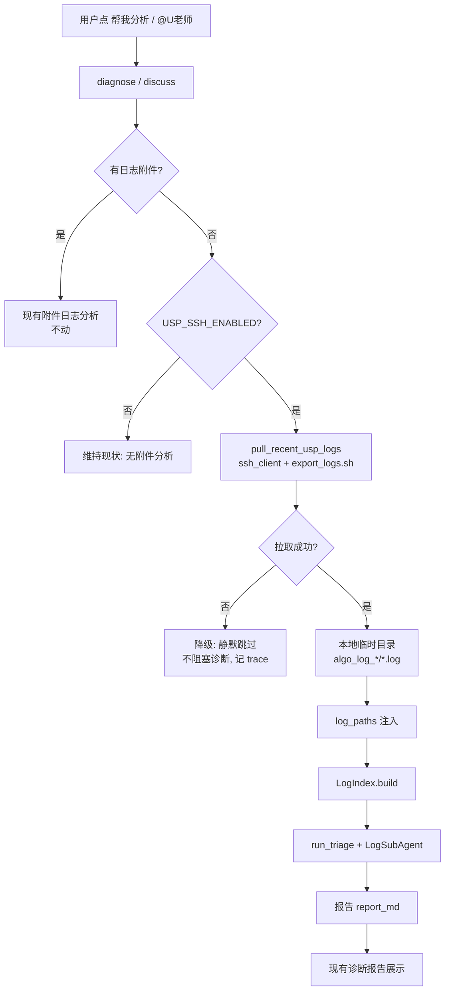

# USP 服务器日志自动拉取 + 分析功能方案

> 版本：v0.1（方案稿，未动手实现）
> 日期：2026-08-26
> 状态：待评审

---

## 1. 背景与目标

### 1.1 背景
当前日志分析依赖**用户主动上传**日志附件（zip/tar/log）到工单，AI 才能分析。但在现场排查场景中，用户往往没有导出日志、或导出的日志不全，导致：

- 工单没有日志附件时，诊断只能"空转"，靠历史工单 + 描述猜测。
- 手动导出日志流程繁琐（登录服务器 → 跑脚本 → 传回 → 上传工单）。

而 USP 服务器上其实**已经存在**现成的算法日志导出脚本 `export_logs.sh`（见 `D:\CodeHub\Algorithm\basic\usp-services\scripts\export_logs.sh`）。只需通过 SSH 能访问服务器，即可按时间范围导出最近日志。

### 1.2 目标
当 OpenRobotService 能通过 **SSH 访问到 USP 服务器**时：

1. 在诊断/讨论缺日志附件时，**自动调用服务器 `export_logs.sh`** 拉取最近时间段的算法日志到本地；
2. 将拉取到的日志**无缝接入现有日志分析管道**（Discovery + LogSubAgent + 诊断 LLM），与"用户上传的日志附件"同等对待。

### 1.3 非目标（本次范围外）
- 不做服务器端脚本改造（`export_logs.sh` 原样调用）。
- 不做批量拉取/定时任务（仅按需、单次触发）。
- 不做日志文件长期归档（拉下来的临时文件分析完即清理）。
- 不改变现有"上传附件"路径，两者并存、互为补充。

---

## 2. 现有系统分析（关键认知）

### 2.1 现成脚本 `export_logs.sh` 行为
| 属性 | 取值 |
|------|------|
| 位置 | `/scripts/export_logs.sh`（安装在 USP 服务器算法层） |
| 参数 | `YYYYMMDDHHMM`（必填，12位时间串）+ `--interval 分钟`（默认15，前后各 interval） |
| 日志来源 | `/usp_algorithm_logs`（在线）+ `/home/ubuntu/usp/log_archive/algo`（归档，`algo_YYYYMMDD.tar.gz`） |
| 输出 | `algo_log_YYYYMMDDHHMM_{M}min.zip`（或 tar.gz），**写到当前工作目录 `$(pwd)`** |
| 内部结构 | 一个目录 `algo_log_时间戳_{M}min/`，内含各服务一个 `<服务名>_debug_logs.log` |
| 排除项 | `start_services` / `session_` / `prom_metrics` / `ray_current_cluster` |
| 空日志 | 某服务该时段无日志 → 不产生文件，仅在摘要里列 "无日志" |

> **关键技术点**：
> - 脚本用 `date -d`（GNU date）→ 服务器须为 Linux（现场即 Linux，OK）。
> - 产物写到 `$(pwd)` → **远程必须先 `cd` 到一个可写目录再执行**。
> - 一个导出包内含**多个服务**的日志（DYNAMIC_MAP / TMS-{map_id} / TASK-MANAGER / AI_map / MapPreprocess 等）。

### 2.2 现有日志分析管道（复用，零侵入）
```mermaid
flowchart LR
    subgraph 现有管道（全复用）
        A[log_paths 列表] --> B[LogIndex.build<br>indexer.py]
        B --> C[run_triage<br>Discovery<br>triage.py]
        B --> D[LogSubAgent.analyze<br>sub_agent.py]
        C --> E[诊断 LLM<br>report_md]
        D --> E
    end
```

- 入口：`diagnose_flow.diagnose()` 的附件分析阶段、`discuss_flow` 的 `log_analyze` 能力。
- 现阶段 `LogSubAgent(log_paths[0])` **只分析第一个日志文件**。
- 关键函数：
  - `_extract_log_paths(context.attachments)` → `(log_paths, tmp_dirs)`（附件中的 zip/tar 解压、日志直接取）
  - `materialize_path()` → MinIO 预签名 URL 下载到本地临时目录（`tempfile.mkdtemp`）
- **接入本质**：把"SSH 拉取到的本地日志路径"注入 `log_paths`，其余管道全不动。

### 2.3 现状缺口
- **无任何 SSH 实现**（全项目无 paramiko/scp/sftp）。
- `AIConfig` **无服务器连接字段**，须新增。
- 附件 `context.attachments` 来自工单/评论的 MinIO 附件，SSH 拉取是全新数据源。

---

## 3. 需求与已确认设计决策

| 决策点 | 结论 | 说明 |
|--------|------|------|
| 触发入口 | **诊断时自动尝试** | 点[帮我分析]（diagnose）或 @U老师讨论（discuss）时，若工单无日志附件且配置了 SSH，自动拉取最近日志补充分析 |
| SSH 凭据来源 | **`ai/.env` 环境变量**（经 `ai/config.py` 读取） | 参照现有 `LOG_MANUALS` 模式，不写死代码 |
| 时间范围 | **两者结合** | 有工单 `occurrence_time` 用故障发生时间附近；否则用当前时间 |
| 分析目标 | **复用现有诊断报告** | 拉取的日志与上传日志同等处理，结果以现有诊断报告形式返回 |

---

## 4. 总体架构

### 4.1 新增模块结构
```
ai/agents/AiTaskPlatform/
  server_pull/                     # 新增：服务器日志拉取
    __init__.py
    ssh_client.py                  # SSH/SFTP 连接封装（paramiko）
    usp_log_puller.py              # 拉取 USP 算法日志（调 export_logs.sh + 拉回 + 解压）
    timeutil.py                    # 时间锚点归一化（occurrence_time → YYYYMMDDHHMM）
```

### 4.2 配置新增（`ai/config.py` + `ai/.env`）
新增一组 `usp_ssh_*` 字段（`AIConfig`）：
| 字段 | 环境变量 | 默认 | 说明 |
|------|---------|------|------|
| `usp_ssh_enabled` | `USP_SSH_ENABLED` | `false` | 总开关（默认关，连不上时静默降级） |
| `usp_ssh_host` | `USP_SSH_HOST` | `""` | 服务器地址 |
| `usp_ssh_port` | `USP_SSH_PORT` | `22` | 端口 |
| `usp_ssh_user` | `USP_SSH_USER` | `""` | 用户名 |
| `usp_ssh_key` | `USP_SSH_KEY` | `""` | 私钥文件路径（优先） |
| `usp_ssh_password` | `USP_SSH_PASSWORD` | `""` | 密码（私钥缺失时用） |
| `usp_ssh_connect_timeout` | `USP_SSH_CONNECT_TIMEOUT` | `8.0` | 连接超时秒 |
| `usp_export_workdir` | `USP_EXPORT_WORKDIR` | `""` | 远程可写目录（脚本输出 zip 处），必填 |
| `usp_export_script` | `USP_EXPORT_SCRIPT` | `""` | 远程脚本绝对路径（export_logs.sh），必填 |
| `usp_log_interval_min` | `USP_LOG_INTERVAL_MIN` | `15` | 时间窗前/后分钟数（喂给 --interval） |

> 凭据安全：`ai/.env` 已被 gitignore（检查确认），私钥优先、密码兜底；不硬编码、不入库。

### 4.3 代码接入点

**诊断 `diagnose_flow.py`（2a 阶段）**：
- 现逻辑：`log_paths, _tmp_dirs = self._extract_log_paths(context.attachments)`，若为空则跳过日志分析。
- 改：新增一个 `_ensure_log_paths()` 辅助——若 `log_paths` 为空且 `usp_ssh_enabled`，则调用 `pull_recent_usp_logs(...)` 得到 `(local_dirs, tmp_dir)`，把解压出的日志文件加入 `log_paths`，`tmp_dir` 并入 `_tmp_dirs`（分析后统一清理）。

**讨论 `discuss_flow.py`（log_path 注入）**：
- 现逻辑：`runtime_ctx["log_path"] = log_paths[0]`（仅当有附件日志时）。
- 改：无附件日志时，同上调 SSH 拉取，把解压出的日志路径设为 `runtime_ctx["log_path"]`，供 `log_analyze` 能力使用。

> 两者共用同一个 `pull_recent_usp_logs()` 纯函数，几乎零侵入地复用全套 Discovery + LogSubAgent + 报告管道。

---

## 5. 核心模块设计

### 5.1 `ssh_client.py` — SSH/SFTP 封装
- 封装 `paramiko.SSHClient`：连接（私钥优先/密码兜底）、关闭、`exec_command`、SFTP `get`。
- 提供：
  - `run(cmd, timeout) -> (exit_code, stdout, stderr)`：执行远程命令。
  - `download(remote_path, local_path)`：SFTP 拉取文件。
- 失败抛异常，由上层降级。

### 5.2 `timeutil.py` — 时间锚点归一化
- 输入工单 `occurrence_time`（可能是 `2026-04-17 10:30` / `202604171030` / `2026/04/17 10:30` 等）。
- 输出 `export_logs.sh` 需要的 `YYYYMMDDHHMM` 12 位串。
- 解析失败 / 无 `occurrence_time` → 用当前本地时间生成 `YYYYMMDDHHMM`。

### 5.3 `usp_log_puller.py` — 拉取 + 解压
`async def pull_recent_usp_logs(occurrence_time="", minutes=None) -> tuple[list, list]`
1. 读配置；若未启用/未配齐 → 抛特定异常（上层静默）。
2. 用 `timeutil` 算 `TIME_STR`；`minutes` 默认取配置。
3. **远程执行**：`cd {workdir} && bash {script} {TIME_STR} --interval {minutes}`。
4. 从输出解析产物文件名 `algo_log_{TIME_STR}_{M}min.zip`（或 `.tar.gz`）。
5. SFTP 拉回本地临时目录（`tempfile.mkdtemp(prefix="usp_pull_")`）。
6. 解压 zip/tar → 得到 `algo_log_*/<服务>_debug_logs.log` 列表。
7. 返回 `(log_files, tmp_dir)`。

**多服务日志选择策略**（重要）：
- `LogSubAgent(log_paths[0])` 目前只分析第一个文件。
- 拉取会得到多个服务日志，方案默认策略：
  - 优先按 `product_registry` 的 `match` 命中（USP 相关模块）排序，结合一个"优先级顺序"（如 `TASK-MANAGER > DYNAMIC_MAP > TMS- > AI_map > MapPreprocess`）。
  - 本阶段**取第一个**作为 `log_paths[0]`（与现状一致），未来可扩展"多日志合并/分模块并行分析"。

---

## 6. 数据流



---

## 7. 错误处理与降级

| 场景 | 处理 |
|------|------|
| SSH 未配置 / 未启用 | 直接跳过，视同无附件，不报错 |
| 连接失败 / 超时 | 捕获异常，`logger.warning` + `_add_trace(error)`，诊断继续（无日志版） |
| 脚本执行非 0 / 找不到产物 | 同上，静默降级 |
| 产物拉回本地失败 / 解压失败 | 同上，清理临时目录 |
| `occurrence_time` 解析失败 | 回退当前时间 |
| 临时目录清理 | 复用 `_tmp_dirs` 统一 `shutil.rmtree`；异常忽略 |

> 核心原则：**SSH 拉取是"锦上添花"**，任何失败都不影响现有诊断主流程，只影响"是否有日志可看"。

---

## 8. 安全考虑
- 凭据仅存 `ai/.env`（不提交、不入库、不走前端）。
- 私钥文件路径优先；密码兜底（建议生产用私钥）。
- SFTP 只拉取脚本产出的指定文件，不开放任意路径下载。
- 远程命令固定模板（`cd + bash script + 时间 + interval`），不拼接用户可注入的任意字符串。
- 拉取文件仅本地临时分析，不落 minio/不长期保存。

---

## 9. 实施步骤（后续动工顺序）
1. `ai/requirements.txt` 加 `paramiko`；确认环境已装。
2. `ai/config.py` 加 `usp_ssh_*` 字段 + `get_ai_config()` 映射。
3. 新建 `server_pull/{ssh_client,timeutil,usp_log_puller}.py`。
4. 接入 `diagnose_flow.py`（`_ensure_log_paths` 辅助）。
5. 接入 `discuss_flow.py`（无附件时拉取设 `runtime_ctx["log_path"]`）。
6. `ai/.env` 补注释化配置示例（默认关闭）。
7. 写最小单测（timeutil 时间归一化、config 解析、usp_log_puller 用 mock 验证命令组装）。
8. 手工验证：开 SSH 配置 → 点[帮我分析] → 观察过程区出现"从 USP 服务器拉取最近日志"节点 + 报告含日志分析。

---

## 10. 风险与边界
- **核心风险**：`paramiko` 新依赖需安装到生产 AI 服务环境。
- **现场服务器可能不一致**：`export_logs.sh` 的输出目录/文件名假设（`algo_log_*`zip）若脚本改动需同步（集中放在 `usp_log_puller` 一处解析，易改）。
- **多服务日志只取第一个**：现阶段局限，后续可多文件合并分析。
- **日志量**：`--interval` 默认 15 分钟，拉取量可控；若用户给大窗，需在 `log_analyze` 已有"故障时间窗截断"机制下使用。
- **只在本机/内网可访问服务器时生效**：`usp_ssh_enabled` 开关控制，连不上自动降级，无副作用。

---

## 11. 待评审问题
1. 生产环境能否安装 `paramiko`？（需确认）
2. USP 服务器 SSH 是否开放给本服务所在机器？（凭据由运维提供后填入 .env）
3. 拉取的多服务日志，是否本期就做"按故障关键词自动选日志"，还是先固定取第一个？
4. 是否需要在前端过程区展示"从服务器拉取日志"这一步骤的可见进度（建议：加，与现有 `prog.add` 一致）？
