{width="5.574305555555555in" height="1.9150437445319335in"}

**《USP实施与操作手册》**

发布日期：2026.03.20

编制单位：智能规划研究院

# **目 录** {#目-录 .TOC-Heading}

[目 录 [2](#_Toc1h06d2)](#_Toc1h06d2)

[0 文档信息 [5](#_Toc098gnz)](#_Toc098gnz)

[0.1 变更日志 [5](#_Tocfs3xx2)](#_Tocfs3xx2)

[0.2 文档说明 [5](#_Tocttu4sc)](#_Tocttu4sc)

[0.3 名词释义 [8](#_Tocoe7139)](#_Tocoe7139)

[1 USP部署与启动 [9](#_Tocuzh9uv)](#_Tocuzh9uv)

[1.1 Ubuntu系统安装（可选） [9](#_Tockmhswi)](#_Tockmhswi)

[1.2 服务器基本信息检查 [10](#_Toc5qa6t5)](#_Toc5qa6t5)

[1.3 服务器时间配置 [11](#_Tocia4n8z)](#_Tocia4n8z)

[1.4 服务器网络配置 [12](#_Tocsjtuvt)](#_Tocsjtuvt)

[1.5 数据盘挂载 [14](#_Toch2lu84)](#_Toch2lu84)

[1.6 ToDesk安装及常见问题 [15](#_Tocly0yu9)](#_Tocly0yu9)

[1.7 部署USP [18](#_Tocmgmdvq)](#_Tocmgmdvq)

[1.8 更新USP [19](#_Toc2zog0j)](#_Toc2zog0j)

[1.8.1 更新单独一个子平台(例：数据分析子平台) [20](#_Toc8cw960)](#_Toc8cw960)

[1.9 激活USP License [20](#_Tocnle8w6)](#_Tocnle8w6)

[1.10 登录USP UI [21](#_Tockyr8uu)](#_Tockyr8uu)

[2 机器人上线、配置与操作 [22](#_Tocds24yv)](#_Tocds24yv)

[2.1 机器人上线 [22](#_Toc1ekz4w)](#_Toc1ekz4w)

[2.1.1 自研车上线 [22](#_Tocaankme)](#_Tocaankme)

[2.1.2 睿芯行/RXX车上线 [25](#_Tockh8xtj)](#_Tockh8xtj)

[2.1.3 科钛车上线 [27](#_Tocrfdt3w)](#_Tocrfdt3w)

[2.2 上线验收 [30](#_Tocakx681)](#_Tocakx681)

[2.3 机器人类型配置 [31](#_Tocyvfr7i)](#_Tocyvfr7i)

[2.4 机器人操作 [32](#_Toceb9ljs)](#_Toceb9ljs)

[2.5 机器人组操作 [35](#_Tocb0wic4)](#_Tocb0wic4)

[2.6 机器人异常诊断 [38](#_Tocb2nsta)](#_Tocb2nsta)

[3 充电桩上线与充电策略 [40](#_Toc1aa5nr)](#_Toc1aa5nr)

[3.1 充电桩蓝牙配网 [40](#_Toc984e9z)](#_Toc984e9z)

[3.2 USP侧配置充电桩 [40](#_Toczraclv)](#_Toczraclv)

[3.3 地图充电桩点位配置与可充车型配置 [41](#_Toc7mr1bh)](#_Toc7mr1bh)

[3.4 充电策略配置 [42](#_Tocobkv4z)](#_Tocobkv4z)

[3.5 充电验收 [43](#_Tocx9lugu)](#_Tocx9lugu)

[4 外设上线 [44](#_Toct91hru)](#_Toct91hru)

[4.1 外设接入闭环 [44](#_Tocw31apu)](#_Tocw31apu)

[4.2 自动门对接与验收 [44](#_Toccp023j)](#_Toccp023j)

[4.3 输送线对接与验收 [47](#_Toc57i5ln)](#_Toc57i5ln)

[4.4 电梯对接与验收 [51](#_Toca4qsee)](#_Toca4qsee)

[4.5 红绿灯对接与验收 [54](#_Tocp88vzf)](#_Tocp88vzf)

[5 地图绘制与生效 [58](#_Toccl2le7)](#_Toccl2le7)

[5.1 新建或导入地图 [58](#_Tocfqggb7)](#_Tocfqggb7)

[5.2 编辑地图单元信息 [59](#_Tocuvm3nv)](#_Tocuvm3nv)

[5.3 采点生成基准点 [60](#_Tocvr3pru)](#_Tocvr3pru)

[5.4 新建点位 [61](#_Tocr0awu6)](#_Tocr0awu6)

[5.5 批量生成点位 [61](#_Tocvkro74)](#_Tocvkro74)

[5.6 绘制直线路线 [62](#_Toc12kx0x)](#_Toc12kx0x)

[5.7 绘制曲线路线 [62](#_Toc10wdb8)](#_Toc10wdb8)

[5.8 批量编辑点与线 [63](#_Toc348ao2)](#_Toc348ao2)

[5.9 配置点位属性 [64](#_Tocjk89wv)](#_Tocjk89wv)

[5.10 配置线路属性 [65](#_Toc716yu4)](#_Toc716yu4)

[5.11 配置地图全局设置 [67](#_Tocps6yks)](#_Tocps6yks)

[5.12 生成库位前置点 [67](#_Toclmbq4f)](#_Toclmbq4f)

[5.13 执行地图生效 [68](#_Tocv94p0u)](#_Tocv94p0u)

[5.14 处理预处理告警 [69](#_Tocpft190)](#_Tocpft190)

[5.15 AI绘制地图 [70](#_Toc4n9hr4)](#_Toc4n9hr4)

[6 库位配置与生效 [72](#_Tocg5crd2)](#_Tocg5crd2)

[6.1 配置前准备 [72](#_Toce1ipdb)](#_Toce1ipdb)

[6.2 基础库位参数配置 [73](#_Tocyvdp07)](#_Tocyvdp07)

[6.3 盲取配置 [78](#_Tockbz5r5)](#_Tockbz5r5)

[6.4 库区避障配置 [79](#_Tocrpqr2h)](#_Tocrpqr2h)

[6.5 多层库位配置 [81](#_Tocpcsync)](#_Tocpcsync)

[6.6 可视化库位配置（v2.2.0+） [83](#_Tocmkc36e)](#_Tocmkc36e)

[6.7 配置库区 [84](#_Tocqlls39)](#_Tocqlls39)

[7 载具类型配置 [86](#_Tocu8mun9)](#_Tocu8mun9)

[7.1 配置载具类型 [86](#_Toc10phjj)](#_Toc10phjj)

[7.2 生成库位载具参数（可选） [87](#_Tocjo33at)](#_Tocjo33at)

[8 偏移量配置（可选） [89](#_Tocc9cb3d)](#_Tocc9cb3d)

[8.1 偏移量的作用与生效范围 [89](#_Tocfphcx6)](#_Tocfphcx6)

[8.2 导出偏移量模板确认字段口径 [89](#_Tocz7ewkf)](#_Tocz7ewkf)

[8.3 偏移量编辑导入 [89](#_Tocdhbqde)](#_Tocdhbqde)

[9 任务下发 [91](#_Tocqtt6ko)](#_Tocqtt6ko)

[9.1 下发移动任务 [91](#_Tocj2i05n)](#_Tocj2i05n)

[9.2 下发充电任务 [92](#_Tocvk78dx)](#_Tocvk78dx)

[9.3 下发搬运任务 [93](#_Toc72yaxs)](#_Toc72yaxs)

[9.4 使用任务模拟器下发任务 [96](#_Tocc5rhe7)](#_Tocc5rhe7)

[9.5 任务操作（取消/重发等） [97](#_Tocswavyz)](#_Tocswavyz)

[10 编排 [99](#_Tochegmox)](#_Tochegmox)

[10.1 使用流程模板 [99](#_Tocdnyao4)](#_Tocdnyao4)

[10.1.1 查看默认流程模板 [99](#_Tocexst7e)](#_Tocexst7e)

[10.1.2 新增流程模板 [102](#_Tocmx0328)](#_Tocmx0328)

[10.1.3 编辑流程模板 [102](#_Tocpl0arf)](#_Tocpl0arf)

[10.1.4 删除流程模板 [103](#_Toc8ef1vy)](#_Toc8ef1vy)

[10.1.5 导入流程模板 [103](#_Toc5jr8q0)](#_Toc5jr8q0)

[10.2 下发流程实例 [103](#_Tocd1wapm)](#_Tocd1wapm)

[10.2.1 发起业务任务 [103](#_Tocebt6ec)](#_Tocebt6ec)

[10.2.2 发起任务 [104](#_Toc3apcjr)](#_Toc3apcjr)

[10.3 管理流程实例 [104](#_Tocigzi0n)](#_Tocigzi0n)

[10.3.1 查看实例详情 [104](#_Toc9e6ypq)](#_Toc9e6ypq)

[10.3.2 取消实例 [105](#_Tocx16ywt)](#_Tocx16ywt)

[10.3.3 筛选实例 [106](#_Tocsatbi7)](#_Tocsatbi7)

[10.3.4 排序实例 [106](#_Toctyiba2)](#_Toctyiba2)

[11 数据运维 [107](#_Tocsapq90)](#_Tocsapq90)

[11.1 数据面板查看 [107](#_Tockjv5e5)](#_Tockjv5e5)

[11.2 服务器状态查看 [107](#_Tocfhz1g3)](#_Tocfhz1g3)

[11.3 监控回放 [108](#_Tochjk02a)](#_Tochjk02a)

[附录A USP 服务器配置档位表 [109](#_Tocf6hh3v)](#_Tocf6hh3v)

[附录B 库位取放货参数字典 [110](#_Tocj5afa0)](#_Tocj5afa0)

# **0 文档信息**

## **0.1 变更日志**

  ----------------------------------- --------- ------------ ----------------------------
  变更内容                            版本号    变更时间     编撰人

  1.初版发布                          1.0       2025/4/23    滕君、张会丽

  2.初版英文版本                      1.1       2025/8/8     滕君

  3.合并变更为《USP实施与操作手册》   2.0       2026/3/19    胡健楠、张会丽、滕君
  ----------------------------------- --------- ------------ ----------------------------

## **0.2 文档说明**

本手册用于指导 USP（机器人统一调度平台）的部署实施、设备接入、功能配置、任务操作及日常运维，覆盖从服务器环境准备、系统部署与启动、License 激活、机器人与充电桩上线、外设接入、地图与库位配置、载具类型与偏移量配置，到任务下发、流程编排、数据查看与运维等关键内容。

适用对象

本手册适用于以下用户角色：

**演示用户**

演示用户包括客户决策领导、客户现场领导等。该类用户主要关注系统整体能力、业务流程闭环、现场运行效果及展示结果，可重点查阅与系统功能展示、任务执行效果、流程运行结果、数据看板及运维展示相关内容。

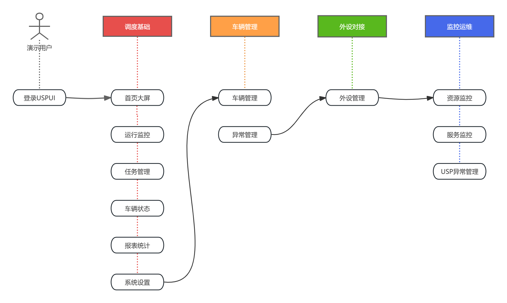{width="5.768055555555556in" height="3.4500513998250217in"}

**终端直接用户**

终端直接用户包括客户现场操作人员、系统直接使用者、监控运维人员等。该类用户主要关注机器人日常操作、任务下发、流程使用、运行监控及异常处理，可重点查阅机器人操作、任务下发、流程编排、数据运维等相关章节。

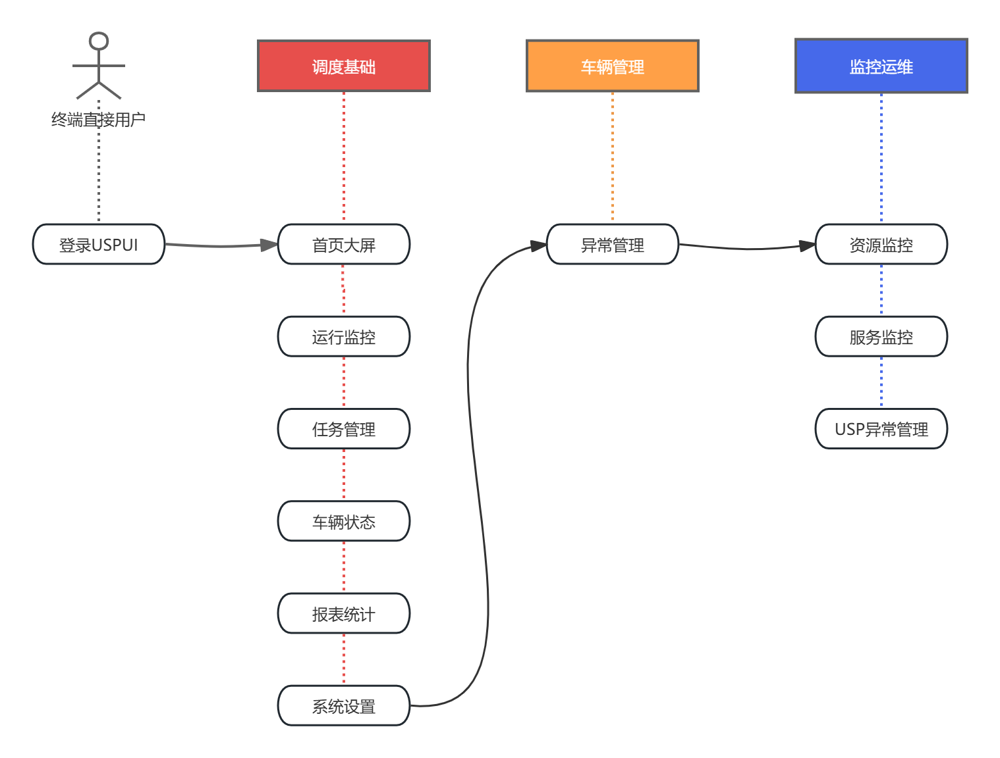{width="5.768055555555556in" height="4.377338145231846in"}

**实施工程师**

实施工程师包括现场实施工程师、售后运维工程师等。该类用户主要关注系统部署、设备接入、配置生效、现场联调、问题定位及验收闭环，可重点查阅系统部署与启动、机器人上线、充电桩与外设接入、地图与库位配置、任务验证及运维排查等相关章节。

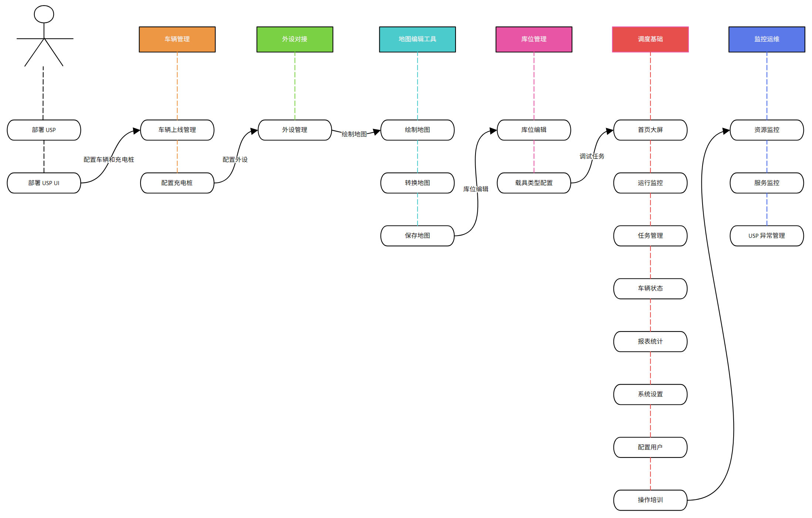{width="5.772222222222222in" height="3.6930653980752406in"}

**测试工程师**

主要负责功能验证、链路联调、问题复现及测试验收。该类用户可重点查阅机器人上线、充电与外设接入、地图与库位配置、载具类型与偏移量配置、任务下发、流程编排及数据运维等相关章节，用于验证功能逻辑和复现操作路径。

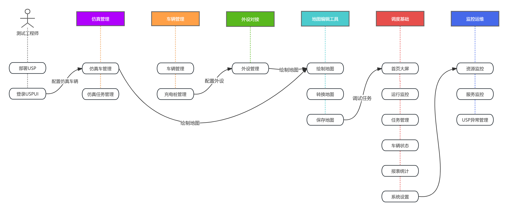{width="5.768055555555556in" height="2.399361329833771in"}

**产品实现部门**

产品实现部门包括部门管理者、系统架构师、开发工程师、产品经理等。该类用户通常需要从整体上了解产品实现路径、实施流程、配置逻辑及现场交付闭环，涉及范围覆盖本手册中的全部内容。产品实现部门可结合项目阶段，查阅相应章节，用于方案设计、功能实现、联调支持、问题分析及交付复盘。

阅读建议

为便于不同角色快速查阅，建议结合实际使用场景选择阅读重点：

- 需要完成**系统部署、配置、联调与验收**时，重点阅读第 1 章至第 8 章。

- 需要进行**日常调度、任务下发及流程操作**时，重点阅读第 2 章、第 9 章、第 10 章及第 11 章。

- 需要**查看系统运行情况、分析问题或进行运维排查**时，重点阅读第 2 章、第 3 章、第 4 章及第 11 章。

- 需要**整体了解产品能力、业务闭环及交付内容**时，可结合全文阅读，并参考附录内容。

使用本手册时，如文中内容与实际系统页面存在差异，应以实际系统版本及页面显示为准；如涉及接口字段、报文格式及接口调用说明，应以《USP 产品接口文档》为准。对于车端网络配置、现场网络规划、充电桩蓝牙配网等由客户、实施方或设备厂商负责的事项，本手册仅说明与 USP 平台相关的配置项、对接点及验收要点。

## **0.3 名词释义**

- USP：USP 即 Universal Scheduling Platform（统一调度平台），提供调度管理、车辆管理、设备管理、地图编辑与监控运维等功能，用于管理 AGV 在运行前、运行中、运行后的关键数据与状态，实现统一的调度与运营管理

- 任务：任务指第三方系统或人工通过 USP 界面创建的 AGV 调度任务，通常包含任务模板、目标点、执行车辆与动作参数等信息。该任务一般不会被 AGV 直接执行，而是由调度侧进一步转换与补充后下发到设备侧执行

- 原子任务：原子任务是调度执行的最小动作单元，USP 支持多种原子任务类型，例如取货、放货、开始充电、停止充电等。对于第三方系统下发的任务，USP 会将其拆分为一个或多个原子任务组成的执行序列

- 任务参数：任务参数指 AGV 执行任务时所使用的配置参数，可能包括平台侧任务参数与车端需要的识别参数等。AGV 将依据这些参数在执行过程中自动开启或关闭相关能力，并影响任务的执行方式与效果

# **1 USP部署与启动**

## **1.1 Ubuntu系统安装（可选）**

**步骤：**

1.  获取Ubuntu ISO镜像文件（版本24.04 LTS**(Desktop)桌面版**）：[Ubuntu Releases](https://releases.ubuntu.com/)。

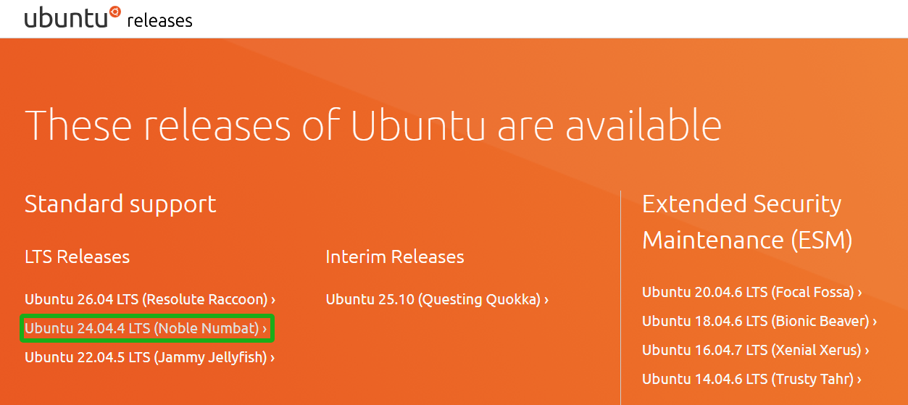{width="5.772222222222222in" height="2.5751574803149606in"}

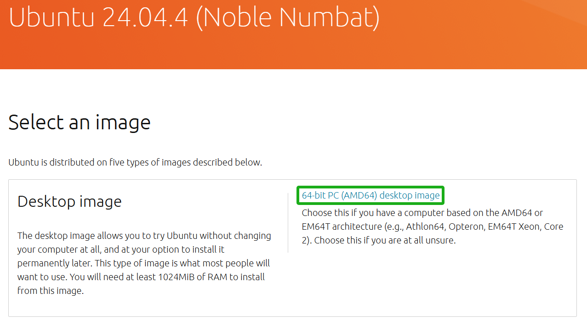{width="5.78125in" height="2.1648654855643046in"}

2.  下载并安装 Rufus 工具：[Rufus - 轻松创建 USB 启动盘](https://rufus.ie/zh/)。

3.  插入 U 盘，打开 Rufus，工具将自动识别 U 盘设备。

4.  点击「选择」，选择已下载的 Ubuntu ISO 文件。

5.  分区类型和目标系统类型选择GPT+UEFI，点击「开始」，制作系统启动盘（此操作会格式化U盘，请注意备份文件）。

> 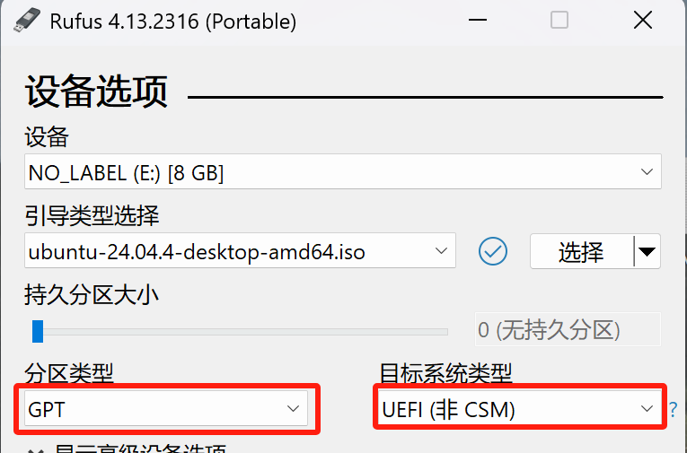{width="2.9529155730533683in" height="1.9493099300087489in"}

6.  制作完成后关闭 Rufus，安全弹出 U 盘。

7.  将启动 U 盘插入待安装系统的 PC/服务器。

8.  重启设备，连续按 **F12 / Del** 进入 BIOS或启动菜单（以设备实际为准）。

- Dell服务器：开机自检时连续按F11进入Boot Manager，选择One-shot UFEI BIOS Boot Menu，方向键选择U盘启动。

9.  在启动菜单中选择从**USB启动**，按提示保存并退出。

10. 设备重启后进入 Ubuntu 安装向导，按提示完成系统安装与基础配置。

- 在磁盘分区阶段，请选择"自定义分区"进行手动配置。

- 通常服务器配有启动盘（较小容量）和数据盘（较大容量）：

  - 启动盘整盘作为系统分区（挂载 /）。

  - 数据盘视项目情况处理：

    - 若为 USP 与 DAS 共用，则将数据盘划分为两个子分区，并分别挂载到约定目录（注意挂载点区分）。

    - 若非共用，则整块数据盘作为一个分区挂载即可。

## **1.2 服务器基本信息检查**

**步骤：**

执行以下命令检查服务器硬件与系统信息：

- 检查系统版本：cat /etc/os-release

- 检查CPU信息：lscpu

- 检查内存信息：free -h

- 检查磁盘挂载与容量：df -h / lsblk

**USP部署基础配置：**

- 系统：Ubuntu 24.04（支持Docker部署）

- CPU：6核12线程，主频≥2.40 GHz

- 内存：≥32GB

- 硬盘：

  - 启动盘：256 GB SSD

  - 数据盘：1 TB（根据项目数据量选配）

**备注：**

当机器人数量以及地图点位较多，需要按需升级配置，详情可咨询产品经理。

## **1.3 服务器时间配置（海外项目）**

**步骤：**

1.  设置时区（推荐 Asia/Shanghai）

2.  启用 NTP 自动同步（Ubuntu 24.04 默认使用 systemd-timesyncd）

3.  检查时间同步状态

确认 System clock synchronized: yes，NTP service: active。

4.  （可选）指定 NTP 服务器（现场有内网 NTP 时使用）

编辑 timesyncd 配置：

在 \[Time\] 下配置（示例）：

重启服务并检查：

**备注：**

若项目要求使用 chrony（部分现场更常见），也可以改用 chrony 统一时间源；但建议在项目内统一一种方案，避免多套服务冲突。

## **1.4 服务器网络配置**

**前提：**

已确认服务器与现场网络物理连通，并获取网络要求。

**步骤：**

1.  **最小可用验证**

插入网线后，检查是否已自动获取 IP（DHCP）：

验证与现场网关互通：

验证与调度相关设备/网络互通（按现场提供目标选一个）：

若以上通过，说明网络已具备基本可用性，现场很多情况无需额外配置固定 IP，可直接进入后续部署。

2.  **按需配置固定 IP（仅当客户要求固定 IP 或部署要求固定地址时执行）**

查看 netplan 配置文件：

编辑对应配置文件（示例文件名以现场为准）：

示例配置（按现场 IP/网关/DNS 替换；网卡名以 ip a 为准）：

应用配置：

3.  **验证网络连通性与延时**

（局域网要求可参考：延时 \< 20ms）

**4．检查并开放端口（如需）**\
USP 常用端口：8082、1883（按项目要求为准）。

查看监听情况：

若启用了 UFW，放行端口：

**备注：**

- 若使用云服务器，部署前需与客户确认网络互通方式（专线/VPN/安全组/白名单），并准备相应网络环境

<!-- -->

- 若现场网络采用 DHCP，但后续要求"地址不变"，建议由现场 IT 侧做 DHCP 静态绑定（更稳定，且不需要改服务器配置）

## **1.5 数据盘挂载**

**重要警告：**

磁盘格式化会清除分区所有数据，**执行前务必确认分区无误**。

**步骤：**

1.  **确认磁盘与分区信息**

说明：确认目标分区（示例：/dev/sdb1）。

2.  **（如需）格式化分区**

若该分区已有可用文件系统且允许直接使用，可跳过本步。

3.  **创建挂载目录**

4.  **配置开机自动挂载**

获取分区 UUID：

编辑 /etc/fstab：

添加一行（示例）：

执行挂载并验证

5.  验证挂载结果：

**可能出现的问题：**

- 挂载失败

原因一般为安装 Ubuntu 时未对数据盘进行分区和挂载配置，系统仅识别到硬盘但未使用。执行步骤2重新格式化再挂载。

- 重启后挂载丢失

写入 /etc/fstab 的 UUID 或设备名不匹配（如更换盘位后设备名变化），导致启动时挂载失败。执行步骤4重新配置开机挂载。

## **1.6 ToDesk安装及常见问题**

本节以 Ubuntu 24.04 LTS 服务器环境为例，说明 ToDesk 的安装及常见问题处理。

**安装启动：**

1.  **查看cpu架构**

x86_64：表示服务器为 x86 架构，应选择 x64 安装包；

aarch64：表示服务器为 ARM 架构，应选择 arm64 安装包。

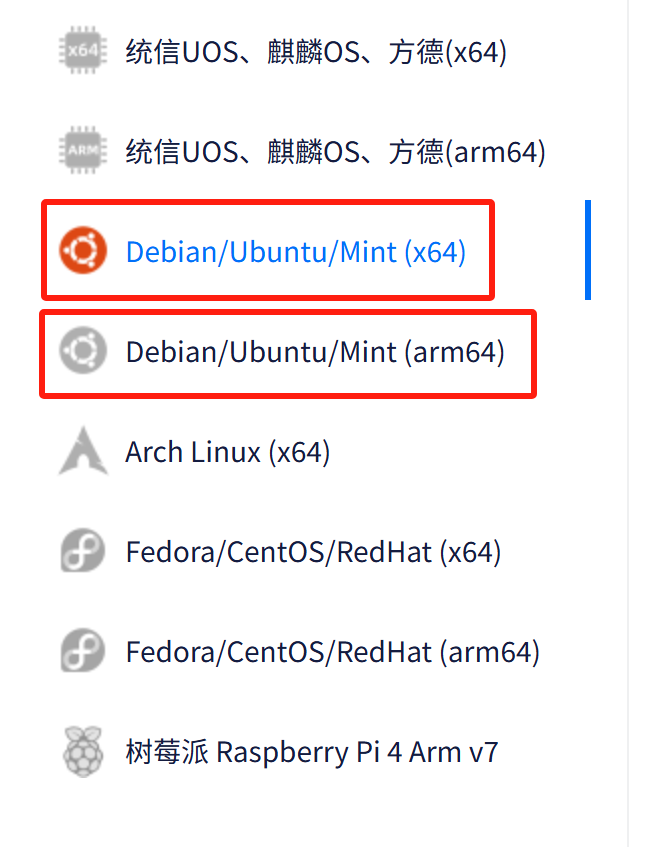{width="2.9479166666666665in" height="1.1722911198600174in"}

2.  **安装启动**

3.  如不能正常使用,请执行以下命令初始化

常见问题：

1.  **安装包安装失败**

提示安装错误：

N:由于文件'/home/loach/todesk-v4.7.2.0-amd64.deb\'无法被用户'\_apt'访问，已脱离沙盒并提权为根用户来进行下载。-pkgAcquire::Run（13：权限不够）

**可尝试解决步骤：**

首先，检查服务器架构，命令在上文，一定要保证架构与安装包对应。

其次，改换安装命令来避免权限问题：

2.  **安装成功后无法运行**

情形一：安装成功后自启动失败

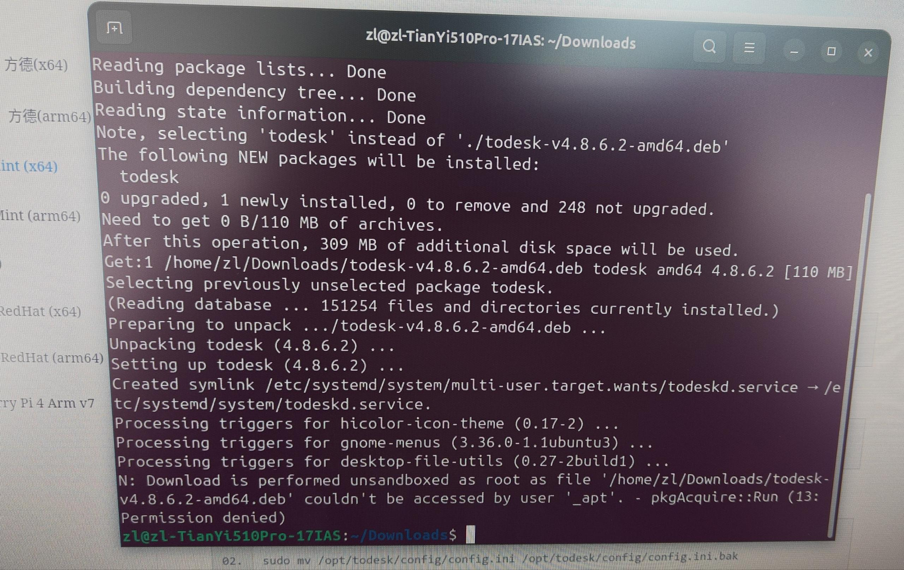{width="4.600604768153981in" height="2.90413167104112in"}

情形二：再次运行失败

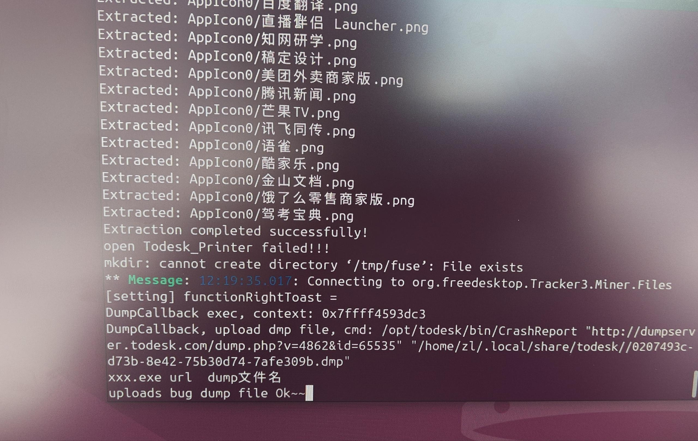{width="4.512115048118985in" height="2.8482720909886265in"}

**可尝试解决步骤：**

用指令直接抓取todesk id，强制启动

3.  Todesk连接服务器卡在加载界面

通常是因为 ToDesk 仅支持 X11 协议，而 Ubuntu 24.04 默认使用 Wayland 协议。可在【设置】-【系统】-【系统详情】中查看当前窗口系统。

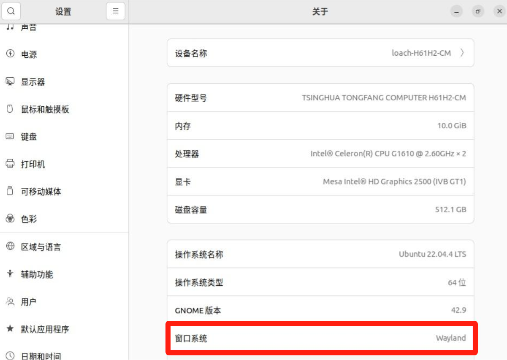{width="4.085589457567804in" height="2.901755249343832in"}

**解决步骤：**

修改Ubuntu窗口协议。

将WaylandEnable=false前的注释符号取消，关闭Wayland协议。保存后退出，重启服务器。

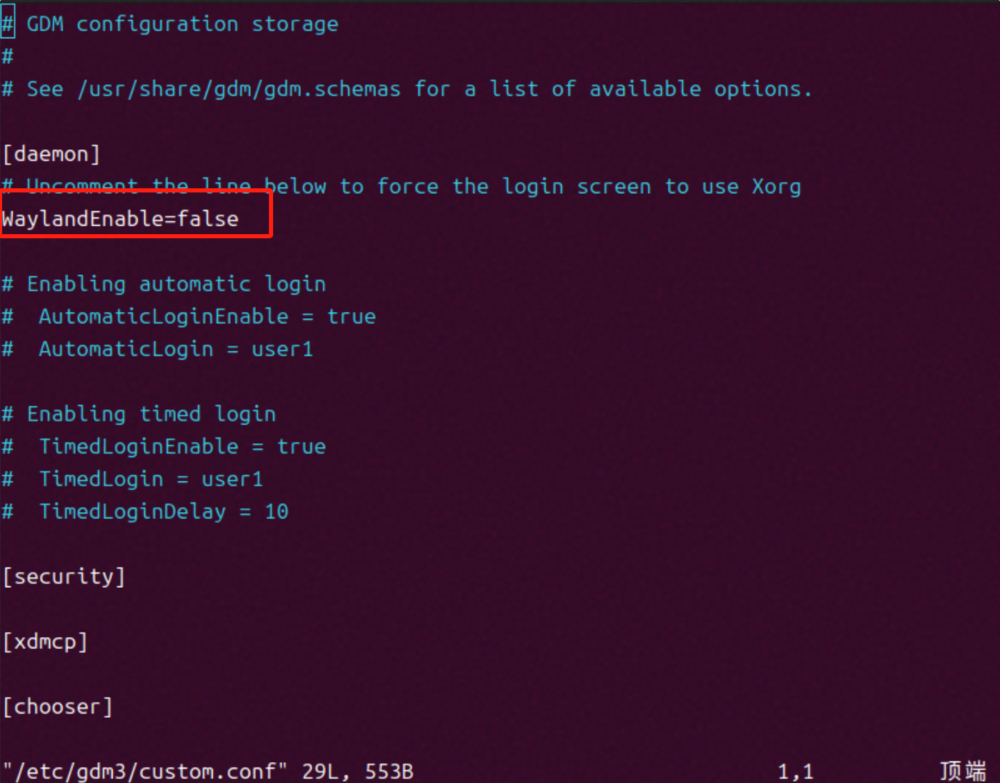{width="3.9367629046369204in" height="3.0832053805774278in"}

4.  提示显示器画面采集异常

首先，检查显示器数据线是连到主板还是显卡上，若有独显，需直连显卡。

其次，进行ubuntu更新（sudo apt update，sudo apt full-upgrade等）；

然后，检查显卡状态和驱动版本（lsmod \| grep nvidia，nvidia-smi），更新驱动；

最后，可以尝试步骤3，修改Ubuntu窗口协议来解决。

## 

## **1.7 部署USP**

**前提：**

服务器基本信息已确认；服务器网络已可用；已将磁盘挂载到docker的数据存储目录下；已获得 USP 离线部署包（usp-encrypt-v2.x.x.tar.gz），并可通过U盘或远程传输工具拷贝到现场服务器。

**步骤：**

1.  **解压离线部署包**

2.  **进入部署目录**

3.  **执行部署脚本**

- **首次安装**

- **服务器已有Docker和MySQL**

**部署包目录结构：**

## **1.8 更新USP**

**前提：**

已获得 USP 更新包（update-payload-v2.x.x.tar.gz）和更新脚本update_from_package.sh(workspace)，并可通过U盘或远程传输工具拷贝到现场服务器。

**步骤：**

1.  重命名更新包为update_payload.tar.gz，复制更新包和脚本到容器临时文件夹

2.  进入容器，进入tmp文件夹，执行更新脚本

3.  查看[各版本数据库字段调整](https://doc.weixin.qq.com/doc/w3_AR0ApAZAAJgCNTGRumKtBTO68fpy5?scode=AKwAdQfoAA4pfCWcW2AcQAbAYuAG4)是否有数据库字段更新，若有，更新字段（可能有多个，需要逐行复制更新）。

4.  重启调度，所有子模块正常运行即可

### **1.8.1 更新单独一个子平台(例：数据分析子平台)**

## **1.9 激活USP License**

说明：

USP v2.5.1起，登录与授权方式变更。部署完成后需按以下流程激活，否则系统无法正常登录使用。

步骤：

1.  获取系统ID

打开调度界面，复制页面中的系统ID（复制后请勿刷新页面）。

{width="5.772222222222222in" height="2.8872430008748906in"}

2.  获取USP账户

打开服务号FacAssist，通过以下命令初始化或管理账户：

- 输入"@姓名"初始化账户，获取系统生成的账户名与默认密码。

- 输入"#修改密码"重置密码（首次使用建议重置）。

{width="5.772222222222222in" height="2.2333005249343834in"}

当前版本重置密码后，需手工将更新后的数据包同步至USP系统方可生效，后续版本将支持自动同步。

3.  导出授权数据包

进入项目授权页面（方式：直接访问授权链接，或从"项目资源 → 项目授权"进入）：

- 若项目未激活，先点击"申请授权码"，并确保当前用户在项目用户列表中（不在则手动添加），然后点击"导出数据"，选择"导出全部数据"。

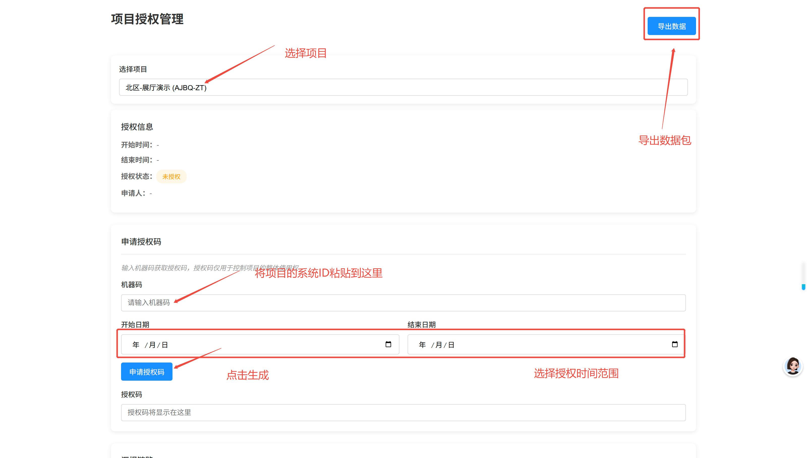{width="4.1834306649168855in" height="2.8817082239720033in"}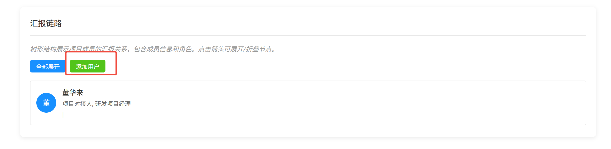{width="4.137517497812773in" height="1.4160542432195975in"}

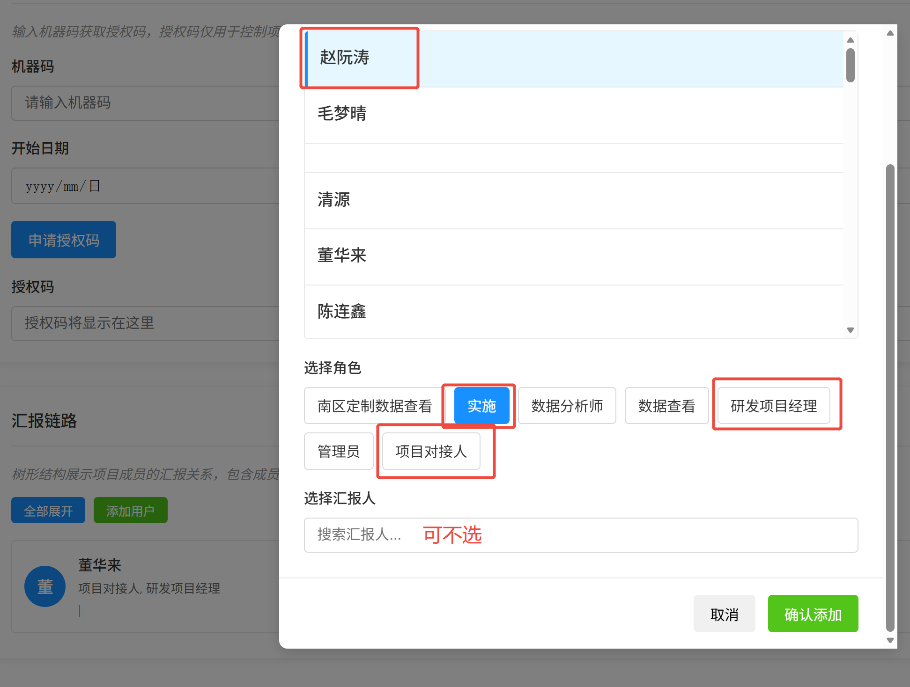{width="4.186696194225722in" height="3.1631856955380577in"}

{width="5.772222222222222in" height="0.5343252405949256in"}

- 若项目已激活，可直接点击"导出数据"，选择"导出用户信息"。

4.  导入数据包

回到调度界面，点击系统ID旁的导入按钮，选择刚刚导出的数据包上传。

完成后，即可使用USP账户登录系统。

{width="5.772222222222222in" height="2.8872430008748906in"}

# **2 机器人上线、配置与操作**

## **2.1 机器人上线**

**前提：**

车辆已接入现场网络，具备与调度服务器的网络互通条件（车辆 IP 由现场网络分配/规划；车端网络配置不属于 USP 部署范围）。

### **2.1.1 自研车上线**

车辆上线分成两种场景：

- 全新车辆首次上线：需要先完成现场地图扫描（扫图）

- 已有地图复用上线：现场已有可用地图，车辆直接复用地图即可上线

**一、新车首次上线（需先扫图）**

**步骤1：车端扫图**

1.  车端实施人员在目标作业区域完成扫图。

2.  扫图完成后，车辆本地会生成地图文件，路径为：

3.  确认地图生成正常后，再进行后续USP线上配置。

**步骤2：基础上线配置\**
在车端配置USP系统的IP、端口以及地图单元编号。

1.  配置 USP 系统 IP 和端口。进入车端的VCS系统，使用车端的密钥登录（车端实施有）。编辑vda5050配置。

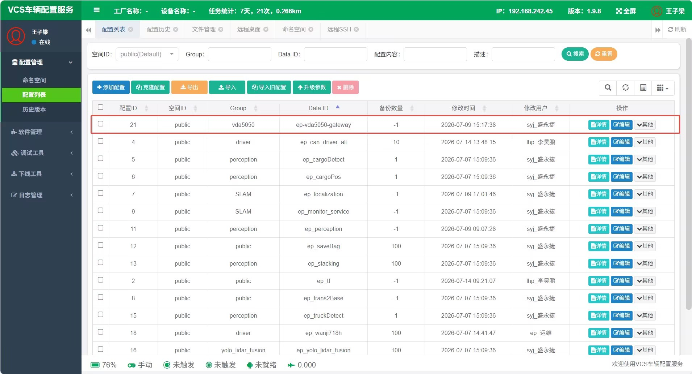{width="5.772222222222222in" height="3.127879483814523in"}

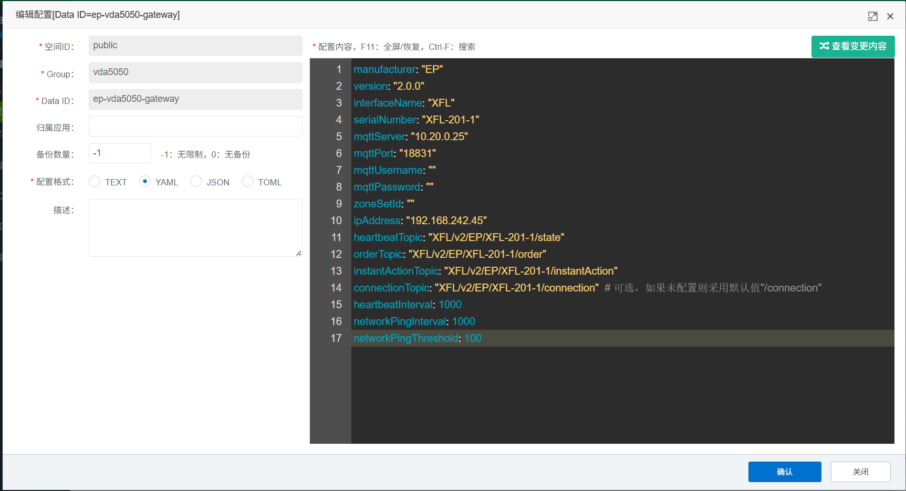{width="5.772222222222222in" height="3.128711723534558in"}其中，interfaceName为机器人型号，serialNumber为展示在调度上的机器人名称，mqttServer为调度服务器的IP地址，mqttPort为调度的端口（默认为1883）。除此之外，还要改下面的四个topic，格式为\"interfaceName/v2/EP/serialNumber/state（order、instantAction、connection）。修改完之后重启vda5050服务。即可上线到调度系统。

2.  配置地图单元编号。修改配置文件 2：/var/xmover/params/ep-map.yaml

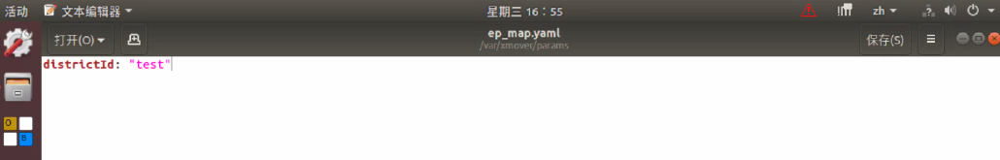{width="5.767716535433071in" height="0.9220439632545931in"}

3.  **配置机器人类型**

在调度系统中依次点击【车辆】→【机器人报表】，进入机器人报表页面后，勾选对应机器人→【设置机器人类型】/或者编辑对应机器人属性，选择对应的机器人类型。

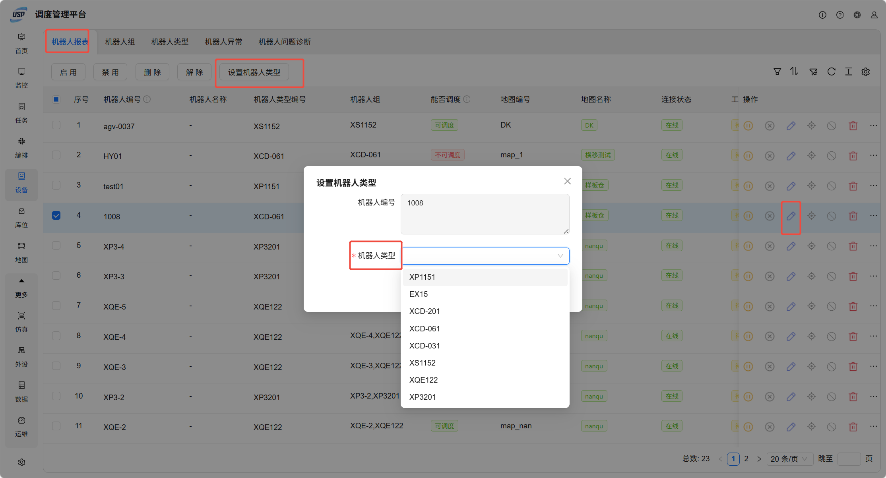{width="5.772222222222222in" height="3.115290901137358in"}

**二、已有地图场景下的车辆上线（无需扫图）**

如现场已有可复用地图，则待上线车辆无需重新扫图，可按以下方式处理：

1.  在扫图车上获取地图文件，将 /var/xmover/map/latest 路径下的 pgm 文件和 yaml 文件压缩为 zip 包。

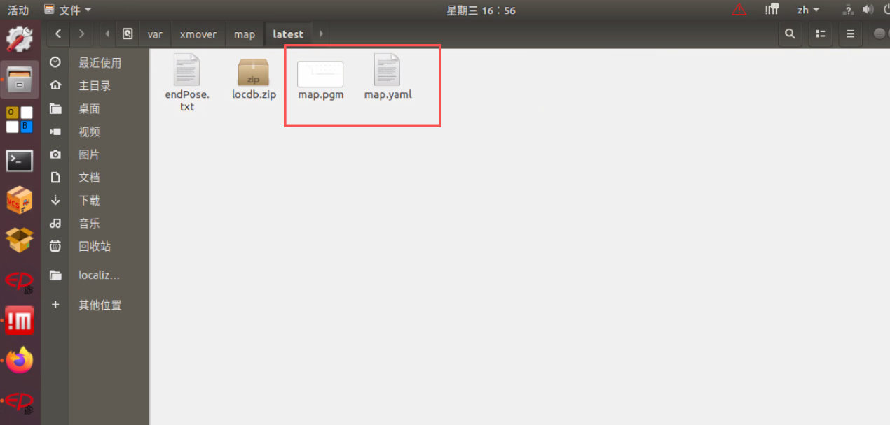{width="5.767716535433071in" height="2.7651137357830273in"}

2.  将压缩包名称修改为与地图单元编号一致的名称。

3.  将该压缩包拷贝至待上线车辆的/var/xmover/map/localization 路径下，并完成解压。

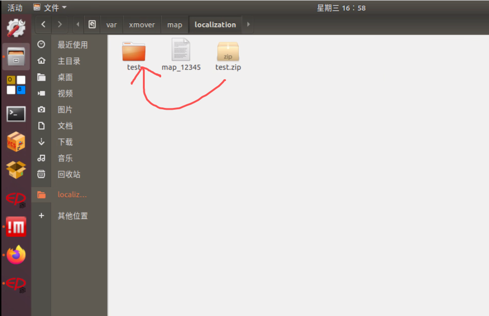{width="5.767716535433071in" height="3.735891294838145in"}

4.  执行"基础上线配置"，配置 USP 系统的 IP、端口及地图单元编号。

5.  重启网关服务。

6.  在 USP 系统中配置对应的**机器人类型**。

### **2.1.2 睿芯行/RXX车上线**

**步骤：**

1.  **配置车载连接参数**

打开车载配置文件 /home/rxx/rxx_install/install/share/rxx_vda5050_interface/config/rxx_vda5050.yaml，完成以下参数配置：

- server_ip 配置为调度服务器 IP；

- server_port 配置为调度服务端口，默认值为 1883；

- client_id 保持唯一；

- agv_id、description、manufacturer、serial_number 与调度系统中的车辆信息保持一致；

- serial_number 作为车辆唯一标识，不可重复。

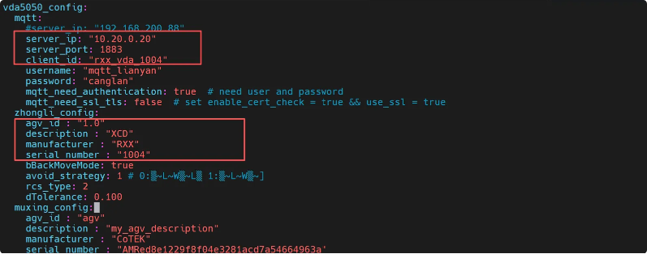{width="5.767716535433071in" height="2.269311023622047in"}

2.  **配置地图单元编号**

访问页面 http://车辆对应IP:8080/#/MapConfiguration，使用默认账号密码 root/root 登录，完成地图单元编号配置。可以在地图列表里修改地图名称，来与调度的地图单元编号适配。

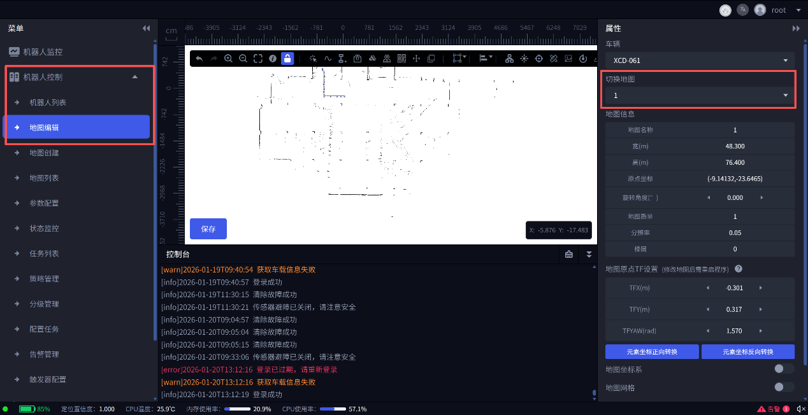{width="5.767716535433071in" height="2.963020559930009in"}

3.  **在EMQX确认车辆已上线**

登录EMQX管理界面**：**http://10.20.0.20/emqx/#/clients/detail/车端对应client_id。默认账号密码：admin/public。

在客户端列表中查看对应 client_id 是否在线，确认车辆已成功连接 MQTT 服务器。

4.  检查Topic 配置一致性

查看适配层配置文件：/home/ubuntu/usp/robotAdapter/src/config/config.ini，并在 EMQX中查看车端实际上报的 Topic 信息，确保两者保持一致。

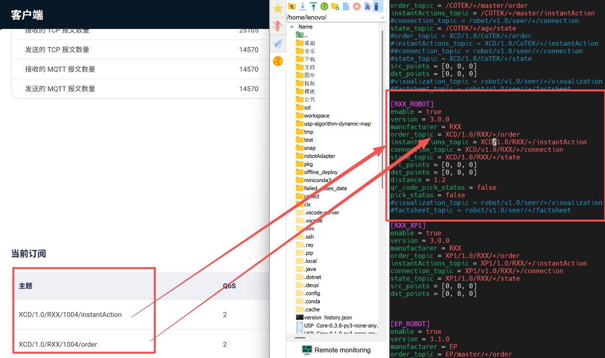{width="5.767716535433071in" height="3.4192443132108488in"}

5.  **完成调度端上线配置**

在调度平台中为车辆配置正确的机器人类型和地图。配置完成后，车辆即可在调度页面完成上线。

{width="5.772222222222222in" height="3.115290901137358in"}

### **2.1.3 科钛车上线**

**步骤：**

1.  使用默认账号密码 cotek / Cotek@123 登录服务器。

2.  打开配置文件 \~/config/basic_config/agv_basic_config.json，完成 MQTT 参数配置：

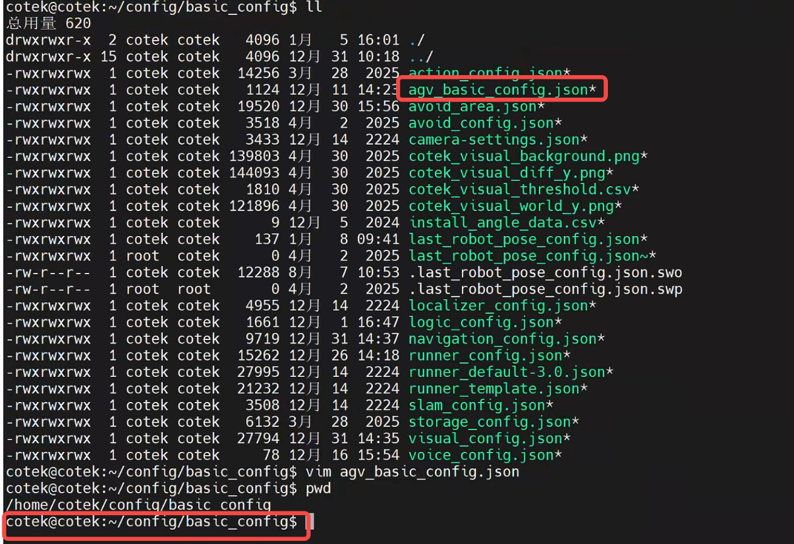{width="5.767716535433071in" height="3.9539337270341206in"}

- server_ip：配置为调度系统服务器 IP；

- server_port：配置为调度系统服务器端口号（1883）；

- communicate_mothod：配置为 2，表示 MQTT 模式；

- current_map_id：配置为调度系统地图单元编号（与后续导入地图的编号相同）；

- project_topic：XS1152 车型无需填写，XCD / XP1 / XPL 系列需填写带对应标识的唯一序列号：(XPL=XP3≈XP1，XPL系列Topic统一为XP1)

{width="2.6770833333333335in" height="0.2604166666666667in"}

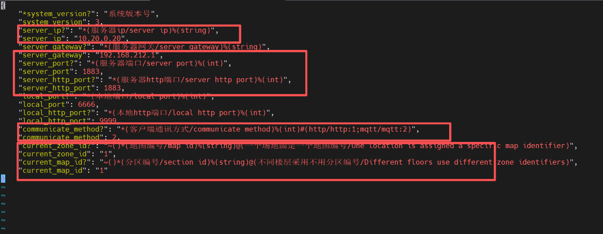{width="5.767716535433071in" height="2.239452099737533in"}

3.  **在EMQX确认车辆已上线**

登录EMQX管理界面**：**http://10.20.0.20/emqx/#/clients/detail/车端对应标识。默认账号密码：admin/public。

在客户端列表中查看对应 client_id 是否在线，确认车辆已成功连接 MQTT 服务器。

4.  检查Topic 配置一致性：

查看适配层配置文件：/home/ubuntu/usp/robotAdapter/src/config/config.ini，并在 EMQX中查看车端实际上报的 Topic 信息，确保两者保持一致。

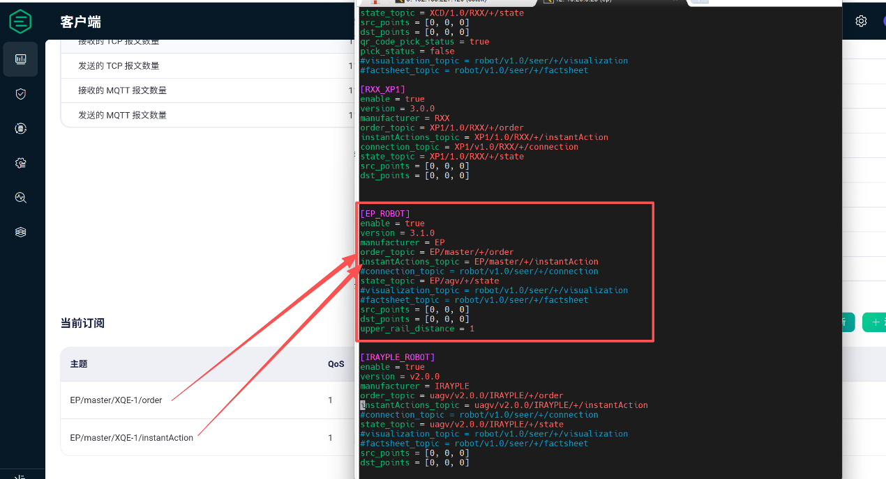{width="5.767716535433071in" height="3.131760717410324in"}

5.  调度平台中配置正确的机器人类型和地图，完成车辆上线。

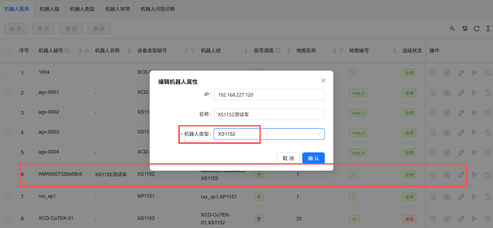{width="5.028133202099737in" height="2.330641951006124in"}

## **2.2 机器人类型配置**

**步骤：**

1.  进入调度平台【设备】→【机器人类型】（或对应的机器人管理页面）。

2.  选中目标机器人，进入"机器人属性"编辑界面。

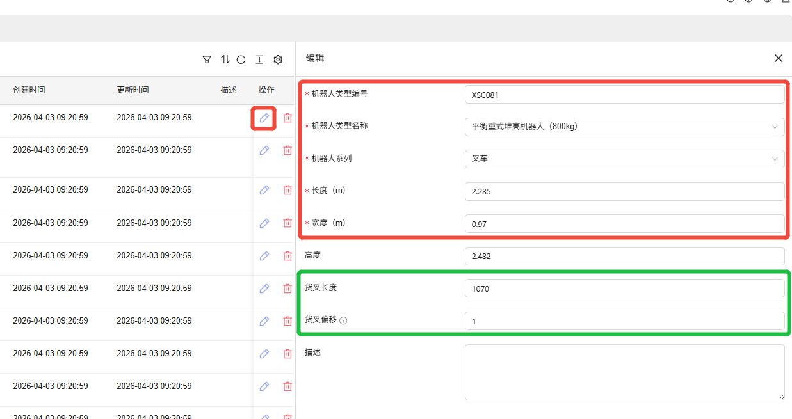{width="5.772222222222222in" height="3.056431539807524in"}

3.  配置机器人类型相关字段：

- **通用必填（所有车型都需配置）**：编号、车型（类型）、模型/尺寸（至少需填写长宽等关键尺寸）

- **叉车专属（叉车/堆高车需要配置）**：货叉相关参数（如货叉长度/货叉偏移等，按页面字段填写）

4.  保存配置。

## **2.3 机器人操作**

机器人操作分为调度平台操作和实车车体本身操作。

- 调度平台机器人操作

> 当前调度平台机器人操作入口有以下方式：车辆报表页面、运行监控右键车辆、运行监控车辆详情弹框，这几个页面的操作调用接口均一样，按照运行监控右键车辆入口操作进行详细讲解说明，如图所示：

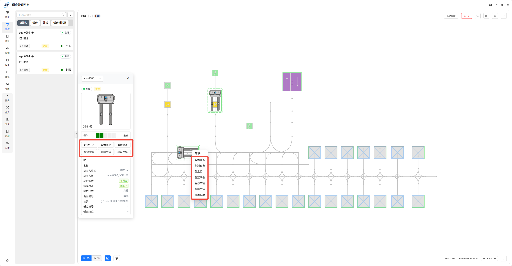{width="5.646134076990376in" height="3.1090398075240593in"}

- 取消任务

  - 取消当前车上正在执行的任务（执行状态的任务），对于\"调度中\"的任务，由于未下发到车上，这个取消任务不会生效

- 取消充电

  - 车在充电桩充电时，操作此项可取消车充电任务，车变为待命空闲状态，可被分配执行其他任务

- 重定位

  - 使用该操作可把车定位到其他位置，使用情况：一般用作车定位异常/或者仿真测试需要便利性修改车位置。

  - 进入重定位功能，顶部有操作指引，鼠标点击到定位目标点，可通过黑色箭头调整车头朝向

  - 点击重定位后，车位置重定位新的位置。

> 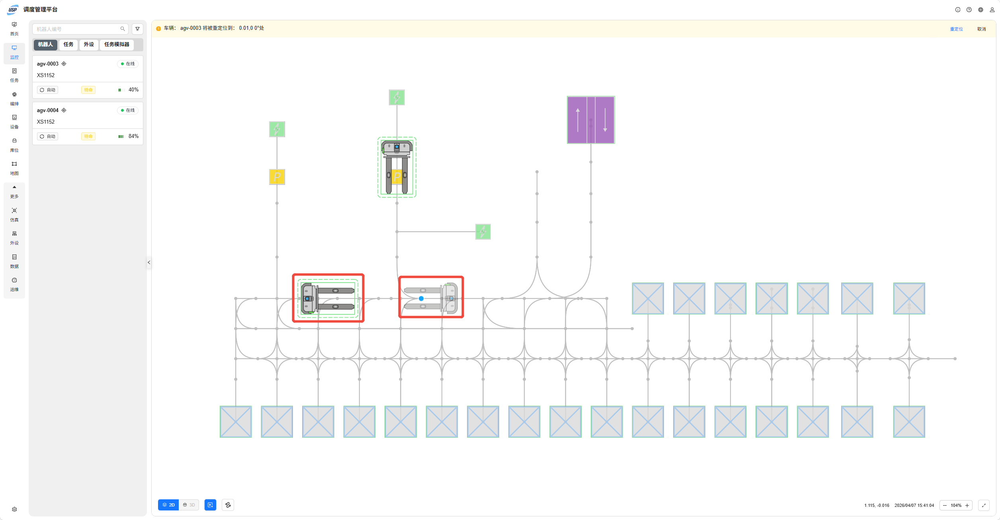{width="5.233333333333333in" height="2.725in"}

- 重置设备

  - 重置设备：车异常、有残留任务、任务状态不同步，使用重置设备把车辆重置到初始状态，此操作会清空车子在内存中的所有状态，并给车发取消任务指令，一般情况下不要轻易使用重置设备。

- 暂停车辆

  - 暂停有任务车：车不继续执行任务（有稍许延时操作），调度会清除车当前任务的路径和锁区，其他车把暂停车当做障碍物，规划路径时会绕行暂停车。

  - 暂停空闲车：调度平台算法不把该暂停车纳入可分配范围，不再分配该车执行任务，同时其他车把暂停车当做障碍物，规划路径时会绕行暂停车

- 取消暂停

  - 取消暂停有任务车，车恢复任务执行，算法重新规划路径

  - 取消暂停空闲车，算法把该车纳入可分配范围，可分配该车执行任务

- 解除车辆

  - 离线车：离线车算法会把它当做障碍物，有一个锁区存在；操作解除车辆后，离线车的锁区不再显示在调度上，不会影响其他车规划

  - 绑定关系解除：由于系统异常，或者人为异常操作，导致车辆和充电桩、休息点处于绑定关系，可通过解除车辆操作，解除车辆和充电桩、休息点的绑定关系

- 禁用车辆

  - 禁用有任务车：车变为禁用状态，但车会把当前执行中的任务继续执行结束；禁用后，算法不把该禁用车纳入可分配范围，不再分配该车执行任务，同时其他车把禁用车当做障碍物，规划路径时会绕行禁用车

  - 禁用空闲车：车变为禁用状态，算法不把该禁用车纳入可分配范围，不再分配该车执行任务，同时其他车把禁用车当做障碍物，规划路径时会绕行禁用车

- 删除车辆

  - 删除车辆的前置条件：车辆离线，且已操作过解除车辆

  - 车辆报表页面，勾选需要删除的车辆，点击删除后，这些车辆的数据完全从调度平台上清除。

> 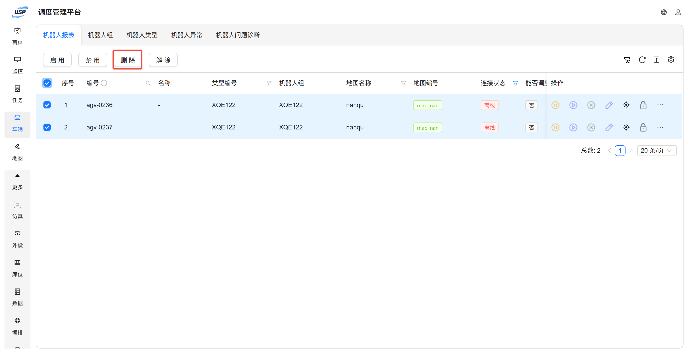{width="5.454861111111111in" height="2.8091108923884516in"}

- 实车车体操作

  - 车辆开机

    - 如果车辆已经和调度平台关联，开机后，车辆上报心跳至调度平台，调度平台-车辆报表/运行监控会显示车辆状态

    - 若车辆不在地图路网上（上轨异常），需要手动控制车辆移动到路网上，确保车辆正常上轨（运行监控车辆有绿色上轨锁区）

  - 车辆急停

    - 使用场景：一般是出于安全/现场突发情况，需要把车紧急停止，可按下车的急停按钮；

    - 急停表现：急停后车立刻停止执行任务，调度会清除车当前任务的路径和锁区，其他车把急停车当做障碍物，规划路径时会绕行急停车

    - 急停恢复：车上拉起急停按钮，急停车恢复正常状态，调度平台感知车状态正确，继续执行车上的任务，算法重新规划路径

  - 切手动模式

    - 使用场景：车任务执行异常/车有残留任务/车状态异常，切换手动模式进行恢复

    - 调度表象：切换手动模式后，车在调度平台是不可调度状态

    - 调度显示车有任务：车执行任务异常（取货/放货异常），切手动模式后，把车拉到主干道上，再切换回自动模式，车在调度平台变为可调度状态，继续执行车身上的任务，重新规划路径

    - 调度显示车无任务：车有残留任务/车状态异常/调度上显示车工作状态实际无任务，切手动模式，车会清除自己的异常残留任务，恢复正常状态，再切换回自动模式，车在调度平台变为可调度状态，可被调度使用

  - 车辆关机

    - 车辆不再使用，可进行关机操作

    - 调度表象：车辆关机后，车在调度上是离线状态，有离线锁区保护（对算法是当做障碍物使用）

    - 后期操作：关机后，需要把车推离地图，推走后，调度平台需要操作解除车辆，把离线锁区清除掉，即后续不影响算法在该路径上的规划

## **2.4 机器人组操作**

实际场景中，执行某个区域的任务可能会指定一批车，或者休息点/充电桩只允许某些机器人使用，此时需要使用机器人组的概念，将这些车配置成一个机器人组，方便使用。

- 机器人组新增

  - 进入车辆-机器人组页面，点击新增，弹出新增弹框，如图所示

> 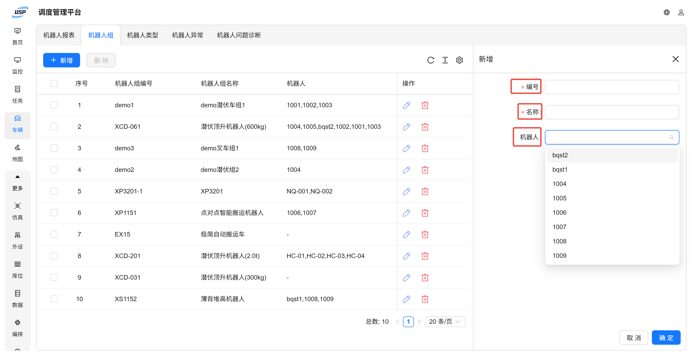{width="5.205555555555556in" height="2.680725065616798in"}

- 机器人组编辑

  - 选择一条数据，点击编辑按钮，进入机器人组数据编辑页面，可对机器人组包含的机器人进行增删

- 机器人组删除

  - 支持列表中单条数据删除

  - 支持勾选多条数据，通过顶部栏删除按钮进行批量数量删除

- 机器人组使用

  - 任务-发起任务

    - 发起任务页面，可指定任务使用的机器人组，如图所示，机器人类型选择机器人组，下拉列表中选择要使用的机器人组

> 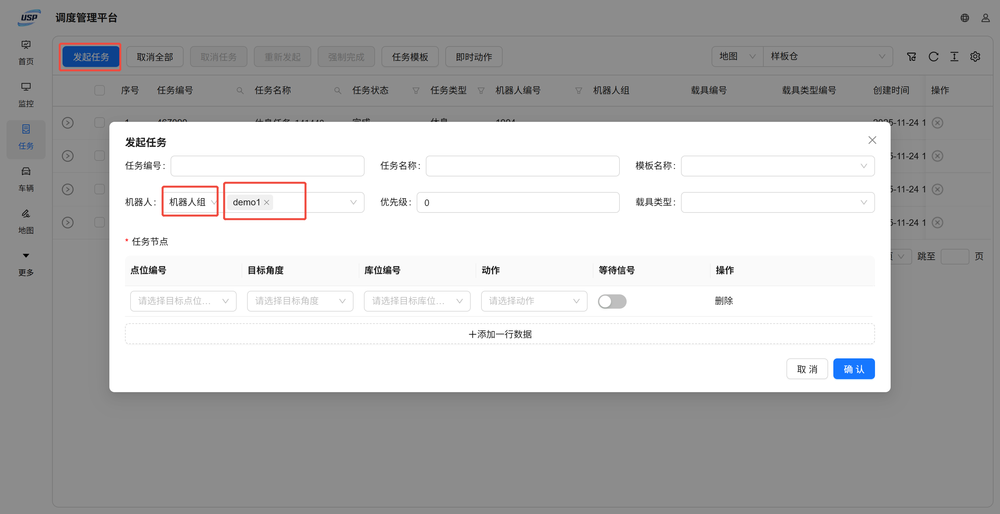{width="4.872222222222222in" height="2.509067147856518in"}

- 应用：选择机器人组，下发任务后，后端把机器人组传给算法，算法会从机器人组中挑选车执行任务

<!-- -->

- 任务模拟器使用

  - 新增/编辑任务模拟器，任务模式选择随机库位/库区，机器人模式为机器人组，下拉列表中选择要使用的机器人组，如图所示：

> 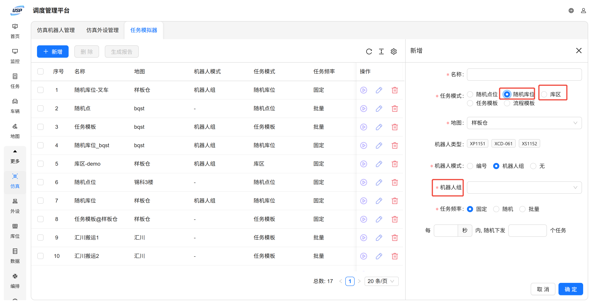{width="4.872222222222222in" height="2.509067147856518in"}

- 应用：任务模拟器新增并启用后，仿真会把任务模式和机器人组传给后端，后端生成的任务会带机器人组，最后算法根据机器人组分配对应的车去执行任务。

<!-- -->

- 任务编排使用

  - 编排-流程实例，新增实例，如下图所示，选择流程模板后，在节点执行车辆中选择机器人组，并配置对应的机器人组

> 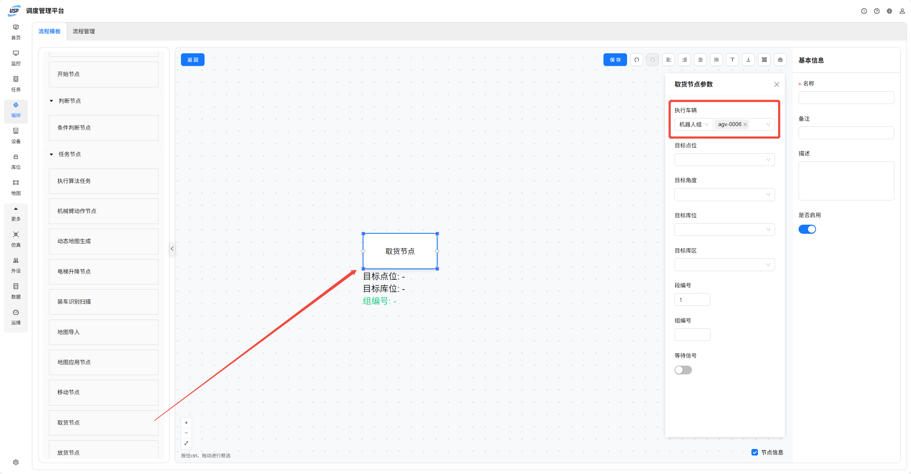{width="4.872222222222222in" height="2.536969597550306in"}

- 应用：下发实例后，流程编排把配置的机器人组下发，算法根据机器人组分配对应的车去执行任务

<!-- -->

- 充电桩属性

  - 地图编辑，充电桩属性中配置机器人组，如图所示

> 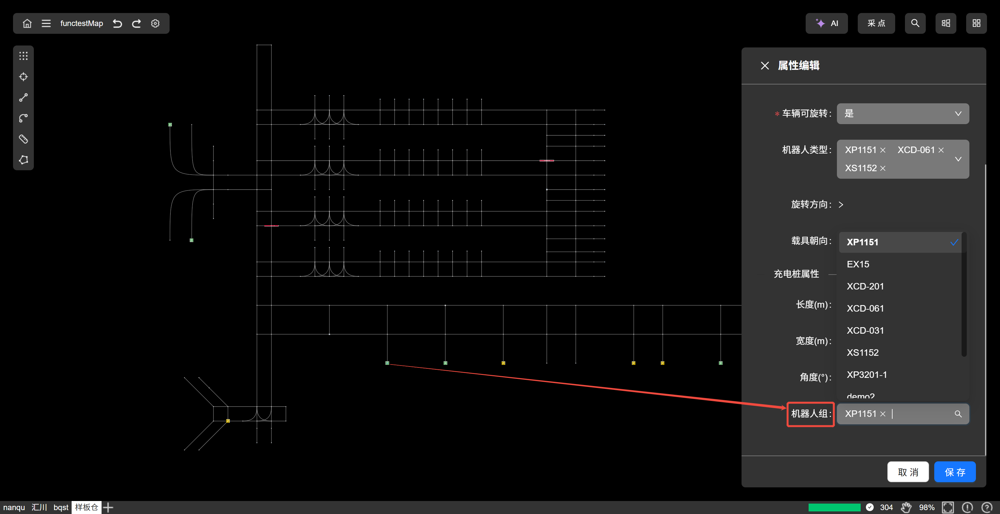{width="4.872222222222222in" height="2.509068241469816in"}

- 应用：地图编辑配置应用地图后，生成充电任务时，会根据充电桩机器人组属性，分配车到对应充电桩进行充电，此时充电桩和车进行绑定；结束充电后充电桩和车绑定关系解除

<!-- -->

- 休息点属性

  - 地图编辑，休息点属性中配置机器人组，如图所示

> 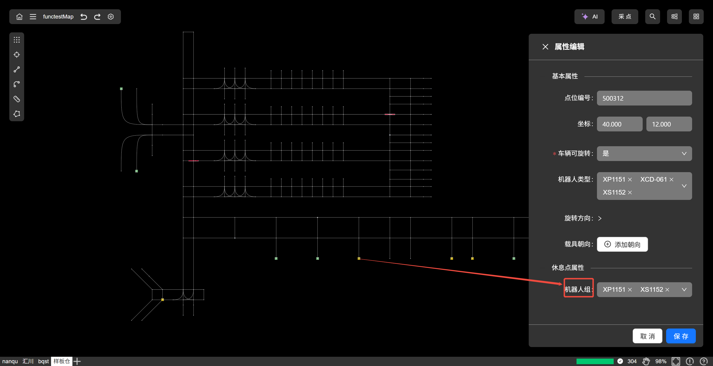{width="4.872222222222222in" height="2.509068241469816in"}

- 应用：地图编辑配置应用地图后，生成休息任务时，会根据休息点机器人组属性，分配车到对应休息点执行休息任务，此时休息点和车进行绑定；休息任务完成后，休息点和车的绑定关系解除

## **2.5 机器人异常诊断**

调度平台会记录车端上报的异常和调度本身识别的问题，如果车执行任务出现异常或者车状态异常，均可以到机器人异常和机器人问题诊断页面查看是否有异常上报。

- 机器人异常

  - 下发任务给车后，任务是执行中状态，车不动时，可到车辆-机器人异常页面，查看对应车是否有异常，如果有异常，则需要找车端。

> 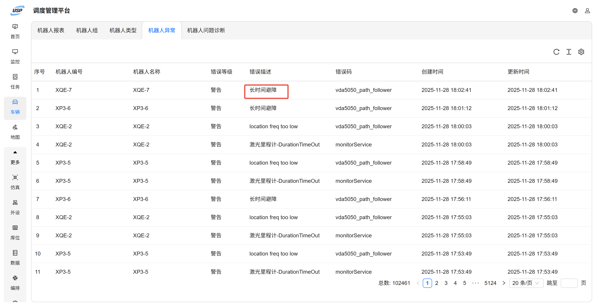{width="5.772222222222222in" height="2.9725437445319334in"}

- 机器人问题诊断

  - 调度平台会对调度层面的机器人问题进行输出，主要是影响机器人的是否可被调用的异常，并呈现在车辆-机器人问题诊断页面，常见问题有：机器人离线、切手动模式、低电量、机器人禁用，同时车辆接任务后，长时间未移动，调度也会上报异常到问题诊断页面，如下图：

> 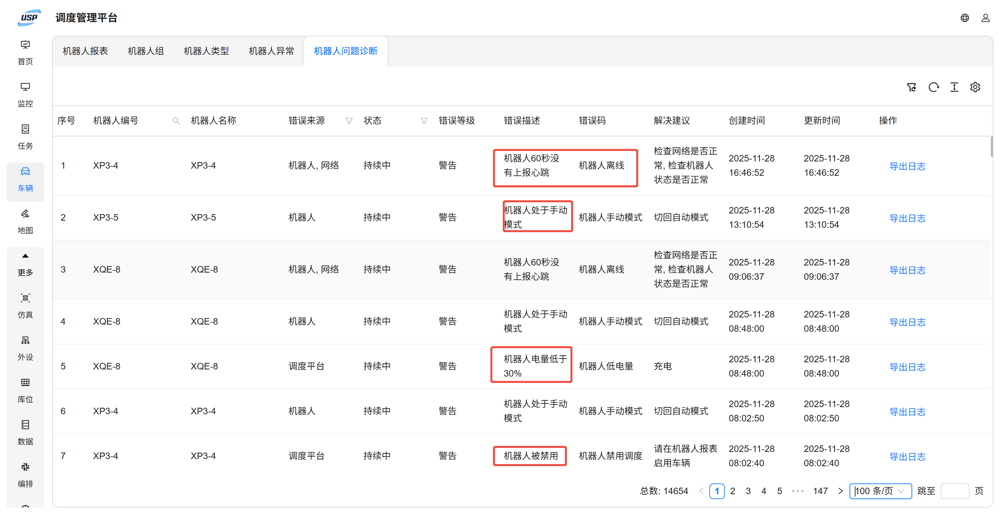{width="5.760416666666667in" height="2.966464348206474in"}

# **3 充电桩上线与充电策略**

## **3.1 充电桩蓝牙配网**

- 设备类型选择 **UDP 透传**；

- 填写充电桩连接网络的 **SSID**；

- 配置网络分配的 **固定 IP**；

- 配置 **USP 系统 IP 和端口**，作为远程服务器的 IP 和端口。

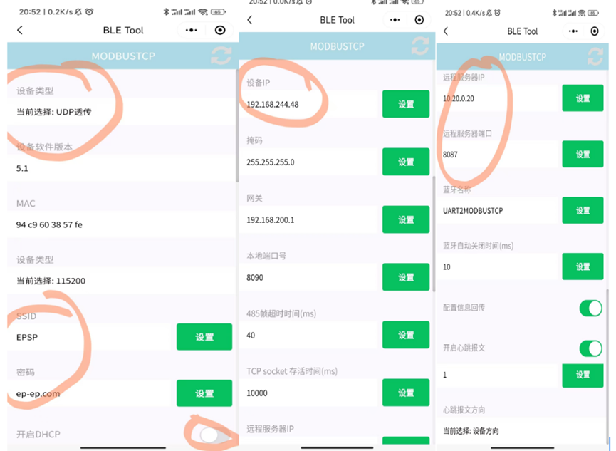{width="5.772222222222222in" height="4.224066054243219in"}

## **3.2 USP侧配置充电桩**

1.  将蓝牙配网阶段配置的充电桩 **固定 IP** 和**端口**配置到 USP 系统对应的充电桩配置项中，并保存生效。

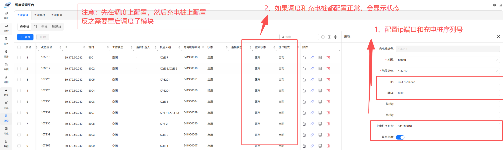{width="5.772222222222222in" height="1.7272233158355206in"}

2.  **（可选）获取充电桩序列号 serialNumber**：若页面配置需要序列号但未知，可先完成充电桩配置后，通过调度日志确认序列号，进入容器查看日志：

3.  在日志中找到对应充电桩 IP 上报内容，提取 serialnumber 字段值作为序列号。页面配置完成后，重启调度子模块使配置生效：

## **3.3 地图充电桩点位配置与可充车型配置**

在地图编辑中选择（或创建）充电桩点位，将其与对应充电桩进行绑定/关联，并配置该充电桩支持充电的车型范围，保存生效。

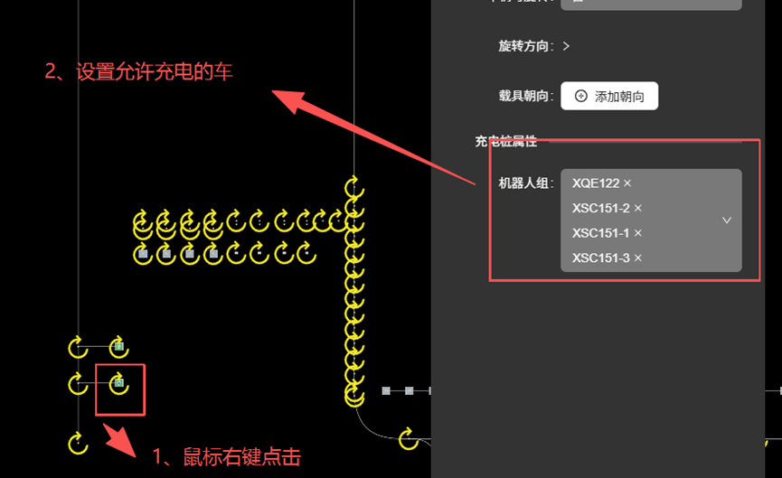{width="5.772222222222222in" height="3.5300645231846017in"}

## **3.4 充电策略配置**

**步骤：**

1\. 在调度系统页面依次进入【更多】→【系统】→【配置管理】。

2\. 在配置管理中设置车辆自动充电相关电量阈值参数。

3\. 按下述规则完成各阈值配置后保存生效。

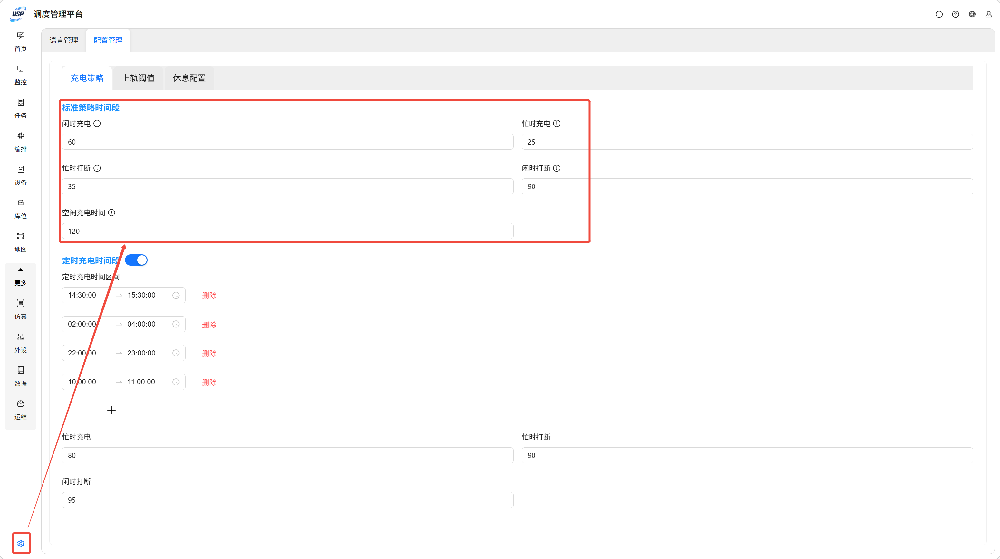{width="5.772222222222222in" height="3.2282786526684166in"}

全局充电策略配置规则：

**闲时充电阈值：**车辆在一定时间内无任务且电量低于该值时，自动开始充电。

- 默认触发条件：需连续无任务 5 分钟后才会触发；

- 该等待时间不能低于自动休息的等待时间，否则可能出现"先休息再去充电"导致绕路。

**忙时充电阈值：**车辆电量低于该值时，不再接收新的搬运任务；待当前任务完成后，自动去充电。

**忙时打断阈值：**车辆充电时电量高于该值，则允许被业务任务打断充电并去接新任务。

**闲时打断阈值：**车辆在充电且没有任务打断的情况下，充到该值后结束充电。

- 该值不能低于"闲时充电阈值"的 70%

- 建议与"闲时充电阈值"的差值至少 20%（避免频繁启停充电）

**空闲充电时间：**用于设置闲时充电的触发时间（单位，s），如果机器人没有任务，在低于闲时充电阈值以及经过这个时间后，会自动触发充电任务。

**定时充电策略配置规则：**

**定时充电时间段：**启用定时充电，并配置充电时间区间，配置时间后，在每天的该时间段都会按照充电策略进行充电（适配现场某个时间段业务停止，让车进行充电的场景）

## **3.5 充电验收**

目的：充电验收用于验证机器人是否能够按照下发指令正常前往目标充电桩，并成功进入充电状态。

步骤：

- 在验收过程中，首先记录目标充电桩对应的点位编号

- 进入【任务】页面后，点击【发起任务】-【充电任务】，在任务下发面板中选择对应的机器人编号，并选择或输入目标充电桩点位编号，发送任务

- 任务下发完成后，在监控界面观察机器人执行情况。正常情况下，机器人应能够按照指令移动至目标充电桩点位，并在到达后正常开始充电。系统界面中应显示机器人处于充电状态（车体变绿），表明充电任务执行正常

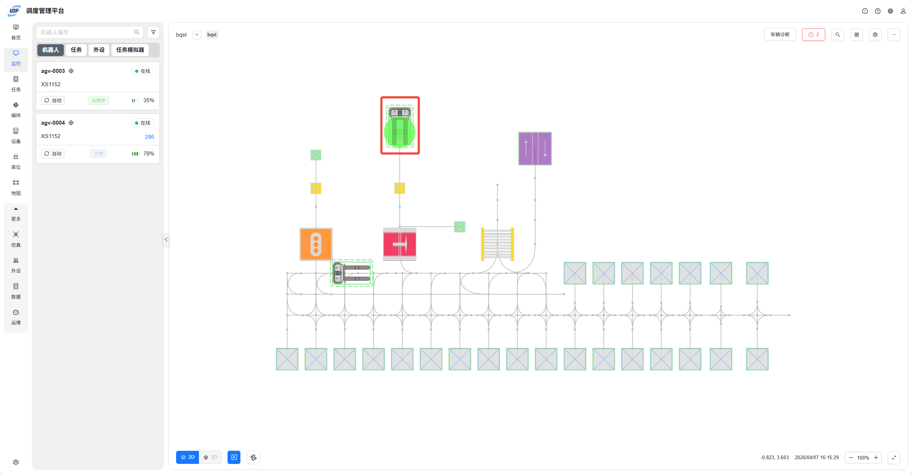{width="5.772222222222222in" height="3.005599300087489in"}

当机器人能够准确到达指定充电桩点位并成功进入充电状态时，可判定本项充电功能验收通过。

# **4 外设上线**

## **4.1 外设接入闭环**

外设接入可按以下闭环完成，确保外设能在任务执行中被正确触发：

1.  外设配置：在平台外设模块新增/编辑外设，录入必要信息并保存。

2.  地图绑定：在地图编辑中将点位设置为对应外设类型，并在点位属性中关联外设编号。

3.  事件配置：地图绑定后自动生成外设事件，可以按业务需求进行外设事件修改。

4.  地图生效：对地图执行【发布】，使绑定与事件生效。

5.  任务验证：下发经过外设点位的任务，确认外设按配置触发并可在平台记录中追溯。

说明：具体外设（自动门/输送线/电梯）的配置项与验证方式，详见后续对应小节。

## **4.2 自动门对接与验收**

**前提：**

已获取自动门设备实际 IP、端口，并确认调度服务器可与设备通信。

**步骤：**

1\. 外设配置

- 进入【外设】→【门】页面，点击新增门

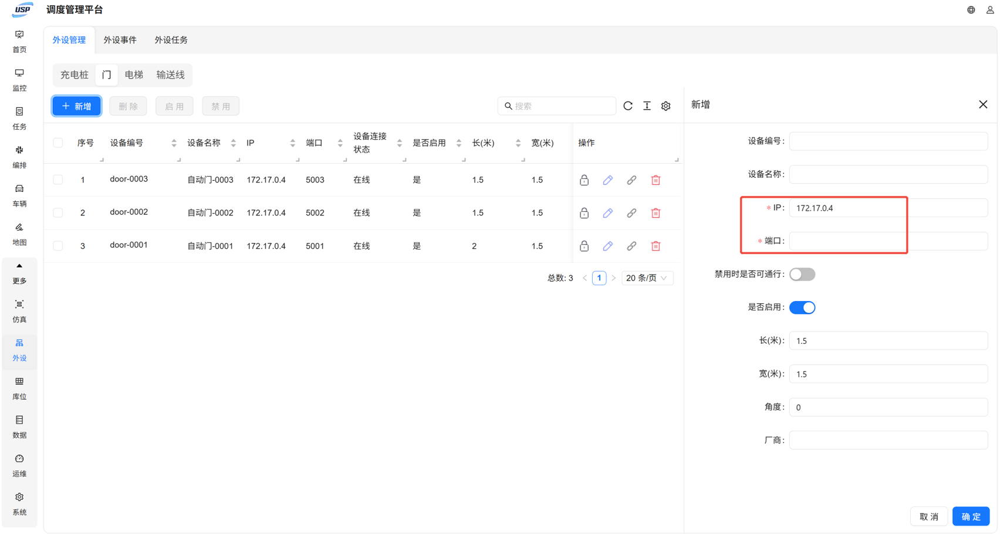{width="5.772222222222222in" height="3.0825831146106735in"}

- 填写门的 IP、端口（使用实际设备信息）；非必填项可留空，其它保持默认/模拟值即可

- 保存后，在【外设-门】列表中新增一条数据，设备连接状态应显示为在线（代表通信正常）

2\. 地图配置

- 进入【地图编辑】，将对应点位类型设置为【自动门】

- 在点位属性中配置自动门编号（选择/填写【外设-门】页面中新增的门数据编号）

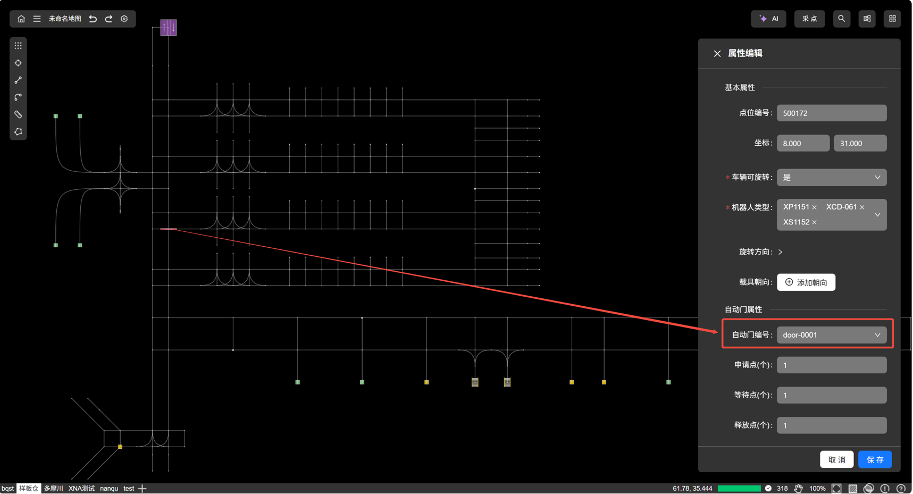{width="5.772222222222222in" height="3.123118985126859in"}

- 按地图生效操作 执行【发布】

- 地图应用后，【外设-门】中该门的"关联功能点"应显示对应的地图点位

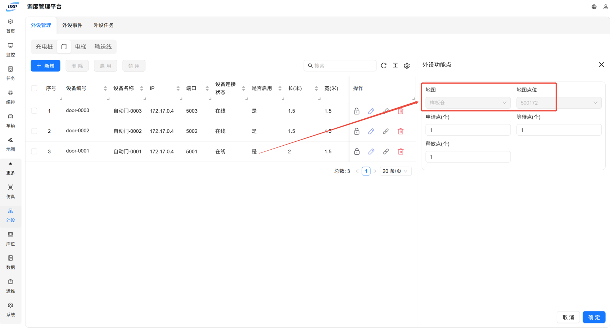{width="5.772222222222222in" height="3.1057622484689413in"}

3.  外设事件配置

- 应用地图后，会自动生成自动门外设事件

- 进入【外设事件】配置页面，可查看生成的外设事件

- 每个地图的外设事件均需要配置，输送线可以进行外设任务参数的配置，如事件提前量：数值表示"点位个数"。正数：提前处理（例如提前 1 个点触发开门）；负数：延后处理

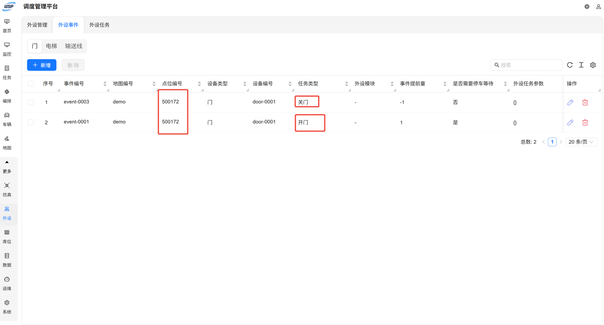{width="5.772222222222222in" height="3.114942038495188in"}

4\. 任务下发验证（业务联动）

- 下发的移动任务/搬运任务，规划的路径需要经过自动门

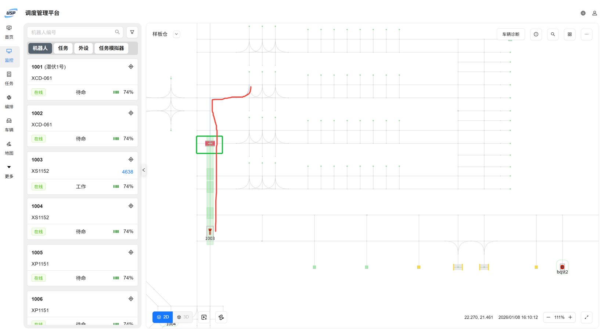{width="5.772222222222222in" height="3.170657261592301in"}

- 任务路径经过门时，调度基础会提前一个点（门前的一个点）申请开门，延后一个点申请关门，触发的外设事件（外设任务）如下

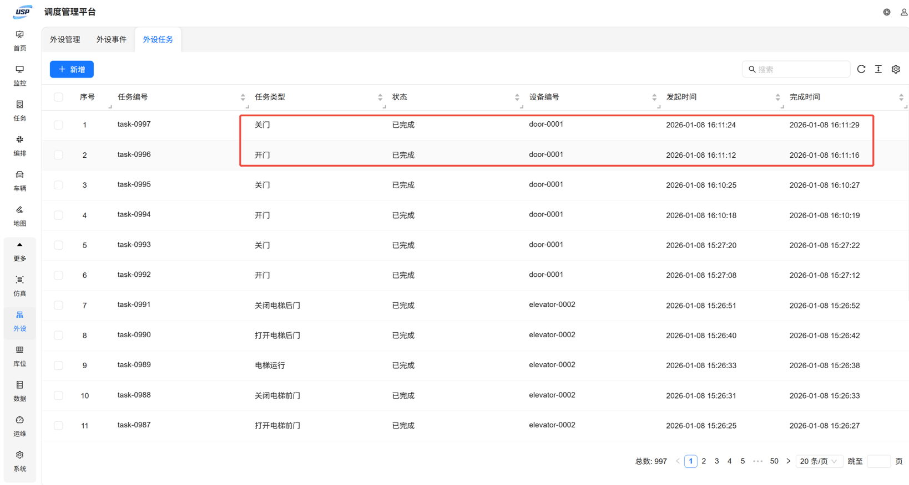{width="5.772222222222222in" height="3.086976159230096in"}

## **4.3 输送线对接与验收**

**前提：**

已获取输送线设备实际 **IP、端口**，并确认适配器模板/接入方式；调度服务器可与设备通信。

**步骤：**

1\. 外设配置

- 进入【外设】→【输送线】页面，点击新增输送线

- 填写输送线 IP、端口、适配器模板（使用实际设备信息）；非必填项可留空，其它保持默认/模拟值即可

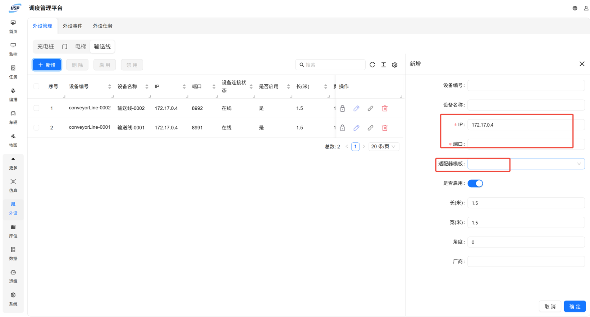{width="5.772222222222222in" height="3.1094728783902013in"}

- 保存后，在【外设-输送线】列表中新增一条数据，设备连接状态应显示为在线

2\. 地图配置

- 进入【地图编辑】，将对应点位类型设置为【输送线】

- 实际项目中输送线点位通常需要完成取货/放货，因此该点位一般也属于库位（可按系统支持的方式设置为多类型点位）

- 在点位属性中配置输送线编号（选择/填写【外设-输送线】页面中新增的数据编号）

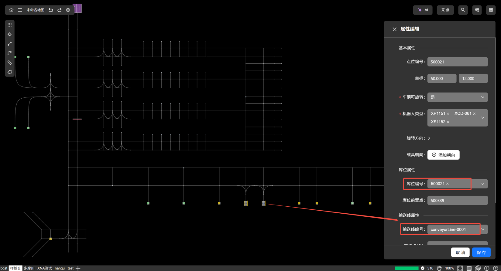{width="5.772222222222222in" height="3.125891294838145in"}

- 按地图生效操作 执行【保存】→【预处理】→【应用】。外设-输送线的外设功能点页面会显示配置的地图点位

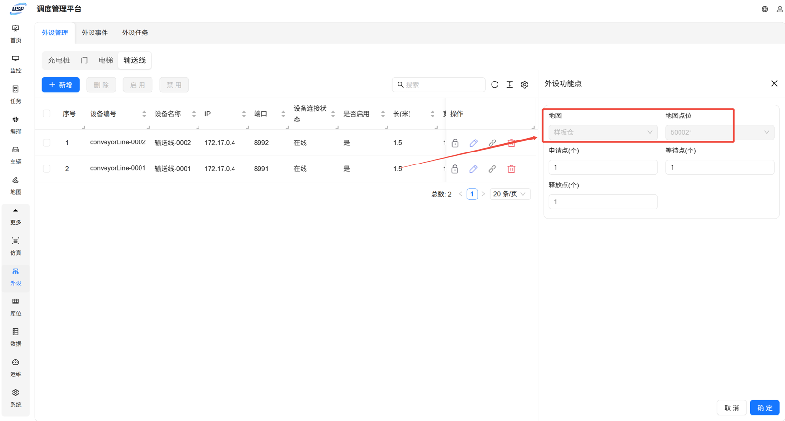{width="5.772222222222222in" height="3.0959142607174104in"}

3.  外设事件配置

- 应用地图后，会自动生成输送线外设事件

- 进入【外设事件】配置页面，可查看生成的外设事件

- 每个地图的外设事件均需要配置，输送线可以进行外设任务参数的配置，如事件提前量：数值表示"点位个数"。正数：提前处理（例如提前 1 个点触发开门）；负数：延后处理

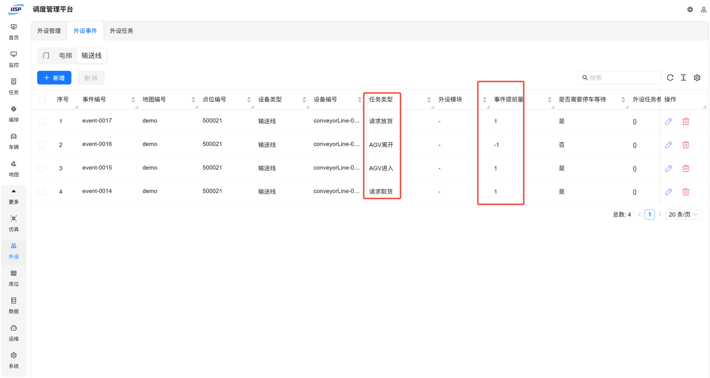{width="5.772222222222222in" height="3.076172353455818in"}4. 任务下发验证（业务联动）

- 通过流程编排下发任务，指定执行车辆（指定车或车组）、取货库位（输送线点位）、放货库位。

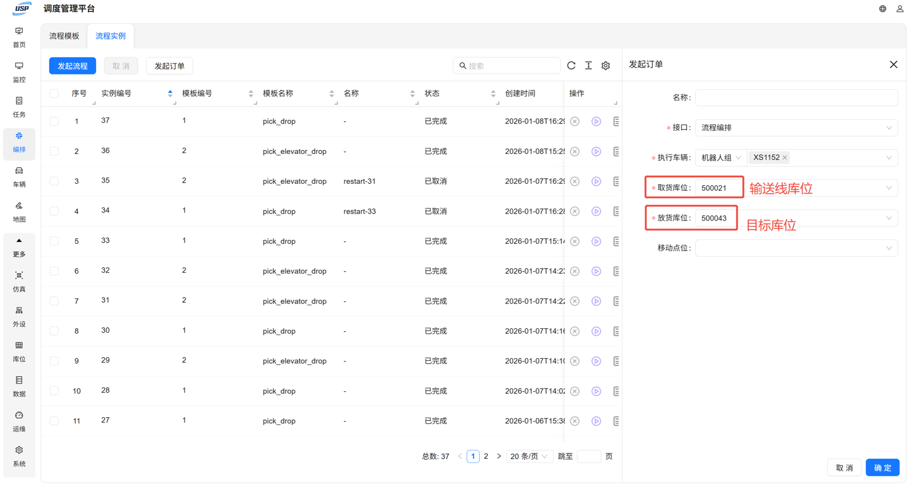{width="5.772222222222222in" height="3.0918853893263343in"}

- 下发后调度基础生成任务，并会根据指定执行车辆填充动作（如涉及货叉动作）。

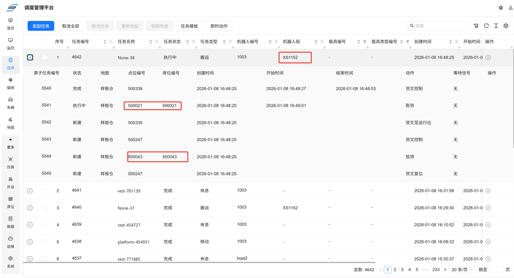{width="5.772222222222222in" height="3.1257392825896764in"}

- 分配车执行任务，车到输送线进行取货并放货到目标点库位

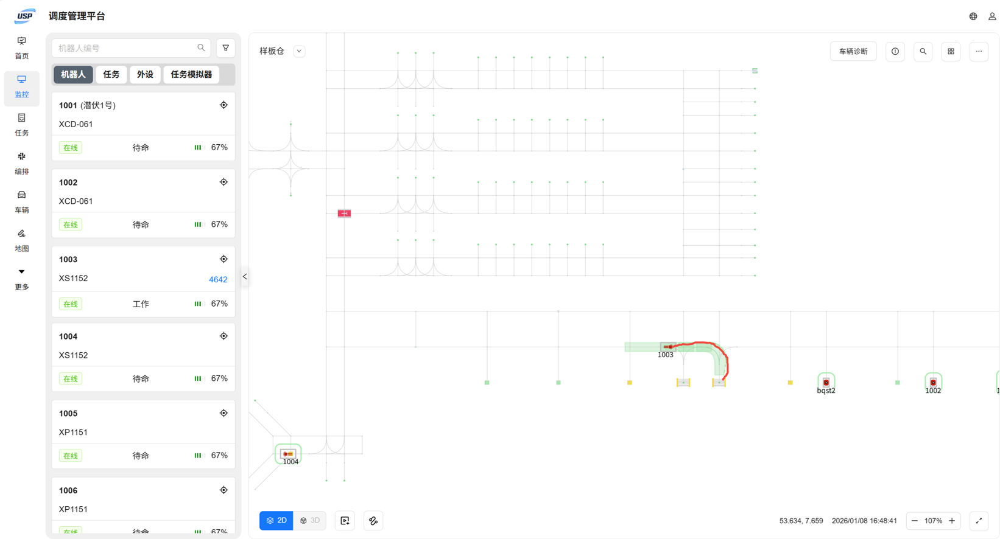{width="5.772222222222222in" height="3.1146095800524933in"}

- 车执行任务过程中，根据外设事件配置进行外设事件触发并产生对应的外设任务

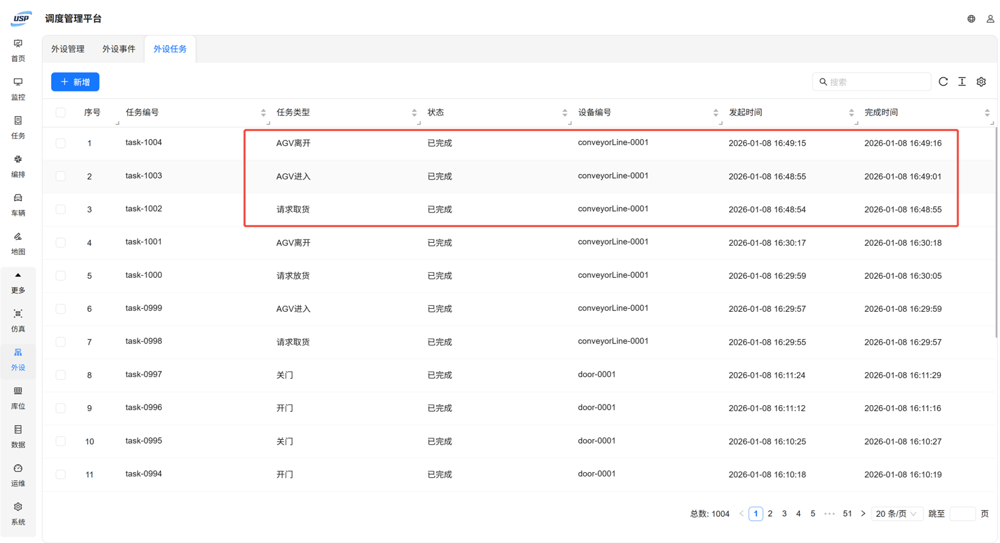{width="5.772222222222222in" height="3.134397419072616in"}

### **4.3.1 输送线对接实例（629宜家区域）**

首先找IT获取正确的输送线IP和端口。

**Modbus测试：**

测试之前需要保证调度上没有连接输送线，如果连接了需要停掉调度的外设模块。调度输送线模块使用的地址为59，60，61，62。其中59 60是取货， 61 62是放货。其中60和62用于调度写入，59和61用于调度读取。示例：如果是取货触发输送线，首先输送线首端的光电需要触发（可以用一个小盒子），代表输送线上现在有货，那么在60位写入相应的数值1（代表请求取货），则59位会正确的反馈2，同时输送线开始转动，直到触发尾端光电停下。

**完整流程：**

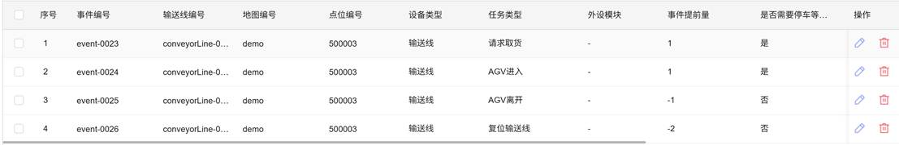{width="5.770833333333333in" height="0.9375in"}

首先查看外设事件设置，正常的取放货任务都包含四个事件，差异只在第一个事件（请求取货/放货）。事件提前量的意思是，在地图上的输送线点位的前几个点位触发相应的外设事件。此处请求取货和AGV进入默认在取货点前一个点，为了适配宜家部分的流程，以下的流程示范将AGV进入的提前量设为0。

1.初始状态，已经在输送线首端放完货，首端光电已触发，等待辊筒车取货触发外设事件。

{width="5.770833333333333in" height="1.1979166666666667in"}

2.辊筒车开始进行取货任务，在取货点前一个点位触发"请求取货"外设任务，输送线开始转动，辊筒车停车等待。

{width="5.770833333333333in" height="1.2357874015748032in"}

3.货物在输送线上滚动至尾部光电触发处停止，等待AGV进入。辊筒车继续前往取货点。

{width="5.770833333333333in" height="1.1979166666666667in"}

4.辊筒车到达取货点，触发AGV进入种的外设任务，输送线继续滚动，同时辊筒车开始取货，辊筒也开始转动。

{width="5.770833333333333in" height="1.5173589238845144in"}

5.货物成功从输送线滚动到辊筒车末端光电停下。输送线仍在转动。此时辊筒车准备通过移动任务回到初始点。

{width="5.770833333333333in" height="1.079359142607174in"}

6.辊筒车到达中间点，即取货任务的延后点位，数量为1。触发AGV离开的外设任务，输送线停止转动，AGV继续移动到初始点位，触发输送线复位任务，在数量为2的延后点位。

{width="5.770833333333333in" height="1.3192158792650919in"}

## **4.4 车随梯：电梯对接与验收**

**前提：**

已获取电梯设备实际 **IP、端口**，调度服务器可与设备通信

**步骤：**

1\. 外设配置

- 进入【外设】→【电梯】页面，点击新增电梯

- 填写电梯 IP、端口；非必填项可留空，其它保持默认/模拟值即可

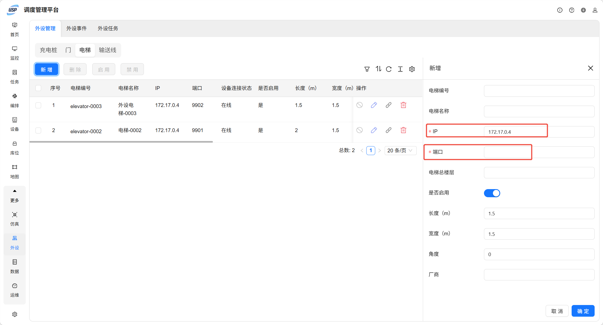{width="5.772222222222222in" height="3.115290901137358in"}

- 保存后，在【外设-电梯】列表中新增一条数据，设备连接状态应显示为在线

2\. 地图配置

- 进入【地图编辑】，将对应点位类型设置为【电梯】

- 在点位属性中配置电梯编号（选择/填写【外设-电梯】页面中新增的数据编号）。备注：需要在电梯点位下方靠近处再配置一个运行点（用于配置外设事件提前量）

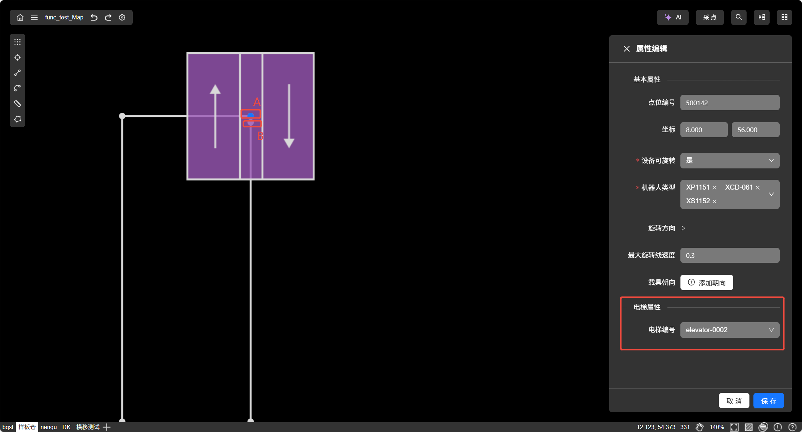{width="5.772222222222222in" height="3.115290901137358in"}

- 按地图生效操作 执行【保存】→【预处理】→【应用】。外设-电梯的外设功能点页面会显示配置的地图点位

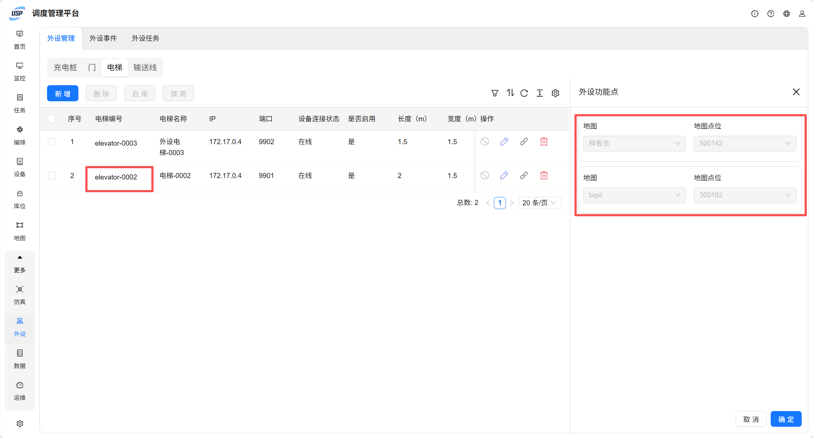{width="5.772222222222222in" height="3.115290901137358in"}

3\. 外设事件配置

- 应用地图后，会自动生成电梯外设事件

- 进入【外设事件】配置页面，可查看生成的外设事件

- 每个地图的外设事件均需要配置，其中任务类型：电梯运行需要进行外设任务参数的额外配置，表明该地图的楼层，如绿色框选

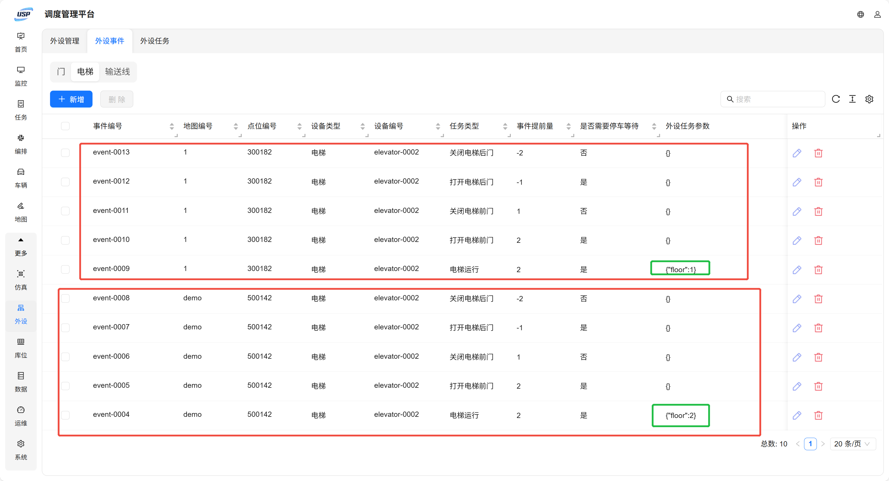{width="5.760416666666667in" height="3.1214818460192477in"}

4\. 任务下发验证（业务联动）

- 通过流程编排下发任务，指定执行车辆（指定车或车组）、取货库位、放货库位

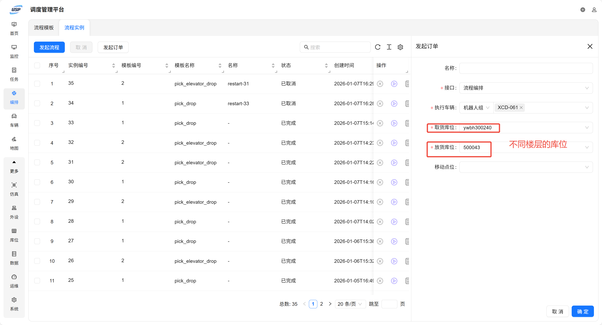{width="5.454861111111111in" height="2.955906605424322in"}

- 下发后调度基础生成任务，包括取货、电梯、放货3个原子任务

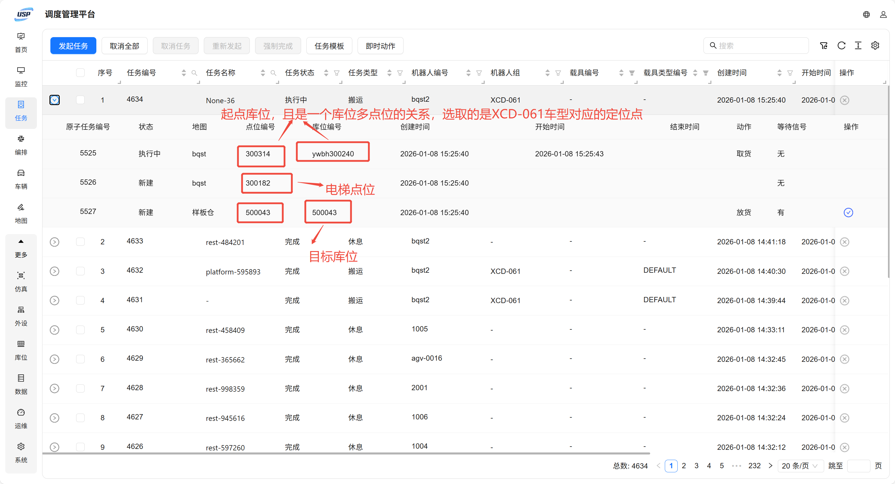{width="5.454861111111111in" height="2.955906605424322in"}

- 分配车执行任务，车到取货库位进行取货，然后带货进电梯，电梯运行到目标楼层，车出电梯并到目标库位放货

<!-- -->

- 车执行任务过程中，根据外设事件配置进行外设事件触发并产生对应的外设任务

> 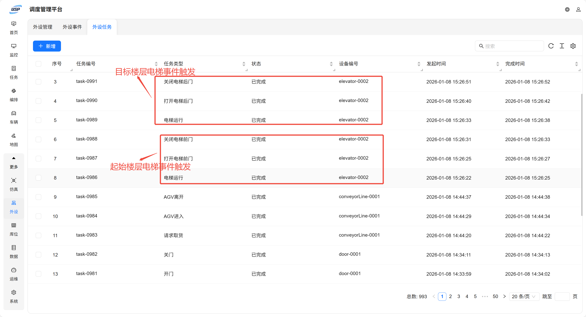{width="5.454861111111111in" height="2.955906605424322in"}

## **4.5 车不随梯：电梯对接与验收**

**前提：**

已获取电梯设备实际 **IP、端口**，调度服务器可与设备通信

**步骤：**

1\. 外设配置

- 进入【外设】→【电梯】页面，点击新增电梯

- 填写电梯 IP、端口；非必填项可留空，其它保持默认/模拟值即可

{width="5.772222222222222in" height="3.115290901137358in"}

- 保存后，在【外设-电梯】列表中新增一条数据，设备连接状态应显示为在线

2\. 地图配置

- 进入【地图编辑】，将对应点位类型设置为【电梯】，同时设置为库位类型，即该点位既是库位又是电梯

- 在点位属性中配置电梯编号（选择/填写【外设-电梯】页面中新增的数据编号）。备注：需要在电梯点位下方靠近处再配置一个运行点（用于配置外设事件提前量）

{width="5.772222222222222in" height="3.115290901137358in"}

- 按地图生效操作 执行【保存】→【预处理】→【应用】。外设-电梯的外设功能点页面会显示配置的地图点位

{width="5.772222222222222in" height="3.115290901137358in"}

3\. 外设事件配置

- 应用地图后，会自动生成电梯外设事件

- 进入【外设事件】配置页面，可查看生成的外设事件

- 每个地图的外设事件均需要配置，其中任务类型：电梯运行需要进行外设任务参数的额外配置，表明该地图的楼层，如绿色框选

- 车不随梯，跨楼层接力，电梯事件稍有不同，在自动生成电梯事件的基础上要把进入电梯的\"关电梯前门\"事件和出电梯的\"打开电梯前门\"事件删除

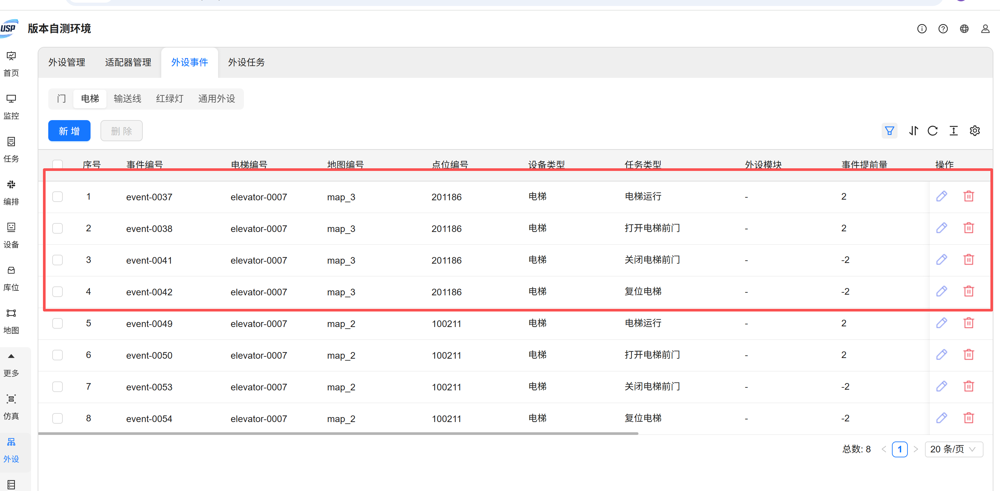{width="5.772222222222222in" height="2.838423009623797in"}

4.  任务下发验证（业务联动）

电梯接力：前段任务（车起始楼层取货到电梯放货，货随电梯到目标楼层）

- 通过流程编排下发任务，起始楼层任务：指定执行车辆（指定车或车组）、取货库位（起始楼层库位）、放货库位（目标楼层电梯库位）

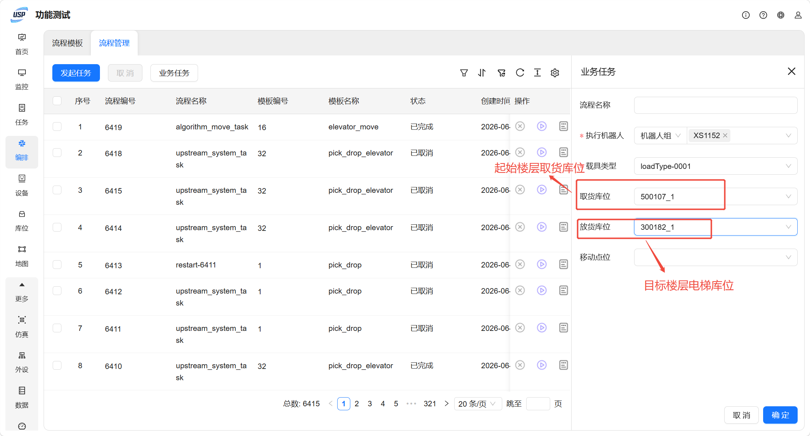{width="5.772222222222222in" height="3.115290901137358in"}

- 流程编排下发任务后生成流程实例（包括取货节点+放货节点+电梯升降节点）及调度基础生成任务（包括取货+放货+移动子任务）

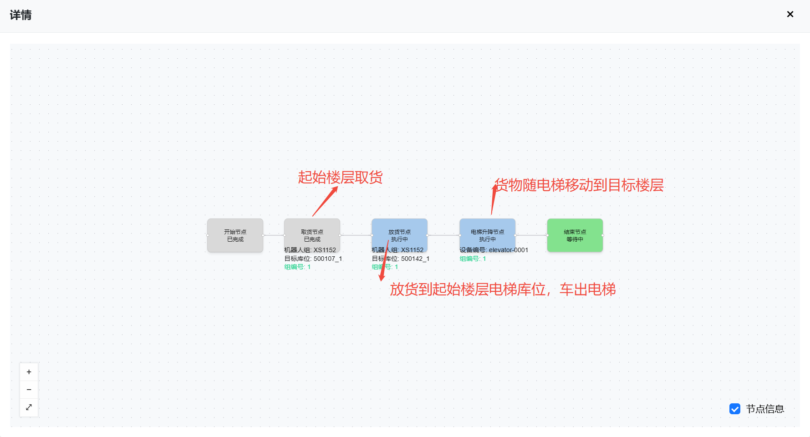{width="5.882638888888889in" height="3.174443350831146in"}

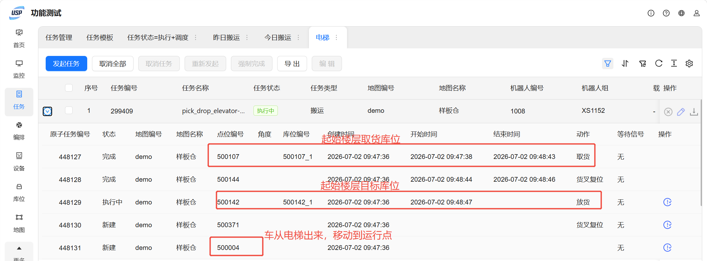{width="5.772222222222222in" height="2.1390113735783025in"}

- 分配车执行任务，车到取货库位进行取货，车带货进电梯并放货，然后车出电梯完成最后的移动子任务

- 车载货进入电梯过程中，根据外设事件配置进行外设事件触发并产生对应的外设任务

  - 电梯运行：电梯前2个点，车载货申请电梯，电梯运行到起始楼层

  - 打开电梯前门：电梯运行到位后，开电梯前门，车载货进入电梯，放货到电梯库位

  - 关闭电梯前门：放货完成后，车出电梯，延后2个点关电梯前门

  - 复位电梯：重置电梯状态

> 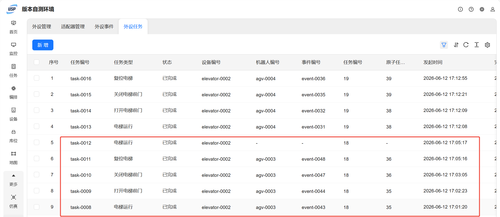{width="5.226388888888889in" height="2.2767268153980753in"}

电梯接力：后段任务（车从目标楼层电梯库位取货，放货到目标楼层库位）

- 通过流程编排下发任务，目标楼层任务：指定执行车辆（指定车或车组）、取货库位（目标楼层电梯库位）、放货库位（目标楼层库位）

> 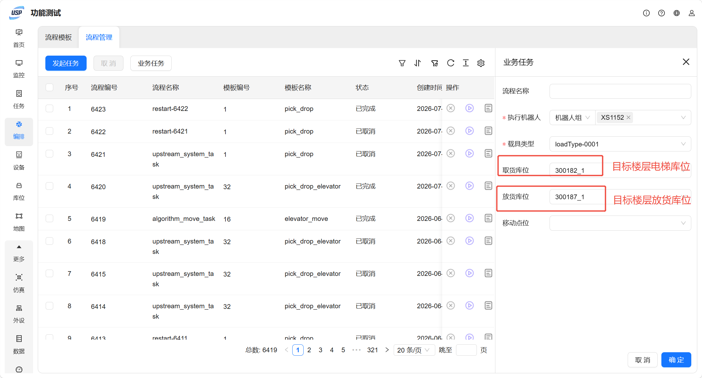{width="5.538888888888889in" height="2.9893602362204725in"}

- 流程编排下发任务后生成流程实例（包括取货节点+放货节点）及调度基础生成任务（包括取货+放货子任务）

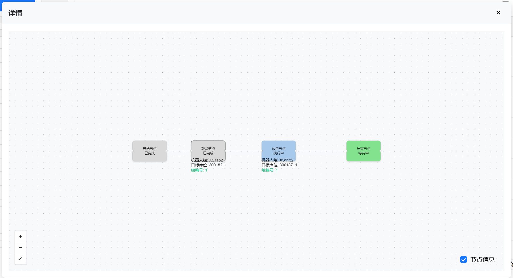{width="5.782638888888889in" height="3.1442093175853016in"}

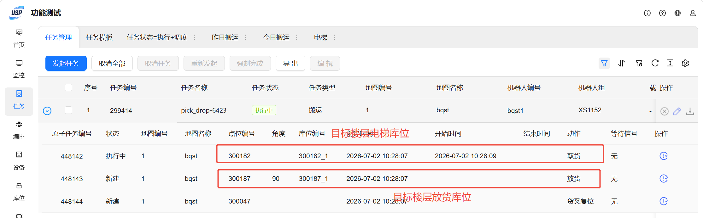{width="5.382638888888889in" height="1.6734722222222222in"}

- 分配车执行任务，车到电梯库位取货，车载货出电梯，并放货到目标库位

- 空车进入电梯过程中，根据外设事件配置进行外设事件触发并产生对应的外设任务

  - 电梯运行：电梯前2个点，空车申请电梯，电梯运行到目标楼层

  - 打开电梯前门：电梯运行到位后，开电梯前门，空车进入电梯，并完成电梯库位的取货

  - 关闭电梯前门：电梯库位取货完成后，车出电梯，延后2个点关电梯前门

  - 复位电梯：重置电梯状态

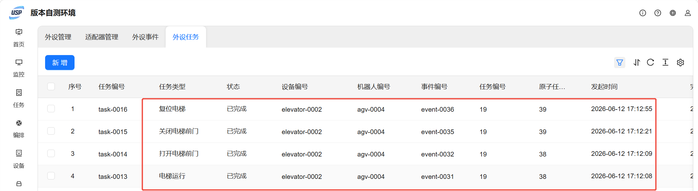{width="5.772222222222222in" height="1.5900153105861767in"}

## 4.6 红绿灯对接与验收

**前提：**

已获取红绿灯设备实际 **IP、端口**，调度服务器可与设备通信

**步骤：**

1\. 外设配置

- 进入【外设】→【红绿灯】页面，点击新增红绿灯

- 填写红绿灯IP、端口；非必填项可留空，其它保持默认/模拟值即可

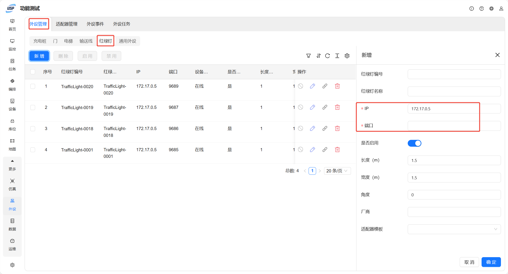{width="5.772222222222222in" height="3.115290901137358in"}

- 保存后，在【外设-红绿灯】列表中新增一条数据，设备连接状态应显示为在线

2\. 地图配置

- 进入【地图编辑】，将对应点位类型设置为【红绿灯】

- 在点位属性中配置红绿灯编号（选择/填写【外设-红绿灯】页面中新增的数据编号）。

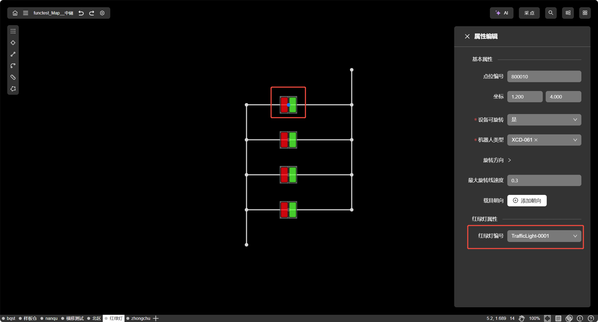{width="5.772222222222222in" height="3.115290901137358in"}

- 按地图生效操作 执行【保存】→【预处理】→【应用】。外设-红绿灯的外设功能点页面会显示配置的地图点位

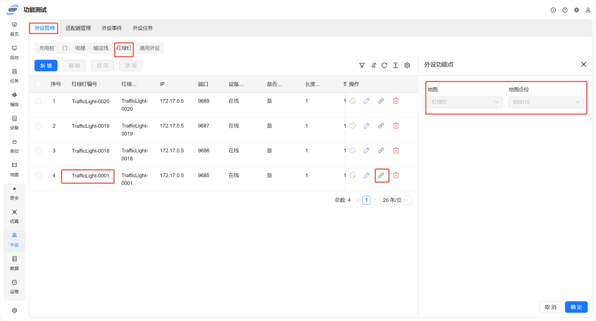{width="5.772222222222222in" height="3.115290901137358in"}

3\. 外设事件配置

- 应用地图后，会自动生成红绿灯外设事件

- 进入【外设事件-红绿灯】配置页面，可查看生成的外设事件

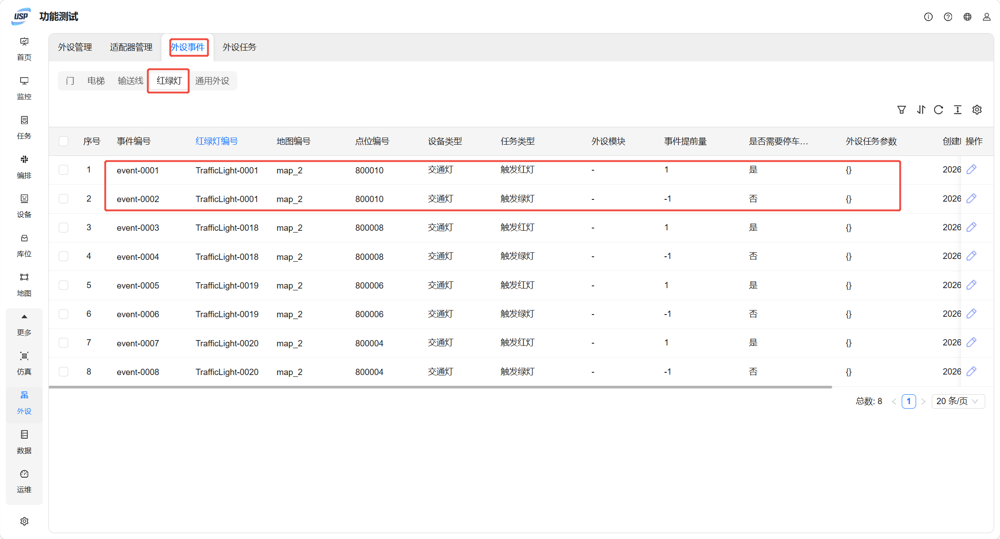{width="5.772222222222222in" height="3.115290901137358in"}

4\. 任务下发验证（业务联动）

- 下发的任务，规划的路径需要经过红绿灯

> 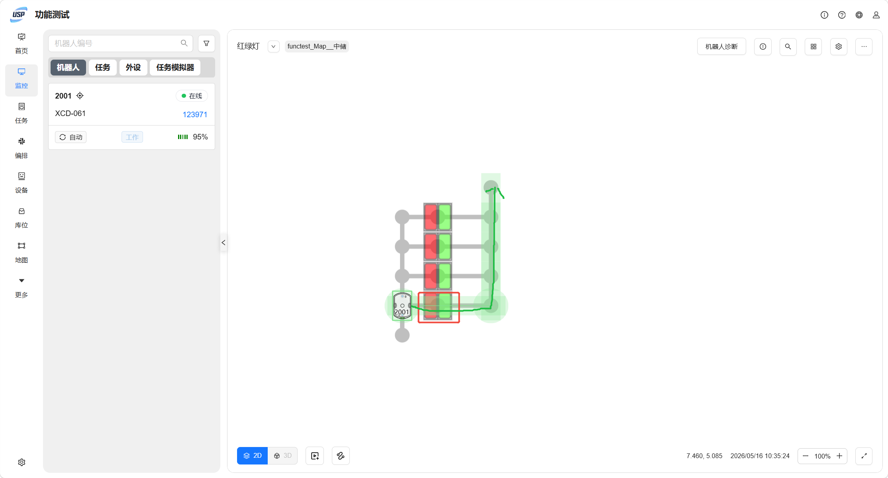{width="5.538888888888889in" height="2.9893602362204725in"}

- 任务路径经过红绿灯时，调度基础会提前一个点（红绿灯前的一个点）触发红灯事件，将红绿灯变为红灯亮，其他车不会再规划路径经过此处，延后一个点触发绿灯事件，将红绿灯变为绿灯，允许其他车规划路径经过此处，触发的外设事件（外设任务）如下：

> 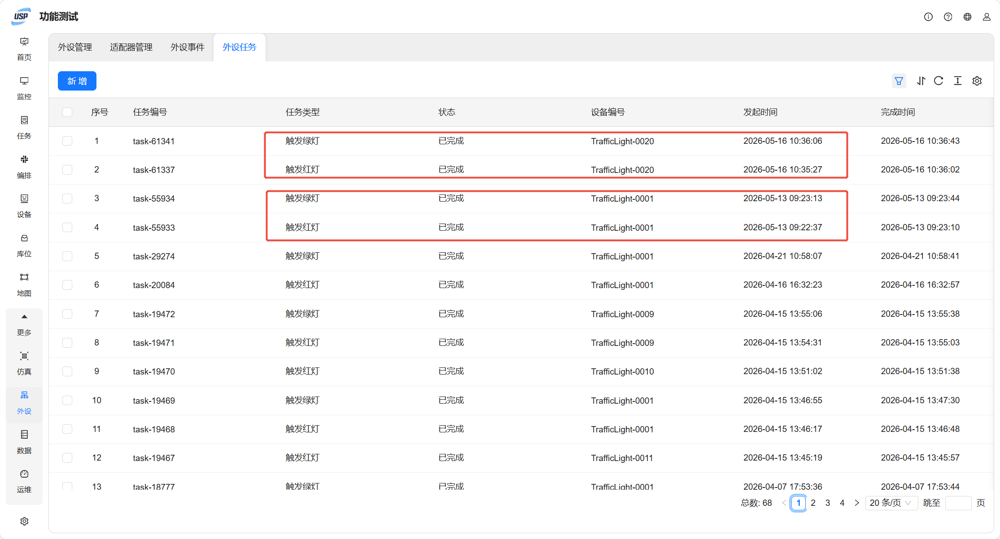{width="5.538888888888889in" height="2.9893602362204725in"}

# **5 地图绘制与生效**

## **5.1 新建或导入地图**

**步骤：**

1.  **进入地图入口：**

- 【地图】→【地图管理】

2.  **新建地图：**

- 若当前无地图，系统会提示【新建地图】；按提示设置地图基础信息，并配置自动创建的地图单元数量（多个地图单元用于在同一张地图上多个独立区域的情况）

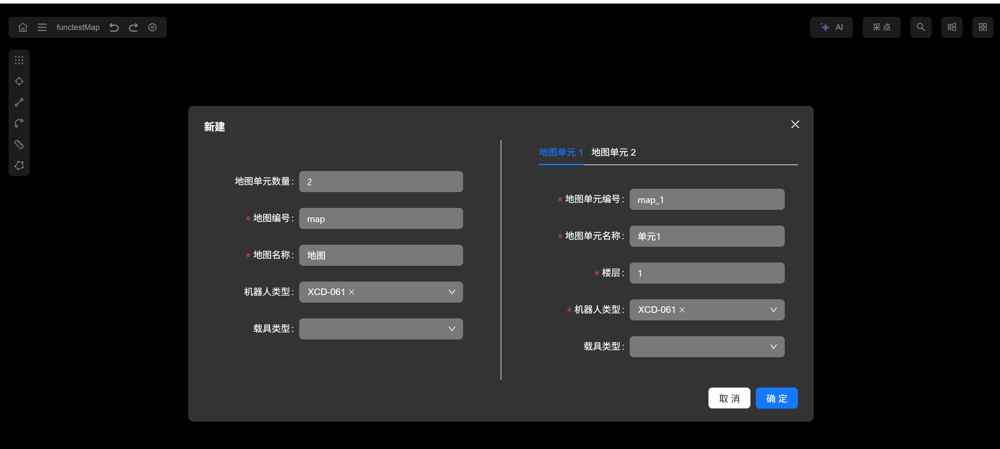{width="5.772222222222222in" height="2.5935094050743657in"}

- 若已存在地图，仍可在地图编辑界面通过左下角"+"新增地图单元（按页面提示操作）

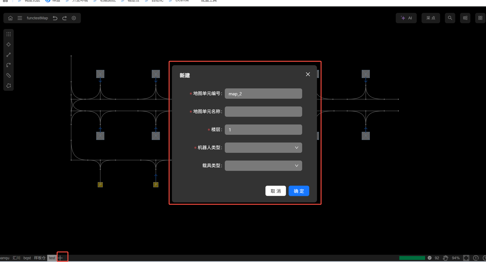{width="5.772222222222222in" height="3.113860454943132in"}

3.  **导入地图：**

- 在【地图管理】页面点击【导入】，按提示导入地图文件

其中，导入地图会在地图管理中新建一份地图，导入并合并则会合并到现有的地图中，增加新的地图单元。

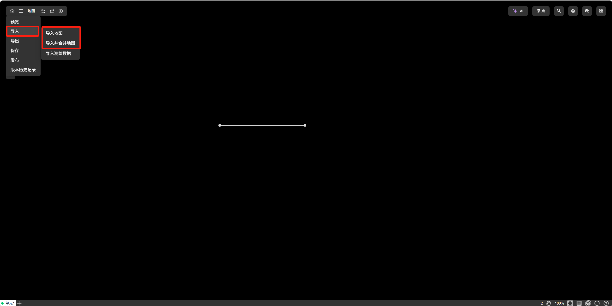{width="5.772222222222222in" height="2.8872430008748906in"}

4.  **导入/新建后检查：**

- 确认左下角已显示对应地图单元；如需继续绘制，进入地图编辑页面进行拓扑绘制与参数配置

说明：

新建地图时可配置地图单元数量、地图编号规则、以及地图单元关联的机器人类型等基础设置（以页面字段为准）

导入地图后如出现保存失败，多与地图文件格式不符或必填字段为空有关（常见于跨版本地图文件）

## **5.2 编辑地图单元信息**

适用场景：需要修改某个地图单元的基础信息（例如地图单元关联的机器人类型/载具类型）时使用

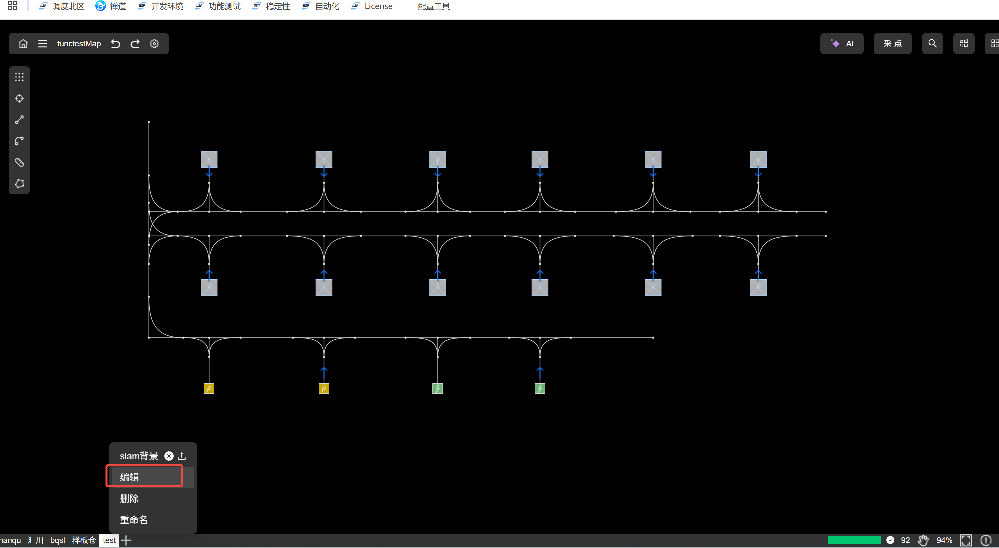{width="5.772222222222222in" height="3.166344050743657in"}

步骤：

1.  在【地图编辑】页面左下角，找到目标地图单元

2.  右键该地图单元，点击【编辑】

3.  在弹窗中修改地图单元相关信息（字段以页面显示为准），点击【确定/保存】完成更新

补充：

地图单元名称可通过左下角右键地图单元或双击地图单元进行重命名（以实际页面行为为准）

## **5.3 采点生成基准点**

前提：现场实施已完成车辆网络接入，且车辆已在平台中上线可选。

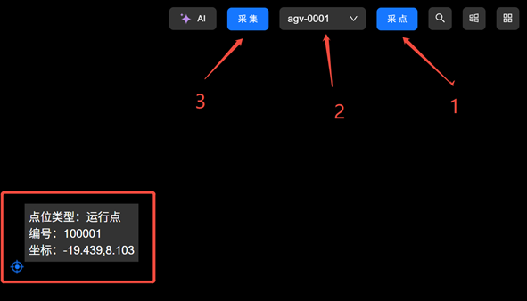{width="3.6368055555555556in" height="2.0799321959755033in"}

**步骤：**

1.  将某一车辆移动到现场一个位置明确的点位（作为基准点）。

2.  在地图编辑界面右上角点击【采点】，在车辆列表中选择对应车辆。

3.  点击【采集】，系统会在地图上生成该车当前位置点位（默认生成运行点）。

4.  以该基准点为参考，再通过新建点位/批量生成等方式补齐其他点位。

**说明：**

现场采点建图建议优先采关键点（如四角点、充电桩、休息点、库位等），再补点提高效率。

## **5.4 新建点位**

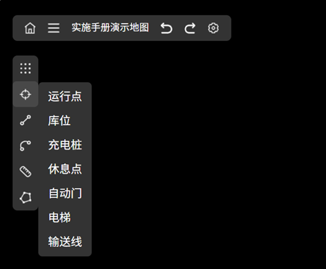{width="2.123393482064742in" height="1.75in"}

步骤：

1.  在地图绘制界面左侧功能栏点击【新建点位】。

2.  选择点位类型（运行点、库位、充电桩、休息点等）。

3.  在地图上点击目标位置创建点位。

4.  按 ESC 退出画点模式。

说明：

右键点位可进行删除、设置点位类型等操作；一个点位可同时设置为多个类型。

## **5.5 批量生成点位**

{width="3.491493875765529in" height="2.1208912948381453in"}

步骤：

1.  在地图绘制界面左侧功能栏点击【批量创建】（或【批量新建】）。

2.  选择生成方式：

- 【矩形】（常用）

- 【圆形】（按场景需要）

3.  在弹出的配置窗口中设置生成参数（以页面字段为准），常见包含：

- 点位类型（运行点/库位点）

- 是否生成线（点与点之间运行路径）

- 起始点 X/Y 坐标

- 行数、列数

- 点间距

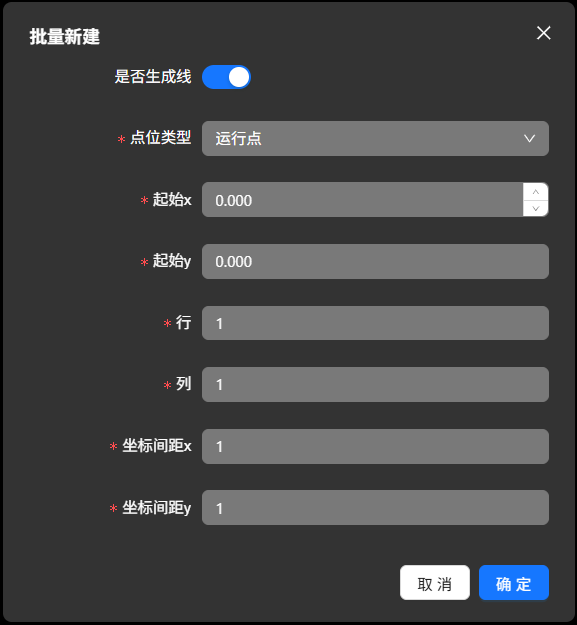{width="2.608338801399825in" height="2.825323709536308in"}

4.  确认配置后执行生成，完成批量画点。

现场常用说明：

建议先通过【采点】生成一个基准点，用于确认坐标方向与布局参考。

批量生成时若提示"点位已存在"，通常是起始点坐标与现有点位重合；可将起始点坐标按点间距做一个偏移后重新生成。

## **5.6 绘制直线路线**

步骤：

1.  在地图绘制界面左侧功能栏点击【新建直线】进入画线模式。

2.  鼠标左键点击直线起点（已有点位）。

3.  移动鼠标至目标位置，确认距离/角度后左键点击终点，生成直线。

4.  如需连续绘制多条直线，重复"点击起点→点击终点"的操作。

5.  右键或按 ESC 退出画线模式。

说明：

绘制直线前需已存在点位；直线用于连接点位形成基础路网。

## **5.7 绘制曲线路线**

步骤：

1.  先确定曲线起点与终点，并在两点之间绘制一段直角折线段（曲线需与该折线段相切）。

2.  在地图绘制界面左侧功能栏点击【新建曲线】进入画曲线模式。

3.  鼠标左键点击曲线起点，移动至终点后再次左键点击，生成曲线初始形态。

4.  按 Tab 键切换曲线相切对象，调整到与目标直线段相切的状态。

5.  按 Enter 确认，或通过鼠标左键双击/右键单击确认，完成单条曲线绘制。

6.  如需连续绘制多条曲线，重复上述操作；右键或按 ESC 退出。

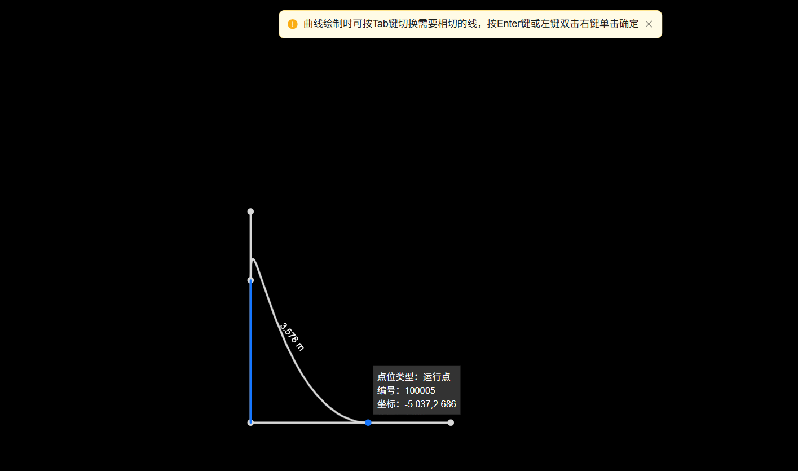{width="5.772222222222222in" height="3.4062226596675416in"}

7.  曲线调整，右键点击曲线，点击调整曲线，可以选择调整点或者调整曲率来对曲线进行调整。示意如下，绿色线代表调整预览。

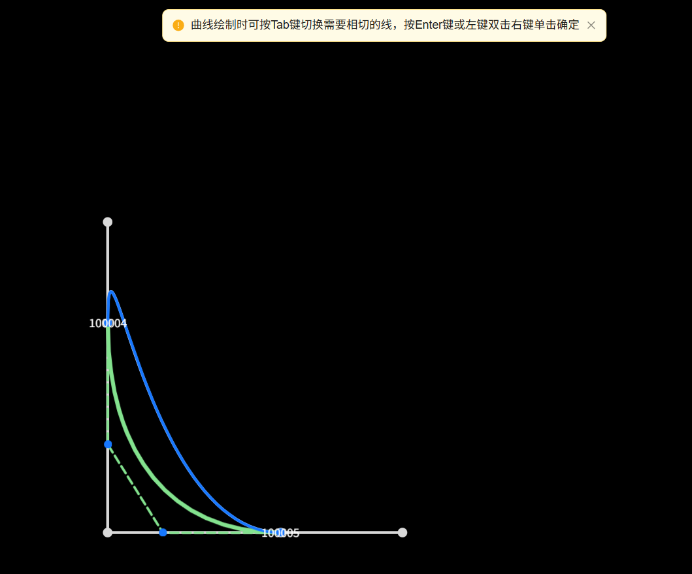{width="4.0875in" height="2.8982884951881016in"}

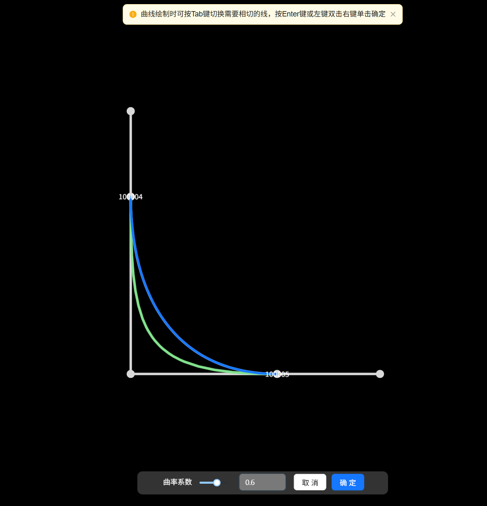{width="3.8645833333333335in" height="3.2335673665791775in"}

补充说明（按页面支持情况）：

- 若在直线上点击作为曲线终点，系统会自动在直线上生成点并分割直线

## **5.8 批量编辑点与线**

步骤：

1.  在地图编辑中按住 Ctrl 并用鼠标左键框选需要处理的点/线（密集区域建议使用框选模式）。

2.  框选完成后右键打开批量处理菜单。

3.  根据需要选择常用批量操作（以页面实际菜单为准），例如：

- 删除点 / 删除线（注意框选方向可能影响删除线范围）

- 批量编辑点 / 批量编辑线（右侧弹出属性编辑面板）

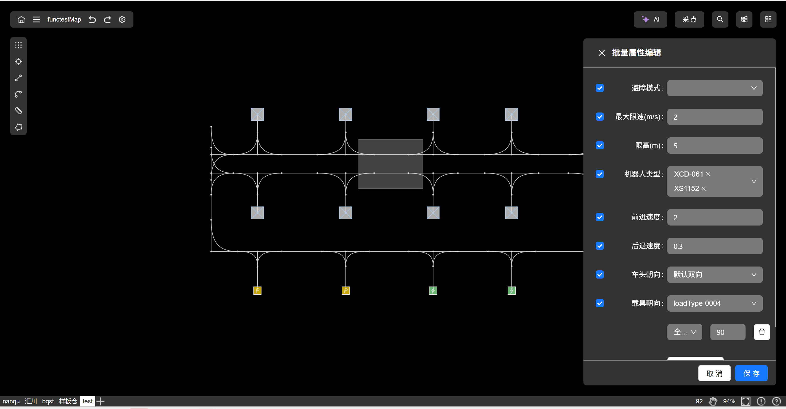{width="5.760416666666667in" height="2.995641951006124in"}

- 设置为（批量设置点位类型）

- 移动位置 / 复制移动

- 多点对齐

- 车头朝向

- 设置库位前置点

- 等距插点连线

说明：

批量操作适用于密集库位区域的快速编辑与对齐、批量设置属性等高频场景。

## **5.9 配置点位属性**

步骤：

1.  在地图上选中目标点位（运行点或功能点）。

2.  在点位属性面板中按需配置字段并保存（以页面字段为准）。

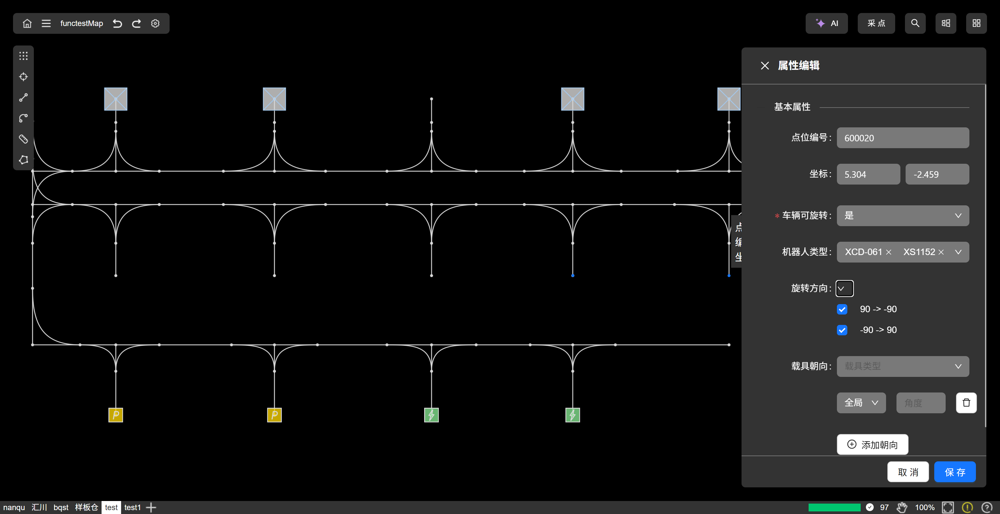{width="5.772222222222222in" height="2.972544838145232in"}

常见配置项说明：

- 运行点：

  - 坐标（可编辑，用于微调点位位置）

  - 车辆可旋转（是否允许车辆在该点旋转）

  - 机器人类型（允许进入该点的车型范围）

  - 载具朝向（需先关联载具类型后按需配置）

- 库位点：

  - 库位编号（可使用系统生成编号，或选择库位管理中已有库位编号）

  - 库位前置点（通常通过"框选右键设置前置点"生成与绑定）

- 外设点位（门/电梯/输送线）：

  - 外设编号（需外设管理中已有对应外设数据）

  - 相关提前/等待/延后点位参数（若版本支持）

- 充电桩点位：

  - 长/宽、角度

  - 可充机器人组（或可充车型范围，按版本字段为准）

- 休息点：

  - 可用机器人组（按版本字段为准）

## **5.10 配置线路属性**

步骤：

1.  在地图中选中一条或多条线路（直线/曲线）。

2.  右键选择【编辑线】（或选中后在右侧属性面板编辑，按页面实际入口）。

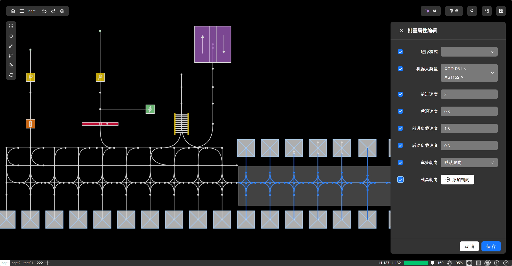{width="5.772222222222222in" height="3.005599300087489in"}

3.  在属性编辑面板中按需配置并保存（字段以页面显示为准），常用包括：

- 避障模式：配置车辆在线路上的避障模式（支持按车型配置时，需在对应车型列设置）

- 速度相关：最大限速、前进速度/后退速度（空载）、前进负载速度/后退负载速度（满载）

- 限高：线路通行高度限制（如版本支持）

- 机器人类型：允许通行该线路的车型范围

- 车头朝向：配置车辆在该线路的行驶朝向（如需要倒车进入等场景）

4.  若需批量配置，建议 Ctrl 框选多条线路后再执行【编辑线】统一修改。

说明：

多车型线路场景下，可先在右上角勾选车型用于辅助显示（仅辅助选线，不影响配置），再对目标线路批量编辑。

## **5.11 配置地图全局设置**

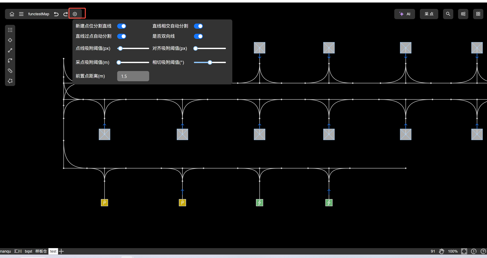{width="5.760416666666667in" height="3.063649387576553in"}

入口：地图编辑界面顶部工具栏【设置】（全局设置）。

常用设置项（以页面字段为准）：

- 直线分割规则：如"新建点位分割直线""直线相交自动分割""直线过点自动分割"

- 是否双向线：新绘制线路默认是否双向

- 点线吸附阈值 / 对齐吸附阈值：用于辅助选中与对齐

- 采点吸附阈值 / 相切吸附阈值：用于采点高亮与曲线相切吸附

- 前置点距离（m）：设置库位前置点生成的默认距离（生成/批量设置前置点前建议先确认该值）

说明：

- 全局设置会影响后续绘图与批量操作效果，建议在开始大规模绘制前先确认关键项（尤其是前置点距离、是否双向线）

## **5.12 生成库位前置点**

**前置点**是库位前方的专用点位，主要用于叉车进入库位作业前进行对位、货叉调整等准备工作。同时，自研车辆会将该点位作为识别点使用，车辆到达前置点后开启识别功能，因此该点位也可称为识别点。

**方式一：框选库位批量设置**

1.  在全局设置中确认【前置点距离（m）】。

2.  按住 Ctrl 框选需要设置前置点的库位点。

3.  右键选择【设置库位前置点】（或【前置点设置】），选择方向并确认。

4.  设置完成后，选中库位点检查库位前置点是否已正确绑定。

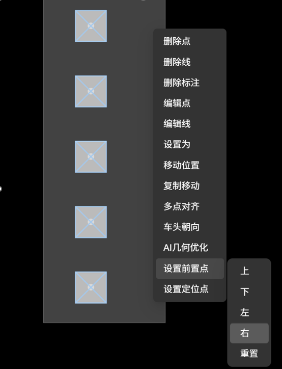{width="2.13616469816273in" height="2.7916666666666665in"}

**方式二：AI 几何优化自动生成（含路线+前置点）**

1.  同时框选目标库位点以及经过库位的主干直线。

2.  右键选择【AI 几何优化】→【库位点连接】。

3.  系统自动生成库位分支路线并生成前置点；如效果不理想，可调整曲率参数、曲率半径、前置点距离等配置项后重新生成（如果所配置车型为不支持曲线车型，如自研XQC，需要直进库位，将曲率和半径设为0即可）。

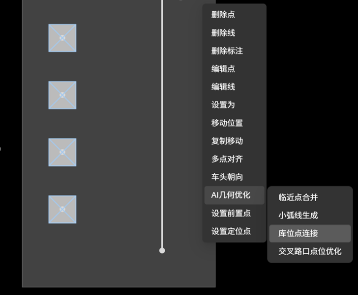{width="3.210797244094488in" height="2.6506714785651795in"} 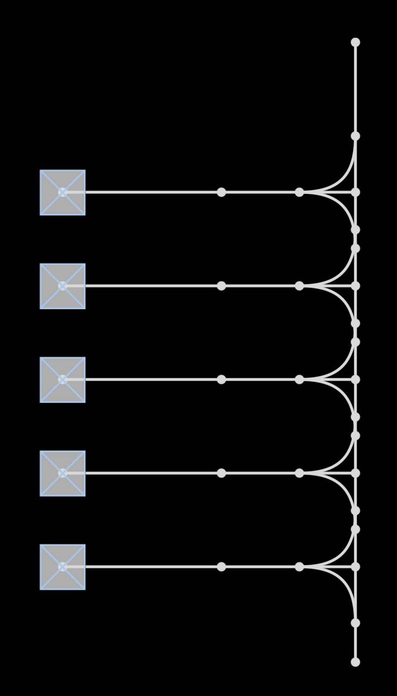{width="1.5168121172353455in" height="2.651855861767279in"}

说明：

- 前置点与库位中心点之间存在距离限制（按车型不同），设置后建议结合监控/任务验证确认效果

## **5.13 执行地图生效**

点击【发布】，按照先后顺序执行保存、预处理、应用操作，执行一键发布操作后，页面loading，不能执行其他操作。

> 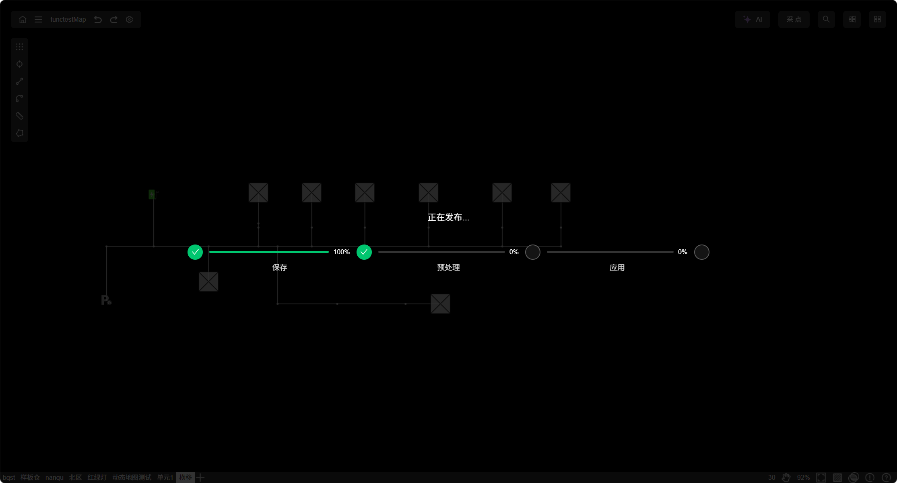{width="5.538888888888889in" height="2.9893602362204725in"}

说明：

- 应用地图后，运行监控会加载该地图；地图中关联功能点（库位、充电桩、休息点、外设等）会自动生成/同步展示

注意：

- 刷新/应用地图前，建议确保车辆处于安全状态（如不在执行任务；必要时切手动模式），避免运行中切图带来风险

## **5.14 处理预处理告警**

告警定位：预处理/校验弹出告警列表后，点击告警条目通常可定位到地图具体位置。

常见致命告警（需处理，否则预处理失败）：

- 存在孤点（点位未连线或形成孤立点集）

- 地图非强连通（存在明显分割区域、路线不连通等）

- 点/线重复或编号重复

- 点缺少坐标等基础数据异常

- 部分点位不可旋转导致路线不可达（常见于拐角/关键点属性配置不当）

处理建议（通用）：

- 优先处理点位少的孤立点集与明显断开的区域

- 检查线路可通行车型配置是否导致某些车型无法连通

- 检查关键点"车辆可旋转"等属性是否限制了连通性

- 修复后重新执行【发布】生效

## **5.15 AI绘制地图**

说明：AI 绘图需先完成区域标注（矩形/多边形），再配置区域属性生成路网。通常可先导入 SLAM 背景图，按扫图布局进行 AI 绘制。

步骤：

1.  进入区域标注模式：在左侧工具栏选择【标注】→【矩形】或【多边形】，在地图上框出需要生成的区域。

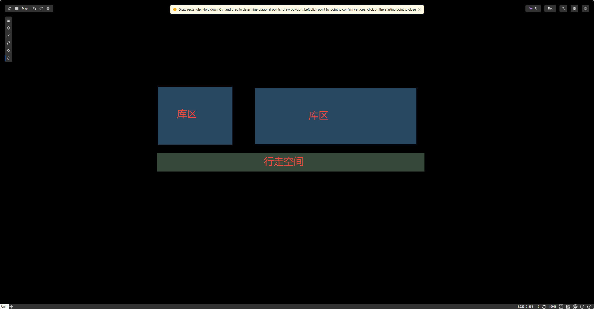{width="5.772222222222222in" height="3.005599300087489in"}

2.  配置区域属性（以页面字段为准）：

- 类型：

  - 库区：自动加载库位相关配置，可设置库位尺寸、库位前置点距离；叉车场景通常还需配置入库前曲线的转弯半径

  - 行走空间：用于生成道路（主干路）；可配置主干道之间的道路间距，以及区域内主干道数量等

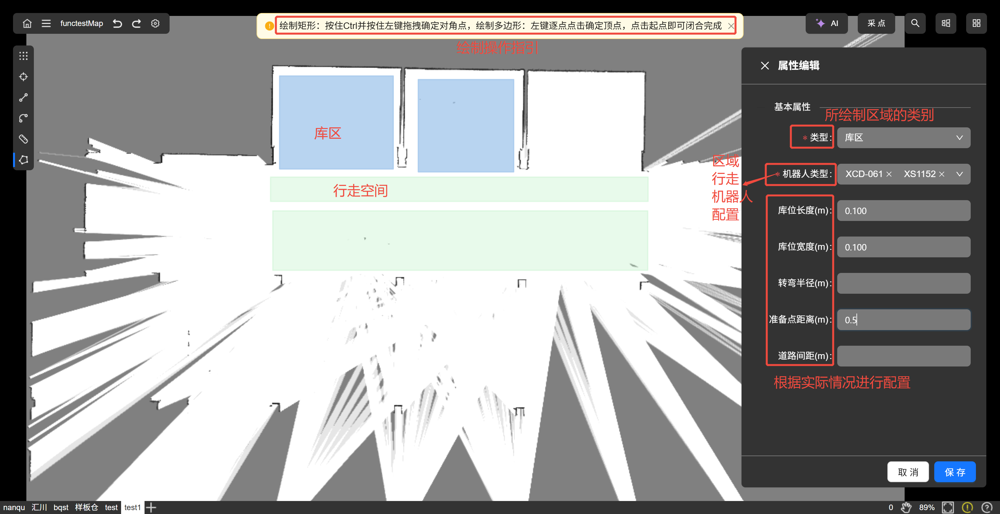{width="5.772222222222222in" height="2.9725437445319334in"}

- 机器人类型：配置该区域允许行走的机器人类型（仅指定类型可在该区域通行）

3.  生成 AI 地图：完成区域与属性配置后，点击右上角【AI】按钮生成地图。

4.  生成后检查：确认点线生成效果符合现场布局需求，必要时再做人工补线/属性调整。

# **6 库位配置与生效**

## **6.1 配置前准备**

**目的：**

确保库位基础数据已由系统生成，并且库位与地图点位、前置点等关系具备可配置前提；避免在库位管理里"找不到库位/数据为空/改了不生效"。

**前提：**

- 已完成地图的基础绘制：至少包含路网与库位点位（库位点位可先用默认参数）

- 当前地图对应的机器人类型已配置完成（影响后续路线与可视化层的展示与校验）

操作步骤：

1.  完成地图生效

- 进入【地图】→打开目标地图的【地图编辑】页面

- 【发布】成功

2.  确认监控已加载地图

- 进入【监控】页面，确认当前地图已加载显示

- 若未加载到目标地图：先在监控界面切换到对应地图/区域（以页面实际入口为准）

3.  确认库位管理已生成基础库位数据

- 进入【库位】→【库位管理】

- 在库位管理中选择目标地图，确认列表中已出现库位数据

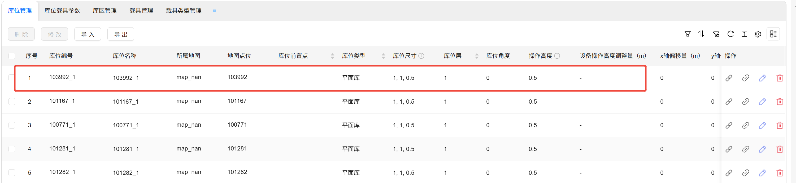{width="5.772222222222222in" height="1.3310159667541557in"}

4.  核对库位编号与地图点位编号的默认规则

- 核对自动生成的库位编号是否符合当前版本规则（常见两种）：

  - 库位编号默认与点位编号一致；或

  - 库位编号默认带层后缀，例如 点位编号_1（表示第 1 层）。

- 同时核对字段：库位对应地图点位、库位前置点、库位尺寸（常见默认值 0/0.5，视版本而定）

**说明：**

- 地图编辑主要负责"画库位 + 绑定库位前置点关系"，库位数据本身在"应用地图后"由【库位管理】自动生成

- 若库位列表为空，优先检查：是否忘记【应用】地图、监控是否加载到目标地图、当前地图是否真的绘制了库位点位（点位类型需为"库位"）

## **6.2 基础库位参数配置**

**入口：**

- 【库位】→【库位管理】

**A. 单个库位编辑（适合少量调整/现场快速改一两个库位）**

步骤

1.  进入【库位管理】，选择目标地图。

2.  在库位列表中找到目标库位（可用库位编号/地图点位筛选）。

3.  点击该行的【修改/编辑】（或行内编辑图标，具体以页面为准）。

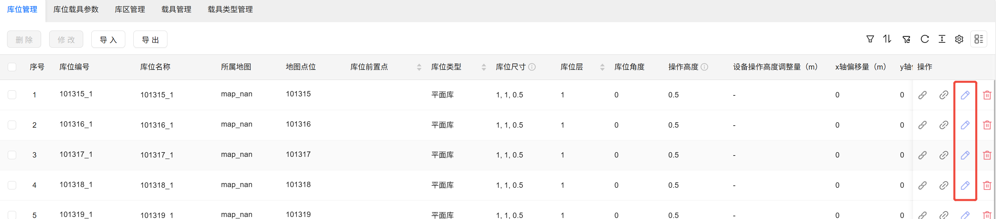{width="5.772222222222222in" height="1.2675951443569553in"}

4.  按需修改字段（常见必改项见下方"参数说明"）。

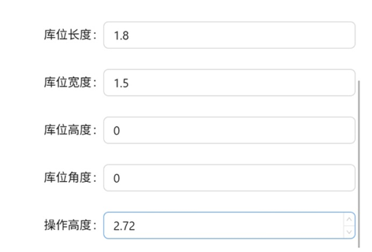{width="2.5778641732283463in" height="1.7477055993000874in"}

5.  点击【保存/确定】完成单个库位更新。

适用场景：

- 现场临时修正某个库位尺寸/角度/高度

- 验收时发现单点靠库动作需要微调

- 不方便导出 Excel 的情况下快速修正

**B. 库位可视化编辑（适合大批量库位/某个区域内的库位）**

步骤（单层库位）

1.  进入【库位管理】，右上角切换库位可视化模式。

2.  切换到目标地图，框选要批量修改的库位，右键选择【编辑库位】

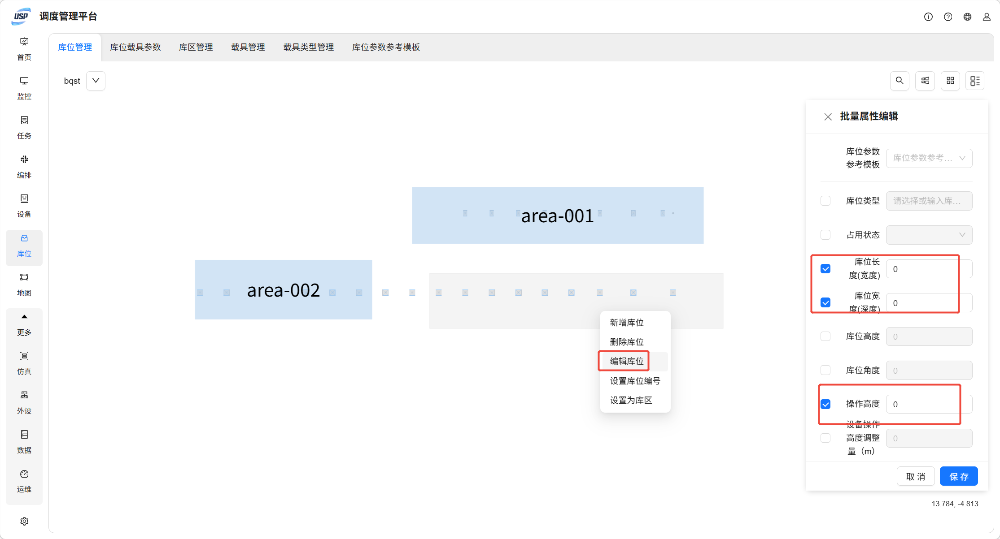{width="5.772222222222222in" height="3.115290901137358in"}

3.  批量属性编辑弹框中，勾选要修改的字段，进行修改即可（常见必改项见下方"参数说明"）。

步骤（多层库位）

若要修改多层库位的某个字段，如操作高度这种每层需要配置不同的字段。首先需要在右上角图层中选择需要修改的图层，然后再使用修改单层库位的方式，框选，右键，编辑库位。

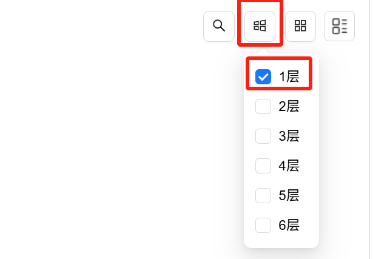{width="2.396563867016623in" height="1.6639555993000874in"}

C. Excel 批量导入导出

步骤：

1.  进入【库位管理】，选择目标地图。

2.  点击【导出】生成系统自动生成的库位 Excel。

3.  打开 Excel 按业务需求批量编辑参数（编辑规则见下方）。

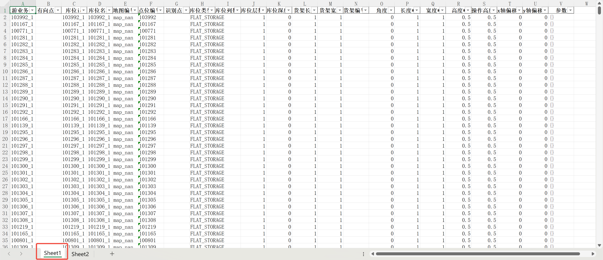{width="5.772222222222222in" height="2.4982895888014in"}

4.  保存 Excel 后回到【库位管理】，点击【导入】上传该 Excel。

5.  导入成功后，抽查 3\~5 条库位记录确认字段更新生效。

适用场景

- 首次上线后需要批量补齐业务编号、尺寸、操作高度等

- 多层库位/一层货架多库位等需要在 sheet2 配置的场景

- 需要统一修改一批库位参数（例如全区尺寸、角度、识别开关）

**参数说明（通用必读）：**

1\) 业务编号

- 用途：用于上游系统按业务编号下发任务、或做库位匹配

- 填写规则：按上层业务（WMS/WES）命名规则填写，保持唯一且稳定

2\) 库位长度 / 库位宽度

- 用途：算法依据尺寸计算库位需求、规划作业路径与作业姿态

- 填写规则：按库位真实尺寸填写（单位以系统字段说明为准，通常为米）

自研口径换算

- USP 库位长度 = 自研库位宽度

- USP 库位宽度 = 自研库位深度

提示：库位尺寸与机器人类型尺寸共同影响锁区、通行与靠库效果；尺寸改动后通常需要走"生效闭环"（见7.1.7）。

3\) 操作高度（叉车/堆垛车场景必配）

- 用途：用于货叉动作执行的高度基础（取/放货高度）

- 填写规则：填写现场实际取放货的抬升高度；多层库位时每层高度需分别配置

**特殊配置说明：**

1\) 库位类型

- 要求：按中文名称对应的英文字符填写到 Excel 中（不通过界面下拉选择）

- 来源：参考老调度 type 类型映射关系

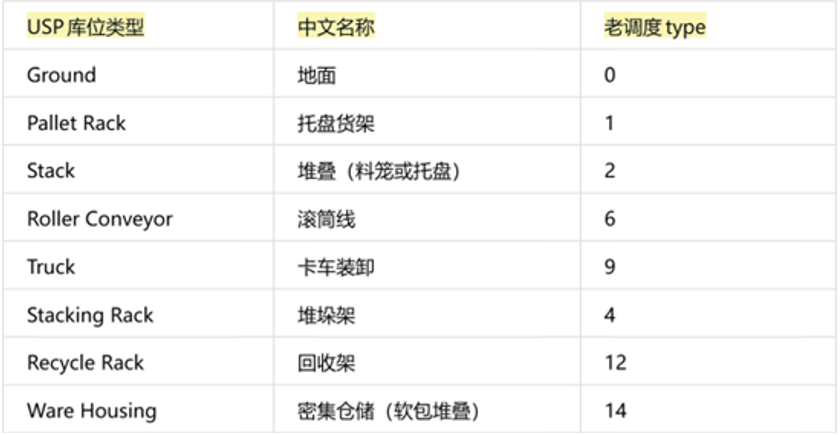{width="3.053472222222222in" height="1.5812620297462816in"}

- 注意：库位类型填错可能导致任务动作/识别逻辑走错口径

2\) 识别参数

- 能力：支持按库位维度单独配置；未填写字段将使用系统默认值

- 库位编辑/库位可视化批量编辑中，勾选识别参数，点击配置，弹出取货/放货参数配置弹框，可对相关参数进行配置，保存

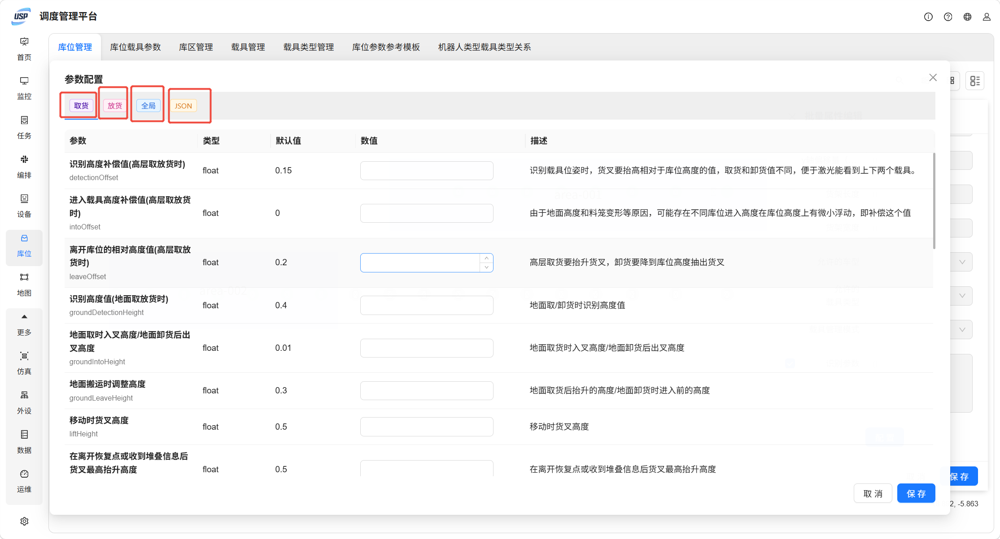{width="5.772222222222222in" height="3.115290901137358in"}

- 如上识别参数配置，可单独配置取货/放货参数，或者全局配置（同时作用于取货和放货），或者直接使用JSON格式配置，配置后显示如下格式，未配置的参数保持默认值。建议：识别参数与车型能力、货架/载具形态强相关；若现场未明确标定方案，优先保持默认或按方案/车端建议填写

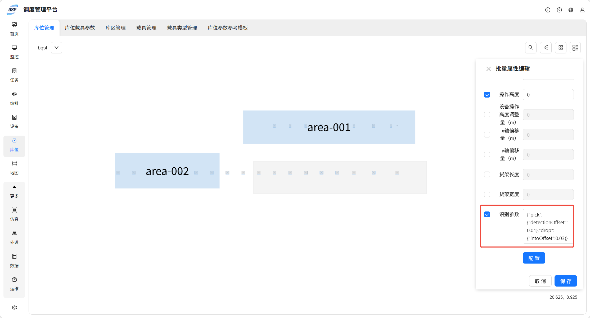{width="5.772222222222222in" height="3.115290901137358in"}

3)  库位业务编号

- 用途：用于上游系统按业务编号下发任务、或做库位匹配

- 库位业务编号批量设置

  - 切换库位可视化模式，批量框选库位，右键选择【设置库位编号】，可按照输入规则批量生成库位编号

> 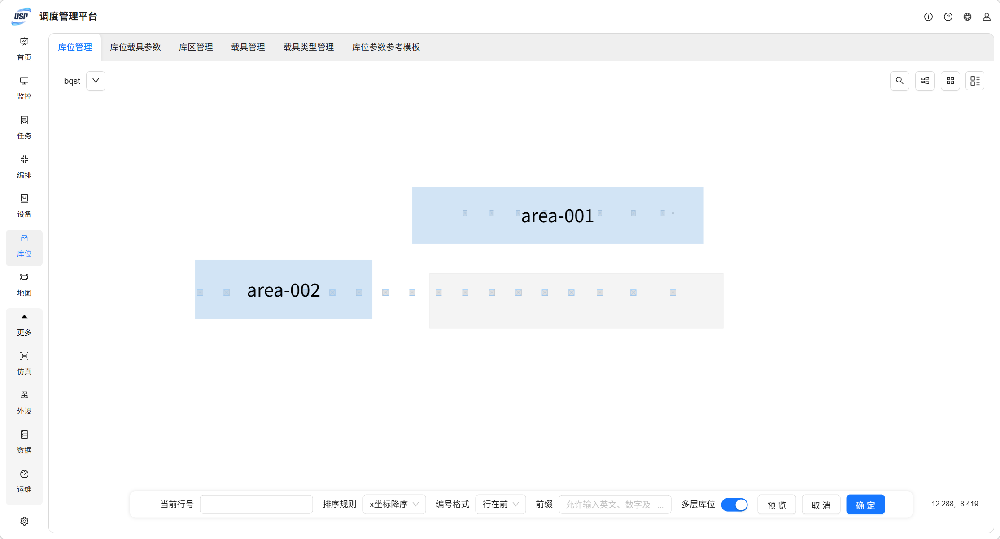{width="5.205555555555556in" height="2.809458661417323in"}

- Excel导入方式：Excel文件中批量修改库位编号，然后再导入

4)  库位角度

- 用途：用于地图显示方向与现场一致，也可能影响靠库姿态相关逻辑。

- 常用约定：0° 表示横向，90° 表示竖向

4\) 一层货架多库位（sheet2）

- 规则：货架长宽及相关参数在 sheet2 配置；sheet1 不重复填写。

- 场景：同一层货架存在多个库位，需要按货架维度维护公共参数。

生效操作：

1.  完成库位参数修改（单个编辑或 Excel 导入）后，返回【地图编辑】界面，点击【刷新】使库位参数同步到地图。

2.  执行地图生效：保存 → 预处理 → 应用，使库位参数正式下发并生效。

检查点：

- 【监控】中库位显示/锁区大小与修改后的尺寸一致（如页面会展示）

- 下发靠库/搬运任务时，车辆行为与配置口径一致（高度、识别开关等）

## **6.3 盲取配置**

方式一：库位载具参数页面，批量修改

步骤：

1.  在【库位载具参数】页面，通过筛选方式筛选出需要修改的地图，勾选数据，点击【修改】按钮，弹出批量修改弹框

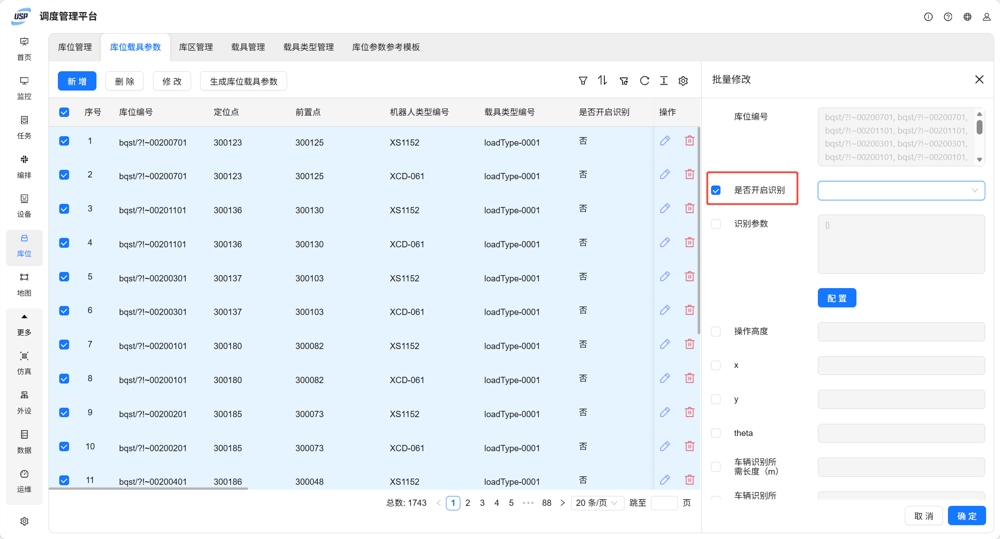{width="5.772222222222222in" height="3.115290901137358in"}

2.  勾选【是否开启识别】参数，从下拉列表中勾选数据进行配置即可

3.  抽查 1\~3 个库位，确认"是否开启识别"字段已按预期更新。

方式二：Excel导出导入

步骤：

1.  在【库位管理】选择目标地图，点击【导出】导出库位 Excel。

2.  打开导出的 Excel，切换到第二个 sheet（通常为库位扩展参数/识别相关配置）。

3.  找到字段 "是否开启识别"：

    - 需要盲取/盲放时，将该字段设置为 关闭识别（填"false"）

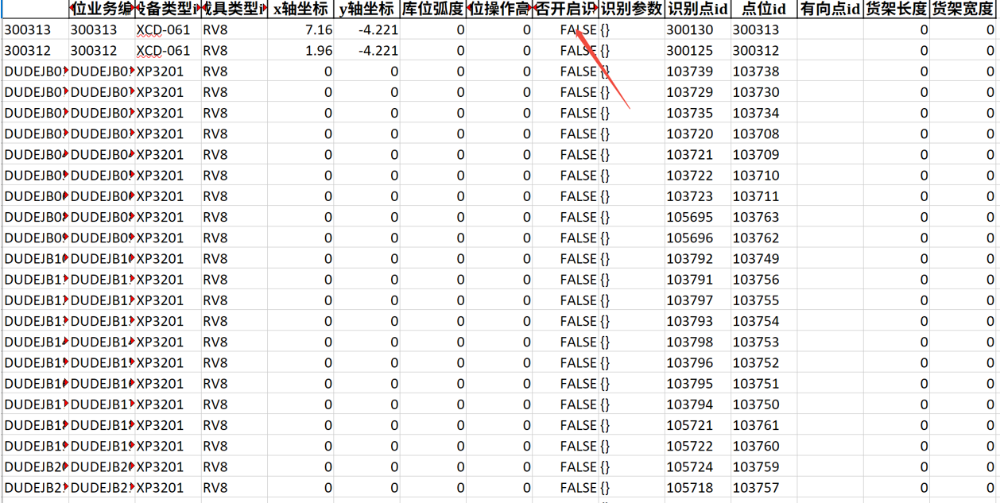{width="5.772222222222222in" height="2.904465223097113in"}

4.  保存 Excel 后回到【库位管理】，点击【导入】上传该 Excel 覆盖生效。

5.  抽查 1\~3 个库位，确认"是否开启识别"字段已按预期更新。

生效操作：

- 运行监控页面，右上角更多点击【重启算法】同步库位参数

说明：

- 盲取本质是关闭识别链路，车辆仍会执行取/放货动作，但不会走识别对位逻辑（具体表现与车型/车端实现有关）

- 如果现场仅希望"某一类车/某一层"盲取，建议先在 Excel 中只修改目标库位行，避免全量关闭造成误配置

## **6.4 库区避障配置**

**目的：**

在库位作业区域（分支路、接驳位等）使用"库区避障"策略，避免出现库区内碰撞风险、绕行异常或任务报错（如 invalid order / AdaptedOrderError 等与库区避障相关的问题）。

**入口：**

进入【地图】→打开目标地图的【地图编辑】页面。

**步骤：**

1.  识别需要设置为库区分支的线段

- 按现场路径判断以下线段通常属于库区分支：从主干道进入库位作业区域的分支线段

- 到库位/接驳位的最后一段（含原地自旋/曲线倒车进入库位的路段）

- 主干道上延伸到接驳位的线段

2.  框选目标线段

- 按住 Ctrl 键框选所有分支线段

- 框选方向建议从左往右

{width="5.157638888888889in" height="3.9404166666666667in"}

3.  批量设置避障模式为"库区避障"

- 右键打开批量菜单，选择【编辑线】

- 在属性编辑面板中，将避障模式设置为：库区避障

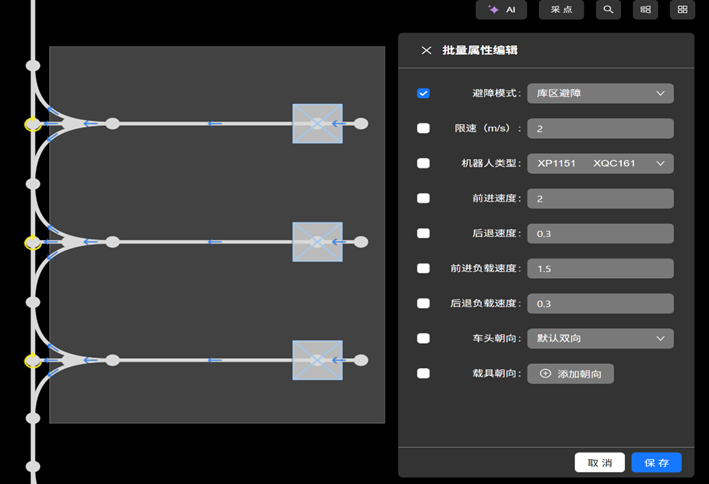{width="4.970138888888889in" height="3.9404166666666667in"}

- 保存配置。

4.  执行地图生效

- 完成设置后执行：保存 → 预处理 → 应用，使避障配置正式下发并生效

说明：

- 关于接驳位（主干道延伸）框选数量差异：

  - v2.0.3 及以上版本：可只框选 1 条线

  - 低版本：需要至少框选 2 条线 才能正确生效

- 验证建议：

  - 任务路径经过库区分支时，车辆在库区内的避障行为符合预期；

  - 若此前出现 invalid order / AdaptedOrderError 等库区相关异常，配置库区避障后应明显减少或消失

## **6.5 多层库位配置**

目的：

适配高架货架、多层存储等场景，使同一库位位置支持多层取放货；并为每一层配置对应的操作高度与必要参数，保证车辆能按层正确执行作业。

前提：

- 目标地图已完成绘制并已应用（保存→预处理→应用）。

- 已完成基础库位数据生成（见 7.1.1）。

- 现场已确认多层货架的层数范围与高度。

操作步骤：

1.  新增多层库位

- 在【库位管理】页面，切换库位可视化模式，框选需要配置多层的库位，右键选择【新增库位】

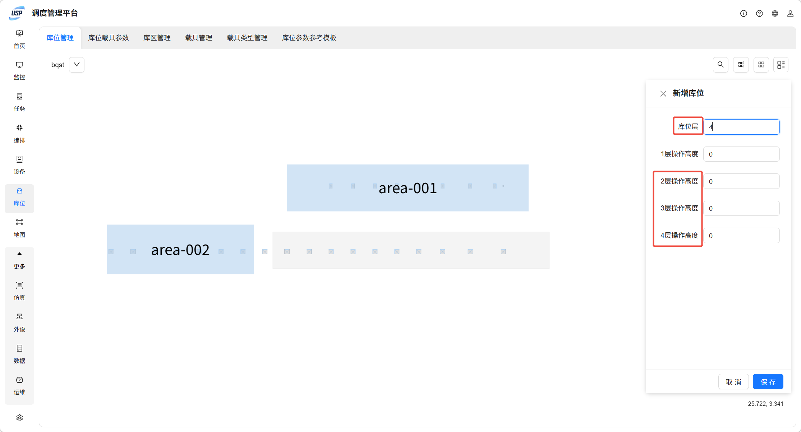{width="5.772222222222222in" height="3.115290901137358in"}

- 配置层数及每层的操作高度（批量的设置）

2.  配置库位基础尺寸（长/宽）

- 在【库位管理】或可视化库位配置中，为该库位（或该组多层库位）配置库位长宽

4.  微调每一层的操作高度

- 设置多层库位时的操作高度是统一配置，若某个库位某层的操作高度有稍许偏差，需单独另外修改"操作高度"（取放货抬升高度）

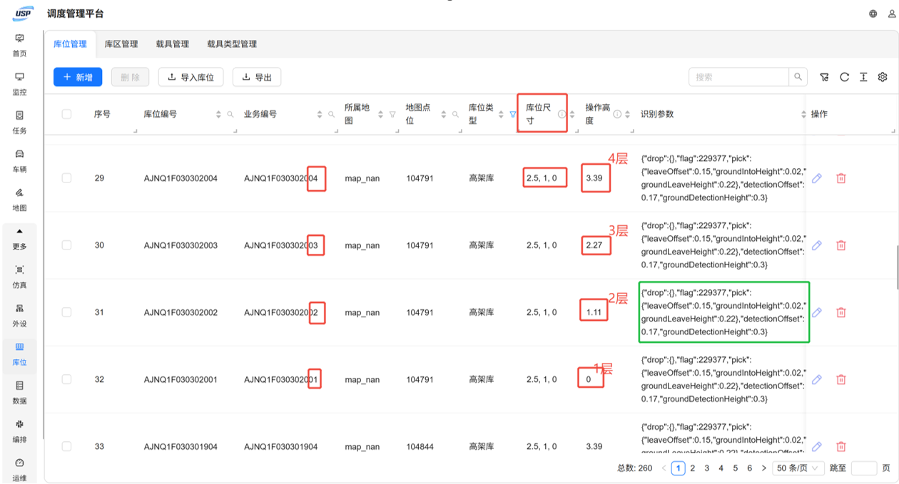{width="5.772222222222222in" height="3.110586176727909in"}

- 初次可按现场测量/预估值填写；后续可结合真实取放货任务中读取到的货叉实际抬升高度进行修正

<!-- -->

- 多层库位适用于高架货架搬运场景；建议同时规划好通行道路、库位前置点以及必要的休息点/充电桩，便于完整业务闭环

- 若版本支持"按层图层显示"，可通过右上角图层仅勾选某一层后进行框选编辑，避免误改其他层（以页面实际功能为准）

- 库位识别参数如无明确方案，可先保持默认；需要定制时再按 7.1.2 的"识别参数 JSON 规则"配置

## **6.6 可视化库位配置**

**入口：**

进入【库位】→【库位管理】→切换到"可视化库位参数配置"视图（页面内的库位可视化区域）。

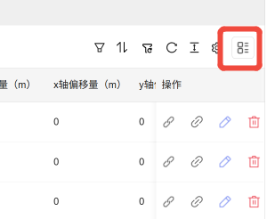{width="3.125in" height="2.5625in"}

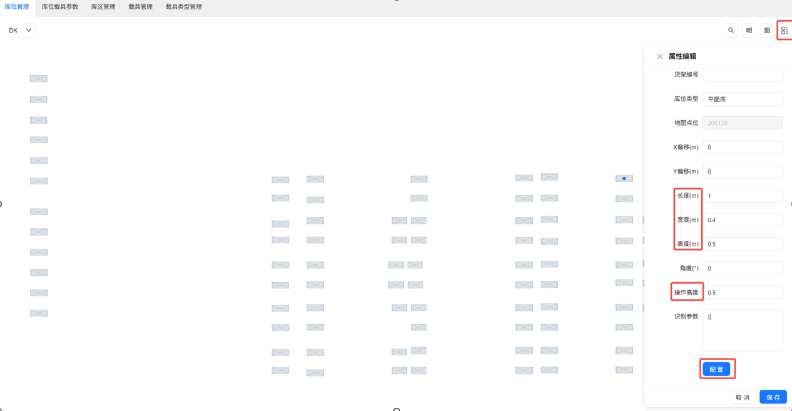{width="5.772222222222222in" height="2.997904636920385in"}

操作要点：

1.  在可视化区域中点击目标库位或ctrl+左键批量框选，打开库位参数编辑面板。

2.  修改库位基础参数并保存。

3.  如需配置取货/放货相关的高级参数，点击【配置】进入参数配置页，按现场方案要求修改并保存。

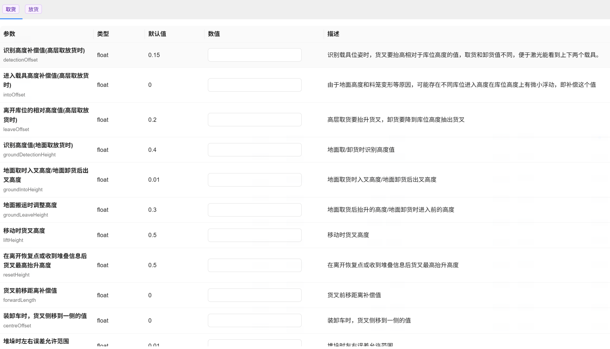{width="5.772222222222222in" height="3.3043383639545056in"}

说明：

- 高级参数字段含义与默认值以页面说明为准，或参照[《附录B：库位取放货参数字典》](#书签98：附录B库位取放货)

## **6.7 配置库区**

入口：进入【库位】→【库区管理】。

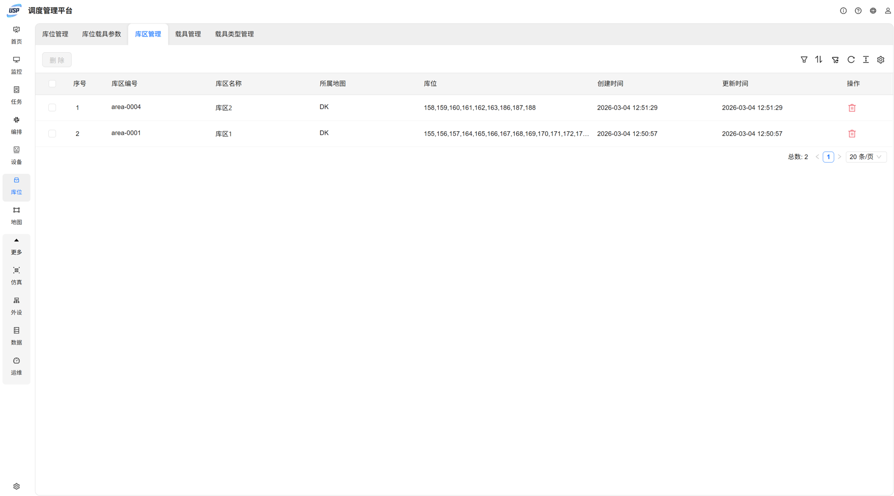{width="5.772222222222222in" height="3.209044181977253in"}

用途：

- 对库区进行维护与划分，用于库位组织、业务范围管理或与任务/模拟器的库区选择联动（按项目使用方式为准）。

操作要点：

- 在页面中新增/编辑库区信息，并维护库区与库位的关联关系（字段与入口以页面实际为准）。

# **7 载具类型配置**

## **7.1 配置载具类型**

目的：

建立或更新载具类型数据，为识别类业务与搬运参数匹配提供基础配置。

入口：

- 进入【载具类型配置】页面：【库位】→【载具类型配置】

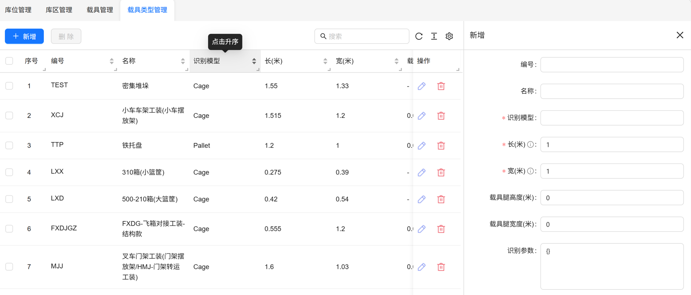{width="5.772222222222222in" height="2.4656408573928257in"}

步骤：

1.  进入载具类型配置页面。

2.  根据现场需求选择：

- 新增载具类型：用于新增现场未覆盖的载具类型

- 编辑载具类型：用于更新已有载具类型配置

3.  配置并保存以下关键参数：

- 识别模型：按实际载具类型选择对应模型类别；需与现场实际载具保持一致（模型类别按配套映射表执行）

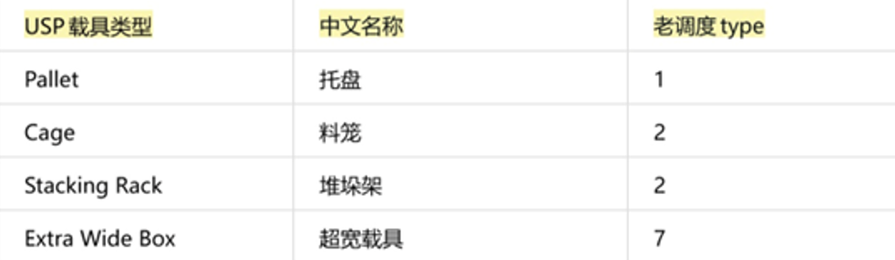{width="4.490972222222222in" height="1.3071030183727035in"}

- 长宽配置：填写载具实际长宽尺寸

4.  点击保存后生效。

结果检查：

- 在载具类型列表中能看到新增/更新记录

- 识别模型与长宽字段已按预期填写并保存成功

## **7.2 生成库位载具参数（可选）**

使用场景与目的：

当现场面临的场景包括：接驳场景，多车多点位，货架多点位等才需要生成库位载具参数。

在库位相关配置完成后，生成/同步"库位载具参数"数据，使调度侧能够基于库位与载具类型组合使用对应参数（以系统实际生效逻辑为准）。入口

**进入：**

【库位】→【库位载具参数】

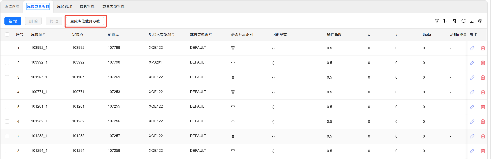{width="5.772222222222222in" height="1.8789227909011375in"}

**步骤：**

1.  打开【库位载具参数】页面。

2.  点击页面顶部按钮 【生成库位载具参数】（如图所示红框按钮）。

3.  等待生成完成后，列表会生成/更新对应数据行（按库位编号、机器人类型编号、载具类型编号等组合生成）。

4.  抽查几条数据确认生成正确：

    - 库位编号 / 定位点 / 前置点 是否符合地图与库位管理的配置

    - 机器人类型编号、载具类型编号 是否符合现场实际

    - 识别开关、识别参数、操作高度等字段是否按预期带出（字段以页面显示为准）

**说明：**

- 该操作相当于把库位相关配置"落到参数表"，后续如果你导出库位 Excel，库位载具维度的参数通常会体现到 sheet2（用于批量编辑后再导入回写）

- 当你修改了以下内容之一，建议重新点击一次【生成库位载具参数】以刷新结果：

  - 载具类型（识别模型/长宽）调整；

  - 库位参数（尺寸/操作高度/识别参数/多层配置等）调整；

  - 机器人类型（尺寸/偏移量等）调整。

- 若现场发现"库位管理里改了，但任务下发参数没变化"，优先检查是否已执行该按钮生成/刷新，以及是否存在旧数据未覆盖的情况。

# **8 偏移量配置（可选）**

## **8.1 偏移量的作用与生效范围**

偏移量用于在特定地图 + 特定车型 + 特定载具类型的组合下，对某一片库位区域（通常为接驳区）内的库位/点位坐标做统一修正（通过"区域最小点/最大点"定义一个矩形框，框内的库位会套用对应 dx/dy 偏移量，从而修正最终点位/目标点）。

适用场景举例：

- 同一地图里，不同车型/不同载具类型对"最终靠库点/定位点"存在系统性偏差，需要整体平移修正

- 现场某片库区整体坐标有偏差，但又不希望逐个库位手工改

## **8.2 导出偏移量模板确认字段口径**

实施建议先导出模板，避免手工新建列导致字段名不一致。

导出模板后，你会看到类似字段（以导出 Excel 为准）：

- 厂商

- 机器人类型编号（车类型）

- 载具类型编号（载具/货物类型）

- 地图编号

- 库位区域X_min / Y_min / X_max / Y_max（定义一个矩形区域：左下角与右上角）

- 偏移量 dx / dy（对该区域内库位/点位应用的偏移）

说明：

"厂商/车型/载具类型/地图编号"是用来确定"哪一类车、哪一类载具、在哪张地图上用"；后面的区域字段定义"作用范围"；dx/dy 用来修正最终点。

## **8.3 偏移量编辑导入**

**步骤：**

1.  在导出的 Excel 中，按现场需求补齐/新增一行偏移规则：

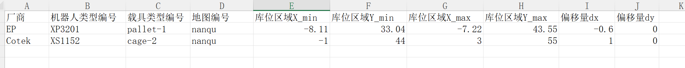{width="5.772222222222222in" height="0.5816327646544182in"}

- 填写：厂商、机器人类型编号、载具类型编号、地图编号

- 填写库位区域范围：X_min/Y_min/X_max/Y_max（构成矩形框）

- 填写偏移量 dx/dy（单位以系统坐标单位为准，通常与地图坐标一致）

2.  保存 Excel。

3.  将 Excel 通过平台"偏移量导入"功能导入系统。

4.  对需要验证的库位/点位，在现场进行一次任务或定位验证，确认偏移效果符合预期。

**示例：**

以下面地图上的库位为例，假设：需要将红色框区域内的库位需要配置Y轴正方向偏移0.3m。

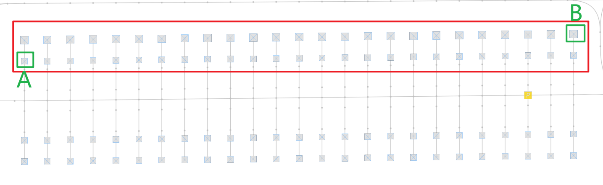{width="5.772222222222222in" height="1.7779254155730533in"}

- 选择该区域的左下角和右上角的库位（即图中的A、B库位），将库位坐标（X_min，Y_min）和（X_max，Y_max），将他们的坐标分别填入表格中的库位区域，偏移量dy设置为0.3

- 如果是沿Y轴负方向偏移0.3m，则偏移量dy设置为-0.3

- 如果是仅一排库位的区域，取头尾的两个库位即可

**注意点：**

- 区域是"矩形框"的定义方式：一定要确保 min/max 填写正确（X_min \< X_max、Y_min \< Y_max）

- 如果你发现"偏移不生效"，优先检查：地图编号、机器人类型编号、载具类型编号是否与系统内配置完全一致（包括大小写/连字符）

- 偏移量是"整体修正"，建议先用小范围矩形做试点验证，再扩大范围

# **9 任务下发**

## **9.1 下发移动任务**

**步骤：**

1.  进入【监控】界面。

2.  在监控地图中右键点击目标空闲点位，选择【快捷任务】。

{width="3.0208333333333335in" height="2.0729166666666665in"}

3.  选择需要执行移动任务的机器人，点击【发起任务】。

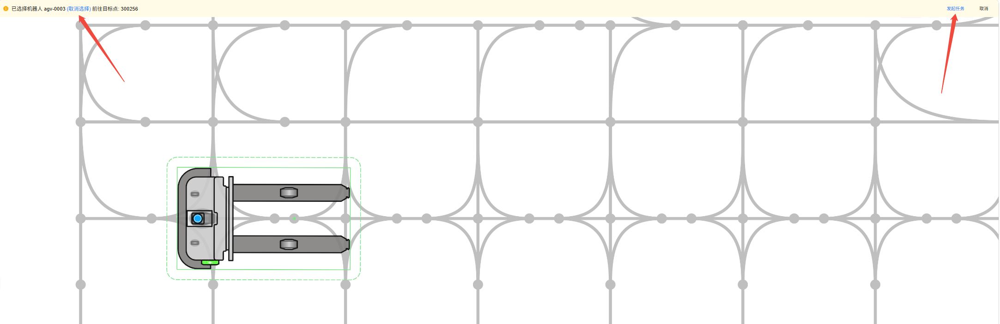{width="5.772222222222222in" height="1.8743055555555554in"}

4.  在运行监控确认执行：AGV 图标生成任务路径，并显示锁区；车辆开始向目标点移动。

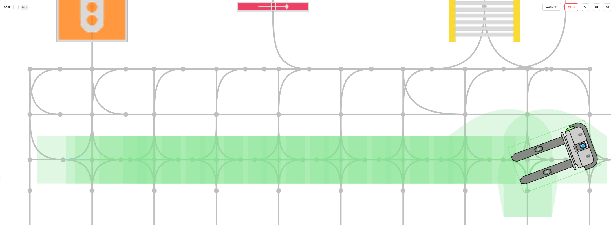{width="5.772222222222222in" height="2.1338068678915136in"}

**运行监控中的路径元素说明：**

点击正在执行移动任务的车辆后，可在地图上看到以下元素：

- 绿色阴影：锁区，表示车辆当前已占用或预占的运行区域

- 绿色路径：已释放路径，表示车辆当前可执行的路径段

- 蓝色路径：已规划未释放路径，表示已规划但暂未进入锁区的后续路径段

- 红色点：目标点，表示本次移动任务的目标位置

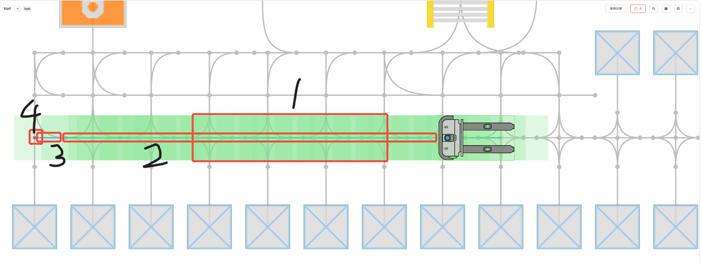{width="5.772222222222222in" height="2.16790791776028in"}

**车辆未移动时的初步判断方法：**

当车辆未按预期移动时，可点击对应车辆，查看地图中的路径和锁区信息：

- **若已显示绿色路径，且存在通往目标点的路线：**表示系统已生成可执行路径，通常可初步判断路径规划正常，需进一步排查其他原因。

- **若未显示绿色路径：**可检查路径规划、路径锁定或交通冲突等相关算法问题

说明：移动方向应符合线路车头朝向/倒车逻辑设定。

## **9.2 下发充电任务**

**步骤：**

在调度系统首页进入【任务】模块。

1.  点击【发起任务】。

2.  在下拉框中选择【充电任务】。

3.  选择需要执行任务的机器人编号和充电桩编号。

4.  确认信息无误后，点击【确认】完成任务发起。

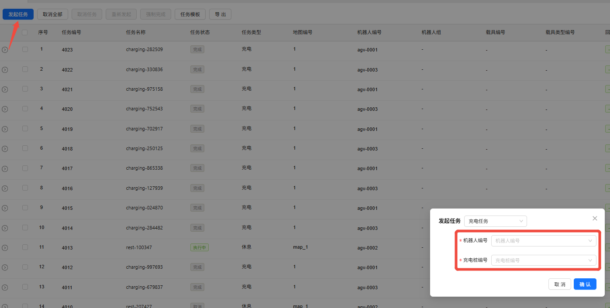{width="5.772222222222222in" height="2.9170997375328085in"}

说明：

监控界面车辆状态显示"充电中"（车体颜色变绿色）；现场充电桩绿灯亮起以设备指示为准。

{width="5.772222222222222in" height="3.005599300087489in"}

## **9.3 下发搬运任务**

**前置条件（带货叉动作时必需）：**

对应库位已配置库位操作高度（用于货叉动作的基础准备）。

**通用下发方式：**

方式一：上层接口下发（仓储接口）

- 上层调用仓储接口，传入库位业务编号，由调度系统生成并下发搬运任务。

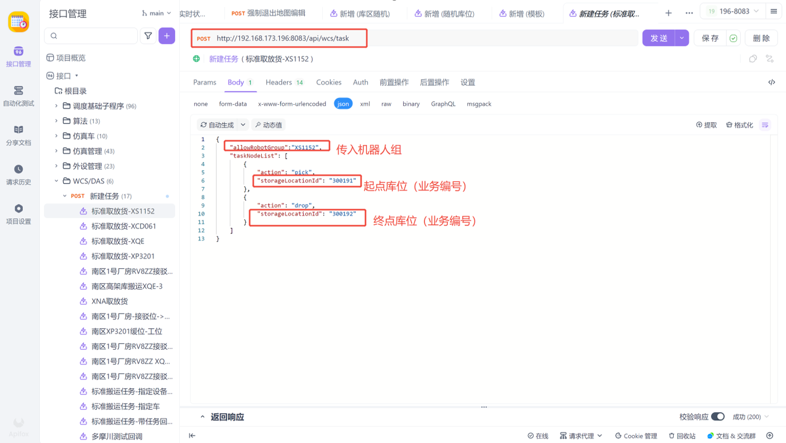{width="5.772222222222222in" height="3.257127077865267in"}

方式二：任务页面手动配置节点

1.  进入【任务】→【发起任务】。

2.  根据业务需要选择任务类型：

- 选择【标准任务】时，可配置的机器人动作包括：取货、放货；

- 选择【原子任务】时，可配置的机器人动作包括：取货、放货、货叉复位等。

3.  选择执行机器人编号，并填写相关任务信息。

4.  在【任务节点】区域新增并配置各节点的点位编号、目标角度、库位编号及机器人动作。

5.  配置完成后，点击【确认】下发任务。

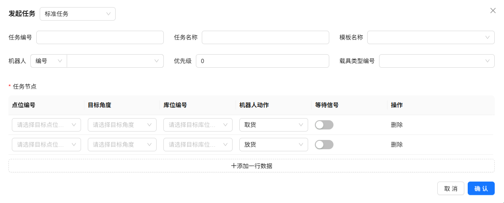{width="3.751388888888889in" height="1.5175207786526683in"}

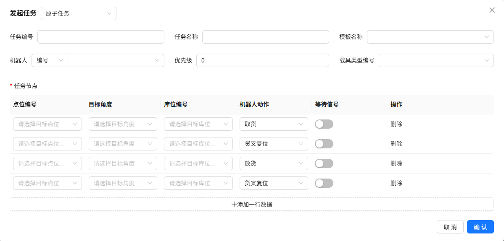{width="3.751388888888889in" height="1.7990398075240595in"}

方式三：流程管理发起订单（调度基础）

1.  进入【编排】→【流程管理】→【业务任务】。

2.  配置执行车辆、取货库位、放货库位后提交，直接生成任务；

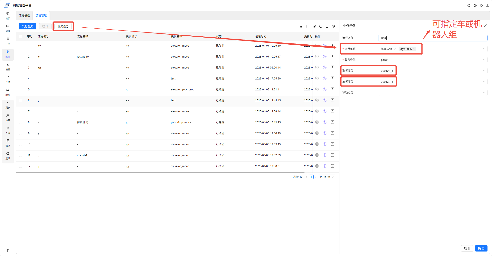{width="5.772222222222222in" height="3.005599300087489in"}

方式四：流程管理发起流程（选择模板）

1.  进入【编排】→【流程管理】→【发起任务】。

2.  （可选）新建流程模板，进入【编排】→【流程模板】→【新增】，**在画布中拖入并连接所需节点（需包含开始节点**和**结束节点）**。选中任务节点，在右侧可以配置节点参数。

**段编号**和**组编号**：段编号相同表示属于同一个任务单中的不同原子任务，段编号不同表示会生成多个任务单；组编号用于控制执行顺序，通常需前一组执行完成后，后一组才会执行。配置完成后点击【保存】。

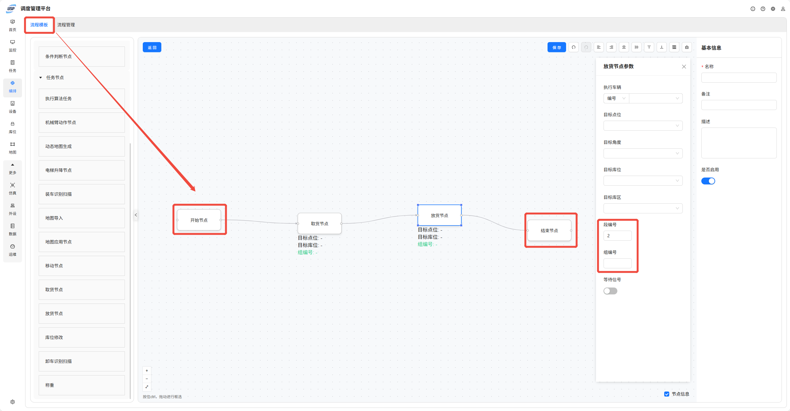{width="5.772222222222222in" height="3.005599300087489in"}

3.  选择流程模板（如 pick_drop-普通搬运）。

4.  配置执行车辆、取货节点参数、放货节点参数后提交，生成流程实例并生成对应调度基础任务。

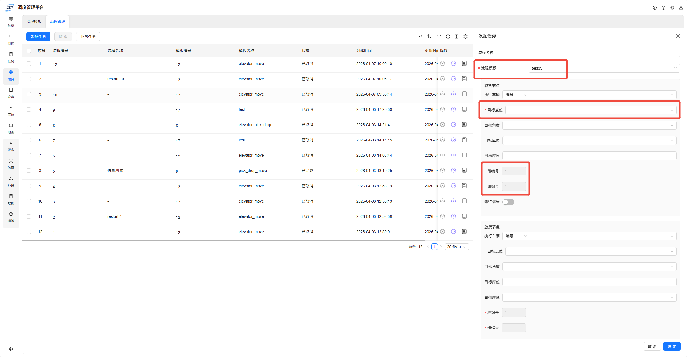{width="5.772222222222222in" height="3.005599300087489in"}

特殊说明（带货叉/不带货叉）：

- 带货叉动作：

  - 任务页面可在取/放货基础上增加货叉动作节点（示例：取货→货叉复位→放货→货叉复位）；

  - 使用业务任务发起时，系统可按车辆类型自动匹配货叉动作（无需逐节点手配）。

- 不带货叉动作：任务页面仅保留"取货、放货"节点，不配置货叉升降/伸缩等动作即可。

- 场景提示：潜伏车通常只需取/放货节点；叉车若未配置操作高度可能默认不执行货叉动作，该方式仅建议用于特殊调试。

## **9.4 使用任务模拟器下发任务**

一、创建任务模板

1.  进入【任务】→【任务模板】→点击【新增任务模板】。

2.  填写模板编号、模板名称（必填）；优先级、载具类型编号按需填写。

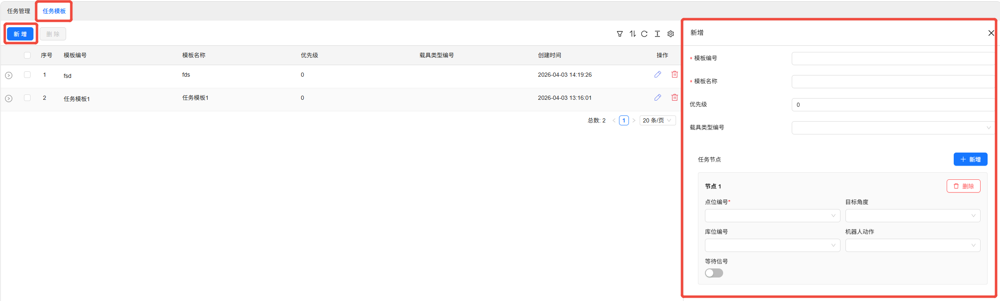{width="5.772222222222222in" height="1.7412073490813649in"}

3.  配置任务节点：点位编号、机器人动作（按需填写角度/库位编号/等待信号等）。

4.  通过【添加一行数据】增加多个节点/原子动作。

5.  点击【确认】保存模板。

二、运行任务模拟器

1.  在【监控】进入【任务模拟器】。

2.  选择任务模板并配置模拟器属性：参与机器人、任务触发频率等。

3.  点击【开始运行】，模拟器按设定频率自动下发任务。

说明：停止模拟器后将不再继续下发任务。

## **9.5 任务操作（取消/重发等）**

取消任务/取消充电

- 运行监控：右键车辆→【取消任务】；充电中车辆右键→【取消充电】。

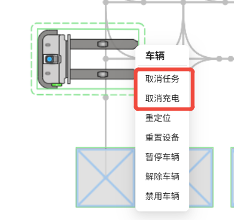{width="2.09375in" height="1.9731681977252844in"}

- 任务列表：勾选任务（单个/多个）→【取消任务】；或【取消全部】批量取消调度中/执行中任务。

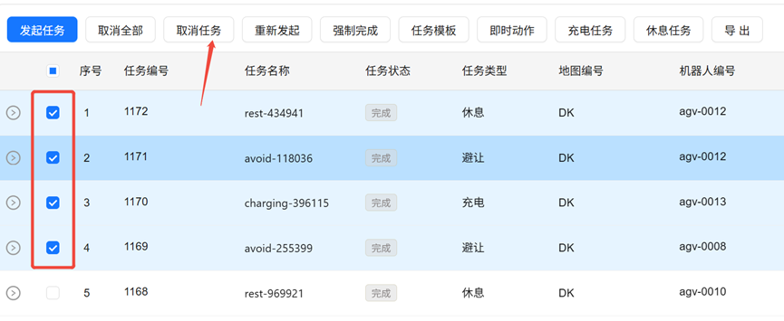{width="4.761805555555555in" height="1.9542672790901137in"}

- 流程实例：实例列表勾选（单个/多个）→【取消】（任务状态同步更新）。

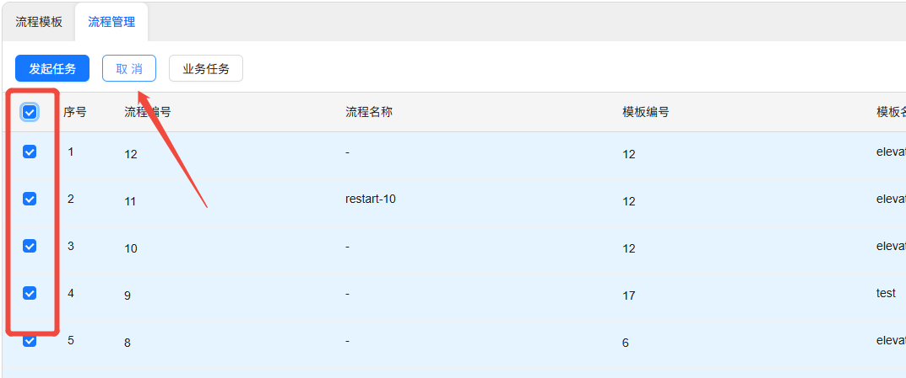{width="4.511805555555555in" height="1.8879779090113735in"}

重发任务

1.  进入【任务】列表。

2.  勾选任务→点击【重新发起】（按原任务点位信息再次下发）。

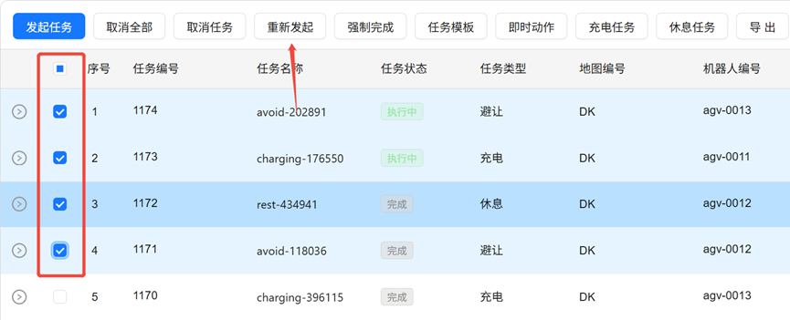{width="4.575819116360455in" height="1.8567771216097988in"}

强制完成任务

1.  适用：现场异常时人工已将货物放到目标点，需要将任务置为完成以闭环上报。进入【任务】列表，选中目标任务。

2.  点击【强制完成】。

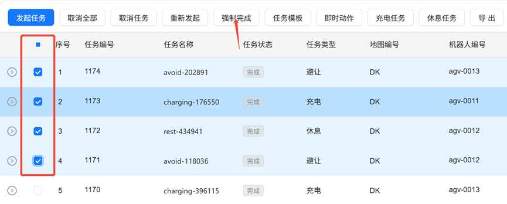{width="4.584722222222222in" height="1.8444892825896764in"}

停止任务模拟器下发

- 进入【任务模拟器】→点击【停止】。

补充说明：取消/强制完成后车辆不一定立刻停下，通常会执行完当前绿色路径上的下一个点位后再停（以系统实际表现为准）。

# 10 编排

说明：

编排用于将业务流程拆解为标准化任务，并按节点驱动生成可执行的调度基础任务。该模块主要包含两部分：**流程模板**与**流程管理**。

## 10.1 使用流程模板

### 10.1.1 查看默认流程模板

系统内置默认模板，通常在上游通过"流程编排接口"下发时，由系统根据执行车辆、取放货点位、是否包含移动节点等条件自动匹配并生成实例。常见默认模板场景包括：

- 跨楼层取货/取放货类模板：用于取货点、放货点与执行车辆不在同一地图/楼层的场景；

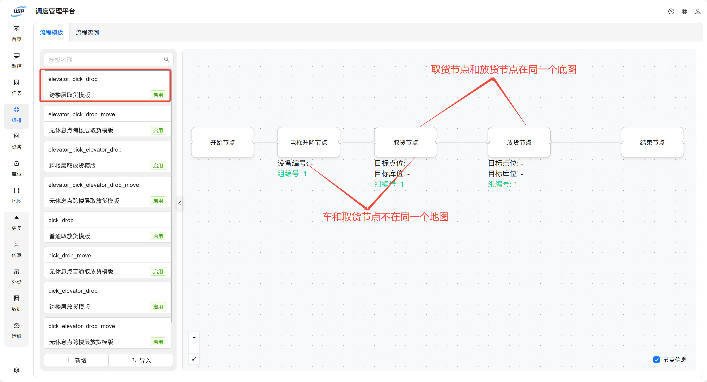{width="5.760416666666667in" height="3.1214818460192477in"}

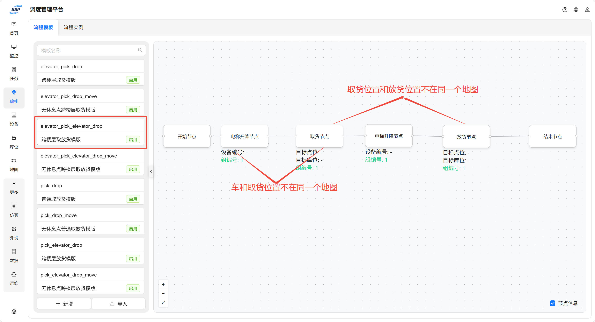{width="5.760416666666667in" height="3.1214818460192477in"}

- 无休息点类模板：用于任务完成后车辆不能停留在放货点、需额外移动到指定暂驻点的场景（通过移动节点实现）；

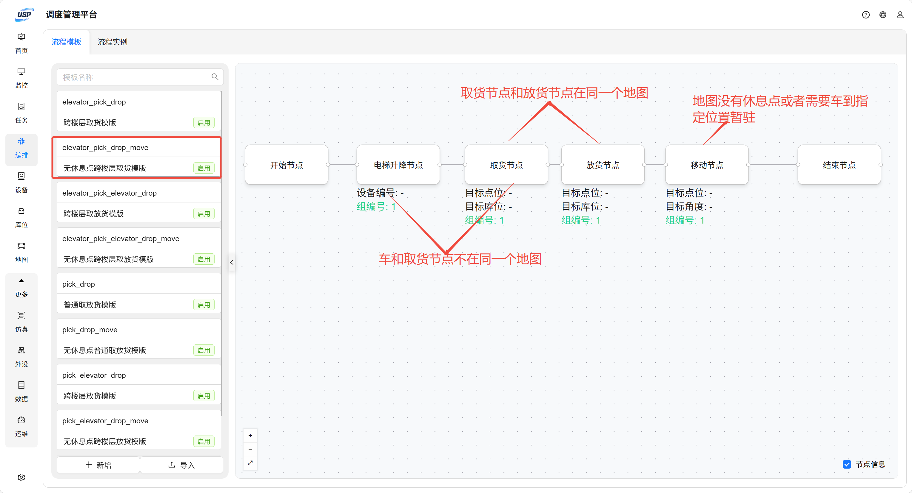{width="5.760416666666667in" height="3.1214818460192477in"}

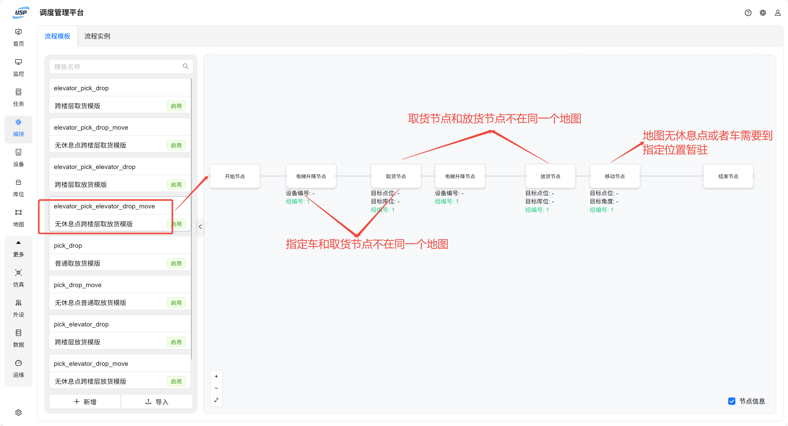{width="5.760416666666667in" height="3.1214818460192477in"}

- 普通取放货类模板：用于取货与放货在同一地图的常规搬运场景；

{width="5.760416666666667in" height="3.1214818460192477in"}

- 跨楼层放货类模板：用于取货与执行车辆同图，但放货在另一地图的场景。

备注：默认模板为系统内置模板，通常不支持删除。

{width="5.760416666666667in" height="3.1214818460192477in"}

### 10.1.2 新增流程模板

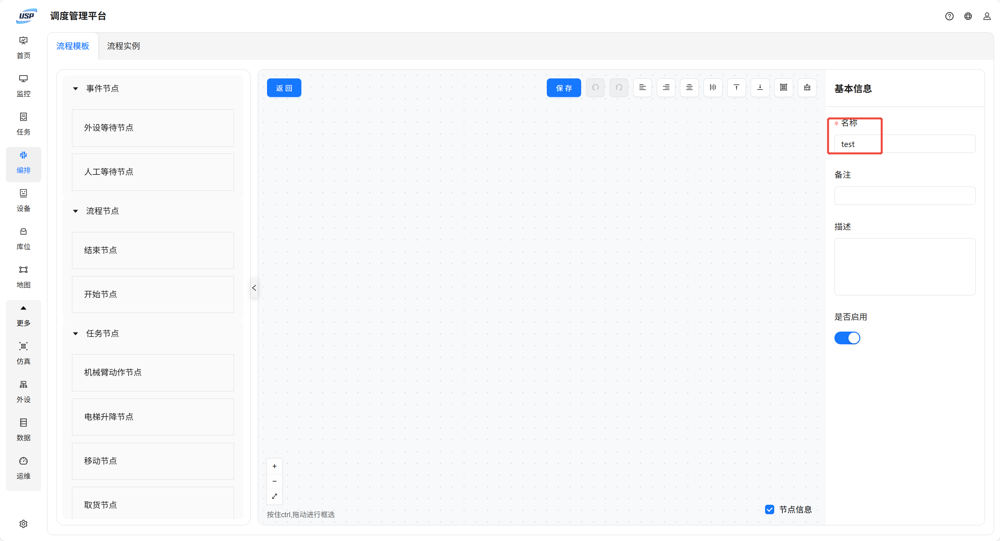{width="5.454861111111111in" height="2.955906605424322in"}

操作要点：

1.  点击【新增】进入新增页面；

2.  输入流程模板名称；

3.  从左侧节点列表拖拽节点到中间画布；

4.  配置节点参数后保存；

5.  保存后可在模板列表中看到新增模板。

### 10.1.3 编辑流程模板

1.  在模板列表中选择目标模板点击【编辑】；

2.  在编辑页面对节点进行增加/删除/调整；

3.  保存后生效。

### 10.1.4 删除流程模板

- 对自建/导入的模板可执行删除；默认模板一般不支持删除。

### 10.1.5 导入流程模板

1.  点击【导入】；

2.  选择本地流程模板文件导入；

3.  导入成功后模板显示在列表中，可继续编辑或删除。

## 10.2 下发流程实例

### 10.2.1 发起业务任务

{width="5.772222222222222in" height="3.005599300087489in"}

说明：用于模拟上游系统下发任务，入口为【业务任务】。常用字段说明如下：

- 执行车辆：可指定车编号或机器人组；生成任务时会按所选车辆填充动作（如叉车会填充货叉动作）。

- 载具类型：搬运货物所属载具类型；流程编排接口下通常为必填，调度基础接口通常非必填（以页面规则为准）。

- 取货库位 / 放货库位：搬运任务的起点与终点库位。

- 移动点位：用于任务完成后额外附加移动（对应"无休息点"类模板场景）。

### 10.2.2 发起任务

{width="5.772222222222222in" height="3.005599300087489in"}

说明：发起流程用于 USP 自身选择流程模板下发实例，入口为【发起任务】。常用字段说明如下：

- 流程模板：选择模板后会加载模板节点配置；

- 设备编号：需要对接外设时选择对应外设编号（如电梯编号）；

- 执行车辆：可指定车编号或机器人组；

- 取货节点 / 放货节点：选择目标库位后自动加载对应点位；

- 移动节点：选择车辆需要移动到的目标点位（按模板/场景使用）。

## 10.3 管理流程实例

### 10.3.1 查看实例详情

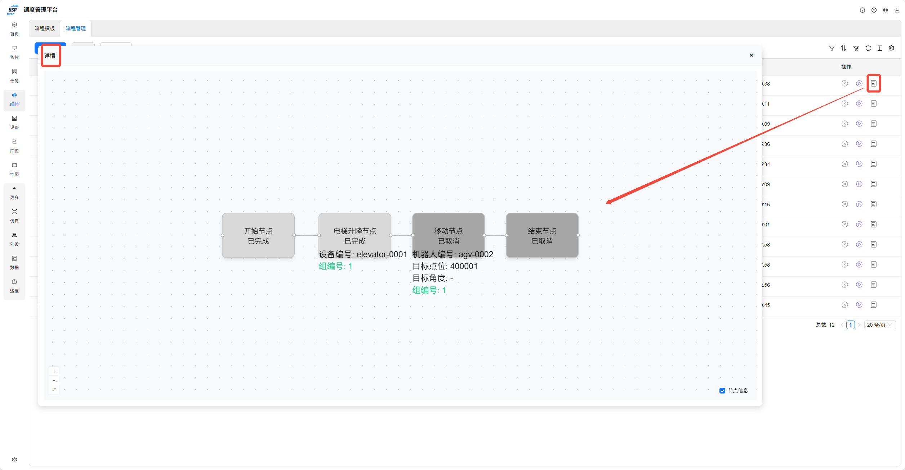{width="5.772222222222222in" height="3.005599300087489in"}

- 在实例列表中点击【详情】进入实例详情页；

- 节点状态会随执行进度变化（例如已完成/执行中/未执行/已取消等），用于追踪实例执行过程。

### 10.3.2 取消实例

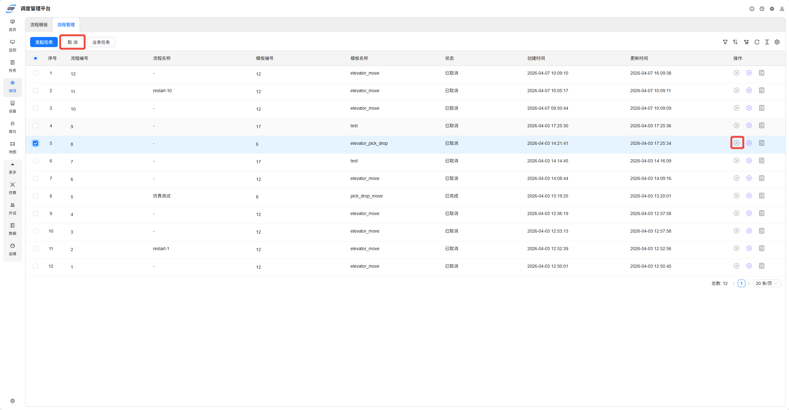{width="5.772222222222222in" height="3.005599300087489in"}

- 单个取消：实例列表操作列点击【取消】；

- 批量取消：勾选多个实例后点击操作栏【取消】。

说明：实例取消后，实例状态会变为取消，同时调度基础的任务状态也会同步变为取消（以系统实现为准）。10.3.3 重发实例（重新发起相同实例）

- 在实例列表操作列点击【重发】，系统会重新发起一个相同的实例（用于快速复现/重试）。

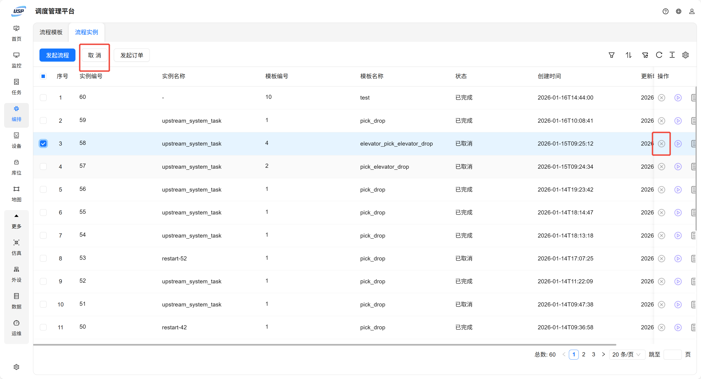{width="5.760416666666667in" height="3.1214818460192477in"}

### 10.3.3 筛选实例

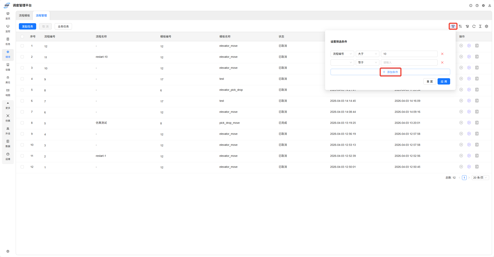{width="5.772222222222222in" height="3.005599300087489in"}

- 打开筛选面板，配置筛选条件；支持单项或多条件组合；

- 点击【应用】生效；点击【重置】清空条件并恢复默认列表。

### 10.3.4 排序实例

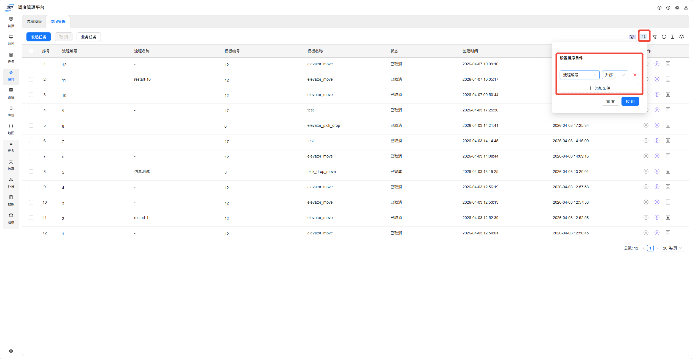{width="5.772222222222222in" height="3.005599300087489in"}

- 打开排序面板，配置排序条件；支持单项或多条件组合；

- 点击【应用】生效；点击【重置】清空条件并恢复默认列表。

# 11 数据运维

## 11.1 数据面板查看

1.  在调度系统中进入【更多】。

2.  点击【数据】。

3.  进入【指标库】页面，查看数据面板内容。

数据面板中可查看的内容包括：

- 今日总任务数

- 已完成任务数

- 各类型任务数量（搬运、移动、休息、充电）

- 任务完成率

- 切手动次数

- 故障处理时间

- 机器人离线时长等运行指标

各项指标以柱状图或条形图形式展示，并支持导出。

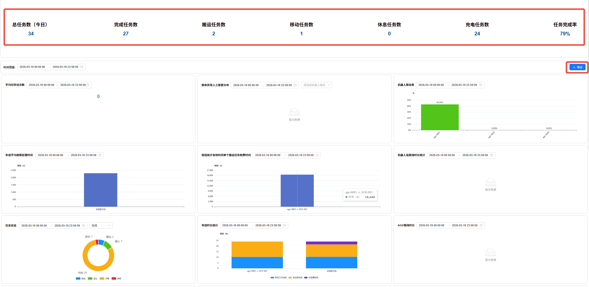{width="5.772222222222222in" height="2.813211942257218in"}

## 11.2 服务器状态查看

1.  在调度系统中进入【更多】。

2.  点击【运维】。

3.  进入【性能检测】页面，查看服务器状态信息。

在该页面中，可查看服务器的以下运行状态：

- CPU 占用情况

- 内存占用情况

- 磁盘占用情况

系统通过对应的性能指标展示服务器当前资源使用情况，便于用户及时了解服务器运行状态并进行运维判断。

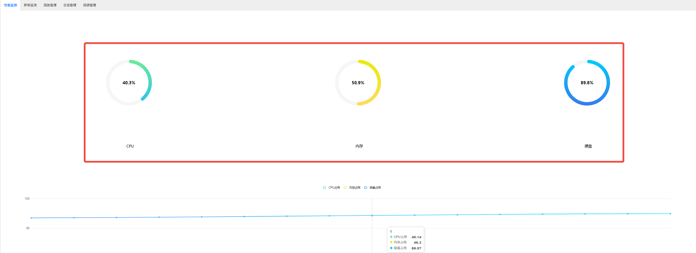{width="5.772222222222222in" height="2.105275590551181in"}

## 11.3 监控回放

1.  在调度系统中进入【更多】。

2.  点击【运维】。

3.  进入【回放管理】页面。

4.  选择对应的历史记录，查看监控回放内容。

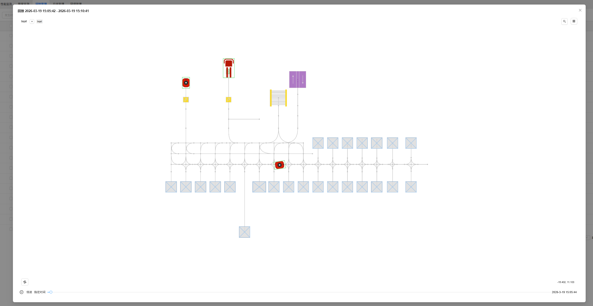{width="5.772222222222222in" height="2.9872484689413823in"}

监控回放可用于查看机器人历史运行情况，辅助定位机器人异常、任务问题及相关故障。历史回放通常在 5 分钟后生成。